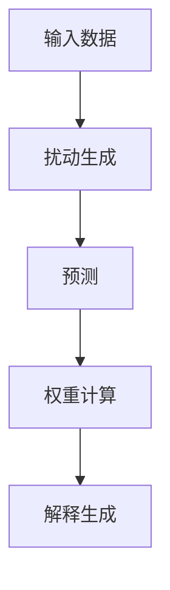
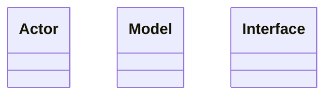

                 


# 模型解释：增加AI Agent的透明度

## 关键词：模型解释，AI Agent，透明度，可解释性，算法原理，系统架构，项目实战

## 摘要：  
随着AI技术的快速发展，AI Agent在各个领域的应用日益广泛，但其决策过程的不透明性引发了诸多信任和伦理问题。本文旨在深入探讨模型解释的重要性，分析其核心概念、算法原理及系统架构，通过具体案例展示如何在实际项目中实现AI Agent的透明度，从而增强用户信任并确保技术的可靠应用。

---

## 第1章: 模型解释的基本概念

### 1.1 问题背景与定义  
在AI Agent的应用中，模型解释性是用户信任的核心。用户需要理解AI决策的依据，以确保结果的合理性和可靠性。模型解释性涉及将复杂的算法输出转化为易于理解的解释，使用户能够验证和评估AI的行为。  

### 1.2 模型解释的核心要素  
模型解释性可以分为局部解释和全局解释。局部解释关注单个预测的解释，而全局解释则关注整个模型的行为。解释性与模型复杂度密切相关：简单模型（如线性回归）通常更易解释，而复杂模型（如深度神经网络）则更难解释。  

### 1.3 模型解释的重要性  
模型解释性是确保AI Agent可信的关键。在金融、医疗等领域，解释性是合规性和伦理审查的基本要求。此外，解释性还有助于发现模型中的偏见和错误，从而提升模型的可靠性和公平性。  

---

## 第2章: 模型解释的核心概念与联系

### 2.1 核心概念原理  
模型解释性涉及多个核心概念，包括可解释性模型、不可解释性模型、局部解释与全局解释。可解释性模型通过简单的规则或线性关系描述，而不可解释性模型则依赖复杂的非线性关系。  

### 2.2 概念属性特征对比表  
以下是核心概念的对比表：  

| 概念 | 属性 | 特征 |
|------|------|------|
| 解释性 | 层次 | 全局/局部 |
| 可解释性 | 方法 | 透明/黑箱 |
| 模型复杂度 | 影响 | 高/低 |

### 2.3 ER实体关系图  

```mermaid
er
actor
    name
    role
    explanation_level
```

---

## 第3章: 模型解释的算法原理

### 3.1 常见模型解释算法  
模型解释算法主要包括LIME、SHAP和梯度上升法。LIME通过扰动数据生成近邻样本，并基于这些样本的预测结果加权解释；SHAP通过特征重要性加权，提供更直观的解释；梯度上升法则通过反向传播计算特征对预测结果的贡献。  

### 3.2 LIME算法流程图  



### 3.3 SHAP值计算公式  

$$ SHAP = \phi_i = \sum_{j} w_j x_j $$  

### 3.4 算法实现代码示例  

```python
import lime
from lime import lime_tabular

def explain_model(predictor, X, y):
    explainer = lime_tabular.LimeTabularExplainer(X, feature_names=['age', 'income', 'gender'])
    explanation = explainer.explain_instance(predictor, X.iloc[0], y=0)
    return explanation
```

---

## 第4章: 系统分析与架构设计

### 4.1 问题场景介绍  
在医疗领域，AI Agent用于辅助诊断，但医生需要理解模型的决策依据。因此，我们需要设计一个可解释的AI系统，将模型解释信息集成到诊断流程中。  

### 4.2 系统功能设计  



### 4.3 系统架构设计  


### 4.4 系统交互设计  

```mermaid
sequenceDiagram
    Actor -> Model: 请求预测
    Model -> Explainer: 请求解释
    Explainer -> Model: 返回解释
    Model -> Actor: 返回预测和解释
```

---

## 第5章: 项目实战

### 5.1 环境安装  
需要安装以下库：  
- `lime`：用于模型解释  
- `shap`：用于特征重要性分析  
- `scikit-learn`：用于模型训练  

### 5.2 核心实现代码  

```python
import numpy as np
from sklearn.ensemble import RandomForestClassifier
from lime lime_tabular import LimeTabularExplainer

# 数据准备
X = np.array([[50, 100], [51, 99], [52, 101]])
y = np.array([0, 0, 1])

# 模型训练
model = RandomForestClassifier().fit(X, y)

# 解释器初始化
explainer = LimeTabularExplainer(X, feature_names=['age', 'income'])

# 生成解释
explanation = explainer.explain_instance(model, np.array([51, 99]), y=0)
print(explanation.as_json())
```

### 5.3 代码解读与分析  
上述代码中，`LimeTabularExplainer`用于生成模型的局部解释，`explain_instance`方法返回单个样本的解释结果。通过`as_json()`方法，可以将解释结果以JSON格式输出，便于后续处理。  

### 5.4 案例分析  
以医疗领域的疾病预测为例，假设模型预测某患者患有糖尿病，解释器可以指出“年龄”和“血糖水平”是关键特征，并提供它们对预测结果的具体贡献。  

### 5.5 项目小结  
通过本案例，我们可以看到模型解释在实际应用中的重要性，以及如何通过代码实现模型的透明度。

---

## 第6章: 总结与最佳实践

### 6.1 总结  
模型解释是确保AI Agent透明度的核心技术。通过本文的分析，我们了解了模型解释的核心概念、算法原理及系统架构，并通过案例展示了如何在实际项目中实现模型的透明度。  

### 6.2 最佳实践  
1. 根据应用场景选择合适的解释方法。  
2. 在系统设计中预留解释模块，确保解释信息能够实时展示。  
3. 定期监控模型的解释性，确保模型行为的透明性和可靠性。  

### 6.3 注意事项  
- 解释性不应牺牲模型的性能，需在模型复杂度和解释性之间找到平衡。  
- 对于高维数据，局部解释可能更有效。  
- 解释性需符合领域专家的理解习惯，避免过于技术化的表达。  

### 6.4 拓展阅读  
- "Explainable AI: A survey"  
- "SHAP: A unified approach to interpreting model predictions"  

---

## 作者：AI天才研究院 & 禅与计算机程序设计艺术

