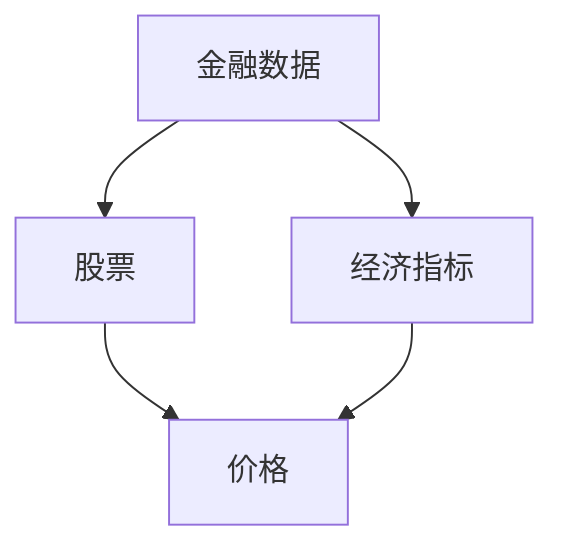
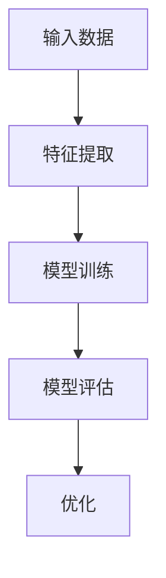
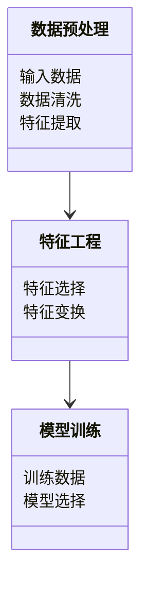
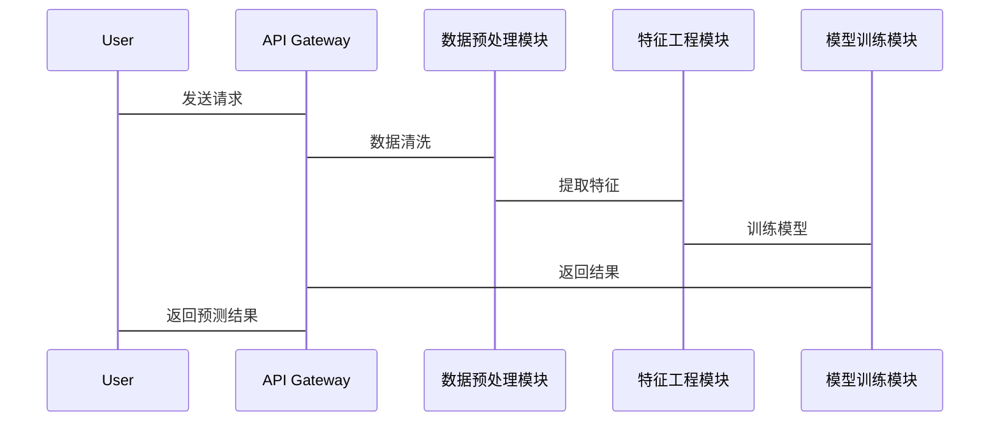

                 


# 模型训练与金融数据的结合

> 关键词：模型训练，金融数据，机器学习，深度学习，时间序列分析，数据预处理

> 摘要：本文深入探讨了模型训练与金融数据结合的应用，从基本概念、数据处理、算法原理到系统架构和项目实战，全面解析其在金融领域的潜力和挑战，为读者提供系统化的知识和实践指导。

---

## 第一部分: 模型训练与金融数据的结合概述

### 第1章: 模型训练与金融数据的结合背景

#### 1.1 模型训练的基本概念
模型训练是利用数据和算法，训练出能够预测或分类的模型的过程，涉及特征提取、数据预处理和算法选择等步骤。在金融领域，数据通常具有时间序列特性、高波动性和相关性，这使得模型训练成为可能。

#### 1.2 问题背景与问题描述
传统金融分析依赖专家经验，但面临数据量大、复杂性和不准确性的问题。数据驱动的金融分析需求日益增长，模型训练在预测股票价格、风险评估等方面展现巨大潜力。

#### 1.3 问题解决与边界
模型训练通过数据驱动的方法解决传统分析的局限性，但需考虑数据质量和模型泛化能力。核心要素包括数据、特征、算法和模型。

### 第2章: 模型训练与金融数据的核心概念

#### 2.1 核心概念与原理
模型训练的数学基础包括线性回归、神经网络等，金融数据处理涉及时间序列分析和特征提取。模型训练通过优化目标函数，最小化预测误差。

#### 2.2 核心概念对比表
| 比较维度 | 模型训练 | 传统金融分析 |
|----------|----------|--------------|
| 数据需求 | 需大量数据 | 依赖经验判断 |
| 处理方式 | 自动学习 | 手动分析 |

#### 2.3 ER实体关系图


### 第3章: 金融数据的特征与处理

#### 3.1 金融数据的特征分析
时间序列数据具有趋势性和周期性，金融数据波动大，相关性强。

#### 3.2 数据预处理方法
数据清洗处理缺失值，标准化消除量纲差异，数据增强增加数据多样性。

#### 3.3 数据处理的数学模型
时间序列模型如ARIMA用于预测，标准化公式如Z=(X-μ)/σ，数据增强方法包括旋转和翻转。

### 第4章: 模型训练的算法原理

#### 4.1 传统机器学习算法
线性回归用于简单预测，支持向量机处理分类，随机森林提供特征重要性。

#### 4.2 深度学习算法
神经网络适合复杂模式识别，LSTM处理时间序列，CNN分析高维数据。

#### 4.3 算法流程图


---

## 第二部分: 模型训练的系统架构与实现

### 第5章: 系统架构设计

#### 5.1 项目介绍
构建一个金融数据预测系统，包括数据预处理、特征工程、模型训练和部署。

#### 5.2 系统功能设计


#### 5.3 系统架构设计


### 第6章: 接口设计与交互流程

#### 6.1 接口设计
RESTful API用于数据输入和结果输出，如POST /predict。

#### 6.2 交互流程


---

## 第三部分: 项目实战与最佳实践

### 第7章: 项目实战

#### 7.1 环境安装
安装Python、Pandas、Scikit-learn、TensorFlow、Keras。

#### 7.2 核心代码实现
```python
import pandas as pd
from sklearn.model import LinearRegression

# 数据加载与预处理
data = pd.read_csv('stock_data.csv')
data = data.dropna()

# 特征提取
features = data[['开盘价', '收盘价', '最高价', '最低价']]
target = data['收盘价'].shift(1)
target = target.iloc[:-1]

# 模型训练
model = LinearRegression()
model.fit(features, target)

# 预测与评估
预测 = model.predict(features)
print(预测)
```

#### 7.3 案例分析
以股票价格预测为例，详细讲解数据准备、模型选择和结果分析。

### 第8章: 最佳实践与小结

#### 8.1 最佳实践
选择合适模型，数据预处理，定期再训练，监控模型性能。

#### 8.2 小结
模型训练与金融数据结合具有巨大潜力，但也面临数据质量和模型泛化的挑战。

---

## 结语

模型训练与金融数据的结合正在改变金融分析方式，通过数据预处理、特征提取和算法选择，构建高效的预测模型，为金融决策提供支持。

---

**作者：AI天才研究院/AI Genius Institute & 禅与计算机程序设计艺术 /Zen And The Art of Computer Programming**

