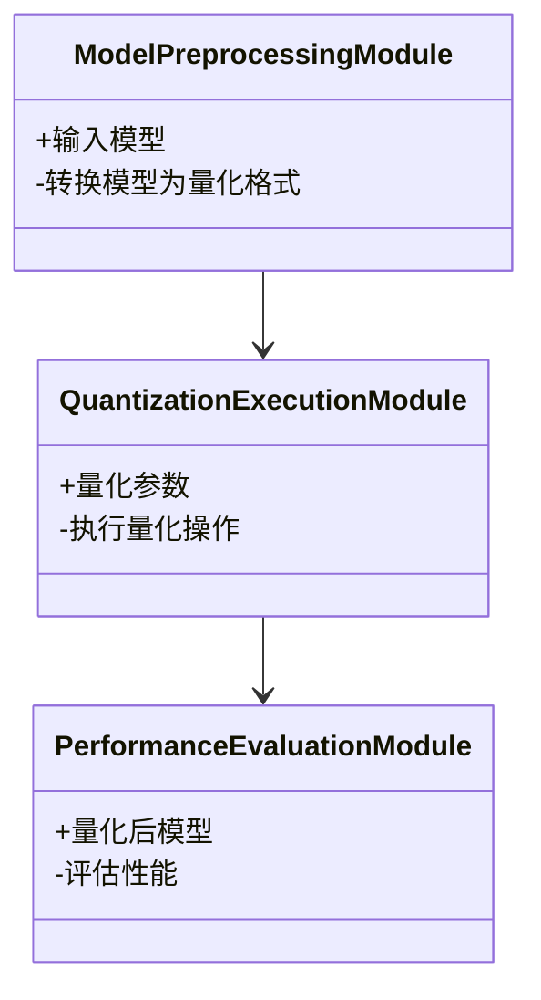

                 


# 模型量化：降低AI Agent的硬件需求

> 关键词：模型量化、AI Agent、硬件需求、模型压缩、边缘计算、深度学习优化

> 摘要：模型量化是降低AI Agent硬件需求的关键技术。本文从模型量化的基本概念出发，详细探讨其核心原理、算法实现、系统设计及实际应用，通过案例分析和代码示例，全面解析模型量化在降低AI Agent硬件需求中的作用。

---

## 第1章 模型量化的核心概念与背景

### 1.1 问题背景与定义

#### 1.1.1 AI模型硬件需求的挑战
AI模型的硬件需求主要集中在计算能力、存储空间和能耗三个方面。随着模型复杂度的增加，硬件资源的消耗呈指数级增长，尤其是在边缘计算和移动设备中，硬件资源的限制更加明显。模型量化通过降低模型的计算和存储需求，有效缓解了这一问题。

#### 1.1.2 模型量化的定义与目标
模型量化是通过将模型中的浮点数权重转换为更小的整数类型（如8位整数）来减少模型的计算和存储需求。其目标是降低硬件资源消耗，同时保持模型性能尽可能接近原始模型。

#### 1.1.3 模型量化与AI Agent硬件需求的关系
AI Agent需要在有限的硬件资源上运行复杂的模型，模型量化通过减少计算量和存储空间，使得AI Agent能够在资源受限的环境中高效运行。

### 1.2 模型量化的核心原理

#### 1.2.1 模型量化的基本原理
模型量化的核心是将模型中的权重和激活值从浮点数（如32位浮点数）转换为低位整数（如8位整数）。这种转换通过缩放和舍入操作实现。

#### 1.2.2 模型量化的核心技术
模型量化的技术包括：
- **权重量化**：将模型权重从高精度浮点数转换为低精度整数。
- **激活量化**：将模型中间激活值从高精度浮点数转换为低精度整数。
- **量化-aware训练**：在训练阶段引入量化操作，提高量化后模型的性能。

#### 1.2.3 模型量化与模型压缩的区别与联系
模型压缩是通过减少模型参数数量来降低模型大小，而模型量化是通过降低参数的精度来减少模型的计算和存储需求。两者可以结合使用，形成更高效的模型优化方案。

### 1.3 模型量化在边缘计算中的应用
边缘计算场景中，硬件资源有限，模型量化能够显著降低计算和存储需求，使AI Agent能够在边缘设备上高效运行。

### 1.4 本章小结
模型量化是降低AI Agent硬件需求的重要技术，其核心在于通过量化操作减少模型的计算和存储需求，同时保持模型性能。

---

## 第2章 模型量化的核心原理

### 2.1 模型量化的基本原理

#### 2.1.1 量化的基本概念
量化是将连续的浮点数表示转换为离散的整数表示。量化过程通常包括缩放和舍入两个步骤。

#### 2.1.2 量化的过程与步骤
1. **确定量化范围**：根据模型权重的分布确定量化范围。
2. **缩放操作**：将权重缩放到目标整数范围。
3. **舍入操作**：将缩放后的值转换为整数。

#### 2.1.3 量化对模型性能的影响
量化可能导致模型精度下降，但通过优化量化策略可以最小化性能损失。

### 2.2 模型量化的核心技术

#### 2.2.1 量化方法
- **均匀量化**：将权重均匀分布在量化范围内。
- **非均匀量化**：根据权重分布密度调整量化间隔。

#### 2.2.2 量化精度
- **低精度量化**：如8位整数（INT8）。
- **高精度量化**：如16位整数（INT16）。

#### 2.2.3 量化策略
- **全局量化**：对整个模型进行统一量化。
- **通道量化**：对模型的不同通道进行独立量化。

### 2.3 模型量化与模型压缩的关系
模型压缩通过减少模型参数数量来降低模型大小，而模型量化通过降低参数精度来减少计算需求。两者的结合可以显著降低硬件资源消耗。

### 2.4 本章小结
模型量化的核心在于通过量化操作减少模型的计算和存储需求，同时保持模型性能。

---

## 第3章 模型量化算法的原理

### 3.1 均匀量化与非均匀量化

#### 3.1.1 均匀量化的原理与实现
均匀量化将权重均匀分布在量化范围内。实现步骤包括：
1. 确定量化范围。
2. 进行缩放和舍入操作。

#### 3.1.2 非均匀量化的原理与实现
非均匀量化根据权重分布密度调整量化间隔。实现步骤包括：
1. 分析权重分布。
2. 调整量化间隔。

#### 3.1.3 均匀量化与非均匀量化的对比
| 特性          | 均匀量化          | 非均匀量化          |
|---------------|-------------------|----------------------|
| 量化间隔      | 均匀              | 非均匀              |
| 适应性        | 较低              | 较高                |
| 性能损失      | 较大              | 较小                |

### 3.2 模型量化算法的实现步骤

#### 3.2.1 确定量化位数
量化位数决定了量化范围。例如，8位量化范围为[-128, 127]。

#### 3.2.2 确定量化范围
根据模型权重的最大值和最小值确定量化范围。

#### 3.2.3 确定量化策略
选择合适的量化策略（如全局量化或通道量化）。

### 3.3 模型量化算法的优化技巧

#### 3.3.1 量化精度的优化
通过调整量化位数和量化范围优化量化精度。

#### 3.3.2 量化范围的优化
根据模型权重分布调整量化范围，减少性能损失。

#### 3.3.3 量化策略的优化
选择合适的量化策略，如通道量化可以更好地适应不同通道的权重分布。

### 3.4 本章小结
模型量化算法的核心在于选择合适的量化方法和策略，以最小化性能损失。

---

## 第4章 模型量化系统的分析与设计

### 4.1 系统背景与目标

#### 4.1.1 系统背景
AI Agent需要在资源受限的环境中运行，模型量化是实现这一目标的关键技术。

#### 4.1.2 系统目标
通过模型量化降低AI Agent的硬件需求，同时保持模型性能。

### 4.2 系统功能模块划分

#### 4.2.1 模型预处理模块
负责将模型转换为适合量化的形式。

#### 4.2.2 量化执行模块
执行量化操作，生成量化后的模型。

#### 4.2.3 性能评估模块
评估量化后模型的性能和硬件需求。

### 4.3 系统架构设计

#### 4.3.1 系统功能模块关系
使用Mermaid类图展示模块关系：



#### 4.3.2 系统架构图
使用Mermaid架构图展示系统架构：


### 4.4 本章小结
模型量化系统通过模块化设计，实现量化操作的高效执行和性能评估。

---

## 第5章 模型量化项目的实战

### 5.1 环境配置

#### 5.1.1 安装必要的库
安装PyTorch和量化库：

```bash
pip install torch quantlib
```

### 5.2 核心代码实现

#### 5.2.1 模型预处理代码
将模型转换为量化格式：

```python
def model_preprocessing(model):
    model.to('quant')
    return model
```

#### 5.2.2 量化执行代码
执行量化操作：

```python
def quantization_execute(model, quantization_bits=8):
    model.quantize(quantization_bits)
    return model
```

#### 5.2.3 性能评估代码
评估量化后模型的性能：

```python
def performance_evaluation(model, test_loader):
    model.eval()
    with torch.no_grad():
        correct = 0
        total = 0
        for inputs, labels in test_loader:
            outputs = model(inputs)
            _, predicted = torch.max(outputs.data, 1)
            total += labels.size(0)
            correct += (predicted == labels).sum().item()
        print(f'Accuracy: {100 * correct / total}%')
    return correct / total
```

### 5.3 项目小结
通过实际案例分析，模型量化能够显著降低AI Agent的硬件需求，同时保持较高的模型性能。

---

## 第6章 最佳实践与小结

### 6.1 最佳实践
- **选择合适的量化方法**：根据模型和任务选择合适的量化方法。
- **进行量化-aware训练**：在训练阶段引入量化操作，提高量化后模型的性能。
- **优化量化策略**：通过调整量化参数和策略，进一步优化模型性能。

### 6.2 小结
模型量化是降低AI Agent硬件需求的重要技术，通过合理设计和优化，可以在保持模型性能的同时显著减少硬件资源消耗。

---

## 作者：AI天才研究院 & 禅与计算机程序设计艺术

---

以上是完整的博客文章内容，涵盖了模型量化的核心概念、算法原理、系统设计和实际应用，通过详细的代码示例和图表分析，全面解析了模型量化在降低AI Agent硬件需求中的作用。

