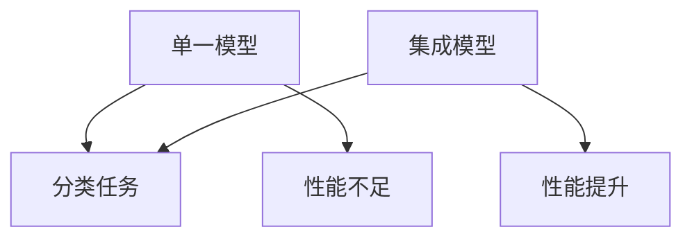
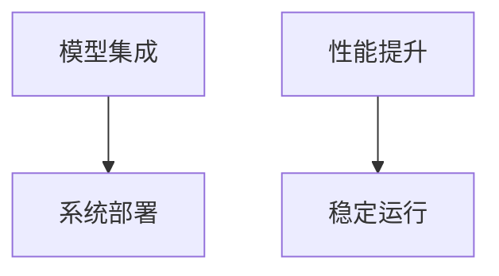
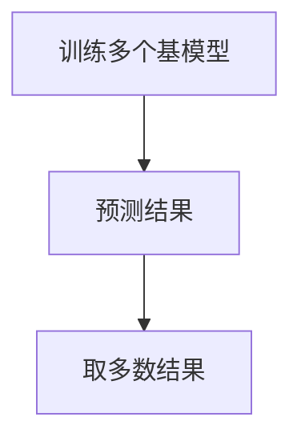
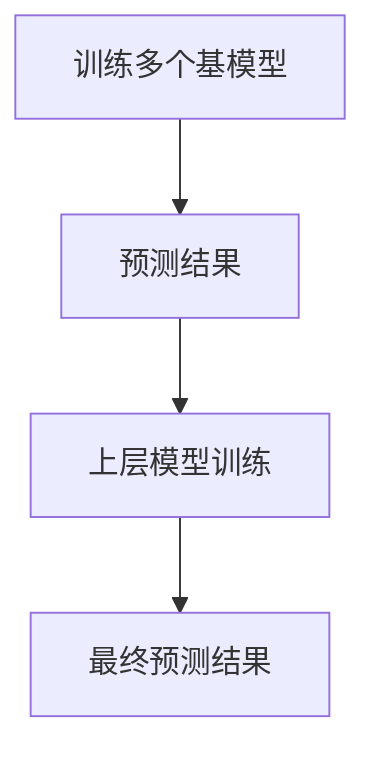
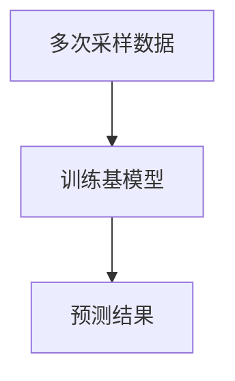
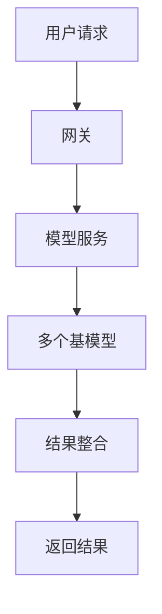
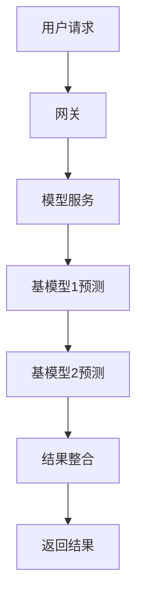

                 


# 模型集成与系统部署

## 关键词：
- 模型集成
- 系统部署
- 集成学习
- 容器化部署
- 微服务架构
- 模型评估
- 系统架构设计

## 摘要：
模型集成与系统部署是现代人工智能和软件工程领域的重要课题。模型集成通过结合多个模型的优势，能够提高系统的准确性和鲁棒性；而系统部署则是将这些集成后的模型高效、稳定地运行在实际环境中的关键步骤。本文将从模型集成的基本原理出发，详细探讨集成学习算法的核心概念与实现方法，并结合系统架构设计，分析如何将模型集成方案成功部署到实际系统中。通过具体案例分析，本文将展示模型集成与系统部署的结合应用，为读者提供从理论到实践的全面指导。

---

# 第1章: 模型集成与系统部署概述

## 1.1 模型集成的概念与背景

### 1.1.1 模型集成的定义
模型集成是一种将多个独立模型结合起来，以获得更优性能的策略。通过集成多个模型的输出，可以有效降低单个模型的方差和偏差，从而提升整体系统的准确性和稳定性。

**模型集成的三种主要方法：**
1. **投票法（Voting）**：多个模型分别进行预测，最终结果取多数模型的预测结果。
2. **堆叠法（Stacking）**：将多个基模型的输出作为上一层模型的输入，通过训练上层模型来整合多个基模型的优势。
3. **袋装法（Bagging）**：通过多次采样数据训练多个基模型，从而降低模型的过拟合风险。

### 1.1.2 模型集成的背景与意义
随着人工智能技术的快速发展，单一模型的性能已经难以满足复杂场景下的需求。通过模型集成，可以有效提升系统的泛化能力，降低模型的过拟合风险，并在实际应用中提高系统的稳定性和可靠性。

**模型集成的背景特征对比：**

| 特性             | 单一模型         | 模型集成       |
|------------------|------------------|---------------|
| 性能             | 较低             | 较高           |
| 稳定性           | 较差             | 较好           |
| 鲁棒性           | 较低             | 较高           |
| 运行效率         | 高               | 中等           |

### 1.1.3 模型集成的应用场景
模型集成广泛应用于分类、回归、推荐系统等领域。例如，在自然语言处理任务中，通过集成多个语言模型可以提升文本分类的准确率。

**模型集成的应用场景图：**


## 1.2 系统部署的核心概念

### 1.2.1 系统部署的定义
系统部署是指将开发完成的系统或模型，部署到实际运行环境中，确保系统能够稳定、高效地运行。

### 1.2.2 系统部署的关键环节
1. **环境搭建**：确保部署环境与开发环境一致。
2. **模型优化**：对模型进行压缩、剪枝等优化，减少资源消耗。
3. **容器化部署**：使用容器技术（如Docker）实现系统的快速部署和扩展。

### 1.2.3 模型集成与系统部署的关系
模型集成是提升系统性能的关键技术，而系统部署则是确保集成后的模型能够稳定运行的基础。

**模型集成与系统部署的关系图：**


## 1.3 本章小结
本章主要介绍了模型集成的概念、背景及其在系统部署中的意义。通过对比分析，强调了模型集成在提升系统性能和稳定性方面的重要作用。

---

# 第2章: 集成学习算法原理

## 2.1 集成学习的基本原理

### 2.1.1 集成学习的投票法

**投票法的实现流程：**


**投票法的数学表达：**
$$
\text{最终预测结果} = \argmax_{i} \sum_{j=1}^{n} y_j[i]
$$
其中，$y_j[i]$ 表示第$j$个基模型对类别$i$的预测结果。

### 2.1.2 集成学习的堆叠法

**堆叠法的实现流程：**


**堆叠法的数学表达：**
$$
\text{上层模型输入} = [y_1, y_2, ..., y_n]
$$
其中，$y_i$ 表示第$i$个基模型的输出向量。

### 2.1.3 集成学习的袋装法

**袋装法的实现流程：**


## 2.2 集成学习的数学模型

### 2.2.1 投票法的数学表达
$$
\text{最终预测结果} = \argmax_{i} \sum_{j=1}^{n} y_j[i]
$$

### 2.2.2 堆叠法的数学表达
$$
\text{上层模型输入} = [y_1, y_2, ..., y_n]
$$

### 2.2.3 袋装法的数学表达
$$
\text{数据采样概率} = \frac{1}{N}
$$

## 2.3 集成学习的优缺点对比

**集成学习的优缺点对比表：**

| 特性           | 优点             | 缺点           |
|----------------|------------------|---------------|
| 性能           | 提高准确率         | 计算资源消耗大   |
| 稳定性         | 降低过拟合风险     | 需要处理多个模型   |
| 鲜活性         | 提高模型的泛化能力   | 部分模型可能失效   |

## 2.4 本章小结
本章详细讲解了集成学习的基本原理和三种主要方法（投票法、堆叠法、袋装法），并通过数学公式和流程图展示了每种方法的实现过程。

---

# 第3章: 模型集成的系统架构与部署

## 3.1 系统架构设计的基本原则

### 3.1.1 模块化设计
系统应划分为独立的功能模块，每个模块负责特定的功能，便于后续的维护和扩展。

### 3.1.2 可扩展性设计
系统架构应具备良好的扩展性，能够方便地添加新的功能模块或优化现有模块。

### 3.1.3 可维护性设计
系统设计应注重可维护性，便于开发人员快速定位和修复问题。

## 3.2 模型集成的系统架构图

**系统架构图：**


## 3.3 系统接口设计

### 3.3.1 模型接口规范
模型服务应提供统一的接口，方便上层调用。

### 3.3.2 数据接口规范
数据接口应支持多种数据格式，确保数据的准确传输。

### 3.3.3 调用接口规范
调用接口应定义清晰的请求格式和返回格式。

## 3.4 系统交互流程图

**系统交互流程图：**


## 3.5 本章小结
本章重点分析了模型集成系统的架构设计，包括模块化设计原则、系统架构图以及系统接口设计等内容。

---

# 第4章: 模型集成与系统部署的项目实战

## 4.1 环境安装与配置

### 4.1.1 安装Python环境
使用Anaconda或虚拟环境管理Python版本。

### 4.1.2 安装依赖库
安装必要的库，如scikit-learn、Docker、Flask等。

## 4.2 系统核心实现

### 4.2.1 集成学习模型实现
使用投票法实现集成分类器：

```python
from sklearn.ensemble import VotingClassifier
from sklearn.tree import DecisionTreeClassifier
from sklearn.linear_model import LogisticRegression

# 初始化基模型
model1 = DecisionTreeClassifier()
model2 = LogisticRegression()

# 初始化集成模型
voting_clf = VotingClassifier(estimators=[('tree', model1), ('lr', model2)])

# 训练模型
voting_clf.fit(X_train, y_train)
```

### 4.2.2 系统部署实现
使用Docker进行容器化部署：

```dockerfile
# Dockerfile
FROM python:3.8
WORKDIR /app
COPY requirements.txt .
RUN pip install -r requirements.txt
COPY . .
CMD ["gunicorn", "--bind", "0.0.0.0:8000", "--workers", "4", "app:app"]
```

## 4.3 项目实战分析

### 4.3.1 数据集选择
使用公共数据集（如MNIST）进行实验。

### 4.3.2 模型评估
通过准确率、召回率等指标评估集成模型的性能。

## 4.4 本章小结
本章通过具体项目实战，详细讲解了模型集成与系统部署的实现过程，包括环境配置、模型实现、系统部署等内容。

---

# 第5章: 模型集成与系统部署的最佳实践

## 5.1 选择模型集成方案的建议

### 5.1.1 根据任务选择集成方法
分类任务适合投票法，回归任务适合平均法。

### 5.1.2 考虑计算资源
对于资源受限的场景，选择轻量级的集成方法。

## 5.2 系统部署方案的选择

### 5.2.1 容器化部署
适合需要快速部署和扩展的场景。

### 5.2.2 微服务架构
适合复杂的分布式系统。

## 5.3 注意事项

### 5.3.1 模型选择
选择合适的基模型，避免引入性能低劣的模型。

### 5.3.2 资源优化
对模型进行压缩和优化，减少资源消耗。

## 5.4 拓展阅读

### 5.4.1 集成学习的深入研究
推荐阅读《Ensemble Methods in Machine Learning》。

### 5.4.2 系统部署的进阶技巧
推荐学习Docker、Kubernetes等技术。

## 5.5 本章小结
本章总结了模型集成与系统部署的最佳实践，包括方案选择、资源优化以及拓展阅读等内容。

---

# 作者：AI天才研究院/AI Genius Institute & 禅与计算机程序设计艺术 /Zen And The Art of Computer Programming

