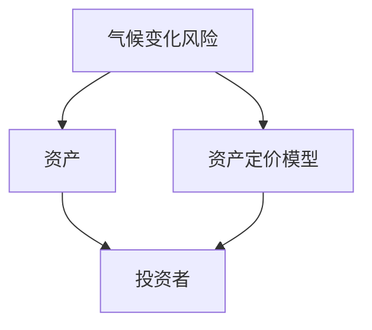
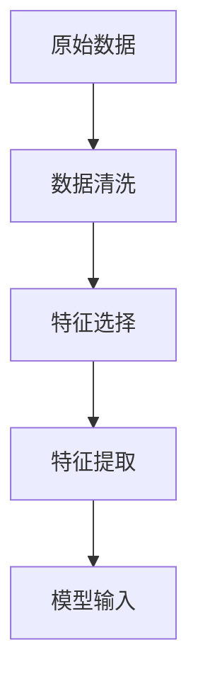
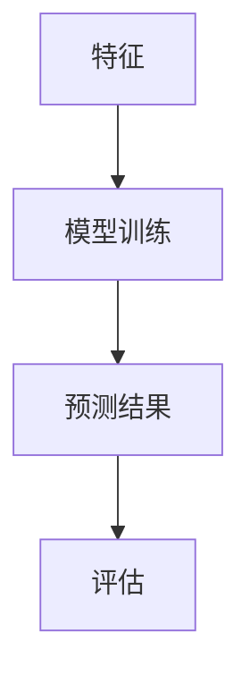
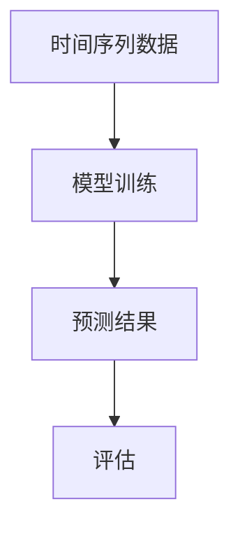
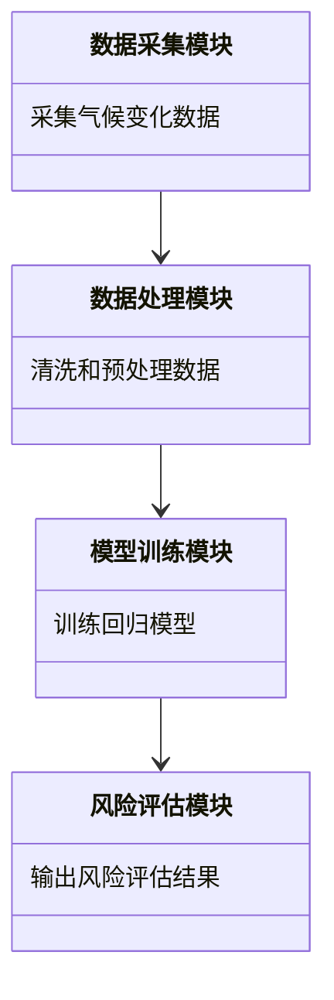
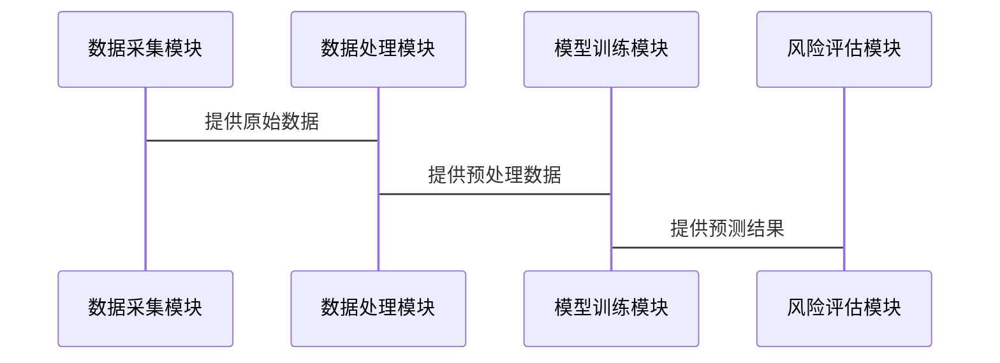

                 


# 气候变化风险在资产定价模型中的整合

> 关键词：气候变化风险，资产定价模型，风险管理，金融建模，可持续投资

> 摘要：随着全球气候变化问题的加剧，其对经济和金融市场的影响日益显著。本文探讨了如何将气候变化风险整合到资产定价模型中，分析了气候变化风险的类型、特征及其对资产定价的影响，并提出了基于机器学习和统计模型的解决方案。文章还通过具体案例展示了如何在实际中应用这些模型，为投资者提供了新的视角和方法。

---

## 第一部分：气候变化风险与资产定价模型的背景

### 第1章：气候变化风险的定义与影响

#### 1.1 气候变化的定义与核心特征

气候变化是指地球气候系统的长期变化，通常由自然因素（如火山活动、太阳辐射变化）和人为因素（如温室气体排放）共同作用引起。其核心特征包括：

- **长期性**：气候变化的影响通常需要数十年甚至更长时间才能显现。
- **全球性**：气候变化影响全球生态系统，跨越国界。
- **不确定性**：气候模型预测存在不确定性，难以精确量化其影响。

#### 1.2 资产定价模型的概述

资产定价模型是用来估计资产内在价值的工具，帮助投资者做出理性决策。常见的模型包括：

- **CAPM（资本资产定价模型）**：基于系统性风险和非系统性风险，计算资产的预期收益。
- **APT（ arbitrage pricing theory）**：通过多个因素解释资产收益。
- **DDM（股利折扣模型）**：基于股利增长预测股票价值。

#### 1.3 气候变化风险与资产定价模型的关联

气候变化风险对资产定价的影响主要体现在：

- **物理风险**：极端天气事件（如洪水、干旱）可能破坏资产，影响其价值。
- **转型风险**：政策变化（如碳税）或技术进步（如可再生能源普及）可能导致资产价值重估。
- **法律风险**：气候变化相关的诉讼或法规变化可能影响企业财务状况。

### 1.4 本章小结

本章介绍了气候变化的基本概念和其对经济金融的影响，分析了传统资产定价模型的局限性，并为后续整合气候变化风险提供了背景支持。

---

## 第二部分：气候变化风险在资产定价模型中的核心概念

### 第2章：气候变化风险的核心概念与属性

#### 2.1 气候变化风险的实体关系图

以下是气候变化风险的实体关系图：

```mermaid
erDiagram
    actor 气候变化风险
    actor 资产
    actor 投资者
    气候变化风险 -> 资产 : 影响
    资产 -> 投资者 : 价值波动
    投资者 -> 气候变化风险 : 风险评估
```

#### 2.2 气候变化风险与资产定价模型的属性对比

以下是气候变化风险与资产定价模型的属性对比表：

| 属性       | 气候变化风险               | 资产定价模型               |
|------------|---------------------------|---------------------------|
| 输入数据   | 气温、降水、极端天气事件   | 股息率、利率、市场回报率   |
| 输出结果   | 资产价值波动概率           | 资产预期收益               |
| 时间维度   | 长期趋势与短期波动         | 短期波动与长期趋势         |
| 不确定性   | 高                         | 中                         |

#### 2.3 气候变化风险与资产定价模型的关系

以下是气候变化风险与资产定价模型的关系图：



### 2.4 本章小结

本章通过实体关系图和属性对比，详细阐述了气候变化风险与资产定价模型之间的关系及其核心属性，为后续的算法设计奠定了基础。

---

## 第三部分：气候变化风险在资产定价模型中的算法原理

### 第3章：气候变化风险的算法原理

#### 3.1 气候变化风险的特征提取

以下是特征提取的流程图：



特征提取的关键步骤包括：

1. **数据清洗**：去除缺失值和异常值。
2. **特征选择**：筛选与气候变化相关的特征（如气温、降水）。
3. **特征提取**：使用主成分分析（PCA）提取关键特征。

#### 3.2 气候变化风险的回归分析

以下是回归分析的流程图：



回归分析的数学模型如下：

$$ y = \beta_0 + \beta_1x + \epsilon $$

其中，$y$ 是资产回报率，$x$ 是气候变化指标，$\epsilon$ 是误差项。

#### 3.3 气候变化风险的时间序列分析

以下是时间序列分析的流程图：



时间序列模型（如ARIMA）的数学表达式如下：

$$ ARIMA(p, d, q): x_t = \phi x_{t-p} + \theta x_{t-q} + \epsilon $$

#### 3.4 气候变化风险的机器学习算法

以下是机器学习算法的流程图：


机器学习算法（如随机森林）的数学表达式如下：

$$ y = \sum_{i=1}^n \theta_i x_i $$

#### 3.5 本章小结

本章详细讲解了如何将气候变化数据整合到资产定价模型中，并通过回归分析、时间序列分析和机器学习算法进行了具体实现。

---

## 第四部分：气候变化风险在资产定价模型中的系统架构

### 第4章：系统架构设计

#### 4.1 系统功能模块划分

以下是系统功能模块的类图：



#### 4.2 系统接口设计

以下是系统接口设计的序列图：



#### 4.3 本章小结

本章通过系统架构设计，详细描述了如何构建一个基于气候变化风险的资产定价系统，并通过模块化设计确保了系统的可扩展性和可维护性。

---

## 第五部分：项目实战

### 第5章：项目实战

#### 5.1 案例分析

以下是一个具体案例的分析：

1. **数据来源**：使用历史气候数据和股票市场数据。
2. **模型实现**：基于随机森林算法进行风险评估。
3. **结果分析**：模型预测了极端天气对某行业股票的影响。

#### 5.2 代码实现

以下是Python代码实现：

```python
import pandas as pd
from sklearn.ensemble import RandomForestRegressor
from sklearn.metrics import mean_squared_error

# 数据加载
data = pd.read_csv('climate_risk.csv')

# 特征选择
features = data[['temperature', 'precipitation', 'wind_speed']]
target = data['return']

# 模型训练
model = RandomForestRegressor()
model.fit(features, target)

# 模型预测
predictions = model.predict(features)
print('均方误差:', mean_squared_error(target, predictions))
```

#### 5.3 本章小结

本章通过具体案例展示了如何在实际中应用气候变化风险模型，并通过代码实现帮助读者理解模型的应用。

---

## 第六部分：总结与展望

### 第6章：总结与展望

#### 6.1 本章总结

本文详细探讨了气候变化风险在资产定价模型中的整合，通过理论分析、算法设计和案例实践，展示了如何将气候变化因素纳入资产定价模型。

#### 6.2 未来展望

未来的研究可以进一步探索以下方向：

1. 更复杂的时间序列模型（如LSTM）在气候变化风险预测中的应用。
2. 多因素模型的优化，以更好地捕捉气候变化的多重影响。
3. 可解释性模型的开发，以满足监管和投资者的需求。

---

## 作者信息

作者：AI天才研究院/AI Genius Institute & 禅与计算机程序设计艺术 /Zen And The Art of Computer Programming

---

### 注意事项

- 气候变化风险的量化具有高度不确定性，模型结果仅供参考。
- 投资者在使用模型时应结合其他因素进行综合判断。
- 模型的可解释性和透明度是监管的重要考量因素。

### 最佳实践 Tips

- 定期更新模型数据，以反映最新的气候变化趋势。
- 结合情景分析法，评估不同气候变化情景下的资产表现。
- 采用多模型验证，提高预测的准确性和可靠性。

---

通过本文的分析，读者可以全面理解气候变化风险对资产定价的影响，并掌握如何在实际中应用相关模型。

