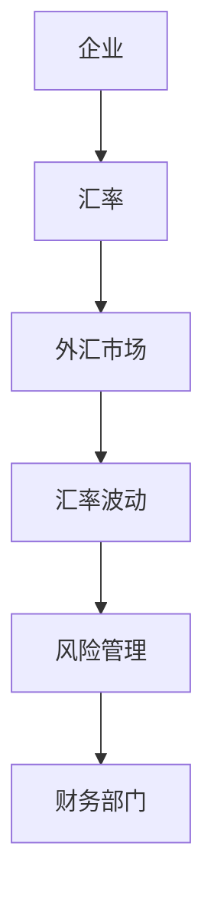
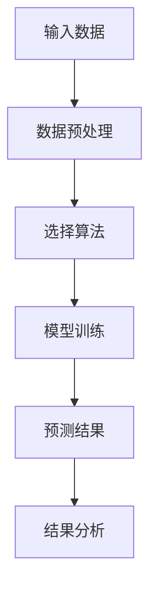
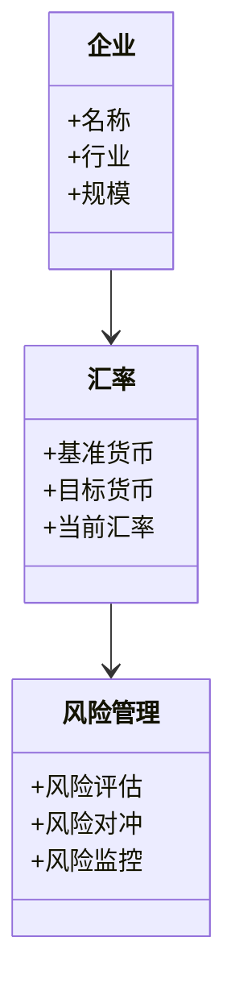
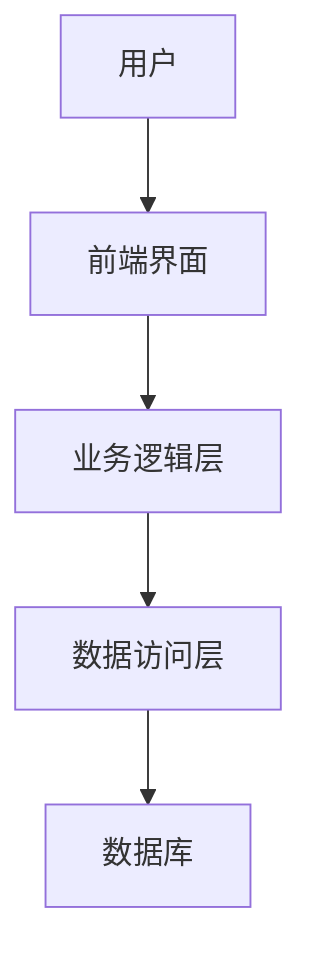

                 


# 汇率波动风险管理策略

> **关键词**：汇率波动、风险管理、对冲策略、算法模型、经济影响

> **摘要**：本文将深入探讨汇率波动风险管理的核心策略，结合实际案例和数学模型，分析如何有效应对汇率波动对企业财务的影响。通过介绍常见的风险管理工具和算法，本文旨在为企业提供一套系统化的风险管理方案，以确保在复杂多变的国际经济环境中稳健经营。

---

## 第1章: 汇率波动风险管理的背景与概念

### 1.1 汇率波动的基本概念

#### 1.1.1 汇率的定义与计算

汇率是两种货币之间的兑换比率，通常表示为一种货币相对于另一种货币的价值。例如，美元对人民币的汇率表示1美元可以兑换多少人民币。汇率的计算公式如下：

$$ 汇率 = \frac{目标货币}{基准货币} $$

在国际交易中，汇率的波动直接影响企业的进出口成本和利润。例如，当人民币升值时，出口商品的美元价格会相对提高，可能导致订单减少。

#### 1.1.2 汇率波动的来源与影响

汇率波动的主要来源包括：

1. **经济指标**：GDP增长率、通货膨胀率、利率变化等。
2. **政治因素**：国际政治局势、贸易政策变化等。
3. **市场情绪**：投资者信心、市场预期等。
4. **货币政策**：中央银行的利率调整、外汇干预等。

汇率波动对企业的影响包括：

- **出口成本增加**：当目标货币贬值时，出口商品的本地货币成本上升。
- **进口成本下降**：当目标货币升值时，进口商品的本地货币成本下降。
- **财务风险**：汇率波动可能导致企业利润波动。

#### 1.1.3 汇率波动对经济活动的影响

汇率波动不仅影响企业的财务状况，还会影响整个经济体系。例如，汇率波动可能导致资本流动不稳定，进而影响金融市场和实体经济。

---

### 1.2 汇率风险管理的重要性

#### 1.2.1 企业面临的汇率风险类型

企业可能面临以下几种汇率风险：

1. **交易风险**：企业在未来结算时，由于汇率波动导致损失的风险。
2. **折算风险**：企业在财务报表中将外币资产和负债折算为本币时的汇率风险。
3. **经济风险**：汇率波动对企业长期经营策略的影响。

#### 1.2.2 汇率波动对企业财务的影响

汇率波动可能导致企业利润下降、资本损失或资产减值。例如，当企业签订长期出口合同后，汇率波动可能导致最终结算时的损失。

#### 1.2.3 风险管理在企业经营中的作用

有效的汇率风险管理可以：

- 降低企业财务风险。
- 稳定企业利润。
- 提高企业竞争力。

---

### 1.3 汇率波动风险管理的核心目标

#### 1.3.1 确保企业财务稳定

通过合理配置资产和负债，企业可以降低汇率波动对其财务状况的影响。

#### 1.3.2 优化企业汇率风险管理策略

企业需要根据自身业务特点，选择合适的汇率风险管理工具。

#### 1.3.3 提高企业应对汇率波动的能力

通过建立完善的汇率风险管理机制，企业可以更好地应对汇率波动的挑战。

---

### 1.4 本章小结

本章介绍了汇率波动的基本概念、来源、影响以及风险管理的重要性。企业需要高度重视汇率波动带来的风险，并采取有效措施进行管理。

---

## 第2章: 汇率波动风险管理的核心概念与联系

### 2.1 汇率波动风险管理的原理

#### 2.1.1 风险识别与评估

企业需要识别潜在的汇率风险，并评估其可能带来的损失。例如，通过分析历史汇率数据，识别出哪些货币对波动较大。

#### 2.1.2 风险对冲机制

企业可以通过金融工具（如远期合约、期权等）来对冲汇率风险。例如，企业可以通过签订远期外汇合约，锁定未来的汇率，从而避免汇率波动带来的损失。

#### 2.1.3 风险监控与预警

企业需要建立监控机制，实时跟踪汇率波动，并设置预警指标。例如，当某货币对的波动率超过设定阈值时，触发预警。

---

### 2.2 核心概念对比分析

#### 2.2.1 汇率波动与经济周期的关系

经济周期波动通常会影响汇率波动。例如，在经济衰退期间，货币可能会贬值，而在经济复苏期间，货币可能会升值。

#### 2.2.2 汇率预测模型的优缺点

常用的汇率预测模型包括：

1. **时间序列模型**：如ARIMA模型，适用于历史数据充足的场景。
2. **机器学习模型**：如神经网络模型，适用于复杂非线性关系的预测。
3. **统计套利模型**：通过统计套利寻找短期价格偏差。

每种模型都有其优缺点，企业需要根据实际情况选择合适的模型。

#### 2.2.3 风险管理工具的选择

企业可以选择以下风险管理工具：

1. **远期合约**：通过签订远期合约，锁定未来的汇率。
2. **期权**：通过购买期权，获得在特定价格买入或卖出外汇的权利。
3. **货币互换**：通过货币互换，调整资产负债结构。

---

### 2.3 实体关系图（ER图）

以下是汇率波动风险管理的核心实体关系图：



---

### 2.4 本章小结

本章详细介绍了汇率波动风险管理的原理、核心概念以及风险管理工具的选择。企业需要根据自身情况，选择合适的工具和策略。

---

## 第3章: 汇率波动风险管理的算法原理

### 3.1 常见的汇率预测算法

#### 3.1.1 时间序列分析法

时间序列分析法是一种常用的汇率预测方法。例如，ARIMA模型可以用于预测未来的汇率走势。

#### 3.1.2 机器学习算法

机器学习算法，如随机森林和神经网络，也可以用于汇率预测。这些方法通常需要大量的历史数据和特征变量。

#### 3.1.3 统计套利算法

统计套利算法通过寻找市场中的价格偏差，进行套利交易。例如，当某种货币对的价格出现短期偏差时，可以通过买卖操作获利。

---

### 3.2 算法流程图

以下是汇率预测算法的流程图：



---

### 3.3 Python代码实现

以下是使用Python实现的简单汇率预测代码示例：

```python
import pandas as pd
import numpy as np
from sklearn.linear_model import LinearRegression

# 数据预处理
data = pd.read_csv('exchange_rate.csv')
X = data[['economic_indicator', 'market_sentiment']]
y = data['exchange_rate']

# 划分训练集和测试集
X_train, X_test, y_train, y_test = train_test_split(X, y, test_size=0.2, random_state=42)

# 模型训练
model = LinearRegression()
model.fit(X_train, y_train)

# 预测结果
y_pred = model.predict(X_test)

# 模型评估
print('预测值:', y_pred)
print('真实值:', y_test)
print('预测误差:', y_pred - y_test)
```

---

### 3.4 数学模型与公式

#### 3.4.1 汇率波动的数学

以下是汇率波动的数学模型：

$$ \text{汇率波动} = \sqrt{\sum_{i=1}^{n} (r_i - \bar{r})^2} $$

其中，$r_i$ 表示第i个时间点的汇率，$\bar{r}$ 表示平均汇率。

---

### 3.5 本章小结

本章介绍了常见的汇率预测算法，包括时间序列分析法、机器学习算法和统计套利算法，并通过Python代码示例展示了算法的实现过程。

---

## 第4章: 汇率波动风险管理的系统分析与架构设计

### 4.1 问题场景介绍

企业在进行跨国交易时，需要面对汇率波动的风险。为了降低这种风险，企业需要建立一套完善的汇率风险管理系统。

---

### 4.2 系统功能设计

#### 4.2.1 领域模型

以下是汇率风险管理系统的领域模型：



#### 4.2.2 系统架构设计

以下是汇率风险管理系统的架构图：



---

### 4.3 系统接口设计

以下是汇率风险管理系统的接口设计：

1. **输入接口**：接收企业的财务数据和市场数据。
2. **输出接口**：输出汇率预测结果和风险管理建议。

---

### 4.4 本章小结

本章通过系统分析和架构设计，展示了如何构建一个完善的汇率风险管理系统。

---

## 第5章: 汇率波动风险管理的项目实战

### 5.1 环境安装

为了实现汇率风险管理，企业需要安装以下工具：

- **数据获取工具**：如Yahoo Finance API。
- **数据分析工具**：如Python和Pandas。
- **可视化工具**：如Matplotlib或Seaborn。

---

### 5.2 核心代码实现

以下是实现汇率风险管理的核心代码：

```python
import pandas as pd
from sklearn.metrics import mean_squared_error

# 数据获取
data = pd.read_csv('exchange_rate.csv')

# 数据预处理
data['date'] = pd.to_datetime(data['date'])
data.set_index('date', inplace=True)

# 数据分割
train_data = data.iloc[:100]
test_data = data.iloc[100:]

# 模型训练
model = LinearRegression()
model.fit(train_data[['economic_indicator', 'market_sentiment']], train_data['exchange_rate'])

# 模型预测
predicted = model.predict(test_data[['economic_indicator', 'market_sentiment']])
print('预测误差:', mean_squared_error(test_data['exchange_rate'], predicted))
```

---

### 5.3 案例分析

以下是一个实际案例分析：

某出口企业签订了一份美元订单，预计3个月后交付。为了规避汇率风险，企业可以选择签订远期外汇合约，锁定未来的汇率。

---

### 5.4 项目小结

本章通过实际案例分析，展示了如何在企业中应用汇率风险管理策略。

---

## 第6章: 汇率波动风险管理的最佳实践

### 6.1 最佳实践 tips

1. **定期评估风险**：企业应定期评估汇率风险，及时调整风险管理策略。
2. **选择合适的工具**：根据企业需求选择合适的汇率风险管理工具。
3. **建立监控机制**：实时监控汇率波动，及时应对潜在风险。

---

### 6.2 小结

通过本文的介绍，读者可以全面了解汇率波动风险管理的核心策略和实际应用。

---

### 6.3 注意事项

1. **数据质量**：确保数据的准确性和完整性。
2. **模型选择**：根据实际情况选择合适的预测模型。
3. **风险管理工具**：选择适合企业需求的对冲工具。

---

### 6.4 拓展阅读

1. **《外汇风险管理》**：深入探讨外汇风险管理的理论与实践。
2. **《汇率预测模型》**：详细介绍常用的汇率预测模型及其应用。

---

## 作者信息

作者：AI天才研究院/AI Genius Institute & 禅与计算机程序设计艺术/Zen And The Art of Computer Programming

---

以上是《汇率波动风险管理策略》的完整目录大纲和文章内容，希望对您有所帮助！

