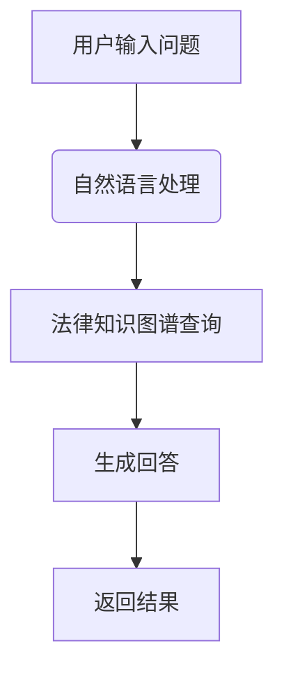
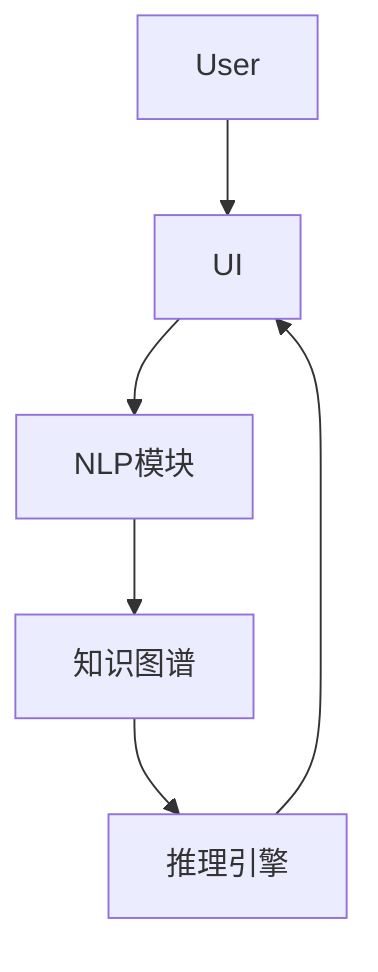

                 


# 《法律AI Agent：法律咨询与案例分析助手》

> **关键词**：法律AI Agent，法律咨询，案例分析，人工智能，自然语言处理，知识图谱

> **摘要**：本文系统介绍了法律AI Agent的概念、功能、核心算法及其实现，结合实际案例，详细讲解了法律AI Agent在法律咨询与案例分析中的应用场景、系统架构设计、算法原理和项目实现过程。文章还提供了最佳实践和注意事项，帮助读者更好地理解和应用法律AI Agent技术。

---

## 第一部分：法律AI Agent的背景与概念

### 第1章：法律AI Agent的起源与现状

#### 1.1 法律AI Agent的定义与背景
- **1.1.1 人工智能在法律领域的应用背景**
  - 随着人工智能技术的快速发展，法律领域逐渐成为AI技术的重要应用场景。法律咨询、案例分析等传统法律事务可以通过AI技术实现自动化和智能化，从而提高效率并降低成本。
  
- **1.1.2 法律AI Agent的概念与核心目标**
  - 法律AI Agent是一种基于人工智能技术的法律咨询与案例分析助手，旨在为用户提供智能化的法律服务，帮助其快速获取法律信息、理解法律规则并做出决策。

- **1.1.3 当前法律AI Agent的发展现状**
  - 当前，法律AI Agent在企业法务、个人法律咨询、法律教育等领域得到了广泛应用。一些领先的法律科技公司已经推出了成熟的法律AI Agent产品，如法律问答系统、智能合同审查工具等。

---

#### 1.2 法律AI Agent的核心功能
- **1.2.1 法律咨询与问答**
  - 用户可以通过法律AI Agent提出法律问题，AI系统通过自然语言处理技术理解和生成回答，提供专业的法律建议。

- **1.2.2 法律案例分析与预测**
  - 法律AI Agent能够分析历史案例数据，提取关键信息并生成案例分析报告，帮助用户预测案件的可能结果。

- **1.2.3 法律文件生成与审查**
  - 法律AI Agent可以根据用户提供的信息自动生成法律文件，如合同、法律声明等，并对文件进行自动审查，确保其合规性。

---

#### 1.3 法律AI Agent的应用场景
- **1.3.1 企业法务与合规管理**
  - 企业可以通过法律AI Agent进行合同审查、合规性检查等，降低法律风险。

- **1.3.2 个人法律咨询与服务**
  - 个人用户可以利用法律AI Agent解决日常法律问题，如离婚咨询、债务纠纷等。

- **1.3.3 法律教育与培训**
  - 法律AI Agent可以作为法律教育工具，帮助学生和新手律师学习法律知识和案例分析。

---

#### 1.4 本章小结
- 本章主要介绍了法律AI Agent的定义、功能及应用场景，为后续内容奠定了基础。

---

## 第二部分：法律AI Agent的核心概念与原理

### 第2章：法律AI Agent的核心概念与联系

#### 2.1 核心概念与原理
- **2.1.1 法律AI Agent的基本原理**
  - 法律AI Agent通过自然语言处理（NLP）技术理解用户的问题，结合知识图谱中的法律规则和案例数据，生成相应的回答或建议。

- **2.1.2 自然语言处理（NLP）在法律AI中的应用**
  - NLP技术用于法律文本的理解和生成，例如从法律文档中提取关键信息、自动生成法律文件等。

- **2.1.3 知识图谱与法律规则的结合**
  - 知识图谱将法律规则、案例、术语等结构化表示，为法律AI Agent提供知识支持。

---

#### 2.2 核心概念对比表
| 概念         | 描述                                                                 |
|--------------|----------------------------------------------------------------------|
| 法律AI Agent  | 基于AI的法律咨询与案例分析工具，提供智能化的法律服务。                 |
| 自然语言处理 | 用于理解和生成自然语言的技术，广泛应用于法律文本的处理。               |
| 知识图谱      | 法律规则、案例的结构化表示，为AI提供知识支持。                         |

---

#### 2.3 ER实体关系图
```mermaid
er
    LawAIAgent {
        id
        name
        description
    }
    LegalCase {
        case_id
        case_name
        case_summary
    }
    LegalRule {
        rule_id
        rule_description
    }
    LawAIAgent --> LegalCase : 分析
    LawAIAgent --> LegalRule : 应用
```

---

### 第3章：法律AI Agent的算法原理

#### 3.1 算法原理概述
- **3.1.1 基于大语言模型的法律问答**
  - 使用预训练的大语言模型（如GPT）处理法律文本，生成回答。

- **3.1.2 法律案例分析的文本挖掘技术**
  - 通过文本挖掘技术从案例数据库中提取关键信息，用于案例分析和预测。

- **3.1.3 法律规则的自动推理**
  - 基于知识图谱中的法律规则，进行逻辑推理，生成法律建议。

---

#### 3.2 算法流程图


---

#### 3.3 算法实现代码
以下是一个简单的法律AI Agent的问答系统实现示例：

```python
import spacy  # 使用spaCy进行NLP处理

nlp = spacy.load("en_core_web_sm")  # 加载预训练的NLP模型

def legal_AIAgent(question):
    doc = nlp(question)
    # 提取问题中的关键实体
    entities = [ent.text for ent in doc.ents]
    # 进行法律规则匹配
    # （此处需要结合知识图谱进行更复杂的处理）
    return "根据法律规则，您的问题是关于合同纠纷的。建议您咨询专业律师。"

# 示例使用
question = "如果我违约，需要承担什么责任？"
print(legal_AIAgent(question))
```

---

#### 3.4 数学公式与模型
- **3.4.1 预训练语言模型的损失函数**
  $$ \mathcal{L} = -\sum_{i=1}^{n} \log p(y_i|x_i) $$
  其中，$x_i$ 是输入，$y_i$ 是对应的输出。

- **3.4.2 知识图谱的表示学习**
  法律规则可以通过向量表示，例如使用Word2Vec进行词嵌入：
  $$ \text{vector}(w) = (v_1, v_2, ..., v_d) $$

---

## 第三部分：法律AI Agent的系统架构与实现

### 第4章：法律AI Agent的系统架构设计

#### 4.1 系统功能设计
- **4.1.1 用户界面**
  - 提供自然语言输入界面，支持中文和英文提问。
  
- **4.1.2 法律知识库**
  - 包含法律法规、案例数据库、合同模板等。

- **4.1.3 AI处理引擎**
  - 包括NLP模块、知识图谱查询模块和推理引擎。

---

#### 4.2 系统架构图


---

#### 4.3 接口设计
- **法律AI Agent API**
  ```python
  def query_legal_info(question):
      # 调用NLP模块进行处理
      result = nlp(question)
      # 查询知识图谱
      return query_knowledge_graph(result)
  ```

---

### 第5章：法律AI Agent的项目实战

#### 5.1 环境安装
- 安装Python和相关库：
  ```bash
  pip install spacy transformers
  ```

#### 5.2 核心代码实现
- 法律AI Agent的问答系统实现：
  ```python
  import spacy
  from transformers import pipeline

  nlp = spacy.load("en_core_web_sm")
  qa_pipeline = pipeline("question-answering")

  def legal_AIAgent(question, context):
      answer = qa_pipeline(question=question, context=context)
      return answer['answer']

  # 示例使用
  context = "违约责任是指一方未履行合同义务而应承担的法律责任。"
  print(legal_AIAgent("违约责任是什么？", context))
  ```

---

#### 5.3 案例分析与解读
- 案例：合同纠纷分析
  - 用户提问：“如果供应商未能按时交付货物，我该怎么办？”
  - 系统分析并生成建议。

---

#### 5.4 项目小结
- 本章通过实际案例展示了法律AI Agent的实现过程，包括环境搭建、核心代码编写和案例分析。

---

## 第四部分：最佳实践与小结

### 第6章：最佳实践与注意事项

#### 6.1 最佳实践
- 数据质量：确保法律知识库的数据准确性和完整性。
- 模型选择：根据具体需求选择合适的NLP模型和算法。
- 用户反馈：收集用户反馈，不断优化系统。

#### 6.2 注意事项
- 数据隐私：处理法律数据时需遵守相关法律法规。
- 系统稳定性：确保系统的高可用性和快速响应。

---

### 第7章：小结与展望

#### 7.1 小结
- 本文全面介绍了法律AI Agent的概念、原理、系统架构及实现方法，结合实际案例进行了详细分析。

#### 7.2 展望
- 未来，随着AI技术的不断发展，法律AI Agent将更加智能化和个性化，为法律领域带来更多创新和变革。

---

## 作者

作者：AI天才研究院/AI Genius Institute & 禅与计算机程序设计艺术 /Zen And The Art of Computer Programming

