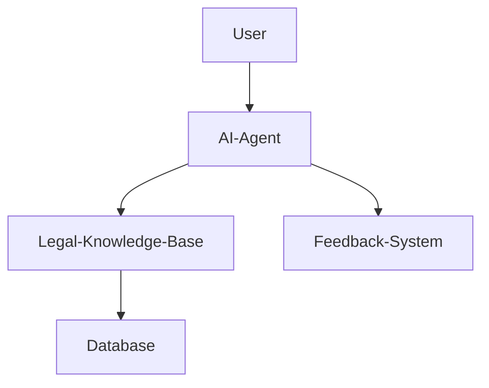
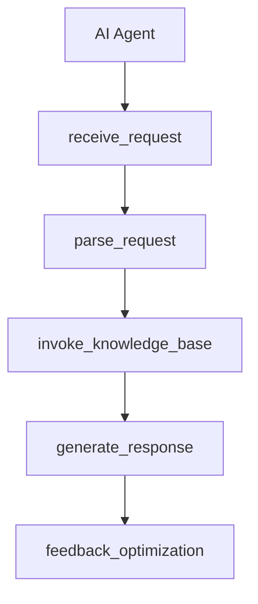
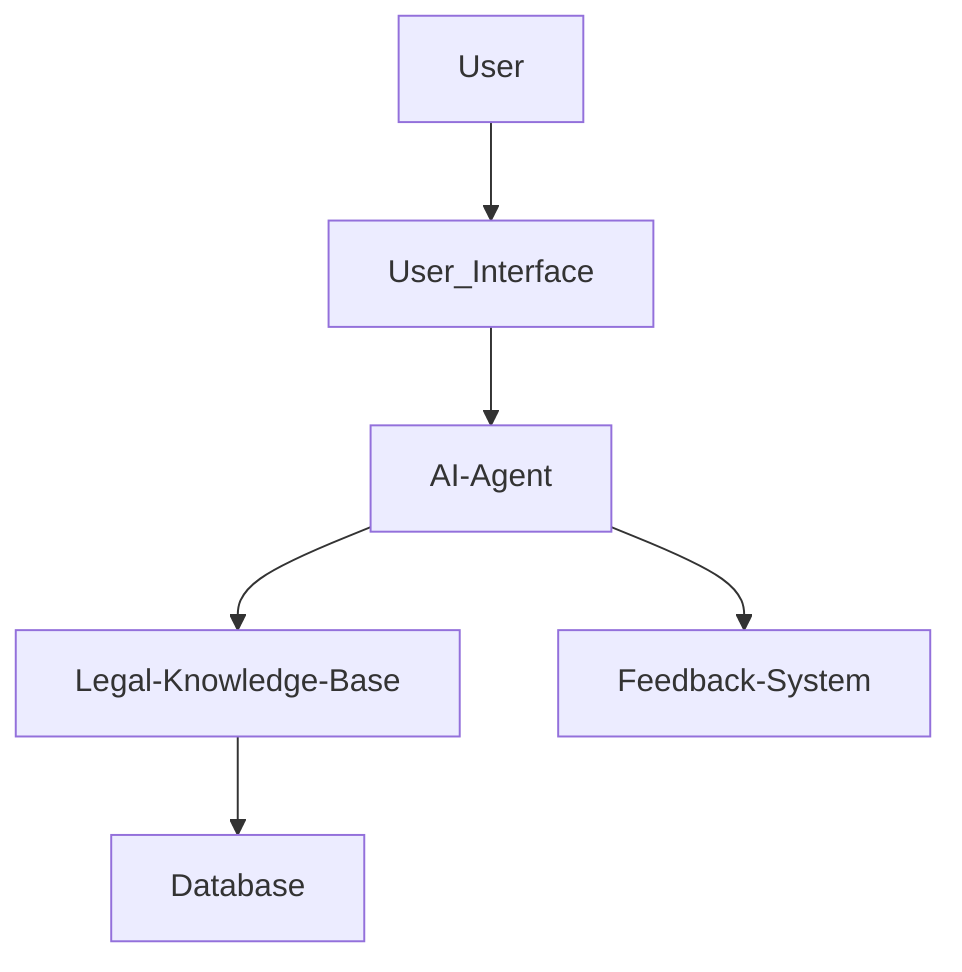
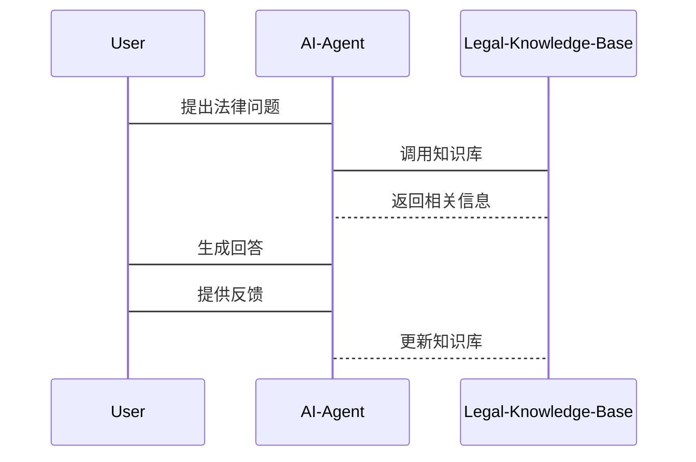

                 


# 法律咨询领域的AI Agent辅助系统

## 关键词：AI Agent, 法律咨询, 人工智能, 知识库构建, 对话生成, 法律系统架构

## 摘要：  
本文探讨了AI Agent在法律咨询领域的应用，从背景、核心概念、算法原理到系统架构、项目实战，全面分析了AI Agent辅助系统的构建与优化。文章详细阐述了法律咨询领域的现状与挑战，AI Agent的核心概念与特点，算法原理与流程，系统架构设计，以及实际项目中的应用与经验总结。通过本文，读者将深入了解如何利用AI技术提升法律咨询效率与准确性。

---

# 第1章: 法律咨询领域的AI Agent概述

## 1.1 法律咨询领域的现状与挑战

### 1.1.1 法律咨询的核心问题  
法律咨询的核心问题是为用户提供准确的法律建议，包括合同审查、法律文书撰写、法律咨询与问答等。传统法律咨询依赖于律师或法律专家，存在效率低、成本高、覆盖面有限等问题。

### 1.1.2 AI Agent的定义与特点  
AI Agent（人工智能代理）是一种能够理解用户需求、执行任务并提供反馈的智能系统。其特点包括：  
1. **智能化**：基于自然语言处理和知识库，能够理解用户意图。  
2. **自动化**：无需人工干预，自动完成任务。  
3. **学习能力**：通过反馈优化自身性能。  

### 1.1.3 法律咨询中的具体问题  
- **信息不对称**：用户缺乏法律知识，难以准确描述问题。  
- **效率低下**：传统咨询流程繁琐，耗时长。  
- **成本高昂**：律师费用昂贵，尤其是中小企业和个人用户。  

### 1.1.4 AI Agent在法律咨询中的应用与挑战  
AI Agent可以通过自然语言处理技术，帮助用户快速找到相关法律信息，降低咨询成本，提高效率。然而，法律领域的复杂性（如法律法规的多样性、案例的特殊性）也给AI Agent带来了技术挑战。

---

## 1.2 AI Agent的核心概念与特点

### 1.2.1 AI Agent的任务分解  
AI Agent在法律咨询中的任务可以分解为以下几个步骤：  
1. **用户需求识别**：通过对话理解用户的具体需求。  
2. **知识库调用**：基于需求调用法律知识库。  
3. **生成回答**：结合知识库生成回答。  
4. **反馈优化**：根据用户反馈优化回答质量。  

### 1.2.2 AI Agent与传统法律咨询工具的对比  

| 特性                | 传统法律咨询工具               | AI Agent                   |
|---------------------|-------------------------------|----------------------------|
| 效率                | 低效                           | 高效                         |
| 准确性              | 取决于咨询人员水平             | 基于知识库，准确性高           |
| 适用范围            | 有限                           | 广泛                         |
| 互动方式            | 单向                           | 双向交互                     |

### 1.2.3 AI Agent在法律咨询中的优势  
- **24/7可用性**：AI Agent可以全天候为用户提供服务。  
- **成本低廉**：相比传统律师，AI Agent的使用成本大幅降低。  
- **快速响应**：基于预训练模型，AI Agent可以快速生成回答。  

---

## 1.3 法律咨询领域的AI Agent应用场景

### 1.3.1 合同审查与分析  
AI Agent可以自动分析合同条款，识别潜在法律风险。例如，用户上传一份商业合同，AI Agent可以快速标注关键条款并提出修改建议。

### 1.3.2 法律咨询与问答  
用户可以通过对话形式向AI Agent提出法律问题，例如“如果我与客户签订的合同中没有明确违约责任，是否可以主张赔偿？”AI Agent将基于知识库提供相关法律依据。

### 1.3.3 法律文书自动生成  
AI Agent可以根据用户提供的信息，自动生成法律文书，如起诉状、仲裁申请等。这大大提高了法律服务的效率。

---

## 1.4 法律咨询领域的AI Agent发展现状

### 1.4.1 国内外研究现状  
目前，国内外在法律咨询领域的AI研究主要集中在自然语言处理和知识图谱构建方面。例如，国外的ROSS Intelligence和国内的法小律都推出了AI法律咨询系统。

### 1.4.2 当前技术瓶颈  
- **知识库覆盖不足**：法律领域庞大，知识库的构建需要大量人工标注。  
- **语义理解能力有限**：AI Agent对复杂法律问题的理解能力仍需提升。  
- **法律规范更新滞后**：法律法规的更新速度难以与AI系统的实时更新同步。  

### 1.4.3 未来发展趋势  
- **知识图谱的深化**：构建更全面的法律知识图谱，支持复杂问题的推理。  
- **多模态交互**：结合视觉、语音等多种交互方式，提升用户体验。  
- **智能化决策支持**：AI Agent将逐步具备辅助决策的能力。  

---

## 1.5 本章小结  
本章介绍了法律咨询领域的现状与挑战，AI Agent的核心概念与特点，以及其在法律咨询中的应用场景和发展现状。AI Agent的引入将显著提升法律咨询的效率与准确性，但同时也面临知识库构建和语义理解等技术挑战。

---

# 第2章: 法律咨询领域的AI Agent核心概念与联系

## 2.1 核心概念原理

### 2.1.1 AI Agent的任务分解  
AI Agent在法律咨询中的任务分解包括：  
1. **用户需求识别**：通过自然语言处理技术理解用户意图。  
2. **知识库调用**：基于需求调用法律知识库。  
3. **对话生成**：结合知识库生成回答。  
4. **反馈优化**：根据用户反馈优化回答质量。  

### 2.1.2 法律知识库的构建  
法律知识库是AI Agent的核心资产，包括法律法规、司法案例、合同模板等内容。知识库的构建需要结合法律专家的指导，采用自动抽取和人工标注相结合的方式。

### 2.1.3 对话生成与推理机制  
对话生成基于预训练语言模型（如GPT），结合法律知识库进行微调。推理机制则依赖于知识图谱的构建与推理算法。

## 2.2 核心概念属性特征对比

### 2.2.1 传统法律咨询与AI Agent的对比  

| 特性                | 传统法律咨询               | AI Agent                   |
|---------------------|-------------------------------|----------------------------|
| 效率                | 低效                           | 高效                         |
| 准确性              | 取决于咨询人员水平             | 基于知识库，准确性高           |
| 成本                | 高                             | 低                           |

### 2.2.2 AI Agent与传统问答系统的对比  

| 特性                | 传统问答系统               | AI Agent                   |
|---------------------|-------------------------------|----------------------------|
| 专业性              | 通用性                       | 高度专业化                   |
| 知识库              | 广泛但不专精                 | 专注于法律领域               |
| 交互方式            | 文本问答                     | 支持复杂对话与任务执行       |

## 2.3 ER实体关系图架构



---

## 2.4 本章小结  
本章详细阐述了AI Agent在法律咨询中的核心概念与联系，对比了传统法律咨询与AI Agent的特点，并通过ER实体关系图展示了AI Agent与法律知识库的关系。

---

# 第3章: 法律咨询领域的AI Agent算法原理

## 3.1 AI Agent算法原理概述

### 3.1.1 AI Agent的算法流程  



### 3.1.2 算法核心步骤  
1. **接收请求**：用户通过文本或语音形式提出法律问题。  
2. **解析请求**：AI Agent通过自然语言处理技术解析用户需求。  
3. **调用知识库**：基于解析结果，AI Agent从法律知识库中提取相关信息。  
4. **生成回答**：结合知识库内容生成回答，并返回给用户。  
5. **反馈优化**：根据用户反馈优化回答质量。

---

## 3.2 法律知识库构建与算法

### 3.2.1 知识库构建流程  
1. **数据收集**：收集法律法规、司法案例等数据。  
2. **数据清洗**：去除无效数据，标注数据。  
3. **知识抽取**：利用自然语言处理技术提取关键信息。  
4. **知识图谱构建**：将抽取的信息构建为知识图谱。  

### 3.2.2 知识图谱的表示与推理  
知识图谱的表示采用图嵌入技术，推理算法基于规则推理与神经推理结合。

---

## 3.3 对话生成与优化算法

### 3.3.1 对话生成模型  
对话生成基于预训练语言模型（如GPT-3），结合法律知识库进行微调。  

### 3.3.2 反馈优化算法  
反馈优化采用强化学习方法，通过用户反馈优化回答策略。

---

## 3.4 本章小结  
本章详细分析了AI Agent在法律咨询中的算法原理，包括算法流程、知识库构建与对话生成的优化算法。

---

# 第4章: 法律咨询领域的AI Agent系统架构设计

## 4.1 系统功能设计

### 4.1.1 用户交互模块  
用户可以通过文本或语音形式与AI Agent交互。  

### 4.1.2 问题解析模块  
通过自然语言处理技术解析用户需求。  

### 4.1.3 知识库调用模块  
根据解析结果调用法律知识库。  

### 4.1.4 对话生成模块  
基于知识库生成回答。  

### 4.1.5 反馈优化模块  
根据用户反馈优化回答质量。  

## 4.2 系统架构设计  



---

## 4.3 系统接口设计  
1. **用户接口**：提供API供用户调用。  
2. **知识库接口**：提供法律知识库的访问接口。  
3. **反馈接口**：收集用户反馈并优化系统。  

---

## 4.4 系统交互流程  



---

## 4.5 本章小结  
本章详细设计了AI Agent在法律咨询中的系统架构，包括功能设计、架构设计、接口设计与交互流程。

---

# 第5章: 法律咨询领域的AI Agent项目实战

## 5.1 项目介绍  
本项目旨在开发一个基于AI Agent的法律咨询系统，涵盖合同审查、法律问答、法律文书生成等功能。

## 5.2 环境配置  
1. **Python版本**：3.8以上  
2. **框架选择**：基于Transformers库与Flask框架  
3. **依赖安装**：`pip install transformers flask`  

## 5.3 核心代码实现

### 5.3.1 问题解析模块  

```python
from transformers import AutoTokenizer, AutoModelForSeq2Seq
import torch

class LegalParser:
    def __init__(self):
        self.tokenizer = AutoTokenizer.from_pretrained("facebook/bart-large-xsum")
        self.model = AutoModelForSeq2Seq.from_pretrained("facebook/bart-large-xsum")
        
    def parse_request(self, text):
        inputs = self.tokenizer.encode(text, return_tensors="pt", max_length=512, truncation=True)
        outputs = self.model.generate(inputs, max_length=100, num_beams=5)
        result = self.tokenizer.decode(outputs[0], skip_special_tokens=True)
        return result
```

### 5.3.2 知识库调用模块  

```python
import json

class LegalKnowledgeBase:
    def __init__(self):
        self.knowledge_base = self.load_knowledge_base()
        
    def load_knowledge_base(self):
        with open("legal_knowledge.json", "r") as f:
            return json.load(f)
    
    def get_relevant_info(self, query):
        # 简单实现：基于关键词匹配
        results = []
        for key in self.knowledge_base:
            if query in key:
                results.append(self.knowledge_base[key])
        return results
```

### 5.3.3 对话生成模块  

```python
from transformers import AutoTokenizer, AutoModelForCausalLM

class LegalResponder:
    def __init__(self):
        self.tokenizer = AutoTokenizer.from_pretrained("gpt2")
        self.model = AutoModelForCausalLM.from_pretrained("gpt2")
        
    def generate_response(self, query, history=None):
        inputs = self.tokenizer.encode(query, return_tensors="pt")
        outputs = self.model.generate(inputs, max_length=200, do_sample=True)
        response = self.tokenizer.decode(outputs[0], skip_special_tokens=True)
        return response
```

## 5.4 项目实战案例分析  
以合同审查为例，用户上传一份商业合同，AI Agent自动识别关键条款并提出修改建议。  

## 5.5 项目总结与经验分享  
1. **知识库构建**：需要法律专家的参与，确保知识库的准确性和全面性。  
2. **模型优化**：对话生成模型需要不断优化，提升回答的准确性和流畅性。  
3. **用户反馈**：及时收集用户反馈，优化系统性能。  

---

## 5.6 本章小结  
本章通过实际案例展示了AI Agent在法律咨询中的应用，详细介绍了项目的环境配置、核心代码实现与实战经验。

---

# 第6章: 法律咨询领域的AI Agent最佳实践

## 6.1 系统优化与维护

### 6.1.1 知识库优化  
定期更新知识库，确保法律法规的准确性。  

### 6.1.2 模型优化  
通过迁移学习与微调提升模型性能。  

## 6.2 用户隐私与数据安全

### 6.2.1 数据加密  
用户数据加密存储，确保隐私安全。  

### 6.2.2 访问权限控制  
严格控制系统的访问权限，避免数据泄露。  

## 6.3 法律合规性

### 6.3.1 合规性要求  
AI Agent的回答需符合相关法律法规。  

### 6.3.2 法律责任划分  
明确AI Agent与法律专家的责任划分。  

## 6.4 未来发展方向

### 6.4.1 多语言支持  
扩展AI Agent的多语言支持，服务全球用户。  

### 6.4.2 复杂问题处理  
提升AI Agent处理复杂法律问题的能力。  

## 6.5 本章小结  
本章总结了AI Agent在法律咨询中的最佳实践，包括系统优化、用户隐私保护、法律合规性与未来发展方向。

---

# 作者：AI天才研究院/AI Genius Institute & 禅与计算机程序设计艺术 /Zen And The Art of Computer Programming

