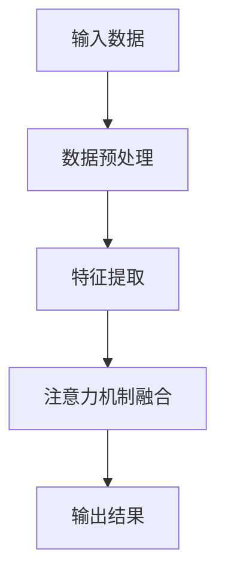

                 


# 目录大纲：注意力机制在AI Agent多模态融合中的应用

---

## 第一部分：注意力机制与多模态融合基础

### 第1章：注意力机制与多模态融合概述

#### 1.1 注意力机制的核心概念

##### 1.1.1 注意力机制的定义与背景
- **定义**：注意力机制是一种模拟人类注意力的机制，用于在处理多模态数据时，自动关注重要的信息。
- **背景**：随着AI Agent在复杂场景中的应用，处理多模态数据的需求日益增加。
- **问题背景**：如何有效处理多模态数据中的冗余信息，提取关键特征。

##### 1.1.2 多模态数据的定义与特点
- **多模态数据**：包括文本、图像、语音等多种类型的数据。
- **特点**：异构性、互补性、复杂性。

##### 1.1.3 AI Agent的定义与应用场景
- **AI Agent**：智能体，能够在复杂环境中感知、推理、决策和行动。
- **应用场景**：如智能助手、自动驾驶、智能客服等。

#### 1.2 多模态融合的背景与挑战

##### 1.2.1 多模态数据的特点与优势
- **优势**：提供更全面的信息，提高准确性。

##### 1.2.2 多模态融合的核心问题与挑战
- **挑战**：数据异构性、信息冗余、计算复杂度。

##### 1.2.3 注意力机制在多模态融合中的作用
- **作用**：自动关注重要模态信息，提高融合效果。

---

## 第二部分：注意力机制的数学模型与原理

### 第2章：注意力机制的数学模型与原理

#### 2.1 自注意力机制的数学推导

##### 2.1.1 自注意力机制的公式推导
- **公式**：$$\text{Attention}(Q, K, V) = \text{softmax}\left(\frac{QK^T}{\sqrt{d_k}}\right)V$$
  其中，$Q$、$K$、$V$分别是查询、键、值向量，$d_k$是键的维度。

##### 2.1.2 查询、键、值的向量表示
- **查询**：表示输入序列中的某个位置。
- **键**：用于匹配其他位置的特征。
- **值**：提供与键匹配后的输出。

##### 2.1.3 缩放点积与Softmax函数的作用
- **缩放点积**：防止数值过大，稳定梯度。
- **Softmax**：将输出转换为概率分布，表示每个位置的重要性。

#### 2.2 多模态注意力机制的扩展

##### 2.2.1 多模态数据的特征表示
- **图像**：使用CNN提取特征。
- **文本**：使用词嵌入表示。

##### 2.2.2 跨模态注意力机制的实现方式
- **跨模态查询**：例如，用文本作为查询，图像作为键值。

##### 2.2.3 模态权重的动态调整方法
- **动态权重分配**：根据上下文调整各模态的重要性。

---

## 第三部分：多模态融合的算法原理

### 第3章：多模态融合的算法原理

#### 3.1 多模态融合的基本方法

##### 3.1.1 晚期融合与早期融合的对比
- **晚期融合**：在高层进行融合，适合需要全局信息的场景。
- **早期融合**：在低层进行融合，适合需要局部信息的场景。

##### 3.1.2 基于注意力机制的融合策略
- **自适应融合**：根据任务动态调整注意力权重。

##### 3.1.3 多模态数据的联合表示方法
- **联合编码**：将多模态数据编码为统一的向量空间。

#### 3.2 基于Transformer的多模态融合模型

##### 3.2.1 Transformer模型的结构与特点
- **编码器-解码器结构**：编码器提取特征，解码器生成输出。
- **位置编码**：引入位置信息。

##### 3.2.2 多模态数据的编码与解码过程
- **编码器**：分别处理各模态数据，生成上下文表示。
- **解码器**：根据编码器输出生成目标模态数据。

##### 3.2.3 多模态注意力机制的实现细节
- **跨模态注意力层**：在编码器中加入跨模态注意力机制，增强模态间信息交互。

---

## 第四部分：多模态融合的系统架构设计

### 第4章：多模态融合的系统架构设计

#### 4.1 系统功能设计

##### 4.1.1 数据输入与预处理模块
- **数据输入**：接收多模态数据。
- **预处理**：归一化、降维等。

##### 4.1.2 多模态特征提取模块
- **图像特征提取**：使用CNN提取图像特征。
- **文本特征提取**：使用词嵌入生成文本特征。

##### 4.1.3 注意力机制融合模块
- **自注意力机制**：在各模态内部进行注意力计算。
- **跨模态注意力机制**：在模态间进行注意力计算。

##### 4.1.4 输出结果与反馈模块
- **输出结果**：生成最终的融合结果。
- **反馈机制**：根据反馈调整模型参数。

#### 4.2 系统架构图



---

## 第五部分：项目实战与高级应用

### 第5章：项目实战

#### 5.1 环境安装

```bash
pip install transformers torch numpy
```

#### 5.2 核心代码实现

##### 5.2.1 注意力机制实现

```python
import torch

def attention(Q, K, V, d_k):
    scores = (Q @ K.transpose(-2, -1)) / torch.sqrt(torch.tensor(d_k, dtype=torch.float))
    scores = torch.softmax(scores, dim=-1)
    output = scores @ V
    return output
```

##### 5.2.2 多模态融合实现

```python
class MultiModalFusion(nn.Module):
    def __init__(self, embed_dim, num_heads):
        super().__init__()
        self.multi_head_attention = nn.MultiheadAttention(embed_dim, num_heads)
        
    def forward(self, x, y):
        # x: 图像特征，y: 文本特征
        concatenated = torch.cat([x, y], dim=1)
        output, _ = self.multi_head_attention(concatenated, concatenated, concatenated)
        return output
```

#### 5.3 案例分析

##### 5.3.1 图像与文本融合案例
- **输入**：图像和文本描述。
- **输出**：融合后的图像描述。

#### 5.4 项目小结

---

## 第六部分：高级应用与未来趋势

### 第6章：高级应用与未来趋势

#### 6.1 多模态注意力机制的前沿应用

##### 6.1.1 实时场景中的应用
- **实时翻译**：结合图像和语音进行实时翻译。

##### 6.1.2 个性化推荐系统
- **基于多模态数据的个性化推荐**。

#### 6.2 未来的研究方向

##### 6.2.1 更高效的注意力机制
- **稀疏注意力机制**：减少计算量。

##### 6.2.2 更智能的多模态融合方法
- **动态权重分配**：根据任务需求动态调整模态权重。

---

## 第七部分：总结与参考文献

### 第7章：总结与参考文献

#### 7.1 总结
- **总结**：注意力机制在多模态融合中的重要性。
- **展望**：未来的研究方向。

#### 7.2 参考文献
- **参考文献1**：[论文1]
- **参考文献2**：[论文2]

---

## 作者信息

作者：AI天才研究院/AI Genius Institute & 禅与计算机程序设计艺术 /Zen And The Art of Computer Programming

