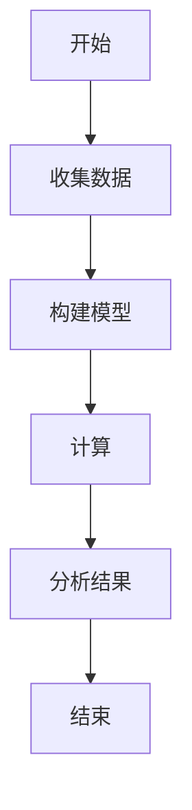

                 


# 海洋塑料污染治理技术的投资价值评估

## 关键词：海洋塑料污染、治理技术、投资价值、环境影响、经济评估

## 摘要：本文章分析了海洋塑料污染的现状及其对环境和经济的影响，探讨了各种治理技术的原理和特点，并评估了这些技术的投资价值。通过系统分析和实际案例，本文为投资者提供了科学的决策依据。

---

# 第一部分: 海洋塑料污染治理技术的投资价值评估基础

## 第1章: 海洋塑料污染治理技术概述

### 1.1 海洋塑料污染的背景与问题背景

#### 1.1.1 全球塑料污染现状
全球每年产生约3亿吨塑料垃圾，其中约800万吨进入海洋。塑料污染已蔓延至全球 oceans，从北极到热带海域都能发现塑料碎片。

#### 1.1.2 海洋塑料污染的定义与特征
海洋塑料污染指塑料制品进入海洋环境，造成生态破坏、环境污染和经济损失的现象。其特点包括分布广泛、降解时间长、危害隐蔽性强等。

#### 1.1.3 海洋塑料污染的来源与路径
主要来源包括直接排放、河流冲刷、垃圾倾倒、船舶遗落等。塑料通过水流和风力的作用在海洋中扩散。

#### 1.1.4 海洋塑料污染的环境影响与社会经济影响
环境影响包括破坏海洋生态系统、威胁海洋生物多样性、影响水文环境等。社会经济影响包括渔获量下降、旅游收入减少、清洁成本增加等。

### 1.2 海洋塑料污染治理的必要性与目标

#### 1.2.1 治理海洋塑料污染的必要性
保护海洋生态系统、保障食品安全、维护国家形象和履行国际责任。

#### 1.2.2 治理目标的设定
实现海洋塑料污染减少、海洋环境改善、经济价值提升等目标。

#### 1.2.3 治理效果的评价标准
包括塑料浓度下降率、生物多样性恢复率、经济收益增长等。

### 1.3 海洋塑料污染治理技术的分类与特点

#### 1.3.1 主流治理技术的分类
1. 化学降解技术
2. 生物降解技术
3. 微生物降解技术
4. 其他创新技术

#### 1.3.2 各种技术的优缺点对比

| 技术类型         | 优点                           | 缺点                           |
|------------------|--------------------------------|--------------------------------|
| 化学降解         | 高效降解、成本较低             | 可能产生二次污染               |
| 生物降解         | 环保、可持续                   | 降解速度较慢                 |
| 微生物降解       | 高效、环保                     | 易受环境条件影响               |
| 创新技术         | 创新性强、效果显著             | 成本高、技术不成熟             |

#### 1.3.3 技术的适用场景与边界
化学降解适用于大规模清理，生物降解适合局部治理，微生物降解适合处理分散污染。

---

## 第2章: 海洋塑料污染治理技术的核心概念与联系

### 2.1 核心概念的定义与原理

#### 2.1.1 化学降解技术的原理
通过化学反应将塑料分解为小分子物质，如水和二氧化碳。

#### 2.1.2 生物降解技术的原理
利用生物菌群将塑料分解为无害物质。

#### 2.1.3 微生物降解技术的原理
通过微生物代谢作用降解塑料。

#### 2.1.4 其他创新技术的原理
如光催化降解、电化学降解等。

### 2.2 核心概念的属性特征对比

| 技术类型         | 成本（低/高） | 降解效率（快/慢） | 环境友好度（高/低） |
|------------------|----------------|---------------------|-----------------------|
| 化学降解         | 低             | 快                   | 低                     |
| 生物降解         | 中             | 中                   | 高                     |
| 微生物降解       | 低             | 中                   | 高                     |
| 创新技术         | 高             | 快                   | 中                     |

### 2.3 ER实体关系图架构

```mermaid
erDiagram
    actor 投资者 {
        <属性>抽样检测结果
        <属性>投资金额
        <属性>投资周期
    }
    actor 治理技术 {
        <属性>技术类型
        <属性>降解效率
        <属性>成本
    }
    actor 环境影响 {
        <属性>塑料浓度
        <属性>生物多样性
        <属性>水文环境
    }
    投资者 --> 技术评估 : 提供投资参数
    技术评估 --> 治理技术 : 选择最优技术
    治理技术 --> 环境影响 : 产生环境效果
```

---

## 第3章: 海洋塑料污染治理技术的算法原理

### 3.1 投资价值评估的算法原理

#### 3.1.1 投资价值评估的定义与目标
通过分析治理技术的成本、收益和风险，评估其投资价值。

#### 3.1.2 评估指标的选择与权重分配
指标包括净现值（NPV）、内部收益率（IRR）、回收期等。

#### 3.1.3 投资价值的计算公式与流程

$$ NPV = \sum_{t=0}^{n} \frac{CF_t}{(1 + r)^t} $$

其中，\( CF_t \) 是第t年的现金流，\( r \) 是折现率。

流程包括数据收集、模型构建、计算与分析。

### 3.2 投资价值评估的数学模型

#### 3.2.1 投资回报率的计算公式

$$ ROI = \frac{\text{净收益}}{\text{初始投资}} \times 100\% $$

#### 3.2.2 风险评估的数学模型
使用标准差衡量风险：

$$ \sigma = \sqrt{\frac{1}{N}\sum_{i=1}^{N}(x_i - \mu)^2} $$

### 3.3 投资价值评估的流程图



---

## 第4章: 海洋塑料污染治理技术的系统分析与架构设计

### 4.1 问题场景的系统分析

#### 4.1.1 问题场景的描述与分解
分解为数据采集、技术选择、效果评估等子问题。

#### 4.1.2 系统需求的分析与提取
需求包括数据准确性、系统实时性、结果可操作性等。

#### 4.1.3 系统目标的设定与验证
目标包括提高效率、降低成本、确保准确性。

### 4.2 系统架构的设计

#### 4.2.1 系统架构的总体设计
采用分层架构：数据采集层、处理层、应用层。

#### 4.2.2 系统功能模块的划分
包括数据采集模块、算法模块、结果展示模块。

#### 4.2.3 系统架构的优化与调整
根据实际需求进行调整，如增加容错机制。

### 4.3 系统接口与交互设计

#### 4.3.1 系统接口的设计与实现
定义输入输出接口，如API接口。

#### 4.3.2 系统交互的流程设计
用户输入需求，系统处理并返回结果。

#### 4.3.3 系统交互的优化与测试
优化交互流程，确保用户体验。

---

## 第5章: 海洋塑料污染治理技术的项目实战

### 5.1 环境与工具的安装配置

#### 5.1.1 开发环境的搭建
使用Python、Jupyter Notebook、数据分析工具等。

#### 5.1.2 工具的安装与配置
安装必要的库，如numpy、pandas、scikit-learn等。

### 5.2 系统核心实现源代码

#### 5.2.1 数据采集与预处理代码
```python
import pandas as pd
data = pd.read_csv('plastic_pollution.csv')
```

#### 5.2.2 技术评估与选择代码
```python
def evaluate_technology(technology, cost, efficiency):
    return {'technology': technology, 'cost': cost, 'efficiency': efficiency}
```

### 5.3 实际案例分析与结果解读

#### 5.3.1 案例选择与描述
选择某海域塑料污染治理项目，采用化学降解技术。

#### 5.3.2 数据分析与结果解读
通过数据分析得出投资回报率，评估技术可行性。

#### 5.3.3 系统优化与总结
根据结果优化系统，如降低成本、提高效率。

### 5.4 项目总结

#### 5.4.1 项目成果与经验总结
成功实现技术评估，提供科学决策依据。

#### 5.4.2 项目不足与改进方向
技术局限性，未来研究方向。

---

# 第六章: 最佳实践与拓展

## 6.1 最佳实践 tips

- 选择合适的技术方案
- 注重成本与效率的平衡
- 定期评估与优化

## 6.2 小结

本文全面分析了海洋塑料污染治理技术的投资价值，为投资者提供了科学的决策依据。

## 6.3 注意事项

- 数据的准确性和完整性
- 技术的可行性和经济性
- 风险的识别和控制

## 6.4 拓展阅读

- 海洋环境保护政策
- 可持续发展技术研究
- 环境经济评估方法

---

# 作者

作者：AI天才研究院/AI Genius Institute & 禅与计算机程序设计艺术 /Zen And The Art of Computer Programming

