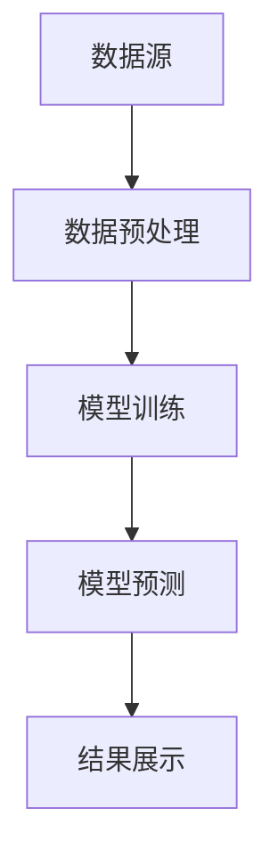
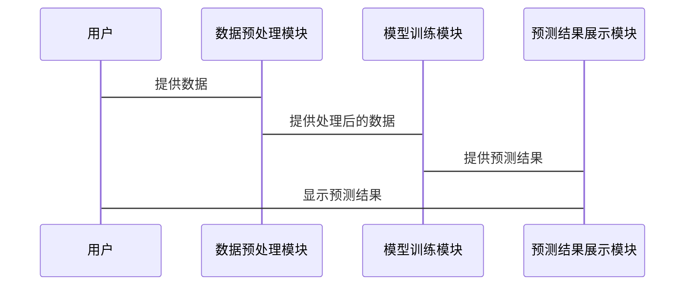

                 


---

# 深度学习在股市预测中的应用案例分析

> 关键词：深度学习，股市预测，时间序列，LSTM，机器学习，股票交易

> 摘要：本文系统地探讨了深度学习在股市预测中的应用，从基本概念、核心算法到实际案例分析，深入剖析了深度学习如何在复杂的金融市场中发挥作用。文章结合时间序列分析、LSTM模型、系统设计和实际项目，详细讲解了深度学习在股市预测中的优势与挑战，为读者提供了全面的视角和实践指导。

---

## 第1章: 深度学习与股市预测的背景介绍

### 1.1 深度学习的基本概念

#### 1.1.1 深度学习的定义与特点
深度学习是一种基于人工神经网络的机器学习方法，通过多层非线性变换模拟人脑的神经网络结构。其特点包括：
- **层次化**：通过多层网络提取数据的高层特征。
- **非线性**：能够处理复杂的非线性关系。
- **自适应**：通过反向传播算法自动调整权重，适应数据分布。

#### 1.1.2 深度学习的核心概念与技术
深度学习的核心技术包括：
- **神经网络**：构建人工神经网络，模拟人脑处理信息的方式。
- **反向传播**：通过损失函数计算梯度，调整网络参数以最小化误差。
- **卷积神经网络（CNN）**：适用于图像处理，但也可用于时间序列数据。
- **循环神经网络（RNN）**：适合处理序列数据，捕捉时间依赖关系。

#### 1.1.3 深度学习与传统机器学习的区别
- **特征提取**：深度学习通过多层网络自动提取特征，而传统机器学习依赖人工特征工程。
- **数据量**：深度学习需要大量数据进行训练，传统方法对数据量要求较低。
- **灵活性**：深度学习能够处理高维复杂数据，传统方法在非线性问题上表现较弱。

### 1.2 股市预测的基本概念

#### 1.2.1 股市预测的定义与目标
股市预测是通过分析历史数据和市场信息，预测未来股票价格走势的过程。其目标是帮助投资者做出更明智的投资决策。

#### 1.2.2 股市预测的主要方法与挑战
常见的股市预测方法包括：
- **技术分析**：基于价格和成交量的模式。
- **基本分析**：分析公司基本面因素。
- **算法交易**：使用算法进行自动交易。

挑战包括：
- **数据噪声**：股市数据受多种因素影响，噪声大。
- **非线性关系**：价格波动复杂，难以建模。
- **过拟合风险**：模型可能过度拟合历史数据，导致预测失效。

### 1.3 深度学习与股市预测的结合点

#### 1.3.1 深度学习在时间序列数据中的优势
深度学习擅长处理时间序列数据，能够捕捉复杂的模式和长期依赖关系，特别适合用于预测股票价格走势。

#### 1.3.2 股市数据的特点与深度学习的匹配性
股市数据具有非线性、高度波动性和复杂性，这些特点使得深度学习成为合适的选择。

#### 1.3.3 深度学习在股市预测中的边界与外延
深度学习在股市预测中的边界包括数据质量、模型选择和市场环境变化。外延则涉及与其他技术的结合，如结合技术指标或新闻数据。

---

## 第2章: 深度学习的核心算法原理

### 2.1 神经网络的基本结构

#### 2.1.1 神经元模型与网络结构
神经网络由输入层、隐藏层和输出层组成，每个神经元通过激活函数处理输入信号。

#### 2.1.2 深度神经网络的层数与复杂度
深度神经网络的层数决定了其表达能力，层数越多，模型越复杂，但训练难度也越大。

#### 2.1.3 深度学习的训练目标与优化方法
训练目标是通过最小化损失函数来优化模型参数，常用优化方法包括随机梯度下降（SGD）和Adam优化器。

### 2.2 深度学习的核心算法

#### 2.2.1 随机梯度下降与反向传播算法
随机梯度下降（SGD）是训练神经网络的基本方法，反向传播（BP）用于计算梯度并更新权重。

#### 2.2.2 卷积神经网络（CNN）与循环神经网络（RNN）
- **CNN**适用于图像数据，不适合处理序列数据。
- **RNN**适合处理序列数据，但存在梯度消失问题。

#### 2.2.3 长短期记忆网络（LSTM）与注意力机制（Attention）
- **LSTM**通过门控机制有效捕捉长期依赖关系。
- **注意力机制**通过关注重要位置信息，提升模型性能。

### 2.3 深度学习算法的数学模型

#### 2.3.1 神经网络的数学表达式
神经网络的输出可以表示为输入的线性组合，经过激活函数处理后得到最终结果。

$$ y = \sigma(wx + b) $$

其中，\( \sigma \) 是激活函数，\( w \) 和 \( b \) 是权重和偏置。

#### 2.3.2 损失函数与优化器的数学公式
常用的损失函数包括均方误差（MSE）和交叉熵损失。优化器如Adam使用动量和自适应学习率优化参数。

$$ \text{MSE} = \frac{1}{n}\sum_{i=1}^{n}(y_i - \hat{y}_i)^2 $$

#### 2.3.3 LSTM的数学模型与公式推导
LSTM通过输入门、遗忘门和输出门控制信息流动。

$$
\begin{align*}
i &= \sigma(W_i x + U_i h_{prev}) \\
f &= \sigma(W_f x + U_f h_{prev}) \\
o &= \sigma(W_o x + U_o h_{prev}) \\
g &= \tanh(W_g x + U_g h_{prev}) \\
h &= f \cdot h_{prev} + i \cdot g \\
\end{align*}
$$

---

## 第3章: 时间序列分析与深度学习

### 3.1 时间序列数据的特征与挑战

#### 3.1.1 时间序列数据的特点
时间序列数据具有时间依赖性、趋势性和周期性。

#### 3.1.2 时间序列预测的主要挑战
- 数据噪声多
- 非线性关系复杂
- 市场环境变化快

### 3.2 常见的时间序列预测模型

#### 3.2.1 ARIMA与GARCH模型
- **ARIMA**：适用于线性时间序列预测。
- **GARCH**：用于预测波动性。

#### 3.2.2 Prophet与FB Prophet模型
Prophet模型通过分解时间序列数据为趋势、季节性和噪声部分进行预测。

#### 3.2.3 LSTM与GRU在时间序列预测中的应用
- **LSTM**：适合捕捉长期依赖关系。
- **GRU**：简化了LSTM的结构，计算效率更高。

### 3.3 深度学习在时间序列预测中的优势

#### 3.3.1 自动特征提取
深度学习能够自动提取特征，减少人工特征工程的工作量。

#### 3.3.2 处理复杂模式
深度学习可以捕捉复杂的非线性关系和多层次特征。

#### 3.3.3 适应市场变化
通过持续训练模型，深度学习能够适应市场的动态变化。

---

## 第4章: 深度学习在股市预测中的系统设计

### 4.1 问题场景介绍

#### 4.1.1 股市预测的核心问题
- 预测未来股票价格
- 识别市场趋势
- 评估风险

#### 4.1.2 系统需求分析
- 数据采集与处理
- 模型训练与评估
- 预测结果展示

### 4.2 系统功能设计

#### 4.2.1 数据预处理
- 数据清洗
- 标准化/归一化
- 时间窗口划分

#### 4.2.2 模型训练
- 选择合适模型（如LSTM）
- 调参优化
- 交叉验证

#### 4.2.3 模型部署与预测
- 接口设计
- 实时预测
- 结果分析

### 4.3 系统架构设计

#### 4.3.1 系统架构图


#### 4.3.2 接口设计
- 数据接口：读取历史数据
- 模型接口：接受输入，返回预测结果
- 用户接口：展示预测结果

### 4.4 系统交互设计

#### 4.4.1 系统交互流程图


---

## 第5章: 深度学习在股市预测中的实战案例分析

### 5.1 环境安装与数据准备

#### 5.1.1 环境安装
- 安装Python和必要的库（如Keras、TensorFlow）
- 配置开发环境（如Jupyter Notebook）

#### 5.1.2 数据获取
- 使用Yahoo Finance API获取历史数据
- 数据清洗和预处理

### 5.2 模型实现与代码解读

#### 5.2.1 LSTM模型实现
```python
import numpy as np
from keras.models import Sequential
from keras.layers import LSTM, Dense

# 数据准备
data = ...  # 归一化处理后的数据
X_train = data[:-100]
y_train = data[100:]
X_test = data[-100:-1]
y_test = data[-1:]

# 模型构建
model = Sequential()
model.add(LSTM(50, input_shape=(timesteps, features)))
model.add(Dense(1))
model.compile(loss='mean_squared_error', optimizer='adam')

# 训练
model.fit(X_train, y_train, epochs=50, batch_size=32)
```

#### 5.2.2 模型评估
- �均方误差（MSE）
- 每日收益率的预测准确率

### 5.3 案例分析与详细解读

#### 5.3.1 数据预处理与特征选择
- 选择影响股价的关键因素
- 数据标准化

#### 5.3.2 模型训练与调优
- 调整LSTM层数和单元数
- 优化学习率和训练轮数

#### 5.3.3 模型预测与结果分析
- 预测结果可视化
- 对比实际价格和预测价格

### 5.4 项目小结

#### 5.4.1 成功经验
- LSTM模型表现出色
- 数据预处理至关重要

#### 5.4.2 挑战与不足
- 模型预测精度有限
- 需要实时数据更新

#### 5.4.3 改进方向
- 引入更多特征
- 结合技术指标
- 频繁调优模型

---

## 第6章: 深度学习在股市预测中的扩展与优化

### 6.1 深度学习与其他技术的结合

#### 6.1.1 结合技术指标
- 使用RSI、MACD等指标作为输入特征

#### 6.1.2 结合新闻数据
- 分析市场情绪对股价的影响

#### 6.1.3 结合市场微观结构
- 分析订单簿数据和交易行为

### 6.2 模型优化与提升策略

#### 6.2.1 超参数调优
- 使用网格搜索或随机搜索优化模型参数

#### 6.2.2 模型集成
- 结合多个模型预测结果，提升准确率

#### 6.2.3 模型解释性
- 使用SHAP或LIME解释模型决策

### 6.3 实际应用中的注意事项

#### 6.3.1 数据质量
- 数据清洗和特征工程至关重要

#### 6.3.2 模型过拟合
- 使用交叉验证和早停机制防止过拟合

#### 6.3.3 市场变化
- 定期重新训练模型，适应市场变化

### 6.4 深度学习在股市预测中的未来展望

#### 6.4.1 多模态数据融合
- 结合文本、图像等多种数据源

#### 6.4.2 解决高维问题
- 使用自注意力机制处理高维特征

#### 6.4.3 智能化投资决策
- 结合强化学习实现自动交易策略

---

## 第7章: 深度学习在股市预测中的伦理与风险

### 7.1 深度学习在股市中的伦理问题

#### 7.1.1 信息不对称
- 深度学习可能导致部分投资者利用技术优势获利

#### 7.1.2 市场操纵风险
- 预测模型可能被用于操纵市场

#### 7.1.3 系统性风险
- 模型失效可能导致系统性风险

### 7.2 深度学习的法律与合规问题

#### 7.2.1 数据使用合规
- 遵守数据隐私和使用规定

#### 7.2.2 模型透明度
- 确保模型决策可解释，符合监管要求

#### 7.2.3 风险披露
- 向投资者充分披露模型的局限性和风险

### 7.3 深度学习在股市中的风险管理

#### 7.3.1 风险评估
- 定期评估模型风险，及时调整策略

#### 7.3.2 风险控制
- 设置止损点和风险预警机制

#### 7.3.3 道德投资
- 结合ESG因素，进行可持续投资

---

## 第8章: 总结与展望

### 8.1 深度学习在股市预测中的应用总结

#### 8.1.1 核心优势
- 自动特征提取
- 非线性建模能力
- 长期依赖捕捉

#### 8.1.2 实际挑战
- 数据噪声
- 模型过拟合
- 市场变化

### 8.2 未来的发展方向

#### 8.2.1 技术创新
- 更先进的模型架构
- 更高效的学习算法

#### 8.2.2 多模态数据融合
- 文本、图像等多种数据源的结合

#### 8.2.3 个性化投资
- 根据投资者风险偏好定制预测模型

### 8.3 最佳实践 tips

#### 8.3.1 数据驱动
- 重视数据的质量和多样性

#### 8.3.2 模型调优
- 不断优化模型结构和参数

#### 8.3.3 风险管理
- 设立合理的风险控制机制

#### 8.3.4 伦理合规
- 遵守相关法律法规，确保模型使用符合伦理

---

## 作者：AI天才研究院/AI Genius Institute & 禅与计算机程序设计艺术 /Zen And The Art of Computer Programming

---

**总结：** 本文通过详细分析深度学习在股市预测中的应用，从基础理论到实际案例，全面探讨了其优势与挑战。深度学习为股市预测提供了新的可能性，但同时也需要我们谨慎应对数据、模型和市场的复杂性。未来，随着技术的进步和数据的丰富，深度学习在股市预测中的应用将更加广泛和深入。

