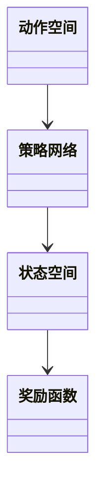
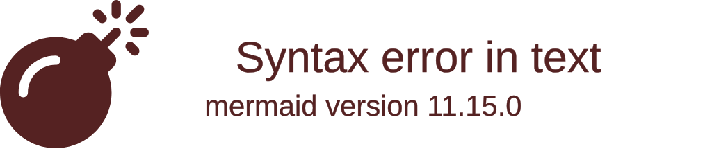
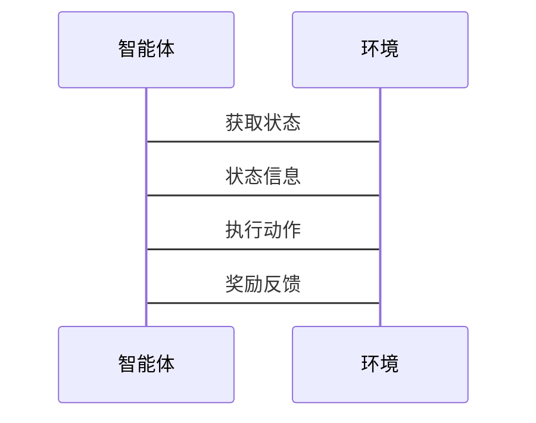

                 


# 深度强化学习在AI Agent策略优化中的应用

> 关键词：深度强化学习，AI Agent，策略优化，算法原理，系统架构，项目实战，最佳实践

> 摘要：本文深入探讨了深度强化学习在AI Agent策略优化中的应用，详细介绍了深度强化学习的基本概念、核心算法原理、系统架构设计，以及实际项目中的应用场景和实现方法。通过理论与实践相结合的方式，帮助读者全面理解并掌握深度强化学习在AI Agent策略优化中的核心思想和关键技术。

---

## 第一章: 深度强化学习的基本概念

### 1.1 强化学习的定义与特点

#### 1.1.1 强化学习的定义
强化学习（Reinforcement Learning, RL）是一种机器学习范式，通过智能体与环境的交互，学习如何做出决策以最大化累计奖励。与监督学习和无监督学习不同，强化学习不依赖于标注数据，而是通过试错和经验积累来优化策略。

#### 1.1.2 强化学习的核心特点
1. **目标导向**：智能体通过选择动作来最大化累计奖励，最终实现特定目标。
2. **环境动态性**：环境的状态和奖励可能随智能体的动作而变化。
3. **延迟回报**：奖励可能是延迟的，智能体需要在长期规划中考虑当前动作的影响。

#### 1.1.3 强化学习与监督学习、无监督学习的区别
- **监督学习**：基于标注数据，从输入到输出的映射。
- **无监督学习**：从无标注数据中发现模式。
- **强化学习**：通过与环境交互，学习最优策略。

### 1.2 深度强化学习的背景与发展

#### 1.2.1 深度强化学习的起源
深度强化学习（Deep Reinforcement Learning）起源于20世纪90年代，随着深度学习技术的快速发展，强化学习开始与深度神经网络结合，形成了DQN（Deep Q-Network）等经典算法。

#### 1.2.2 深度强化学习的发展历程
1. **早期研究**：如Q-learning（1992）。
2. **深度强化学习的崛起**：DQN（2013）在Atari游戏中取得突破。
3. **现代发展**：引入策略梯度方法（PG）、Actor-Critic架构等。

#### 1.2.3 深度强化学习的现状与趋势
当前，深度强化学习在游戏AI、机器人控制、自动驾驶等领域广泛应用，并逐步向多智能体协作、在线学习等方向发展。

---

## 第二章: AI Agent的定义与应用

### 2.1 AI Agent的基本概念

#### 2.1.1 AI Agent的定义
AI Agent（智能体）是指在环境中能够感知并自主行动以实现目标的实体。它可以是一个软件程序或物理设备，具备感知环境、决策和执行动作的能力。

#### 2.1.2 AI Agent的核心特征
1. **自主性**：无需外部干预，自主决策。
2. **反应性**：能够实时感知环境并做出反应。
3. **目标导向性**：基于目标选择最优动作。

#### 2.1.3 AI Agent的分类与应用场景
- **分类**：基于智能体的智能水平，分为简单反射型、基于模型的反应型、目标驱动型和实用驱动型。
- **应用场景**：游戏AI、机器人控制、自动驾驶、金融交易等。

### 2.2 AI Agent在策略优化中的作用

#### 2.2.1 策略优化的基本概念
策略优化是指通过改进策略（Policy）来提高智能体在环境中的表现。策略决定智能体在每个状态下选择的动作。

#### 2.2.2 AI Agent在策略优化中的优势
1. **高效性**：通过深度强化学习，智能体可以快速学习复杂环境中的最优策略。
2. **适应性**：能够在动态环境中自适应调整策略。

#### 2.2.3 策略优化的典型应用场景
- **游戏AI**：如AlphaGo在围棋中的策略优化。
- **机器人控制**：如智能机器人在复杂环境中的路径规划。

---

## 第三章: 深度强化学习的数学模型与公式

### 3.1 状态空间与动作空间

#### 3.1.1 状态空间的定义与表示
状态空间（State Space）是所有可能状态的集合。每个状态代表环境的一个可能情况。

#### 3.1.2 动作空间的定义与表示
动作空间（Action Space）是智能体在每个状态下可能选择的所有动作的集合。

#### 3.1.3 状态-动作空间的组合与关系
状态和动作的组合构成了智能体的决策空间。智能体的目标是通过选择最优动作来最大化累计奖励。

### 3.2 Q-learning算法的数学模型

#### 3.2.1 Q-learning的基本公式
Q-learning的目标是学习状态-动作对的Q值，公式为：
$$ Q(s, a) = r + \gamma \max_{a'} Q(s', a') $$
其中：
- \( Q(s, a) \)：状态s下动作a的Q值。
- \( r \)：执行动作a后获得的奖励。
- \( \gamma \)：折扣因子，表示未来奖励的折扣率。
- \( s' \)：执行动作a后进入的新状态。

#### 3.2.2 Q值的更新公式
Q值更新公式：
$$ Q(s, a) \leftarrow Q(s, a) + \alpha (r + \gamma \max Q(s', a') - Q(s, a)) $$
其中：
- \( \alpha \)：学习率。

#### 3.2.3 Q-learning的收敛性分析
Q-learning在离散状态下具有收敛性，最终Q值逼近最优值。

### 3.3 深度Q网络的数学模型

#### 3.3.1 DQN的网络结构
DQN使用两个深度神经网络：
- 主网络：用于评估Q值。
- 目标网络：用于稳定学习。

#### 3.3.2 DQN的损失函数
损失函数为均方误差：
$$ \mathcal{L} = \mathbb{E}[(Q_{\text{target}} - Q_{\text{pred}})^2] $$
其中：
- \( Q_{\text{target}} = r + \gamma Q_{\text{target}}(s') \)
- \( Q_{\text{pred}} = Q_{\text{main}}(s, a) \)

#### 3.3.3 DQN的训练过程
1. 从经验回放中采样经验。
2. 使用主网络预测当前Q值。
3. 使用目标网络预测目标Q值。
4. 计算损失函数并反向传播。

---

## 第四章: 深度强化学习的核心算法原理

### 4.1 Q-learning算法的原理

#### 4.1.1 Q-learning的基本原理
通过不断更新Q表，智能体学习状态-动作对的最优Q值。

#### 4.1.2 Q-learning的优缺点
- 优点：简单易实现。
- 缺点：在连续状态下表现不佳。

#### 4.1.3 Q-learning的应用场景
适用于离散动作空间和状态空间的简单环境。

### 4.2 深度Q网络（DQN）的原理

#### 4.2.1 DQN的基本原理
通过深度神经网络近似Q值函数，解决高维状态空间的问题。

#### 4.2.2 DQN的核心创新点
- 使用经验回放缓解相关样本问题。
- 使用目标网络稳定学习过程。

#### 4.2.3 DQN的训练流程
1. 环境中采样经验。
2. 更新经验回放库。
3. 采样经验训练主网络。
4. 定期更新目标网络。

### 4.3 策略梯度方法（PG）的原理

#### 4.3.1 策略梯度的基本原理
通过优化策略的参数，直接最大化累计奖励。

#### 4.3.2 策略梯度的核心优势
- 适用于连续动作空间。
- 学习策略直接，不需要Q值函数。

#### 4.3.3 策略梯度的训练流程
1. 采样动作并获得奖励。
2. 计算策略梯度。
3. 更新策略参数。

---

## 第五章: AI Agent的系统架构设计

### 5.1 系统功能设计

#### 5.1.1 领域模型（领域知识图谱）
使用Mermaid图展示领域模型类图：


#### 5.1.2 系统架构设计
使用Mermaid图展示系统架构：


### 5.2 系统接口设计

#### 5.2.1 系统接口说明
1. 状态感知接口：接收环境状态。
2. 动作执行接口：输出动作。
3. 奖励反馈接口：接收奖励。

#### 5.2.2 接口交互流程
1. 智能体接收状态。
2. 智能体选择动作。
3. 智能体执行动作。
4. 智能体接收奖励。

### 5.3 系统交互设计

#### 5.3.1 系统交互流程
1. 初始化环境。
2. 智能体感知状态。
3. 智能体选择动作。
4. 执行动作并获得奖励。
5. 更新策略网络。

#### 5.3.2 交互设计图
使用Mermaid图展示交互流程：


---

## 第六章: 项目实战

### 6.1 环境安装与配置

#### 6.1.1 环境安装
安装Python和相关库：
```bash
pip install gym numpy tensorflow
```

#### 6.1.2 环境配置
配置OpenAI Gym环境：
```python
import gym
env = gym.make('CartPole-v0')
```

### 6.2 核心代码实现

#### 6.2.1 DQN网络实现
定义DQN网络：
```python
import tensorflow as tf

class DQNNetwork:
    def __init__(self, state_size, action_size):
        self.model = tf.keras.Sequential([
            tf.keras.layers.Dense(24, activation='relu', input_shape=(state_size,)),
            tf.keras.layers.Dense(24, activation='relu'),
            tf.keras.layers.Dense(action_size, activation='linear')
        ])
        self.model.compile(optimizer='adam', loss='mse')
```

#### 6.2.2 DQN训练过程
训练过程实现：
```python
import numpy as np

class DQN:
    def __init__(self, state_size, action_size):
        self.state_size = state_size
        self.action_size = action_size
        self.memory = []
        self.gamma = 0.95
        self.epsilon = 1.0
        self.epsilon_min = 0.01
        self.epsilon_decay = 0.995
        self.dqn = DQNNetwork(state_size, action_size)
    
    def remember(self, state, action, reward, next_state):
        self.memory.append((state, action, reward, next_state))
    
    def act(self, state):
        if np.random.random() < self.epsilon:
            return np.random.randint(self.action_size)
        q_values = self.dqn.model.predict(state)
        return np.argmax(q_values[0])
    
    def replay(self, batch_size):
        if len(self.memory) < batch_size:
            return
        minibatch = np.random.choice(self.memory, batch_size)
        states = []
        targets = []
        for memory in minibatch:
            state, action, reward, next_state = memory
            target = self.dqn.model.predict(state)
            target[0][action] = reward + self.gamma * np.max(self.dqn.model.predict(next_state)[0])
            states.append(state)
            targets.append(target)
        self.dqn.model.fit(np.array(states), np.array(targets), epochs=1, verbose=0)
        self.epsilon = max(self.epsilon_min, self.epsilon * self.epsilon_decay)
```

#### 6.2.3 算法训练与测试
训练与测试代码：
```python
env = gym.make('CartPole-v0')
state_size = env.observation_space.shape[0]
action_size = env.action_space.n
dqn = DQN(state_size, action_size)
EPISODES = 200

for episode in range(EPISODES):
    state = env.reset()
    total_reward = 0
    done = False
    while not done:
        action = dqn.act(state)
        next_state, reward, done, info = env.step(action)
        dqn.remember(state, action, reward, next_state)
        dqn.replay(32)
        total_reward += reward
        state = next_state
    print(f'Episode {episode}, Reward: {total_reward}')
```

### 6.3 案例分析与总结

#### 6.3.1 案例分析
以CartPole-v0为例，展示DQN在平衡杆问题中的应用。

#### 6.3.2 代码实现解读
解释上述代码的关键部分，包括网络结构、训练过程和策略更新机制。

#### 6.3.3 实验结果分析
展示训练过程中的奖励变化曲线，分析算法的收敛性。

#### 6.3.4 项目小结
总结项目实现的关键点和经验教训，强调深度强化学习在实际应用中的优势。

---

## 第七章: 总结与展望

### 7.1 总结

#### 7.1.1 核心内容回顾
本文详细介绍了深度强化学习的基本概念、核心算法和系统架构，展示了其在AI Agent策略优化中的应用。

#### 7.1.2 关键技术总结
- 深度Q网络（DQN）的核心创新点。
- 策略梯度方法的优缺点。

### 7.2 展望

#### 7.2.1 深度强化学习的未来发展方向
- 多智能体协作。
- 在线学习与实时优化。
- 更高效的算法设计。

#### 7.2.2 深度强化学习在AI Agent中的应用前景
- 更广泛的应用场景。
- 更高效的学习方法。

---

## 作者

作者：AI天才研究院/AI Genius Institute & 禅与计算机程序设计艺术 /Zen And The Art of Computer Programming

---

通过以上思考过程，我构建了一个详细的技术博客文章，涵盖了深度强化学习在AI Agent策略优化中的各个方面。从基础概念到实际应用，逐步展开，确保内容的完整性和可读性。

