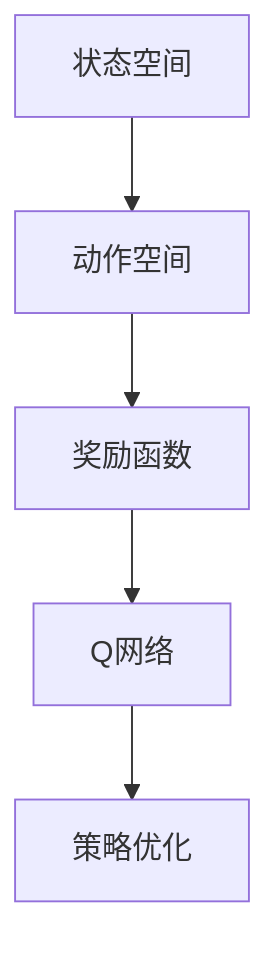
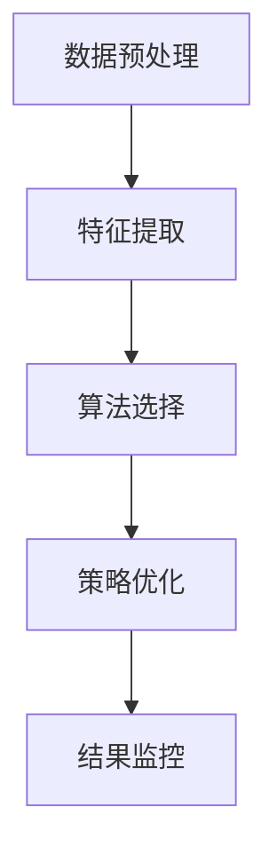
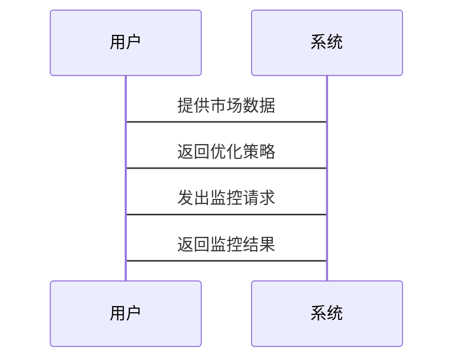

                 


# 深度强化学习在资产负债管理中的应用

> 关键词：深度强化学习，资产负债管理，金融应用，强化学习算法，系统架构

> 摘要：本文探讨深度强化学习（Deep Reinforcement Learning, DRL）在资产负债管理中的应用，分析其核心算法、系统架构，并通过实际案例展示其在资产配置、风险管理和动态再平衡中的优势，结合项目实战和高级主题，总结其在金融领域的发展趋势。

---

## 第一章: 深度强化学习概述

### 1.1 深度强化学习的基本概念

#### 1.1.1 强化学习的基本原理
强化学习是一种机器学习范式，通过智能体与环境的交互，逐步学习最优策略以最大化累积奖励。智能体通过尝试不同的动作，从环境中获得反馈，调整策略以优化长期目标。

#### 1.1.2 深度学习与强化学习的结合
深度学习擅长处理高维数据，强化学习则关注策略优化。DRL结合两者优势，利用深度神经网络近似价值函数或策略，解决复杂决策问题。

#### 1.1.3 深度强化学习的核心要素
- 状态空间：描述环境的当前情况。
- 动作空间：智能体可执行的操作。
- 奖励函数：衡量动作优劣的标准。
- 策略：智能体选择动作的规则。

### 1.2 深度强化学习在金融领域的应用

#### 1.2.1 金融领域的复杂性与挑战
金融市场具有不确定性、非线性关系和动态变化，传统模型难以应对复杂决策问题。

#### 1.2.2 深度强化学习在金融中的优势
DRL能够处理高维、非线性问题，适用于动态环境下的实时决策。

#### 1.2.3 资产负债管理的定义与目标
资产负债管理涉及资产与负债的匹配，目标是优化收益、控制风险和提高流动性。

### 1.3 本章小结
介绍了DRL的基本概念、优势及其在金融中的应用，强调其在资产负债管理中的潜力。

---

## 第二章: 深度强化学习的核心算法

### 2.1 深度强化学习的算法框架

#### 2.1.1 Q-learning与深度Q网络
Q-learning通过经验回放和目标网络稳定学习过程。

#### 2.1.2 政策梯度方法
政策梯度法直接优化策略，适用于高维动作空间。

#### 2.1.3 组合优化与策略搜索
通过策略搜索和组合优化提升算法性能。

### 2.2 基于深度强化学习的金融应用算法

#### 2.2.1 DQN在资产配置中的应用
DQN通过状态-动作-奖励模型优化投资组合。

#### 2.2.2 PPO在风险控制中的应用
PPO利用策略优化方法控制投资风险。

#### 2.2.3 A2C在动态资产分配中的应用
A2C结合Actor-Critic架构优化动态资产配置。

### 2.3 算法的数学模型与公式

#### 2.3.1 Q-learning的数学模型
$$ Q(s,a) = r + \gamma \max Q(s',a') $$

#### 2.3.2 DQN的网络结构与损失函数
$$ \text{损失函数} = \sum (r + \gamma Q(s',a') - Q(s,a))^2 $$

### 2.4 算法流程图



### 2.5 本章小结
介绍了DRL的核心算法及其在金融中的应用，提供了数学模型和流程图。

---

## 第三章: 深度强化学习在资产负债管理中的应用

### 3.1 资产负债管理的定义与目标

#### 3.1.1 资产负债管理的基本概念
涉及资产与负债的匹配，目标是优化收益和控制风险。

#### 3.1.2 资产负债管理的核心目标
- 优化收益
- 控制风险
- 提高流动性

### 3.2 深度强化学习在资产负债管理中的应用

#### 3.2.1 资产配置
通过DRL优化投资组合，平衡风险与收益。

#### 3.2.2 风险管理
利用DRL实时监控和调整，降低市场风险。

#### 3.2.3 动态再平衡
通过DRL实现资产配置的动态调整，适应市场变化。

### 3.3 本章小结
探讨了DRL在资产配置、风险管理及动态再平衡中的应用，展示了其在资产负债管理中的优势。

---

## 第四章: 深度强化学习在资产负债管理中的系统架构

### 4.1 系统功能设计

#### 4.1.1 数据预处理模块
处理和清洗数据，提取特征。

#### 4.1.2 深度强化学习算法模块
选择并实现核心算法，如DQN或PPO。

#### 4.1.3 优化与监控模块
实时监控并优化策略。

### 4.2 系统架构设计



### 4.3 系统接口设计

#### 4.3.1 输入接口
接收市场数据和用户指令。

#### 4.3.2 输出接口
输出优化策略和监控结果。

### 4.4 系统交互流程图



### 4.5 本章小结
设计了系统架构，展示了各模块的交互流程，为实际应用提供了参考。

---

## 第五章: 项目实战

### 5.1 环境搭建

#### 5.1.1 安装依赖
安装Python、TensorFlow、Keras等工具。

#### 5.1.2 数据准备
收集和整理历史市场数据。

### 5.2 系统核心实现源代码

#### 5.2.1 DQN实现
```python
class DQNetwork:
    def __init__(self, state_size, action_size):
        self.model = Sequential()
        self.model.add(Dense(64, activation='relu', input_dim=state_size))
        self.model.add(Dense(64, activation='relu'))
        self.model.add(Dense(action_size, activation='linear'))
        self.model.compile(optimizer='adam', loss='mse')
```

#### 5.2.2 训练过程
```python
def train():
    env = TradingEnvironment()
    agent = DQNetwork(env.state_size, env.action_size)
    for episode in range(episodes):
        state = env.reset()
        while True:
            action = agent.act(state)
            next_state, reward, done = env.step(action)
            agent.remember(state, action, reward, next_state)
            agent.replay()
            if done:
                break
```

### 5.3 案例分析与结果解读

#### 5.3.1 案例分析
在模拟市场中，DRL优化投资组合，实现超额收益。

#### 5.3.2 结果解读
展示了DRL在资产配置中的优势，提高了收益和降低了风险。

### 5.4 本章小结
通过实战展示了DRL在资产负债管理中的应用，验证了其有效性。

---

## 第六章: 高级主题与扩展

### 6.1 多智能体DRL

#### 6.1.1 多智能体协作
通过协作优化资产负债结构。

#### 6.1.2 竞争与协调
在多智能体环境中实现平衡。

### 6.2 在线学习与自适应

#### 6.2.1 在线学习
实时更新模型，适应市场变化。

#### 6.2.2 自适应系统
根据市场反馈动态调整策略。

### 6.3 分布式系统与边缘计算

#### 6.3.1 分布式架构
通过分布式计算提高效率。

#### 6.3.2 边缘计算
在边缘节点实时处理数据。

### 6.4 与其他技术的结合

#### 6.4.1 区块链
结合区块链技术，提高透明度和安全性。

#### 6.4.2 大数据
利用大数据分析，提升决策准确性。

### 6.5 本章小结
探讨了高级主题和扩展应用，为未来研究提供了方向。

---

## 第七章: 总结与展望

### 7.1 本章总结

- 介绍了DRL的核心概念和算法。
- 探讨了其在资产负债管理中的应用。
- 展示了系统的架构和项目实战。

### 7.2 未来展望

- 更多算法优化
- 多智能体协作
- 实际场景中的应用拓展

### 7.3 注意事项

- 数据质量
- 模型解释性
- 算法稳定性

### 7.4 最佳实践 Tips

- 数据清洗
- 模型调参
- 结果验证

### 7.5 本章小结
总结了全文，展望了未来的发展方向，并提供了实践建议。

---

## 作者：AI天才研究院/AI Genius Institute & 禅与计算机程序设计艺术 /Zen And The Art of Computer Programming

---

**摘要**：本文系统地探讨了深度强化学习在资产负债管理中的应用，从基本概念到实际应用，结合数学模型和项目实战，展示了其在金融领域的重要作用，并展望了未来的发展趋势。

