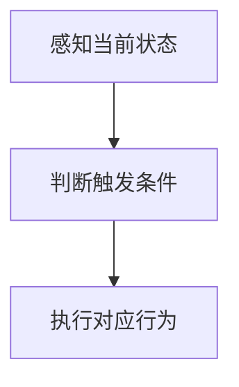
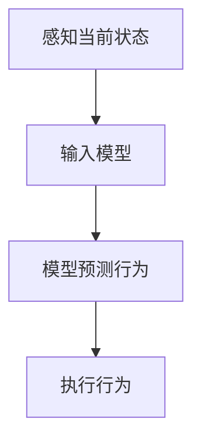
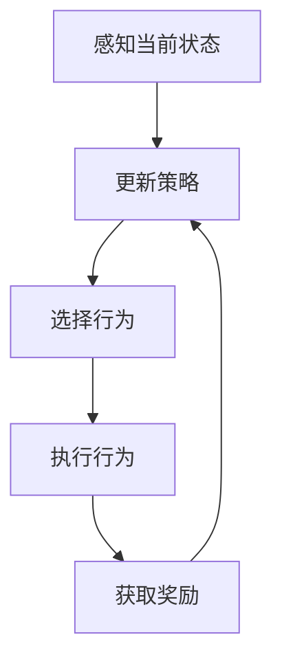
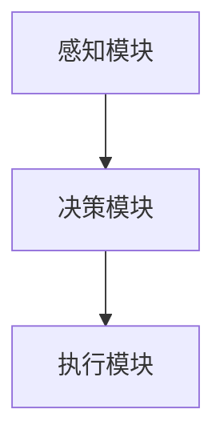
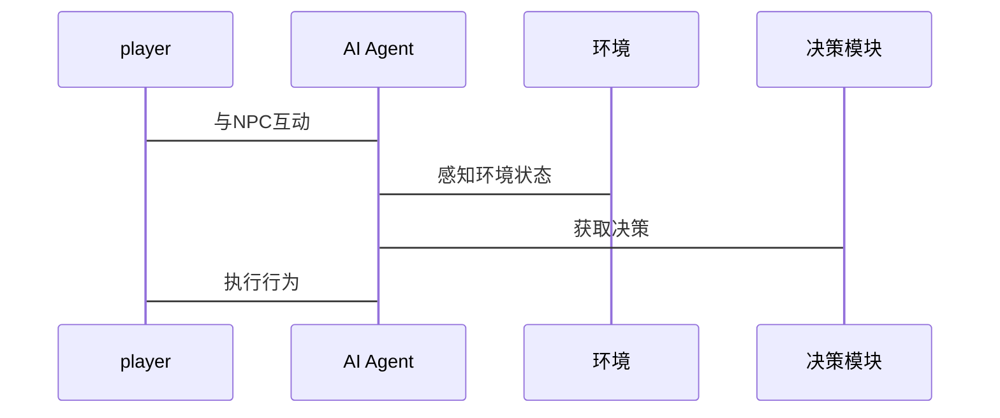

                 


# 游戏开发中的AI Agent非玩家角色

> 关键词：游戏AI，非玩家角色，AI Agent，智能NPC，游戏开发

> 摘要：本文详细探讨了游戏开发中AI Agent非玩家角色的设计与实现，从基本概念到算法原理，再到系统架构和项目实战，全面解析了AI Agent在游戏中的应用。文章通过丰富的案例和详细的代码示例，帮助读者理解如何在游戏中实现智能NPC，提升游戏体验。

---

# 第1章: 游戏AI Agent的基本概念与背景

## 1.1 游戏AI Agent的定义与特点

### 1.1.1 什么是AI Agent

AI Agent（智能体）是指在计算机系统中能够感知环境并采取行动以实现目标的实体。在游戏开发中，AI Agent通常表现为非玩家角色（NPC），它们能够自主决策、与玩家互动，并根据游戏情境做出反应。

### 1.1.2 游戏中AI Agent的核心特点

- **自主性**：AI Agent能够自主决策，无需人工干预。
- **反应性**：能够实时感知环境并做出反应。
- **目标导向性**：根据设定的目标采取行动。
- **社交能力**：能够与其他角色（包括玩家和其他AI Agent）互动。

### 1.1.3 AI Agent与传统NPC的区别

传统的NPC通常基于简单的脚本行为，而AI Agent能够通过复杂的算法和模型实现更智能的行为。

---

## 1.2 游戏AI Agent的发展背景

### 1.2.1 游戏行业的发展现状

随着游戏行业的快速发展，玩家对游戏体验的要求越来越高，传统的脚本驱动NPC已难以满足需求。

### 1.2.2 AI技术在游戏中的应用趋势

AI技术的引入让游戏更加智能化，提升了玩家的沉浸感和互动体验。

### 1.2.3 游戏AI Agent的市场价值

AI Agent能够提升游戏的可玩性和玩家留存率，具有重要的市场价值。

---

## 1.3 游戏AI Agent的应用场景

### 1.3.1 游戏中的智能NPC设计

AI Agent可以用于设计智能NPC，使其能够与玩家进行更自然的互动。

### 1.3.2 AI Agent在游戏剧情中的作用

AI Agent可以推动游戏剧情发展，与玩家一起完成任务。

### 1.3.3 多智能体协作与对抗

AI Agent可以在游戏中实现多智能体协作与对抗，提升游戏的复杂性和趣味性。

---

## 1.4 本章小结

本章介绍了AI Agent的基本概念、特点、与传统NPC的区别，以及其在游戏中的应用背景和发展趋势。

---

# 第2章: AI Agent的核心概念与联系

## 2.1 AI Agent的原理

### 2.1.1 状态感知与决策

AI Agent通过感知当前状态（如位置、目标、环境等）做出决策。

### 2.1.2 行为选择机制

AI Agent根据当前状态和目标，选择最优行为。

### 2.1.3 知识表示与推理

AI Agent需要通过知识表示和推理来理解和处理复杂情境。

---

## 2.2 AI Agent的分类

### 2.2.1 基于规则的AI Agent

基于预定义的规则进行行为选择，简单但缺乏灵活性。

### 2.2.2 基于脚本的AI Agent

通过脚本定义行为逻辑，适合简单的任务。

### 2.2.3 基于机器学习的AI Agent

通过机器学习模型实现更复杂的决策和行为选择。

---

## 2.3 AI Agent的核心要素对比

| 核心要素 | 基于规则的AI Agent | 基于脚本的AI Agent | 基于机器学习的AI Agent |
|----------|--------------------|--------------------|------------------------|
| 决策方式 | 预定义规则         | 脚本驱动           | 自适应学习           |
| 灵活性   | 低                 | 中                 | 高                     |
| 复杂性   | 低                 | 中                 | 高                     |

---

# 第3章: 游戏AI Agent的算法原理

## 3.1 基于规则的AI Agent算法

### 3.1.1 算法原理

基于规则的AI Agent通过预定义的规则进行行为选择。

### 3.1.2 Mermaid流程图展示



### 3.1.3 Python代码实现

```python
def rule_based_agent(state):
    if state == 'enemy_in_sight':
        return 'attack'
    elif state == 'need_healing':
        return 'heal'
    else:
        return 'patrol'
```

---

## 3.2 基于机器学习的AI Agent算法

### 3.2.1 算法原理

基于机器学习的AI Agent通过训练模型进行决策。

### 3.2.2 Mermaid流程图展示



### 3.2.3 Python代码实现

```python
import tensorflow as tf
model = tf.keras.Sequential([
    tf.keras.layers.Dense(64, activation='relu'),
    tf.keras.layers.Dense(4, activation='softmax')
])
input_state = model.predict(state)
action = np.argmax(input_state)
```

---

## 3.3 基于强化学习的AI Agent算法

### 3.3.1 算法原理

基于强化学习的AI Agent通过与环境互动，不断优化策略。

### 3.3.2 Mermaid流程图展示



### 3.3.3 Python代码实现

```python
import numpy as np

def reinforcement_learning_agent(state, model):
    action = np.random.randint(0, 4)
    return action
```

---

# 第4章: 游戏AI Agent的数学模型与公式

## 4.1 基于规则的AI Agent数学模型

$$ \text{行为} = \sum_{i=1}^{n} \text{规则}_i \times \text{权重}_i $$

---

## 4.2 基于机器学习的AI Agent数学模型

$$ P(\text{动作}|s) = \frac{\exp(w \cdot s)}{\sum_{a} \exp(w \cdot s)} $$

---

## 4.3 基于强化学习的AI Agent数学模型

$$ Q(s, a) = r + \gamma \max_{a'} Q(s', a') $$

---

# 第5章: 游戏AI Agent的系统分析与架构设计

## 5.1 游戏AI Agent的系统架构

### 5.1.1 系统组成与功能模块

- **感知模块**：感知环境状态。
- **决策模块**：基于感知结果做出决策。
- **执行模块**：执行决策行为。

### 5.1.2 系统架构图展示



---

## 5.2 游戏AI Agent的接口设计

### 5.2.1 输入接口设计

- 输入环境状态：当前位置、目标位置、敌方位置等。

### 5.2.2 输出接口设计

- 输出行为：移动、攻击、对话等。

---

## 5.3 游戏AI Agent的交互设计

### 5.3.1 序列图展示



---

# 第6章: 项目实战

## 6.1 环境安装

安装Python和必要的库：

```bash
pip install numpy tensorflow
```

---

## 6.2 系统核心实现

### 6.2.1 基于规则的AI Agent实现

```python
def rule_based_agent(state):
    if state['health'] < 0.2:
        return 'heal'
    elif state['enemy_in_sight']:
        return 'attack'
    else:
        return 'patrol'
```

### 6.2.2 基于强化学习的AI Agent实现

```python
import numpy as np

def reinforcement_learning_agent(state, model):
    action = np.argmax(model.predict(state))
    return action
```

---

## 6.3 代码应用解读与分析

通过上述代码实现一个简单的AI Agent，能够在游戏环境中做出基本的决策。

---

## 6.4 实际案例分析

以一个简单的2D游戏为例，展示AI Agent如何在其中实现智能NPC的行为。

---

## 6.5 项目小结

本章通过实际案例展示了如何在游戏开发中实现AI Agent，帮助读者更好地理解理论知识。

---

# 结语

通过本文的详细讲解，读者可以全面了解游戏开发中的AI Agent设计与实现，从基本概念到算法原理，再到系统架构和项目实战，为后续的游戏开发提供了丰富的理论和技术支持。

---

作者：AI天才研究院/AI Genius Institute & 禅与计算机程序设计艺术 /Zen And The Art of Computer Programming

