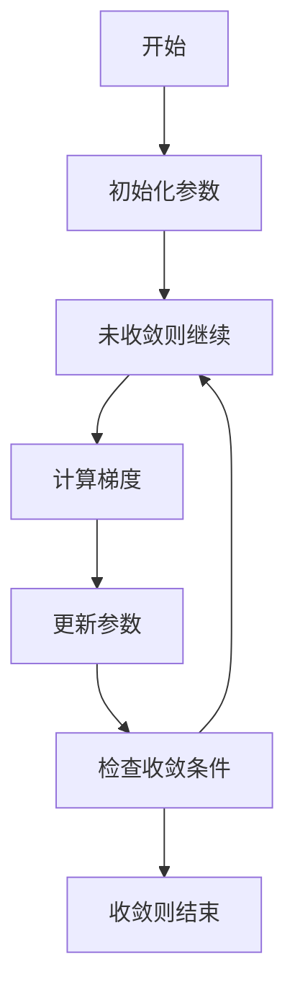
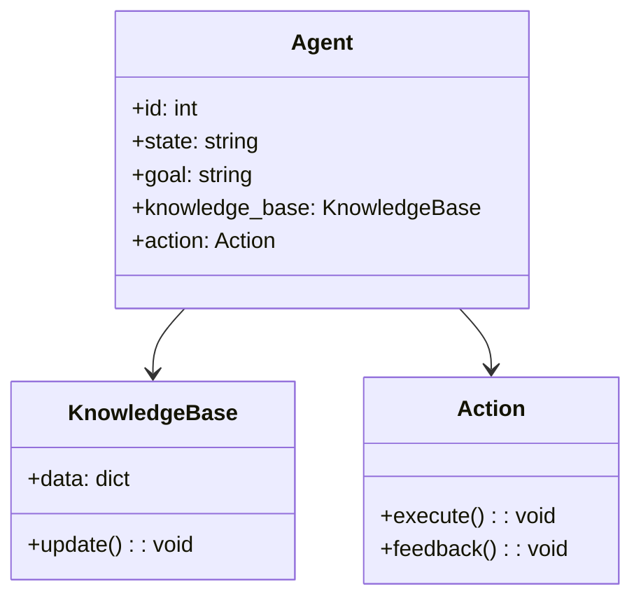
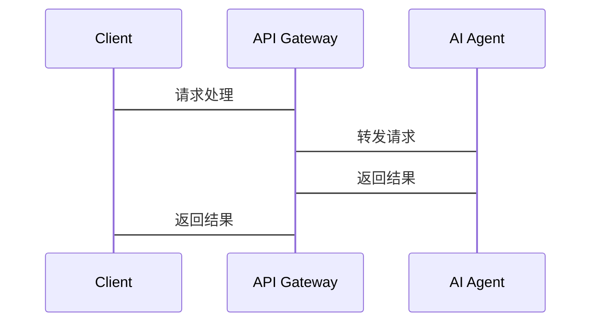

                 


# 《版本控制与迭代：AI Agent的持续优化策略》

## 关键词：
- 版本控制
- 迭代优化
- AI Agent
- 系统架构
- 数学模型

## 摘要：
本文探讨了AI Agent的持续优化策略，结合版本控制和迭代优化的方法，详细分析了如何在AI Agent的开发过程中应用这些技术。文章从背景介绍开始，逐步深入到核心概念、算法原理、系统架构设计，再到项目实战和最佳实践，帮助读者系统地理解和应用版本控制与迭代优化策略。

---

## 第一部分: 背景介绍

### 第1章: 版本控制与迭代的基本概念

#### 1.1 版本控制的定义与作用
- 1.1.1 版本控制的定义
- 1.1.2 版本控制的作用与意义
- 1.1.3 版本控制的常见应用场景

#### 1.2 迭代优化的基本概念
- 1.2.1 迭代优化的定义
- 1.2.2 迭代优化的核心思想
- 1.2.3 迭代优化在软件开发中的应用

#### 1.3 AI Agent的持续优化策略
- 1.3.1 AI Agent的基本概念
- 1.3.2 AI Agent的优化目标
- 1.3.3 AI Agent优化的挑战与机遇

#### 1.4 版本控制与迭代的关联性
- 1.4.1 版本控制与迭代的关系
- 1.4.2 版本控制在迭代优化中的作用
- 1.4.3 迭代优化对版本控制的推动作用

---

## 第二部分: 核心概念与理论

### 第2章: 版本控制的机制与实现

#### 2.1 版本控制的核心机制
- 2.1.1 版本控制的版本记录机制
- 2.1.2 版本控制的分支与合并机制
- 2.1.3 版本控制的冲突解决

---

## 第三部分: 算法原理

### 第3章: 迭代优化算法的实现与数学模型

#### 3.1 迭代优化算法的实现
- 3.1.1 算法的流程图（使用mermaid）


#### 3.2 迭代优化的数学模型
- 3.2.1 损失函数的定义：$$L(x) = \frac{1}{2n}\sum_{i=1}^{n}(y_i - \hat{y_i})^2$$
- 3.2.2 梯度下降算法：$$\theta = \theta - \eta \cdot \nabla L$$
- 3.2.3 学习率的调整策略

---

## 第四部分: 系统分析与架构设计

### 第4章: AI Agent系统架构

#### 4.1 系统功能设计（领域模型）


#### 4.2 系统架构设计


#### 4.3 系统接口设计
- 4.3.1 Agent与API Gateway的接口
- 4.3.2 API Gateway与Client的接口

#### 4.4 系统交互设计


---

## 第五部分: 项目实战

### 第5章: 环境安装与配置

#### 5.1 环境要求
- 操作系统：Linux/Windows/macOS
- Python版本：3.8+
- 安装依赖：git、pip、flask等

#### 5.2 安装步骤
1. 安装Python：```bash
python --version
```
2. 安装依赖：```bash
pip install -r requirements.txt
```

### 第6章: 核心代码实现

#### 6.1 代码实现
```python
class Agent:
    def __init__(self, knowledge_base):
        self.knowledge_base = knowledge_base

    def update(self, new_knowledge):
        self.knowledge_base.update(new_knowledge)

def main():
    kb = KnowledgeBase()
    agent = Agent(kb)
    agent.update("新知识内容")
    print("更新完成")

if __name__ == "__main__":
    main()
```

---

## 第六部分: 最佳实践

### 第7章: 小结与注意事项

#### 7.1 小结
- 本章详细讲解了版本控制与迭代优化在AI Agent中的应用
- 强调了系统架构设计和数学模型的重要性

#### 7.2 注意事项
- 确保代码的可维护性和扩展性
- 定期进行代码审查和测试
- 合理选择学习率和优化策略

---

## 作者：AI天才研究院 & 禅与计算机程序设计艺术

---

以上目录大纲详细涵盖了版本控制与迭代优化在AI Agent中的各个方面，从理论到实践，从系统设计到代码实现，为读者提供了全面的学习和应用指导。

