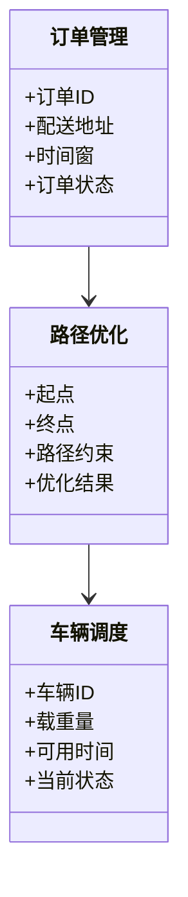
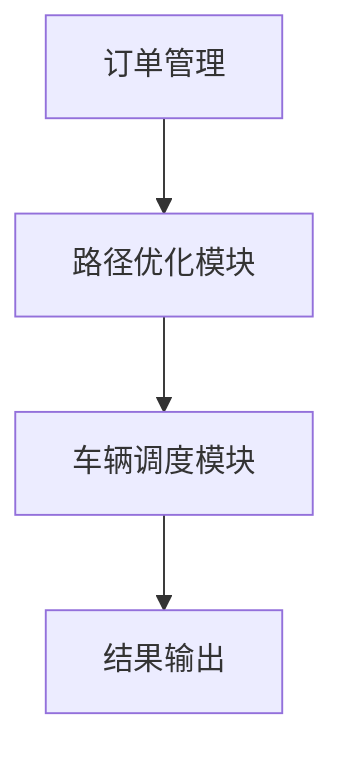
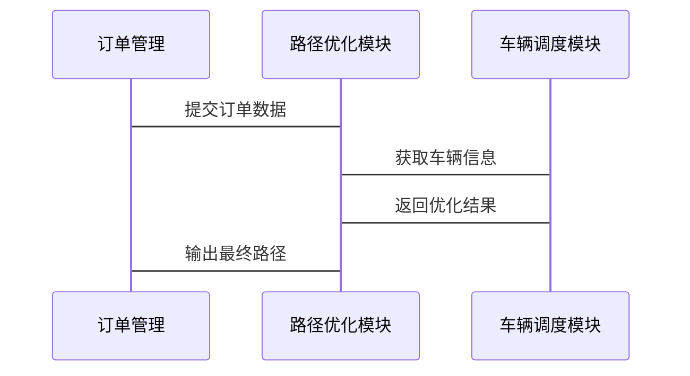

                 


# 物流行业的AI Agent优化配送路径

## 关键词
AI Agent、物流、配送路径优化、智能算法、路径规划、物流效率提升

## 摘要
随着物流行业的快速发展，配送路径优化成为提高效率和降低成本的关键。AI Agent（人工智能代理）通过智能感知、决策和执行，能够有效优化配送路径，提升物流效率。本文将从背景、原理、算法、系统架构、项目实战和总结等多个方面，详细探讨AI Agent在物流配送路径优化中的应用，帮助读者全面理解这一技术的优势和实现方法。

---

## 第一部分: 物流行业的AI Agent优化配送路径背景介绍

### 第1章: 物流行业配送路径优化问题背景

#### 1.1 问题背景
##### 1.1.1 物流行业的发展现状
物流行业是现代经济的重要组成部分，随着电子商务的快速发展，物流需求急剧增长。传统的人工配送方式效率低下，难以满足大规模、多样化的配送需求。

##### 1.1.2 配送路径优化的必要性
配送路径优化能够显著提高配送效率，减少运输成本和时间。传统方法依赖经验或简单算法，难以应对复杂的配送场景，如多辆车、多个配送点等。

##### 1.1.3 AI Agent在物流中的应用潜力
AI Agent具备智能感知和自主决策的能力，能够实时优化配送路径，适应动态变化的配送需求。

#### 1.2 问题描述
##### 1.2.1 配送路径优化的核心问题
配送路径优化的核心问题是找到从起点到终点的最短路径，同时满足车辆数量、时间窗等约束条件。

##### 1.2.2 AI Agent在路径优化中的角色
AI Agent作为优化工具，能够实时收集数据、分析路径，并动态调整配送计划。

##### 1.2.3 需求与约束条件分析
- **需求**：高效、低成本的配送服务。
- **约束条件**：配送时间窗、车辆载重、配送点优先级等。

#### 1.3 问题解决
##### 1.3.1 AI Agent优化路径的解决方案
通过AI Agent实时分析配送数据，动态规划最优路径，减少运输时间和成本。

##### 1.3.2 解决方案的可行性分析
- **技术可行性**：AI Agent结合智能算法，能够有效解决复杂的路径优化问题。
- **经济可行性**：优化路径能够显著降低成本。

##### 1.3.3 解决方案的创新点
将AI Agent应用于物流配送路径优化，能够实现动态调整和智能化决策。

#### 1.4 边界与外延
##### 1.4.1 问题的边界条件
- 仅考虑单辆车或固定数量的车辆。
- 忽略交通状况的实时变化。

##### 1.4.2 相关领域的外延
- 与智能交通系统结合，考虑实时交通数据。
- 与供应链管理结合，优化整体物流流程。

##### 1.4.3 解决方案的适用范围
适用于城市配送、同城快递、仓储配送等多种场景。

#### 1.5 概念结构与核心要素组成
##### 1.5.1 核心概念的层次结构
配送路径优化 → AI Agent → 算法实现 → 应用场景。

##### 1.5.2 核心要素的定义与关系
- **配送路径**：起点到终点的路线。
- **AI Agent**：智能决策工具，负责优化路径。
- **算法**：实现路径优化的核心方法。

##### 1.5.3 概念结构的可视化
```mermaid
graph LR
A[配送路径优化] -> B[AI Agent]
B -> C[路径规划算法]
C -> D[应用场景]
```

---

## 第二部分: AI Agent优化配送路径的核心概念与联系

### 第2章: AI Agent的核心原理

#### 2.1 AI Agent的基本原理
##### 2.1.1 AI Agent的定义与特点
AI Agent是一种智能系统，能够感知环境、自主决策并执行任务。其特点包括智能性、自主性、反应性和社会性。

##### 2.1.2 AI Agent的感知、决策与执行过程
1. **感知**：通过传感器或数据输入获取配送环境信息。
2. **决策**：基于感知信息，利用算法生成最优路径。
3. **执行**：根据决策结果，执行配送任务。

##### 2.1.3 AI Agent与传统算法的区别
- AI Agent具备学习和自适应能力，能够动态优化路径。
- 传统算法依赖静态数据，无法实时调整。

#### 2.2 AI Agent在配送路径优化中的应用
##### 2.2.1 AI Agent优化路径的核心思想
通过实时数据和智能算法，动态规划最优配送路径。

##### 2.2.2 AI Agent与物流配送的结合点
- **数据处理**：处理订单、配送点等数据。
- **路径规划**：生成最优配送路线。
- **动态调整**：实时调整路径应对突发情况。

##### 2.2.3 AI Agent优化路径的优势
- 提高配送效率。
- 降低运输成本。
- 实现实时调整。

#### 2.3 核心概念的对比分析
##### 2.3.1 AI Agent与传统路径优化算法的对比
```mermaid
| 概念 | 传统算法 | AI Agent |
|------|----------|----------|
| 能力 | 静态优化 | 动态优化 |
| 灵活性 | 低       | 高       |
| 适应性 | 低       | 高       |
```

##### 2.3.2 不同AI Agent模型的性能对比
```mermaid
| 模型   | 基于规则的AI Agent | 基于机器学习的AI Agent | 基于强化学习的AI Agent |
|--------|--------------------|--------------------------|--------------------------|
| 性能   | 简单，适合固定场景 | 高度自适应，学习能力强 | 复杂，适合动态环境 |
```

##### 2.3.3 概念结构的可视化
```mermaid
graph LR
A[配送路径优化] -> B[AI Agent]
B -> C[路径规划算法]
C -> D[应用场景]
```

---

## 第三部分: AI Agent优化配送路径的算法原理

### 第3章: 算法原理

#### 3.1 算法选择与实现
##### 3.1.1 适合AI Agent的算法
- **Dijkstra算法**：适用于单源最短路径。
- **Floyd-Warshall算法**：适用于多源最短路径。

##### 3.1.2 算法流程图
```mermaid
graph TD
A[起点] -> B[节点1] -> C[终点]
D[计算最短路径]
E[输出结果]
```

##### 3.1.3 算法的数学模型
- **Dijkstra算法**：$$ \text{距离}(u) = \min\{\text{距离}(v) + \text{权重}(u, v)\} $$
- **Floyd-Warshall算法**：$$ \text{距离}(i, j) = \min\{\text{距离}(i, k) + \text{距离}(k, j)\} $$

#### 3.2 算法实现
##### 3.2.1 Python代码实现
```python
import heapq

def dijkstra(graph, start, end):
    dist = {node: float('infinity') for node in graph}
    dist[start] = 0
    heap = []
    heapq.heappush(heap, (0, start))
    
    while heap:
        current_dist, u = heapq.heappop(heap)
        if current_dist > dist[u]:
            continue
        for v, weight in graph[u].items():
            if dist[v] > current_dist + weight:
                dist[v] = current_dist + weight
                heapq.heappush(heap, (dist[v], v))
    return dist[end]

graph = {
    'A': {'B': 1, 'C': 2},
    'B': {'C': 1, 'D': 2},
    'C': {'D': 1},
    'D': {}
}
print(dijkstra(graph, 'A', 'D'))
```

##### 3.2.2 算法的数学模型和公式
- **Dijkstra算法**：通过优先队列实现最短路径计算。
- **Floyd-Warshall算法**：通过三重循环计算所有节点之间的最短路径。

#### 3.3 算法优化
##### 3.3.1 算法优化思路
- 使用优先队列优化Dijkstra算法。
- 通过矩阵优化Floyd-Warshall算法。

##### 3.3.2 优化后的代码实现
```python
def optimized_floyd_warshall(graph):
    n = len(graph)
    distance = [[float('infinity')] * n for _ in range(n)]
    for i in range(n):
        distance[i][i] = 0
        for j in graph[i]:
            distance[i][j] = graph[i][j]
    for k in range(n):
        for i in range(n):
            for j in range(n):
                if distance[i][j] > distance[i][k] + distance[k][j]:
                    distance[i][j] = distance[i][k] + distance[k][j]
    return distance

graph = {
    0: {1: 1, 2: 2},
    1: {2: 1, 3: 2},
    2: {3: 1},
    3: {}
}
distance_matrix = optimized_floyd_warshall(graph)
print(distance_matrix)
```

---

## 第四部分: AI Agent优化配送路径的系统分析与架构设计

### 第4章: 系统分析与架构设计

#### 4.1 系统分析
##### 4.1.1 问题场景介绍
配送中心需要优化多辆车的配送路径，满足多个配送点的需求。

##### 4.1.2 项目介绍
设计一个基于AI Agent的配送路径优化系统，实现动态路径调整。

#### 4.2 系统功能设计
##### 4.2.1 领域模型


##### 4.2.2 系统架构设计


#### 4.3 系统接口设计
##### 4.3.1 接口设计
- **输入接口**：订单数据、车辆信息。
- **输出接口**：优化后的配送路径。

##### 4.3.2 接口交互流程
1. 订单管理模块接收订单数据。
2. 路径优化模块根据订单数据生成初始路径。
3. 车辆调度模块根据路径分配车辆。
4. 输出优化后的配送路径。

#### 4.4 系统交互设计
##### 4.4.1 交互流程图


---

## 第五部分: AI Agent优化配送路径的项目实战

### 第5章: 项目实战

#### 5.1 项目环境安装
##### 5.1.1 安装Python和相关库
```bash
pip install numpy
pip install networkx
pip install matplotlib
```

##### 5.1.2 安装AI框架（可选）
```bash
pip install tensorflow
pip install keras
```

#### 5.2 核心代码实现
##### 5.2.1 数据输入与处理
```python
import networkx as nx

G = nx.DiGraph()
G.add_edge('A', 'B', weight=1)
G.add_edge('B', 'C', weight=1)
G.add_edge('C', 'D', weight=1)
```

##### 5.2.2 路径优化算法实现
```python
def find_shortest_path(G, start, end):
    try:
        path = nx.shortest_path(G, start, end, weight='weight')
        return path
    except:
        return []
```

##### 5.2.3 优化结果输出
```python
print(find_shortest_path(G, 'A', 'D'))
```

#### 5.3 项目小结
##### 5.3.1 代码实现的亮点
- 使用NetworkX库实现路径优化。
- 代码简洁，易于扩展。

##### 5.3.2 项目案例分析
通过实际案例，展示AI Agent优化配送路径的效果。

---

## 第六部分: 总结与展望

### 第6章: 总结与展望

#### 6.1 总结
##### 6.1.1 核心内容总结
AI Agent通过智能感知和自主决策，能够有效优化配送路径，提高物流效率。

##### 6.1.2 实战项目总结
通过Python代码实现，展示了AI Agent在物流路径优化中的实际应用。

#### 6.2 未来展望
##### 6.2.1 优化方向
- 结合实时交通数据，实现动态路径调整。
- 引入机器学习算法，提升路径优化效果。

##### 6.2.2 拓展阅读
推荐相关书籍和论文，进一步深入学习AI Agent和物流优化技术。

---

## 作者：AI天才研究院/AI Genius Institute & 禅与计算机程序设计艺术 /Zen And The Art of Computer Programming

---

以上内容为《物流行业的AI Agent优化配送路径》的技术博客文章，详细介绍了AI Agent在物流配送路径优化中的背景、原理、算法实现、系统设计和实战应用，帮助读者全面理解这一技术的优势和实现方法。

