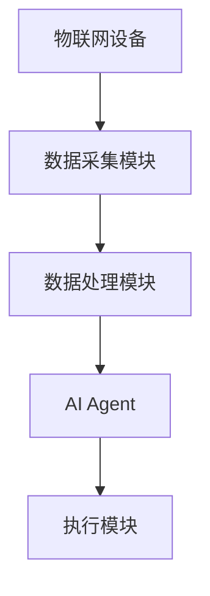
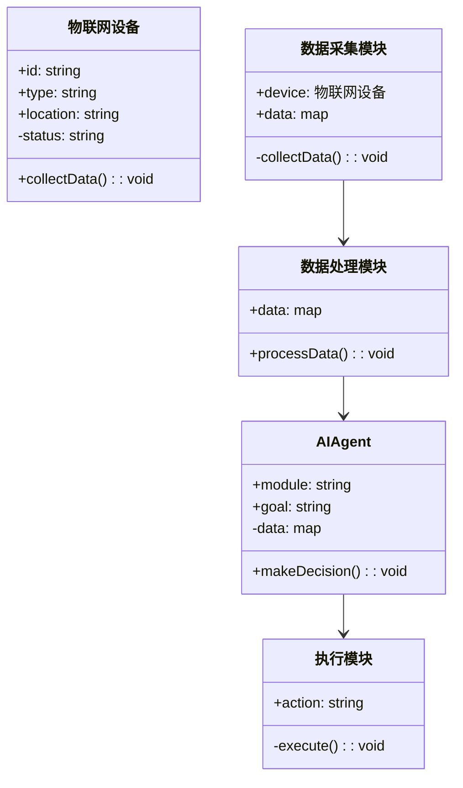
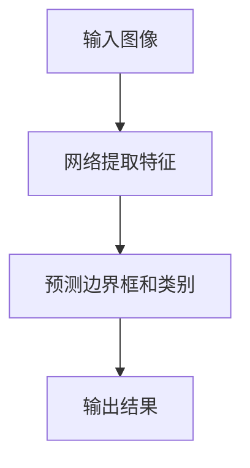
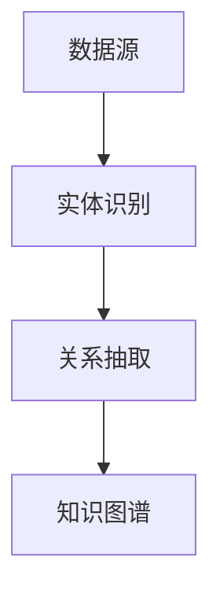
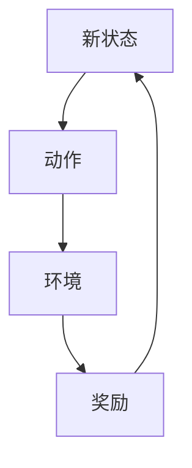
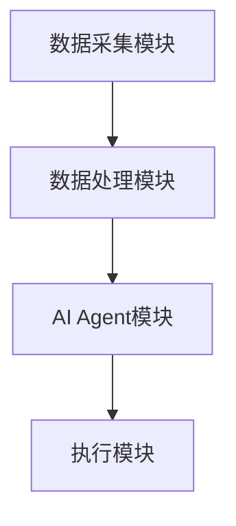

                 


# 物联网AI：构建智能家居和工业互联网的AI Agent

> 关键词：物联网AI, AI Agent, 智能家居, 工业互联网, 人工智能, 物联网, 自动化控制

> 摘要：本文详细探讨了物联网AI在智能家居和工业互联网中的应用，重点分析了AI Agent的核心概念、算法原理、系统架构和实际案例。通过逐步推理和技术细节的深入剖析，展示了如何构建高效、智能的物联网AI Agent。

---

# 第一部分: 物联网AI与AI Agent概述

## 第1章: 物联网AI与AI Agent背景介绍

### 1.1 物联网AI的定义与核心概念

物联网（Internet of Things, IoT）是指通过各种信息传感设备，如传感器、射频识别（RFID）、全球定位系统（GPS）、红外感应器等，按照约定的协议，把任何物品与互联网连接起来，进行信息交换和通信，以实现智能化识别、定位、跟踪、监控和管理。物联网AI则是将人工智能技术与物联网系统相结合，通过AI算法对物联网数据进行分析、推理和决策，从而实现智能化的应用。

AI Agent（人工智能代理）是一种能够感知环境、自主决策并执行任务的智能实体。它能够根据环境中的信息做出反应，完成特定的目标。在物联网AI中，AI Agent通常作为连接物联网设备和用户的桥梁，负责数据的采集、处理、分析和执行。

物联网AI的核心在于通过AI Agent实现智能化的决策和控制。在智能家居和工业互联网中，物联网AI Agent能够协调各种设备和系统，提供更加智能化的服务和管理。

---

### 1.2 物联网AI的应用场景

物联网AI的应用场景非常广泛，以下是两个主要领域的详细分析：

#### 1.2.1 智能家居中的物联网AI

智能家居是物联网AI的重要应用场景之一。通过AI Agent，智能家居能够实现设备的联动控制、能源管理、安全监控等功能。例如：

- **设备联动控制**：当用户离开家时，AI Agent可以根据位置信息自动关闭灯光、空调等设备。
- **能源管理**：AI Agent可以通过分析家庭用电数据，优化能源使用，降低能耗。
- **安全监控**：AI Agent可以结合摄像头、门禁系统等设备，实时监控家庭安全，发现异常情况时及时通知用户或采取应对措施。

#### 1.2.2 工业互联网中的物联网AI

工业互联网是物联网AI的另一个重要领域。在工业互联网中，AI Agent可以用于设备监控、生产优化、预测维护等场景。例如：

- **设备监控**：通过AI Agent实时监控生产线上的设备状态，及时发现故障并进行预测性维护，减少停机时间。
- **生产优化**：AI Agent可以通过分析生产数据，优化生产流程，提高生产效率。
- **质量控制**：AI Agent可以结合视觉识别技术，实时检测产品 quality，确保产品质量。

---

### 1.3 物联网AI的核心技术

物联网AI的核心技术包括以下几个方面：

#### 1.3.1 数据采集与处理

物联网AI的第一步是数据采集。通过各种传感器和设备，AI Agent可以采集环境中的各种数据，如温度、湿度、光照强度、设备状态等。这些数据需要经过预处理，去除噪声和异常值，提取有用的信息。

#### 1.3.2 AI Agent的决策机制

AI Agent的决策机制是物联网AI的核心。它需要根据采集到的数据，结合预设的目标和规则，进行推理和决策。常见的决策机制包括基于规则的决策、基于知识图谱的推理、基于机器学习的预测等。

#### 1.3.3 物联网通信协议

物联网AI的实现离不开高效的通信协议。常用的物联网通信协议包括MQTT、HTTP、CoAP等。这些协议在物联网系统中起到数据传输的作用，确保数据能够快速、可靠地传递到AI Agent进行处理。

---

## 第2章: 物联网AI的核心概念与联系

### 2.1 AI Agent的实体关系图

以下是一个简单的实体关系图，展示了物联网AI系统中的主要实体及其关系：



### 2.2 领域模型图

以下是一个物联网AI系统的领域模型图：



---

## 第3章: 物联网AI的算法原理

### 3.1 物联网AI的感知算法

感知算法是物联网AI的核心算法之一，主要用于从环境中获取信息。常见的感知算法包括：

#### 3.1.1 物体检测

物体检测是感知算法中的一个重要任务。以下是一个基于YOLO（You Only Look Once）算法的物体检测流程：



以下是YOLO算法的Python实现示例：

```python
import torch
from torchvision import models

# 加载预训练模型
model = models.yolov5(pretrained=True)

# 推理函数
def detect_objects(image):
    results = model(image)
    return results.pandas().xyxy[0]
```

---

### 3.2 物联网AI的推理算法

推理算法是物联网AI的另一个重要算法，主要用于从感知数据中提取有用的信息。常见的推理算法包括：

#### 3.2.1 知识图谱构建

知识图谱是推理算法的重要工具。以下是知识图谱构建的流程：



以下是知识图谱构建的Python实现示例：

```python
from kgneo import KnowledgeGraph

# 初始化知识图谱
kg = KnowledgeGraph()

# 添加实体和关系
kg.add_entity("Device", "设备")
kg.add_entity("Status", "状态")
kg.add_relation("has_status", "设备", "状态")

# 查询知识图谱
results = kg.query("设备", "has_status", "状态")
print(results)
```

---

### 3.3 物联网AI的执行算法

执行算法是物联网AI的最后一个关键算法，主要用于根据推理结果执行具体的操作。常见的执行算法包括：

#### 3.3.1 强化学习

强化学习是一种常用的执行算法，通过不断试错来优化决策策略。以下是强化学习的流程：



以下是强化学习的Python实现示例：

```python
import numpy as np
import gym

# 初始化环境
env = gym.make('CartPole-v0')
env.reset()

# 初始化策略
policy = np.random.rand(4, 1)

# 执行策略
while True:
    observation, reward, done, info = env.step(policy.dot(observation))
    if done:
        env.reset()
```

---

## 第4章: 物联网AI的系统架构设计

### 4.1 系统功能设计

物联网AI的系统功能设计需要考虑以下几个方面：

#### 4.1.1 数据采集模块

数据采集模块负责从物联网设备中采集数据，并将其传递给数据处理模块。以下是数据采集模块的实现示例：

```python
import serial

# 初始化串口
ser = serial.Serial('COM3', 9600)

# 采集数据
def collect_data():
    data = ser.readline().decode()
    return data
```

---

#### 4.1.2 数据处理模块

数据处理模块负责对采集到的数据进行预处理和特征提取。以下是数据处理模块的实现示例：

```python
import numpy as np

# 数据预处理
def preprocess(data):
    # 去除噪声
    filtered_data = np.median_filter(data, size=3)
    return filtered_data
```

---

#### 4.1.3 AI Agent模块

AI Agent模块负责根据处理后的数据进行推理和决策。以下是AI Agent模块的实现示例：

```python
import torch
import torch.nn as nn

# 定义神经网络
class AI-Agent(nn.Module):
    def __init__(self):
        super(AI-Agent, self).__init__()
        self.fc1 = nn.Linear(10, 20)
        self.fc2 = nn.Linear(20, 1)

    def forward(self, x):
        x = torch.relu(self.fc1(x))
        x = torch.sigmoid(self.fc2(x))
        return x

# 初始化模型
model = AI-Agent()

# 进行推理
def make_decision(data):
    output = model(data)
    return output
```

---

#### 4.1.4 执行模块

执行模块负责根据AI Agent的决策结果执行具体的操作。以下是执行模块的实现示例：

```python
import RPi.GPIO as GPIO

# 初始化GPIO
GPIO.setmode(GPIO.BCM)

# 执行操作
def execute_action(pin):
    GPIO.setup(pin, GPIO.OUT)
    GPIO.output(pin, GPIO.HIGH)
    GPIO.cleanup()
```

---

### 4.2 系统架构图

以下是物联网AI系统的架构图：



---

## 第5章: 物联网AI的项目实战

### 5.1 项目环境搭建

在进行物联网AI项目开发之前，需要确保环境配置正确。以下是常见的开发环境配置：

- **硬件设备**： Raspberry Pi、Arduino、传感器模块等。
- **软件工具**： Python、TensorFlow、Keras、OpenCV等。
- **开发平台**： AWS IoT、Azure IoT Hub、Google Cloud IoT等。

---

### 5.2 核心代码实现

以下是物联网AI项目的核心代码实现：

#### 5.2.1 数据采集模块

```python
import serial

# 初始化串口
ser = serial.Serial('COM3', 9600)

# 采集数据
def collect_data():
    data = ser.readline().decode()
    return data
```

---

#### 5.2.2 数据处理模块

```python
import numpy as np

# 数据预处理
def preprocess(data):
    # 去除噪声
    filtered_data = np.median_filter(data, size=3)
    return filtered_data
```

---

#### 5.2.3 AI Agent模块

```python
import torch
import torch.nn as nn

# 定义神经网络
class AI-Agent(nn.Module):
    def __init__(self):
        super(AI-Agent, self).__init__()
        self.fc1 = nn.Linear(10, 20)
        self.fc2 = nn.Linear(20, 1)

    def forward(self, x):
        x = torch.relu(self.fc1(x))
        x = torch.sigmoid(self.fc2(x))
        return x

# 初始化模型
model = AI-Agent()

# 进行推理
def make_decision(data):
    output = model(data)
    return output
```

---

#### 5.2.4 执行模块

```python
import RPi.GPIO as GPIO

# 初始化GPIO
GPIO.setmode(GPIO.BCM)

# 执行操作
def execute_action(pin):
    GPIO.setup(pin, GPIO.OUT)
    GPIO.output(pin, GPIO.HIGH)
    GPIO.cleanup()
```

---

### 5.3 项目总结

通过以上代码实现，我们可以看到物联网AI的强大功能。AI Agent能够通过感知环境、推理决策、执行操作，实现智能化的控制和管理。在智能家居和工业互联网中，物联网AI的应用前景广阔，能够显著提高生产效率和生活质量。

---

## 第6章: 物联网AI的最佳实践

### 6.1 注意事项

在实际应用中，需要注意以下几点：

- **数据质量**：确保数据的准确性和完整性。
- **算法选择**：根据具体场景选择合适的算法。
- **系统维护**：定期更新模型和优化系统性能。

---

### 6.2 实际案例分析

以下是一个智能家居中的实际案例：

- **案例背景**：用户希望在离家时自动关闭家中设备。
- **解决方案**：通过AI Agent实时监测用户的地理位置，当检测到用户离开家时，自动关闭灯光、空调等设备。

---

### 6.3 小结

物联网AI的应用需要结合具体场景，选择合适的算法和系统架构。通过不断优化和创新，物联网AI将在智能家居和工业互联网中发挥越来越重要的作用。

---

# 作者：AI天才研究院/AI Genius Institute & 禅与计算机程序设计艺术 /Zen And The Art of Computer Programming

