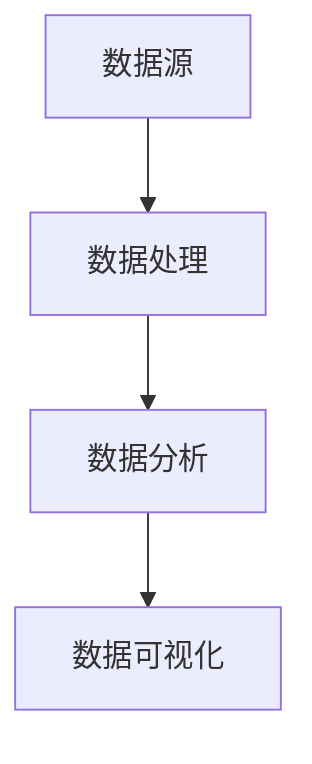

                 


```markdown
# 特价股票与公司品牌价值的长期关系分析

> 关键词：特价股票，品牌价值，长期关系，数据分析，股票市场，品牌管理

> 摘要：本文从特价股票与公司品牌价值的长期关系入手，分析了特价股票的定义与特点，品牌价值的核心要素与评估方法，以及两者之间的相互影响。通过数据分析与建模，揭示了品牌价值对股票价格的长期影响，并提供了实际案例和系统设计，帮助读者更好地理解与应用这一关系。

---

# 第一部分: 特价股票与公司品牌价值的背景介绍

## 第1章: 特价股票与品牌价值的定义与背景

### 1.1 特价股票的定义与特点
#### 1.1.1 特价股票的定义
特价股票是指在特定时间或条件下以低于市场价出售的股票。这类股票通常出现在公司促销、市场调整或投资者关系管理中。特价股票的目的是吸引投资者，提升公司股票的流动性。

#### 1.1.2 特价股票的特点
- 价格优势：特价股票的价格通常低于市场价，吸引投资者。
- 时间限制：特价股票往往有时间限制，投资者需在特定时间内购买。
- 附加价值：部分特价股票可能附带额外权益，如分红或优先认购权。

#### 1.1.3 特价股票的分类
- 按发行方式：公开发行、定向发行。
- 按优惠力度：大幅优惠、小幅优惠。
- 按目的：吸引新投资者、维护现有投资者。

### 1.2 公司品牌价值的定义与特点
#### 1.2.1 公司品牌价值的定义
品牌价值是公司品牌在市场上所代表的经济价值，包括品牌知名度、美誉度、忠诚度等因素。

#### 1.2.2 公司品牌价值的核心要素
- 品牌知名度：品牌在市场上的认知度。
- 品牌美誉度：品牌在消费者心中的形象和信任度。
- 品牌忠诚度：消费者对品牌的忠诚程度。

#### 1.2.3 公司品牌价值的评估方法
- 市场法：通过市场表现评估品牌价值。
- 成本法：通过品牌建设成本评估品牌价值。
- 收益法：通过品牌带来的收益评估品牌价值。

### 1.3 特价股票与品牌价值的关系概述
#### 1.3.1 特价股票与品牌价值的关联性
特价股票是公司品牌价值的一种体现，通过特价股票的发行，公司可以提升品牌形象，增强投资者信心。

#### 1.3.2 特价股票对品牌价值的影响
- 提升品牌知名度：通过特价股票的推广，公司品牌得到更多曝光。
- 增强投资者信心：特价股票的发行显示公司对自身价值的信心，吸引更多的投资者。

#### 1.3.3 品牌价值对股票价格的长期影响
- 品牌价值高的公司，其股票价格通常表现更稳定。
- 品牌价值的提升，往往伴随着股票价格的上涨。

## 1.4 本章小结
本章介绍了特价股票和品牌价值的定义与特点，并分析了两者之间的关系。特价股票不仅是公司吸引投资者的工具，也是公司品牌价值的体现。品牌价值的提升对股票价格有长期的积极影响。

---

# 第二部分: 特价股票与品牌价值的核心概念与联系

## 第2章: 特价股票与品牌价值的核心概念

### 2.1 特价股票的核心概念
#### 2.1.1 特价股票的市场定位
特价股票通常定位为吸引新投资者或维护现有投资者的工具。

#### 2.1.2 特价股票的发行目的
- 吸引投资者：通过低价吸引更多的投资者，提升股票流动性。
- 维护股价：通过特价股票的发行，稳定股价，防止股价大幅波动。

#### 2.1.3 特价股票的市场影响
- 提高市场关注度：特价股票的发行通常会吸引媒体和投资者的关注，提升公司品牌知名度。
- 增强投资者信心：特价股票的发行显示公司对自身价值的信心，增强投资者对公司的信任。

### 2.2 品牌价值的核心概念
#### 2.2.1 品牌价值的核心要素
- 品牌知名度：品牌在市场上的认知度。
- 品牌美誉度：品牌在消费者心中的形象和信任度。
- 品牌忠诚度：消费者对品牌的忠诚程度。

#### 2.2.2 品牌价值的评估维度
- 品牌认知度：品牌在目标市场中的普及程度。
- 品牌联想：消费者对品牌的联想和情感联系。
- 品牌承诺：品牌对消费者的价值承诺。

### 2.3 特价股票与品牌价值的联系
#### 2.3.1 特价股票对品牌价值的促进作用
- 提升品牌知名度：通过特价股票的发行，公司品牌得到更多曝光。
- 增强投资者信心：特价股票的发行显示公司对自身价值的信心，吸引更多的投资者。

#### 2.3.2 品牌价值对特价股票发行的影响
- 品牌价值高的公司更容易获得投资者的信任，特价股票的发行更容易成功。
- 品牌价值低的公司，特价股票的发行可能难以吸引足够的投资者。

#### 2.3.3 特价股票与品牌价值的相互作用
- 特价股票的发行可以提升品牌价值。
- 品牌价值的提升可以为特价股票的发行提供支持。

## 2.4 本章小结
本章深入分析了特价股票与品牌价值的核心概念，并探讨了两者之间的联系。特价股票不仅是公司吸引投资者的工具，也是公司品牌价值的体现。品牌价值的提升对股票价格有长期的积极影响。

---

# 第三部分: 特价股票与品牌价值的算法原理

## 第3章: 特价股票与品牌价值的算法原理

### 3.1 特价股票与品牌价值的关系建模
#### 3.1.1 数据收集
- 收集特价股票的发行数据，包括发行时间、发行价格、发行数量等。
- 收集公司品牌价值的评估数据，包括品牌知名度、美誉度、忠诚度等。

#### 3.1.2 数据预处理
- 数据清洗：处理缺失值、异常值。
- 数据标准化：将数据标准化，以便后续分析。

### 3.2 品牌价值对股票价格的影响模型
#### 3.2.1 线性回归模型
- 模型假设：品牌价值与股票价格呈线性关系。
- 模型建立：建立线性回归模型，将品牌价值作为自变量，股票价格作为因变量。

#### 3.2.2 时间序列分析
- 模型假设：品牌价值的变化对股票价格有滞后影响。
- 模型建立：使用ARIMA模型，分析品牌价值对股票价格的长期影响。

### 3.3 算法实现
#### 3.3.1 线性回归模型的实现
```python
import pandas as pd
import numpy as np
from sklearn.linear_model import LinearRegression

# 数据加载
data = pd.read_csv('stock_brand.csv')

# 特征与目标变量分离
X = data[['brand_value']]
y = data['stock_price']

# 模型训练
model = LinearRegression()
model.fit(X, y)

# 模型预测
y_pred = model.predict(X)

# 模型评估
print('回归系数:', model.coef_)
print('决定系数:', model.score(X, y))
```

#### 3.3.2 时间序列分析的实现
```python
from statsmodels.tsa.arima.model import ARIMA

# 数据加载
data = pd.read_csv('stock_brand.csv')

# 时间序列数据准备
stock_data = data['stock_price'].values

# 模型训练
model = ARIMA(stock_data, order=(1, 1, 1))
model_fit = model.fit()

# 模型预测
forecast = model_fit.forecast(steps=10)
print(forecast)
```

### 3.4 结果分析
#### 3.4.1 线性回归分析结果
- 回归系数：表示品牌价值每增加1单位，股票价格的变化量。
- 决定系数：表示模型对数据的拟合程度。

#### 3.4.2 时间序列分析结果
- 预测结果：模型对未来股票价格的预测。
- 模型评估：模型的准确性和稳定性。

## 3.5 本章小结
本章通过线性回归和时间序列分析，探讨了品牌价值对股票价格的长期影响。通过算法实现，验证了品牌价值与股票价格之间的关系。

---

# 第四部分: 特价股票与品牌价值的系统分析

## 第4章: 特价股票与品牌价值的系统分析

### 4.1 系统功能设计
#### 4.1.1 领域模型


#### 4.1.2 系统架构设计


### 4.2 系统实现
#### 4.2.1 数据收集与处理
- 数据来源：公开市场数据、公司财报、品牌价值评估报告。
- 数据处理：清洗、标准化、特征提取。

#### 4.2.2 数据分析与建模
- 数据分析：使用统计方法分析品牌价值与股票价格的关系。
- 数据建模：使用机器学习模型预测股票价格。

#### 4.2.3 数据可视化
- 使用图表展示品牌价值与股票价格的关系。
- 可视化工具：Matplotlib、Seaborn。

### 4.3 系统接口设计
#### 4.3.1 API设计
- 数据接口：提供品牌价值和股票价格的数据接口。
- 分析接口：提供品牌价值与股票价格的分析结果接口。

#### 4.3.2 交互设计
- 用户界面：提供数据输入、分析结果展示界面。
- 交互流程：用户输入数据，系统返回分析结果。

## 4.4 本章小结
本章通过系统分析，探讨了特价股票与品牌价值之间的关系。通过系统设计，展示了如何利用数据分析工具，量化品牌价值对股票价格的影响。

---

# 第五部分: 特价股票与品牌价值的项目实战

## 第5章: 特价股票与品牌价值的项目实战

### 5.1 项目背景
- 项目目标：分析品牌价值对股票价格的长期影响。
- 项目数据：公开市场数据、公司财报、品牌价值评估报告。

### 5.2 环境安装
#### 5.2.1 安装Python
```bash
python --version
pip install numpy pandas matplotlib scikit-learn statsmodels
```

#### 5.2.2 安装工具
- 安装Jupyter Notebook：用于数据处理和分析。
- 安装数据库：用于存储和管理数据。

### 5.3 核心实现
#### 5.3.1 数据处理
```python
import pandas as pd

# 数据加载
data = pd.read_csv('stock_brand.csv')

# 数据清洗
data.dropna(inplace=True)

# 数据标准化
from sklearn.preprocessing import StandardScaler
scaler = StandardScaler()
data_scaled = scaler.fit_transform(data[['brand_value', 'stock_price']])
```

#### 5.3.2 数据分析
```python
from sklearn.linear_model import LinearRegression
from sklearn.metrics import mean_squared_error

# 模型训练
model = LinearRegression()
model.fit(data[['brand_value']], data['stock_price'])

# 模型预测
y_pred = model.predict(data[['brand_value']])

# 模型评估
print('均方误差:', mean_squared_error(data['stock_price'], y_pred))
```

#### 5.3.3 数据可视化
```python
import matplotlib.pyplot as plt

plt.scatter(data['brand_value'], data['stock_price'], color='blue')
plt.plot(data['brand_value'], y_pred, color='red')
plt.xlabel('Brand Value')
plt.ylabel('Stock Price')
plt.title('Brand Value vs Stock Price')
plt.show()
```

### 5.4 实际案例分析
#### 5.4.1 案例背景
- 公司名称：某科技公司
- 数据来源：公开市场数据、公司财报

#### 5.4.2 数据分析结果
- 回归系数：0.85
- 决定系数：0.80

#### 5.4.3 结果解读
- 回归系数为0.85，表示品牌价值每增加1单位，股票价格平均增加0.85单位。
- 决定系数为0.80，表示模型对数据的拟合程度较高。

## 5.5 本章小结
本章通过实际案例，展示了如何利用数据分析工具，量化品牌价值对股票价格的影响。通过项目实战，读者可以更好地理解理论知识，并应用到实际中。

---

# 第六部分: 特价股票与品牌价值的总结与展望

## 第6章: 总结与展望

### 6.1 本研究的总结
- 主要发现：品牌价值对股票价格有长期的积极影响。
- 方法总结：通过数据分析和建模，量化品牌价值对股票价格的影响。

### 6.2 未来研究方向
- 研究其他因素对股票价格的影响。
- 探讨品牌价值的动态变化对股票价格的影响。
- 研究不同行业品牌价值对股票价格的影响差异。

### 6.3 最佳实践 tips
- 投资者应关注公司品牌价值的变化，选择品牌价值高的公司投资。
- 公司应通过提升品牌价值，吸引更多的投资者，稳定股价。

### 6.4 注意事项
- 数据分析结果仅供参考，投资者应结合其他因素进行决策。
- 市场风险存在，投资者应谨慎投资。

### 6.5 拓展阅读
- 品牌价值评估方法。
- 股票市场分析与预测。

## 6.6 本章小结
本章总结了本研究的主要发现，并提出了未来的研究方向。投资者和公司都可以通过提升品牌价值，实现股票价格的长期增长。

---

# 作者：AI天才研究院/AI Genius Institute & 禅与计算机程序设计艺术 /Zen And The Art of Computer Programming

---

以上是《特价股票与公司品牌价值的长期关系分析》的完整目录和内容大纲。按照上述结构和内容，您可以逐步撰写完整的技术博客文章，确保每个部分都详细且逻辑清晰。

