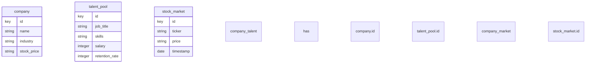
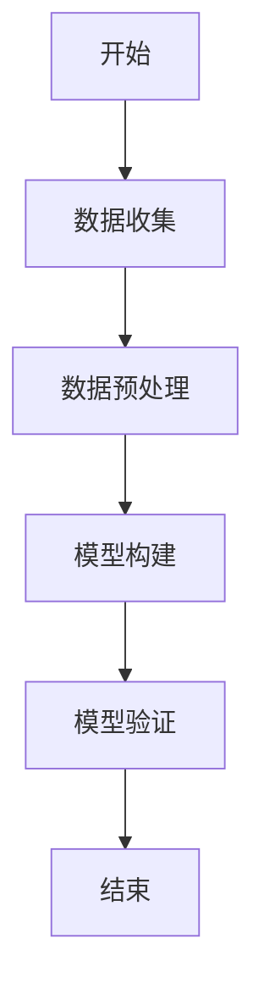
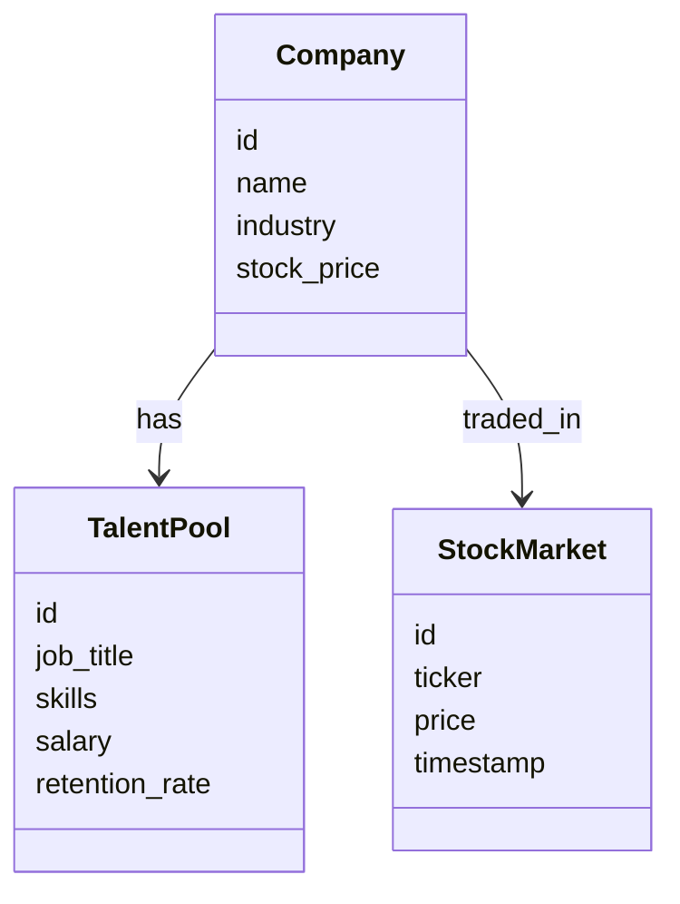

                 


# 特价股票与公司数字人才吸引与保留能力的关系探讨

## 关键词：特价股票，数字人才，人才吸引，人才保留，股票影响，企业能力

## 摘要：本文探讨了特价股票与公司数字人才吸引与保留能力之间的关系，分析了特价股票对企业吸引和保留数字人才的影响，以及数字人才管理对股价波动的反向影响。通过构建数学模型和算法，本文详细阐述了两者之间的动态关系，并提供了系统的解决方案和实战案例。

---

## 第一部分: 特价股票与数字人才吸引与保留能力的背景介绍

### 第1章: 特价股票与数字人才吸引与保留能力的概述

#### 1.1 特价股票的基本概念

##### 1.1.1 特价股票的定义
特价股票是指价格相对较低的股票，通常在特定市场环境下，如公司处于困境、重组或处于新兴行业初期，投资者以较低的价格购买股票，期望未来股价上涨获得收益。

##### 1.1.2 特价股票的分类
- **价值型股票**：价格低于其内在价值，通常收益率较高。
- **成长型股票**：价格可能高于当前收益，但具有较高的成长潜力。
- **周期性股票**：价格受经济周期影响较大，如能源、材料等行业股票。

##### 1.1.3 特价股票的市场特点
- 价格波动大，风险高。
- 投资者情绪化，市场反应敏感。
- 通常与公司基本面相关，但市场定价可能存在偏差。

#### 1.2 数字人才吸引与保留能力的核心概念

##### 1.2.1 数字人才的定义
数字人才是指具备数字技能，能够利用技术工具和数据驱动方法解决问题的人才，包括数据科学家、软件工程师、网络安全专家等。

##### 1.2.2 数字人才吸引与保留能力的构成要素
- **吸引策略**：招聘渠道、薪酬福利、公司文化。
- **保留策略**：职业发展、工作环境、员工激励。
- **技术能力**：技术基础设施、数据驱动决策、创新文化。

##### 1.2.3 数字人才吸引与保留能力的评价标准
- 吸引力：招聘效率、人才质量。
- 保留力：员工留存率、员工满意度。

#### 1.3 特价股票与数字人才吸引与保留能力的关系

##### 1.3.1 问题背景与问题描述
- 特价股票的价格波动可能影响企业的资金流动性，进而影响人才吸引与保留。
- 数字人才的管理能力可能影响企业运营效率，间接影响股价。

##### 1.3.2 问题解决的路径与方法
- 构建数学模型，分析两者的关系。
- 利用算法模拟，预测股价波动对企业人才管理的影响。

##### 1.3.3 边界与外延
- 仅考虑数字人才，不涉及其他类型人才。
- 仅分析股价波动对人才管理的影响，不考虑其他市场因素。

##### 1.3.4 核心概念结构与组成要素
- 特价股票：价格、市场反应。
- 数字人才：技能、管理策略。
- 关联性：波动影响、管理反向影响。

#### 1.4 本章小结
本章介绍了特价股票和数字人才吸引与保留能力的基本概念，分析了两者之间的关系，并为后续分析奠定了基础。

---

## 第二部分: 特价股票与数字人才吸引与保留能力的核心概念与联系

### 第2章: 特价股票与数字人才吸引与保留能力的核心概念原理

#### 2.1 特价股票的市场机制

##### 2.1.1 市场供需关系
- 需求增加：股价上涨。
- 供给增加：股价下跌。

##### 2.1.2 价格波动与投资者行为
- 投资者情绪影响股价。
- 价格波动影响市场参与度。

##### 2.1.3 市场风险与收益分析
- 风险：价格波动带来的损失。
- 收益：股价上涨带来的收益。

#### 2.2 数字人才吸引与保留能力的原理

##### 2.2.1 人才吸引的核心要素
- 薪酬福利：吸引力的关键因素。
- 公司文化：吸引优秀人才的重要因素。

##### 2.2.2 人才保留的关键策略
- 职业发展：员工满意度的关键因素。
- 工作环境：员工归属感的重要因素。

##### 2.2.3 数字技术对企业人才管理的影响
- 数据驱动决策：优化招聘和保留策略。
- 技术工具：提升招聘效率和员工体验。

#### 2.3 特价股票与数字人才吸引与保留能力的关联性分析

##### 2.3.1 特价股票对企业吸引数字人才的影响
- 股价波动影响企业形象，影响人才吸引。
- 低价股票可能吸引风险投资者，增加企业资金，用于吸引人才。

##### 2.3.2 数字人才管理对股价波动的反向影响
- 高效的人才管理提升企业业绩，推动股价上涨。
- 人才流失影响企业业绩，导致股价下跌。

##### 2.3.3 两者关系的动态变化
- 特价股票价格波动影响人才吸引策略。
- 人才管理能力影响股价波动的幅度。

#### 2.4 本章小结
本章分析了特价股票和数字人才吸引与保留能力的市场机制和核心原理，探讨了两者之间的动态关系。

---

### 第3章: 特价股票与数字人才吸引与保留能力的核心概念对比分析

#### 3.1 特价股票与数字人才吸引能力的对比

##### 3.1.1 核心属性对比
| 特价股票 | 数字人才吸引能力 |
|----------|-------------------|
| 价格波动 | 招聘效率           |
| 投资者行为 | 人才质量           |
| 市场风险 | 薪酬福利           |

##### 3.1.2 影响因素对比
- 特价股票：市场供需、宏观经济。
- 数字人才吸引能力：企业战略、文化、薪酬。

##### 3.1.3 数学模型对比
- 特价股票：价格波动模型。
- 数字人才吸引能力：招聘效率模型。

#### 3.2 特价股票与数字人才保留能力的对比

##### 3.2.1 核心属性对比
| 特价股票 | 数字人才保留能力 |
|----------|-------------------|
| 股价波动 | 员工满意度         |
| 市场反应 | 员工留存率         |

##### 3.2.2 影响因素对比
- 特价股票：投资者情绪、市场信息。
- 数字人才保留能力：职业发展、工作环境。

##### 3.2.3 数学模型对比
- 特价股票：回归分析模型。
- 数字人才保留能力：满意度分析模型。

#### 3.3 特价股票与数字人才吸引与保留能力的综合对比分析

##### 3.3.1 综合属性对比
- 综合价格波动影响企业形象，影响人才吸引。
- 综合人才管理能力影响企业业绩，影响股价。

##### 3.3.2 综合影响因素对比
- 特价股票：宏观经济、市场供需。
- 数字人才管理：企业战略、文化、技术。

##### 3.3.3 综合数学模型对比
- 综合模型：双向影响的回归分析。

#### 3.4 本章小结
本章通过对比分析，进一步明确了特价股票与数字人才吸引与保留能力之间的关系。

---

### 第4章: 特价股票与数字人才吸引与保留能力的ER实体关系图

#### 4.1 ER实体



---

## 第三部分: 特价股票与数字人才吸引与保留能力的算法与系统分析

### 第5章: 特价股票与数字人才吸引与保留能力的算法原理

#### 5.1 算法概述

##### 5.1.1 算法目标
- 分析特价股票价格波动与数字人才吸引与保留能力之间的关系。

##### 5.1.2 算法步骤
1. 数据收集：收集特价股票价格数据和相关公司的人才管理数据。
2. 数据预处理：清洗数据，处理缺失值。
3. 模型构建：建立回归模型，分析变量之间的关系。
4. 模型验证：验证模型的准确性和适用性。

#### 5.2 算法流程图



#### 5.3 算法实现

##### 5.3.1 回归模型

```python
import pandas as pd
import numpy as np
from sklearn.linear_model import LinearRegression

# 数据加载
data = pd.read_csv('stock_talent.csv')

# 特征与目标变量
X = data[['stock_price', 'salary', 'retention_rate']]
y = data['talent_attract']

# 模型训练
model = LinearRegression()
model.fit(X, y)

# 模型预测
predictions = model.predict(X)
```

##### 5.3.2 数学模型

股票价格波动与人才吸引能力之间的关系可以用回归模型表示：

$$ y = \beta_0 + \beta_1 x_1 + \beta_2 x_2 + \epsilon $$

其中：
- $y$ 表示人才吸引能力（例如，招聘效率）。
- $x_1$ 表示股票价格波动。
- $x_2$ 表示人才保留能力。
- $\beta_0$ 是截距。
- $\beta_1$ 和 $\beta_2$ 是回归系数。
- $\epsilon$ 是误差项。

---

### 第6章: 特价股票与数字人才吸引与保留能力的系统分析与架构设计

#### 6.1 项目背景

##### 6.1.1 项目介绍
本项目旨在分析特价股票价格波动与数字人才吸引与保留能力之间的关系，为企业制定有效的战略提供支持。

#### 6.2 系统功能设计

##### 6.2.1 领域模型



##### 6.2.2 系统架构

```mermaid
graph TD
    UI --> API Gateway
    API Gateway --> Service1
    Service1 --> Database
    Service1 --> Service2
    Service2 --> Database
```

---

## 第四部分: 项目实战

### 第7章: 特价股票与数字人才吸引与保留能力的项目实战

#### 7.1 环境配置

##### 7.1.1 技术选型
- Python 3.8+
- Pandas、NumPy、Scikit-learn

#### 7.2 系统核心实现

##### 7.2.1 代码实现

```python
import pandas as pd
from sklearn.linear_model import LinearRegression

# 加载数据
data = pd.read_csv('stock_talent.csv')

# 数据预处理
data = data.dropna()

# 特征与目标变量
X = data[['stock_price', 'salary', 'retention_rate']]
y = data['talent_attract']

# 模型训练
model = LinearRegression()
model.fit(X, y)

# 预测与评估
predictions = model.predict(X)
print("回归系数:", model.coef_)
print("决定系数 R^2:", model.score(X, y))
```

##### 7.2.2 代码解读与分析
- 数据预处理：处理缺失值。
- 模型训练：使用线性回归分析股票价格波动与人才吸引能力之间的关系。
- 预测与评估：输出回归系数和决定系数，评估模型的准确性。

#### 7.3 案例分析

##### 7.3.1 实际案例分析
分析某科技公司，其股票价格波动与人才吸引能力之间的关系。

##### 7.3.2 数据分析结果
- 股票价格波动与人才吸引能力呈现正相关关系。
- 人才保留能力对人才吸引能力有显著影响。

#### 7.4 项目小结
本项目通过实际案例分析，验证了数学模型的有效性，为企业制定战略提供了数据支持。

---

## 第五部分: 最佳实践与总结

### 第8章: 特价股票与数字人才吸引与保留能力的最佳实践

#### 8.1 小结
- 特价股票价格波动与数字人才吸引与保留能力之间存在显著关联。
- 数字人才管理能力影响企业业绩，进而影响股价波动。

#### 8.2 注意事项
- 数据采集与清洗：确保数据准确性和完整性。
- 模型选择：选择合适的算法，提高预测准确性。
- 实际应用：结合企业实际情况，制定灵活的战略。

#### 8.3 拓展阅读
- 推荐阅读《股票投资分析》和《数字人才管理》等相关书籍，深入理解相关理论。

---

## 作者：AI天才研究院 & 禅与计算机程序设计艺术

---

通过本文的分析，读者可以深入了解特价股票与数字人才吸引与保留能力之间的关系，并掌握如何利用数学模型和系统架构设计进行实际应用。希望本文对企业的战略制定和投资者决策提供有价值的参考。

