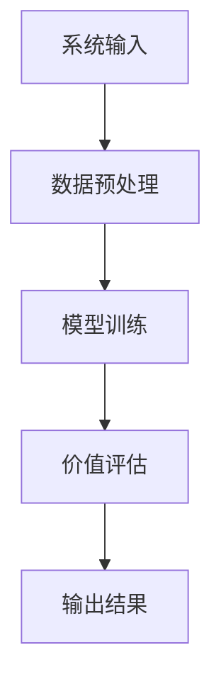
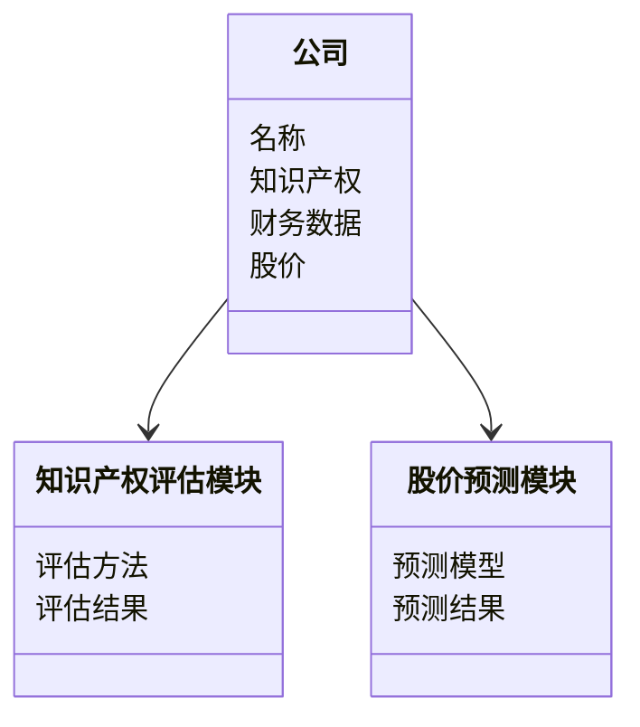
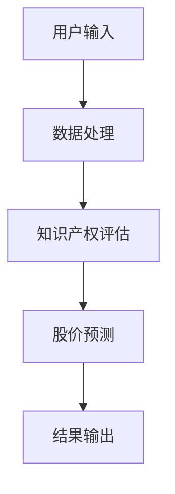

                 


# 特价股票与公司知识产权变现能力的关系分析

**关键词：** 特价股票, 知识产权, 变现能力, 股价波动, 投资分析

**摘要：**  
本文深入探讨了特价股票与公司知识产权变现能力之间的关系。通过对知识产权对公司价值和股价的影响进行分析，构建了数学模型和算法，结合实际案例和系统设计，揭示了知识产权变现能力对股价波动的潜在影响，为投资者提供了科学的决策依据。

---

# 第一部分: 特价股票与公司知识产权变现能力的背景与概念

## 第1章: 特价股票与公司知识产权变现能力的概述

### 1.1 特价股票的基本概念
#### 1.1.1 特价股票的定义  
特价股票通常指价格低于行业平均水平或历史平均水平的股票。这类股票往往具有较高的投资潜力，但伴随着较高的风险。

#### 1.1.2 特价股票的分类  
根据市场波动和公司基本面，特价股票可以分为以下几类：
- **低估值股票**：市盈率、市净率低于行业平均水平。
- **成长型股票**：未来增长潜力大，但当前股价被低估。
- **周期性股票**：受经济周期影响较大的行业股票。

#### 1.1.3 特价股票的投资价值分析  
投资者选择特价股票通常基于以下几点：
- 价格优势：股价低于内在价值，具备反弹空间。
- 风险偏好：低价股票波动性较大，适合高风险承受能力的投资者。
- 市场情绪：市场低迷时，特价股票可能被市场忽视，存在低估机会。

### 1.2 公司知识产权的基本概念
#### 1.2.1 知识产权的定义与范围  
知识产权是指依法保护的智力成果，包括专利权、商标权、版权、商业秘密等。

#### 1.2.2 知识产权的主要类型  
- **专利权**：保护发明成果。
- **商标权**：保护品牌标识。
- **版权**：保护文学、艺术作品。
- **商业秘密**：保护未公开的商业信息。

#### 1.2.3 知识产权的经济价值  
知识产权的经济价值体现在以下几个方面：
- **市场竞争力**：专利技术可以提高产品附加值。
- **收入来源**：通过授权使用或出售知识产权获得收入。
- **品牌价值**：强大的商标和品牌可以提升企业形象和市场地位。

### 1.3 特价股票与公司知识产权变现能力的关系
#### 1.3.1 特价股票与公司价值的关系  
特价股票的股价波动往往反映了市场对公司价值的重新评估。如果公司具备强大的知识产权变现能力，其股价可能在短期内被低估，具备上涨空间。

#### 1.3.2 知识产权对公司价值的影响  
知识产权是公司核心竞争力的体现。拥有强大的知识产权储备，可以提升公司的市场地位和盈利能力。

#### 1.3.3 特价股票与知识产权变现能力的关联性  
公司知识产权的变现能力直接影响其财务表现，进而影响股价。投资者可以通过分析公司的知识产权状况，判断其潜在的投资价值。

### 1.4 本章小结  
本章通过分析特价股票和知识产权的基本概念，揭示了两者之间的潜在联系，为后续分析奠定了基础。

---

## 第2章: 特价股票与公司知识产权变现能力的核心概念

### 2.1 特价股票的市场表现分析
#### 2.1.1 特价股票的市场特征  
特价股票通常在市场低迷时出现，投资者需要关注其潜在的反弹机会。

#### 2.1.2 特价股票的投资策略  
- **价值投资**：寻找被市场低估的股票。
- **趋势投资**：关注行业周期性波动。
- **事件驱动投资**：关注公司重大事件（如并购、重组）的影响。

#### 2.1.3 特价股票的风险与机会  
风险：  
- 市场波动可能导致股价进一步下跌。
- 公司基本面不佳可能导致股价继续低迷。  

机会：  
- 股价反弹空间较大。
- 市场情绪改善时，股价可能快速回升。

### 2.2 知识产权的变现能力分析
#### 2.2.1 知识产权的评估方法  
- **市场法**：通过比较类似知识产权的交易价格进行评估。
- **成本法**：基于研发成本估算知识产权价值。
- **收益法**：预测未来现金流，折现后评估价值。

#### 2.2.2 知识产权的变现途径  
- **技术授权**：将专利授权给其他企业使用。
- **产品销售**：将知识产权应用于产品，通过销售获利。
- **诉讼赔偿**：通过知识产权侵权诉讼获得赔偿。

#### 2.2.3 知识产权的市场价值与公司业绩的关系  
知识产权的市场价值直接影响公司的收入和利润，进而影响股价。例如，一家拥有强大专利储备的科技公司，其股价可能因技术创新而被高估，但也可能因专利变现能力不足而被低估。

### 2.3 特价股票与知识产权变现能力的内在联系
#### 2.3.1 知识产权对公司核心竞争力的影响  
知识产权是公司技术优势的体现，能够提升公司在行业中的竞争力。

#### 2.3.2 特价股票与公司知识产权变现能力的互动关系  
- 知识产权变现能力强的公司，其股价可能因市场低估而成为特价股票。
- 特价股票的股价波动可能反映了市场对公司知识产权变现能力的重新评估。

#### 2.3.3 知识产权对股价波动的潜在影响  
- 知识产权的获得或丧失可能引发股价波动。
- 知识产权诉讼或授权可能影响公司的财务表现，进而影响股价。

### 2.4 本章小结  
本章深入分析了特价股票与公司知识产权变现能力的核心概念，揭示了两者之间的互动关系。

---

## 第3章: 特价股票与公司知识产权变现能力的数学模型与算法原理

### 3.1 知识产权价值评估的数学模型
#### 3.1.1 知识产权价值评估的基本假设  
- 知识产权的价值与公司的技术优势相关。
- 知识产权的变现能力可以通过财务指标量化。

#### 3.1.2 知识产权价值的评估公式  
$$ V = \alpha \cdot I + \beta \cdot Q + \gamma \cdot T $$  
其中，$V$ 表示知识产权价值，$I$ 表示创新能力，$Q$ 表示市场占有率，$T$ 表示技术领先度，$\alpha$、$\beta$、$\gamma$ 为系数。

#### 3.1.3 系统架构设计  


### 3.2 特价股票价格预测的算法原理
#### 3.2.1 基于知识产权的股票价格预测模型  
$$ P = a \cdot V + b \cdot S + c \cdot R $$  
其中，$P$ 表示股票价格，$V$ 表示知识产权价值，$S$ 表示公司规模，$R$ 表示行业风险，$a$、$b$、$c$ 为系数。

#### 3.2.2 线性回归模型的构建与应用  
- 数据收集：收集公司知识产权、财务数据和股价数据。
- 模型训练：使用历史数据训练线性回归模型。
- 预测股价：基于模型预测未来股价。

#### 3.2.3 代码实现  
```python
import pandas as pd
import numpy as np
from sklearn.linear_model import LinearRegression

# 数据加载
data = pd.read_csv('stock_ip.csv')

# 模型训练
model = LinearRegression()
model.fit(data[['V', 'S', 'R']], data['P'])

# 预测股价
predicted_P = model.predict(new_data[['V', 'S', 'R']])
```

### 3.3 本章小结  
本章通过构建数学模型和算法，量化了知识产权对公司股价的影响，为投资者提供了科学的决策工具。

---

## 第4章: 特价股票与公司知识产权变现能力的系统设计与实现

### 4.1 系统功能设计
#### 4.1.1 领域模型设计  


#### 4.1.2 系统架构设计  


### 4.2 系统实现
#### 4.2.1 环境安装  
- 安装Python和相关库（如pandas、numpy、scikit-learn）。

#### 4.2.2 核心代码实现  
```python
import pandas as pd
from sklearn.linear_model import LinearRegression

# 数据加载
data = pd.read_csv('stock_data.csv')

# 模型训练
model = LinearRegression()
model.fit(data[['知识产权', '规模', '风险']], data['股价'])

# 预测股价
predicted_price = model.predict(new_data[['知识产权', '规模', '风险']])
```

### 4.3 本章小结  
本章通过系统设计与实现，展示了如何将知识产权分析与股价预测相结合，为投资者提供了技术支持。

---

## 第5章: 特价股票与公司知识产权变现能力的实际案例分析

### 5.1 案例背景介绍
#### 5.1.1 公司概况  
以某科技公司为例，分析其知识产权与股价的关系。

#### 5.1.2 数据来源  
收集公司过去5年的知识产权、财务数据和股价数据。

### 5.2 数据分析与解读
#### 5.2.1 知识产权价值评估  
通过数学模型评估公司的知识产权价值。

#### 5.2.2 股价预测  
基于模型预测公司未来股价走势。

### 5.3 案例结论  
通过案例分析，验证了知识产权对公司股价的显著影响。

### 5.4 本章小结  
本章通过实际案例分析，进一步验证了知识产权与股价之间的关系。

---

## 第6章: 特价股票与公司知识产权变现能力的关系分析总结与展望

### 6.1 本章总结  
本文通过分析特价股票与公司知识产权变现能力的关系，构建了数学模型和算法，验证了知识产权对公司股价的显著影响。

### 6.2 未来展望  
未来的研究可以进一步探索以下方向：
- 更复杂的模型（如深度学习）在股价预测中的应用。
- 知识产权多维度评估方法的开发。
- 全球市场中知识产权与股价关系的比较研究。

### 6.3 最佳实践 Tips  
- 投资者应关注公司知识产权的变现能力。
- 在选择特价股票时，需综合考虑公司知识产权的价值。
- 长期投资者应关注公司技术创新和知识产权储备。

### 6.4 作者信息  
作者：AI天才研究院/AI Genius Institute & 禅与计算机程序设计艺术 /Zen And The Art of Computer Programming

---

通过以上分析，我们可以得出结论：公司知识产权的变现能力直接影响其股价，投资者在选择特价股票时，应充分考虑公司的知识产权状况。

