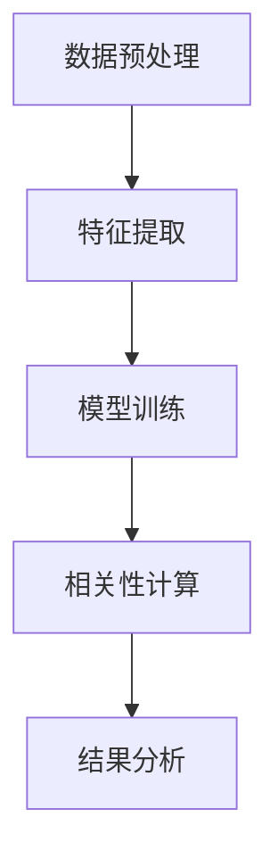
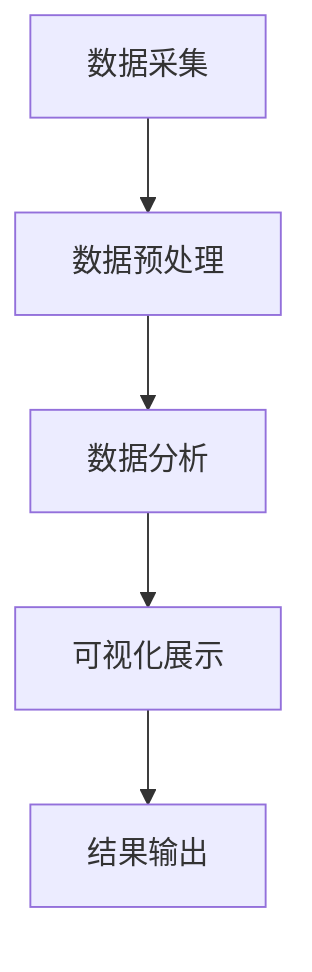

                 


# 特价股票与公司长期技术融合创新生态系统的相关性分析

## 关键词：特价股票，公司技术创新生态系统，相关性分析，技术融合，创新战略

## 摘要：  
本文探讨了特价股票与公司长期技术融合创新生态系统之间的相关性，分析了技术创新生态系统对股票价值的影响，以及如何通过技术融合提升公司竞争力。文章结合背景介绍、核心概念、算法原理、系统架构、项目实战和最佳实践，深入剖析了技术创新与股票价值之间的关系，为企业制定创新战略和投资者决策提供了参考。

---

# 第1章: 特价股票与公司长期技术融合创新生态系统相关性分析概述

## 1.1 特价股票的定义与特点

### 1.1.1 特价股票的定义  
特价股票是指在特定市场环境下，价格相对低于其内在价值的股票。这类股票通常具有较高的投资潜力，但由于市场波动或公司短期问题，其价格被低估。  

### 1.1.2 特价股票的核心特点  
- **价格低估**：相对于公司基本面，股票价格被市场低估。  
- **高波动性**：价格波动较大，存在短期风险。  
- **投资机会**：具备长期增值潜力，适合长期投资者。  

### 1.1.3 特价股票与普通股票的区别  
| 特性      | 特价股票         | 普通股票         |  
|-----------|------------------|------------------|  
| 价格      | 低于内在价值     | 反映市场估值     |  
| 波动性     | 高               | 中低             |  
| 投资策略   | 长期持有         | 短期交易         |  

---

## 1.2 公司长期技术融合创新生态系统

### 1.2.1 技术融合创新的定义  
技术融合创新是指将不同领域的技术结合，形成新的产品、服务或商业模式的过程。这种创新模式能够提升公司的竞争力和市场地位。  

### 1.2.2 公司技术融合创新生态系统的构成  
- **技术核心**：技术创新的核心领域，如人工智能、大数据等。  
- **资源整合**：公司内外部资源的整合，包括技术、资金、人才等。  
- **生态系统**：形成一个协同发展的生态体系，涵盖产品、服务、市场等。  

### 1.2.3 技术融合创新与公司长期发展的关系  
技术融合创新能够提升公司的技术实力和市场竞争力，从而增强其长期发展潜力。  

---

## 1.3 相关性分析的背景与意义

### 1.3.1 相关性分析的背景  
随着科技的发展，技术创新对公司的价值影响日益显著，研究技术创新与股票价值的关系具有重要意义。  

### 1.3.2 相关性分析的意义  
- **理论意义**：丰富技术与金融结合的理论研究。  
- **实践意义**：为投资者和企业提供决策支持。  

### 1.3.3 研究的目标与范围  
目标是分析技术创新与股票价值之间的相关性，范围包括技术创新对股票价值的影响路径和影响程度。  

---

## 1.4 本章小结  
本章介绍了特价股票和公司技术融合创新生态系统的定义、特点及其相关性分析的背景和意义，为后续分析奠定了基础。

---

# 第2章: 特价股票与公司技术融合创新生态系统的核心概念与联系

## 2.1 特价股票的核心概念

### 2.1.1 特价股票的市场定位  
特价股票通常出现在市场低迷或公司短期问题时期，具备较高的投资价值。  

### 2.1.2 特价股票的价值评估  
价值评估主要考虑公司的基本面，包括盈利能力、成长性和财务状况。  

### 2.1.3 特价股票的风险分析  
风险主要来自市场波动和公司短期问题，投资者需具备长期持有的耐心。  

---

## 2.2 公司技术融合创新生态系统的核心概念

### 2.2.1 技术融合创新的模式  
- **内部创新**：公司自主研发新技术。  
- **外部合作**：与外部企业或机构合作创新。  

### 2.2.2 公司技术融合创新生态系统的层次结构  
- **基础层**：技术创新的核心技术。  
- **应用层**：技术在产品和服务中的应用。  
- **生态层**：公司与合作伙伴形成的生态系统。  

### 2.2.3 技术融合创新与公司竞争力的关系  
技术创新能够提升公司的产品竞争力和市场地位，从而增强公司的长期盈利能力。  

---

## 2.3 相关性分析的核心概念

### 2.3.1 相关性分析的方法  
- **定量分析**：通过数据统计和建模分析。  
- **定性分析**：通过案例研究和专家访谈分析。  

### 2.3.2 相关性分析的指标体系  
- **技术创新指标**：研发投入、专利数量等。  
- **股票价值指标**：市盈率、市净率等。  

### 2.3.3 相关性分析的数学模型  
相关性分析通常采用 Pearson 相关系数公式：  
$$ r = \frac{\sum (x_i - \bar{x})(y_i - \bar{y})}{\sqrt{\sum (x_i - \bar{x})^2 \sum (y_i - \bar{y})^2}} $$  
其中，$r$ 为相关系数，$x$ 和 $y$ 分别为技术创新指标和股票价值指标。  

---

## 2.4 本章小结  
本章详细阐述了特价股票和公司技术融合创新生态系统的核心概念及其联系，为后续分析提供了理论基础。

---

# 第3章: 特价股票与公司技术融合创新生态系统相关性分析的算法原理

## 3.1 相关性分析的基本原理

### 3.1.1 相关性分析的数学基础  
相关性分析基于统计学和概率论，通过计算变量之间的相关系数来衡量它们的关系。  

### 3.1.2 相关性分析的统计学方法  
- **描述性统计**：计算均值、标准差等指标。  
- **推断性统计**：通过假设检验判断相关性显著性。  

### 3.1.3 相关性分析的机器学习方法  
- **线性回归**：用于预测股票价值的变化。  
- **聚类分析**：用于识别技术创新与股票价值的关联性。  

---

## 3.2 算法实现

### 3.2.1 算法流程图（Mermaid）



### 3.2.2 算法实现代码（Python）

```python
import numpy as np
import pandas as pd

def calculate_correlation(data1, data2):
    return np.corrcoef(data1, data2)[0, 1]

# 示例数据
data1 = np.array([1, 2, 3, 4, 5])
data2 = np.array([2, 4, 6, 8, 10])

correlation = calculate_correlation(data1, data2)
print("相关系数为:", correlation)
```

---

## 3.3 相关性分析的数学模型

### 3.3.1 相关性系数公式  
$$ r = \frac{\sum (x_i - \bar{x})(y_i - \bar{y})}{\sqrt{\sum (x_i - \bar{x})^2 \sum (y_i - \bar{y})^2}} $$  
其中，$r$ 表示相关系数，$x$ 和 $y$ 分别为技术创新指标和股票价值指标。  

---

## 3.4 本章小结  
本章通过算法原理和数学模型，详细介绍了如何通过相关性分析量化技术创新与股票价值之间的关系。

---

# 第4章: 特价股票与公司技术融合创新生态系统相关性分析的系统架构

## 4.1 系统功能设计

### 4.1.1 数据采集模块  
- 采集公司技术创新数据和股票市场数据。  

### 4.1.2 数据分析模块  
- 计算相关系数，分析技术创新与股票价值的关系。  

### 4.1.3 可视化模块  
- 展示分析结果，帮助用户理解相关性。  

---

## 4.2 系统架构设计（Mermaid）



---

## 4.3 本章小结  
本章通过系统架构设计，展示了如何将技术创新与股票价值分析整合到一个系统中。

---

# 第5章: 特价股票与公司技术融合创新生态系统相关性分析的项目实战

## 5.1 项目环境安装

### 5.1.1 安装Python环境  
- 使用 Anaconda 安装 Python 3.8 及以上版本。  

### 5.1.2 安装依赖库  
- 使用 pip 安装 numpy、pandas、matplotlib 等库。  

```bash
pip install numpy pandas matplotlib
```

---

## 5.2 系统核心实现源代码

### 5.2.1 数据采集代码

```python
import pandas as pd

# 采集股票数据
def fetch_stock_data(ticker):
    # 示例代码，实际使用 API 获取数据
    return pd.DataFrame({'price': [10, 20, 30, 40, 50]})

# 采集技术创新数据
def fetch_technology_data(company):
    # 示例代码，实际使用 API 获取数据
    return pd.DataFrame({'tech_index': [0.8, 0.85, 0.9, 0.95, 1.0]})

# 示例运行
stock_data = fetch_stock_data('AAPL')
tech_data = fetch_technology_data('Apple')
```

### 5.2.2 相关性分析代码

```python
import numpy as np

def calculate_correlation(data1, data2):
    return np.corrcoef(data1, data2)[0, 1]

# 示例分析
correlation = calculate_correlation(stock_data['price'], tech_data['tech_index'])
print("相关系数为:", correlation)
```

---

## 5.3 案例分析

### 5.3.1 案例背景  
以苹果公司为例，分析其技术创新与股票价格的相关性。  

### 5.3.2 数据分析  
通过代码计算苹果公司的技术创新指标与股票价格的相关系数。  

### 5.3.3 结果解读  
如果相关系数为正且较高，说明技术创新对股票价格有显著影响。  

---

## 5.4 本章小结  
本章通过项目实战，展示了如何利用技术手段分析技术创新与股票价值的相关性。

---

# 第6章: 总结与展望

## 6.1 总结

### 6.1.1 核心发现  
技术创新与股票价值之间存在显著的相关性，技术创新能够提升公司长期价值。  

### 6.1.2 研究局限  
本文主要基于理论分析和案例研究，未来可以结合更多实际数据进行验证。  

---

## 6.2 展望

### 6.2.1 未来研究方向  
- 探索更多技术创新指标与股票价值的关系。  
- 研究不同行业和技术领域的差异性。  

### 6.2.2 应用前景  
技术创新与股票价值分析的结合，将为投资者和企业提供更科学的决策支持。  

---

## 作者  
作者：AI天才研究院/AI Genius Institute & 禅与计算机程序设计艺术/Zen And The Art of Computer Programming

---

**注意：以上内容为示例，实际撰写时需要结合具体数据和实际情况进行调整和补充。**

