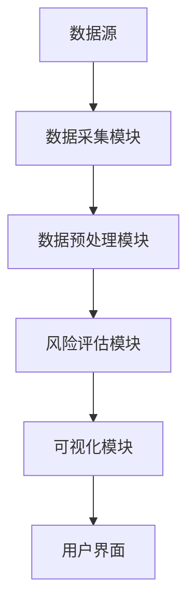

                 


# 特价股票投资中的Beta世代消费行为分析与风险管理

## 关键词：特价股票投资、Beta世代、消费行为分析、风险管理、数据挖掘、机器学习、数学模型

## 摘要：  
本文从Beta世代的消费行为入手，分析其在特价股票投资中的影响，并结合风险管理的核心算法，探讨如何通过数据挖掘和机器学习技术，构建有效的风险管理模型。文章详细介绍了Beta世代消费行为的特征、消费行为与股票投资的关联性，以及如何利用数学模型和算法对风险进行预测和管理。通过实际案例分析，本文展示了如何将理论应用于实践，为投资者提供科学的决策依据。

---

# 正文

## 第1章: 特价股票投资与Beta世代消费行为的背景介绍

### 1.1 特价股票投资的定义与特点  
特价股票投资是指以低于市场价或内在价值的价格购买股票的投资策略。其核心特点包括：  
- **低估值**：通常选择市盈率、市净率等估值指标低于行业平均水平的股票。  
- **高波动性**：特价股票的价格波动较大，容易受到市场情绪和突发事件的影响。  
- **长期价值**：投资目标是等待股票价格回归合理估值区间，实现收益。  

### 1.2 Beta世代消费行为的定义与特征  
Beta世代指的是出生于1981年至1996年之间的人群，他们具有以下消费行为特征：  
- **数字化消费**：Beta世代更倾向于在线购物和数字支付，对互联网和社交媒体依赖性强。  
- **个性化需求**：他们追求个性化的产品和服务，注重品牌与个人价值观的契合。  
- **价格敏感性**：Beta世代对价格较为敏感，倾向于寻找性价比高的产品。  

### 1.3 特价股票投资中的风险管理重要性  
风险管理是特价股票投资成功的关键，其重要性体现在：  
- **降低损失**：通过风险管理，投资者可以避免因市场波动或公司基本面恶化导致的重大损失。  
- **提高收益稳定性**：通过合理分散投资风险，投资者可以实现收益的长期稳定增长。  
- **适应Beta世代需求**：Beta世代的消费行为特点要求投资者在风险管理中更加注重灵活性和快速响应能力。  

---

## 第2章: Beta世代消费行为与股票投资的核心概念分析

### 2.1 Beta世代消费行为的核心要素  
- **消费偏好**：Beta世代倾向于选择性价比高、符合个性化需求的产品。  
- **消费决策影响因素**：价格、品牌、产品创新性、用户评价等均会影响其消费决策。  
- **时空特征**：Beta世代的消费行为具有明显的周期性特征，例如节假日消费高峰。  

### 2.2 特价股票投资中的Beta世代消费行为分析框架  
- **数据采集**：通过社交媒体、电商平台等渠道获取Beta世代的消费数据。  
- **数据分析**：利用统计分析和机器学习技术，分析Beta世代的消费行为与股票市场的关联性。  
- **模型构建**：建立Beta世代消费行为与股票价格波动的预测模型。  

### 2.3 Beta世代消费行为与股票投资的互动关系  
- **消费行为对股票市场的反馈机制**：Beta世代的消费行为会影响相关行业的股票价格。  
- **股票市场波动对消费行为的影响**：股票市场的波动会间接影响Beta世代的消费信心。  
- **动态变化特征**：Beta世代的消费行为与股票市场的互动关系会随着市场环境的变化而调整。  

---

## 第3章: 特价股票投资中的风险管理算法原理

### 3.1 数据挖掘与统计分析方法  
- **数据预处理**：对Beta世代的消费数据进行清洗、去重和特征提取。  
- **统计分析方法**：使用回归分析、聚类分析等方法，识别消费行为与股票价格波动的关联性。  
- **数据挖掘技术**：应用关联规则挖掘和分类算法，发现潜在的市场规律。  

### 3.2 机器学习模型在风险管理中的应用  
- **线性回归模型**：用于预测股票价格的变化趋势。  
- **随机森林模型**：用于分类和回归分析，识别影响股票价格的关键因素。  
- **支持向量机模型**：用于处理非线性关系，提高风险预测的准确性。  

### 3.3 风险评估与预测的数学模型  
- **CAPM模型**：用于计算股票的预期收益与风险的关系。  
$$ R_i = R_f + β_i (R_m - R_f) $$  
- **VaR模型**：用于衡量投资组合的风险值。  
$$ \text{VaR} = \mu + z \cdot \sigma $$  

---

## 第4章: 系统分析与架构设计方案

### 4.1 系统功能设计  
- **数据采集模块**：从Beta世代的消费数据中提取关键特征。  
- **风险评估模块**：基于机器学习模型进行风险预测。  
- **可视化模块**：将分析结果以图表形式展示，便于投资者理解和决策。  

### 4.2 系统架构设计  


### 4.3 系统接口设计  
- **数据接口**：与Beta世代消费数据源对接，获取实时数据。  
- **API接口**：提供风险评估结果的查询接口，方便其他系统调用。  

---

## 第5章: 项目实战

### 5.1 环境安装与数据采集  
- **环境安装**：安装Python、Pandas、Scikit-learn等工具。  
- **数据采集**：通过爬虫技术获取Beta世代的消费数据。  

### 5.2 系统核心实现  
```python
import pandas as pd
from sklearn.ensemble import RandomForestClassifier
from sklearn.metrics import accuracy_score

# 数据预处理
data = pd.read_csv('beta_consumption.csv')
X = data.drop('target', axis=1)
y = data['target']

# 模型训练
model = RandomForestClassifier()
model.fit(X, y)

# 模型评估
y_pred = model.predict(X)
print("准确率:", accuracy_score(y, y_pred))
```

### 5.3 案例分析与结果解读  
- **案例分析**：以Beta世代的消费数据为例，分析其对股票价格的影响。  
- **结果解读**：通过模型预测，识别出Beta世代消费行为对股票市场的潜在影响。  

### 5.4 可视化报告  
- **可视化图表**：展示Beta世代消费行为与股票价格波动的关联性。  
- **风险预警**：通过图表形式展示风险预测结果，帮助投资者做出决策。  

---

## 第6章: 最佳实践与注意事项

### 6.1 最佳实践  
- **数据更新频率**：定期更新Beta世代的消费数据，确保模型的准确性。  
- **模型优化**：根据市场变化，持续优化机器学习模型，提高预测精度。  

### 6.2 注意事项  
- **数据隐私**：在处理Beta世代消费数据时，需注意数据隐私保护。  
- **市场波动**：Beta世代的消费行为受市场波动影响较大，需及时调整投资策略。  

---

## 作者：AI天才研究院/AI Genius Institute & 禅与计算机程序设计艺术 /Zen And The Art of Computer Programming

