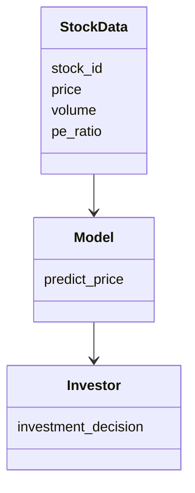
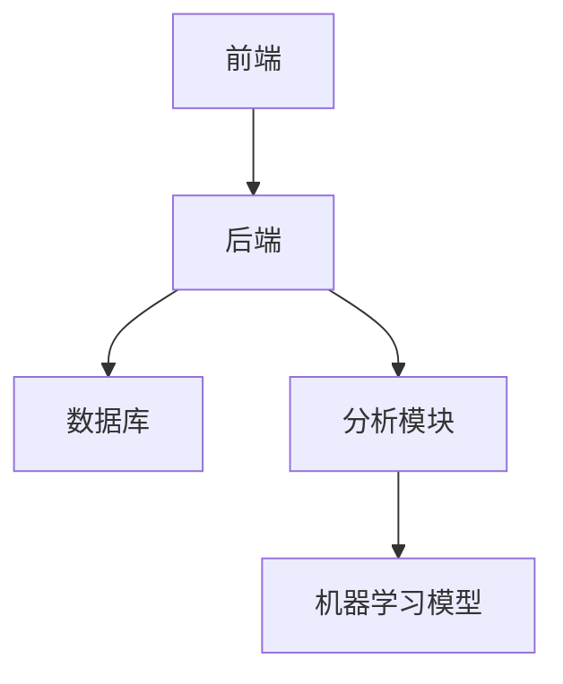

                 


# 特价股票投资中的产业互联网分析方法

> 关键词：特价股票，产业互联网，数据分析，投资方法，互联网技术

> 摘要：本文探讨了如何利用产业互联网技术进行特价股票投资分析。通过分析产业互联网的核心概念、算法原理、系统架构设计和项目实战，本文为投资者提供了一套基于互联网技术的股票分析方法，帮助投资者在特价股票市场中做出更明智的投资决策。

---

## 第一部分：背景介绍

### 第1章：特价股票投资的定义与特点

#### 1.1 特价股票的定义
特价股票是指价格相对较低的股票，通常具有较高的成长潜力或被市场低估的特性。这种股票适合中长期投资者，尤其是那些能够承受一定市场波动风险的投资者。

#### 1.2 特价股票的特点
- **低估值**：通常市盈率、市净率等估值指标低于行业平均水平。
- **高潜力**：可能因为市场暂时低估，具有较高的上涨潜力。
- **波动性**：价格波动较大，投资者需要具备较高的市场敏感性。

#### 1.3 特价股票与普通股票的区别
| 特性 | 特价股票 | 普通股票 |
|------|----------|----------|
| 价格 | 较低     | 无特定要求 |
| 估值 | 低       | 取决于市场 |
| 风险 | 中高     | 适中     |

---

### 第2章：产业互联网的定义与特点

#### 2.1 产业互联网的定义
产业互联网是指将互联网技术应用于传统产业，通过数据化、网络化、智能化的方式，优化传统产业的生产、管理、销售等环节，提升产业效率和竞争力。

#### 2.2 产业互联网的核心特征
- **数据驱动**：依赖大数据分析，提供精准的产业洞察。
- **智能化**：利用人工智能技术，实现自动化分析和决策。
- **网络化**：通过互联网连接产业链上下游，实现信息共享和协同合作。

#### 2.3 产业互联网与传统互联网的区别
| 特性 | 产业互联网 | 传统互联网 |
|------|------------|------------|
| 应用场景 | 传统产业 | 信息、娱乐等 |
| 核心技术 | 大数据、AI | 网络技术、信息服务 |

---

### 第3章：特价股票投资与产业互联网的结合

#### 3.1 特价股票投资的背景
随着市场波动加剧，投资者 increasingly look for low-priced stocks with high potential. 通过产业互联网技术，投资者可以更精准地分析市场趋势和公司基本面。

#### 3.2 产业互联网对特价股票投资的影响
- **数据获取**：互联网提供了丰富的数据源，如公司财报、行业报告、市场新闻等。
- **分析工具**：产业互联网技术提供了强大的数据分析工具，帮助投资者快速筛选和评估股票。
- **实时监控**：通过互联网技术，投资者可以实时监控市场动态，及时调整投资策略。

---

## 第二部分：核心概念与方法

### 第4章：产业互联网分析方法的原理

#### 4.1 产业互联网分析方法的核心要素
- **数据来源**：包括公开市场数据、互联网新闻、社交媒体等。
- **分析工具**：如大数据平台、人工智能算法等。
- **分析模型**：如回归分析、聚类分析等。

#### 4.2 产业互联网分析方法的流程
1. 数据采集：从互联网获取相关数据。
2. 数据清洗：去除无效数据，处理缺失值。
3. 数据分析：使用算法对数据进行建模和分析。
4. 结果解读：根据分析结果制定投资策略。

---

### 第5章：特价股票投资的产业互联网分析框架

#### 5.1 特价股票投资的产业分析框架
- **产业链分析**：分析产业链上下游的关系，找到投资机会。
- **产业政策分析**：研究政府政策对行业的影响。
- **产业竞争分析**：评估行业竞争格局，选择具有竞争优势的企业。

#### 5.2 特价股票投资的互联网数据来源
- **公开市场数据**：如股票价格、成交量等。
- **互联网新闻**：如行业动态、公司公告。
- **社交媒体**：如投资者情绪分析。

---

## 第三部分：算法原理

### 第6章：数据预处理与特征提取

#### 6.1 数据预处理
- **数据清洗**：处理缺失值、重复值。
- **数据转换**：如标准化、归一化。

#### 6.2 特征提取
- **特征选择**：如使用相关系数筛选重要特征。
- **特征工程**：如创建新特征（如动量指标）。

---

### 第7章：基于机器学习的股票价格预测模型

#### 7.1 算法选择
- **线性回归**：用于预测股票价格的趋势。
- **随机森林**：用于分类和回归任务。

#### 7.2 模型实现
```python
# 示例代码：使用线性回归模型预测股票价格
import pandas as pd
from sklearn.linear_model import LinearRegression

# 数据加载
data = pd.read_csv('stock_data.csv')

# 特征与目标分离
X = data[['price', 'volume', 'pe_ratio']]
y = data['target_price']

# 模型训练
model = LinearRegression()
model.fit(X, y)

# 预测
predicted_price = model.predict(X)
```

---

## 第四部分：系统架构设计

### 第8章：系统功能设计

#### 8.1 领域模型


#### 8.2 系统架构


---

## 第五部分：项目实战

### 第9章：环境安装与核心实现

#### 9.1 环境安装
- **Python**：安装Anaconda或Miniconda。
- **依赖库**：安装Pandas、Scikit-learn、Mermaid等。

#### 9.2 核心实现
```python
# 示例代码：数据获取与处理
import pandas as pd
import requests

# 获取股票数据
url = "https://api.example.com/stock_data"
response = requests.get(url)
data = response.json()

# 转换为DataFrame
df = pd.DataFrame(data)
```

---

## 第六部分：数学模型

### 第10章：评估模型建立

#### 10.1 评估指标
- **均方误差（MSE）**：衡量预测值与真实值的差异。
- **R平方值（R²）**：衡量模型的拟合优度。

#### 10.2 数学公式
$$ \text{MSE} = \frac{1}{n}\sum_{i=1}^{n}(y_i - \hat{y_i})^2 $$
$$ \text{R²} = 1 - \frac{\text{MSE}}{\text{Variance of y}} $$

---

## 第七部分：最佳实践

### 第11章：总结与注意事项

#### 11.1 小结
- 产业互联网技术为特价股票投资提供了强大的数据分析工具。
- 投资者需要结合市场动态和公司基本面进行综合分析。

#### 11.2 注意事项
- **数据质量**：确保数据来源可靠。
- **模型优化**：根据市场变化不断优化模型。
- **风险管理**：合理控制投资风险。

#### 11.3 扩展阅读
- 《股票投资实战策略》
- 《大数据与人工智能结合的金融分析》

---

## 作者：AI天才研究院/AI Genius Institute & 禅与计算机程序设计艺术 /Zen And The Art of Computer Programming

---

以上是《特价股票投资中的产业互联网分析方法》的完整目录和内容框架。通过系统的分析和详细的讲解，希望读者能够深入了解如何利用产业互联网技术进行特价股票投资分析。

