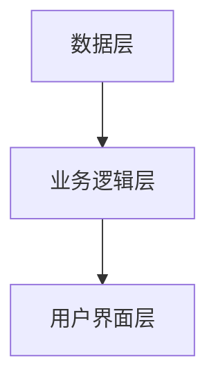

                 


# 特价股票投资中的人口结构数字代际价值观转移趋势考量

---

## 关键词  
特价股票投资、人口结构、数字代际、价值观转移趋势、投资策略、市场分析

---

## 摘要  
本文深入探讨了特价股票投资中人口结构和数字代际价值观转移趋势的影响。通过分析不同人口结构对经济和股票市场的影响，结合数字代际价值观的变化，构建数学模型，提出投资策略。文章结合系统架构设计和实战案例，为投资者提供科学的决策依据。

---

## 第1章：特价股票投资的背景与基本概念

### 1.1 特价股票的定义与特点  
特价股票是指价格低于市场平均水平的股票，通常具有较高的投资潜力。其特点包括低估值、高成长性和较高的安全边际。  

### 1.2 人口结构变化的经济影响  
人口结构的变化直接影响经济的供给和需求。例如，老龄化社会可能导致劳动力减少，而年轻人口增加则可能推动消费增长。  

### 1.3 数字代际价值观的形成与演变  
数字代际指不同年龄段人群因成长环境差异而形成的数字行为和价值观差异。数字化时代下，年轻一代更倾向于数字化投资方式。

---

## 第2章：人口结构变化与股票投资的关系

### 2.1 人口结构对股票市场的影响机制  
人口结构影响股票需求和供给，进而影响市场波动。例如，年轻人口增加可能推动科技股需求，而老龄化可能导致防御性股票需求上升。

### 2.2 数字代际价值观对投资行为的影响  
不同代际在投资偏好上有显著差异。年轻一代更注重创新和风险，而年长一代更倾向于稳健投资。

---

## 第3章：人口结构与数字代际价值观的数学模型构建

### 3.1 人口结构变化的数学模型  
使用线性回归模型分析人口结构对股票价格的影响：  
$$ \text{Price} = \beta_0 + \beta_1 \times \text{Age\_Distribution} + \epsilon $$  

### 3.2 数字代际价值观的量化模型  
构建指标体系，量化代际价值观对投资行为的影响。例如，使用层次分析法（AHP）确定各指标权重。

---

## 第4章：特价股票投资中的系统架构设计

### 4.1 系统功能设计  
- **特价股票筛选模块**：基于估值指标筛选低价股票。  
- **人口结构分析模块**：分析不同年龄段人口对市场的影响。  

### 4.2 系统架构设计  
系统架构采用分层设计，包括数据层、业务逻辑层和用户界面层。  



---

## 第5章：项目实战与案例分析

### 5.1 实战环境准备  
- 数据获取与清洗：收集人口统计数据和股票价格数据。  
- 工具安装：安装数据分析工具如Python和Pandas。  

### 5.2 核心算法实现  
- 使用Python代码实现人口结构对股票价格的影响分析：  

```python
import pandas as pd

# 数据加载
data = pd.read_csv('stock_data.csv')

# 线性回归模型
from sklearn.linear_model import LinearRegression
model = LinearRegression()
model.fit(data[['Age_Distribution']], data['Price'])
```

### 5.3 案例分析与结果解读  
以某地区为例，分析人口结构变化对特价股票投资的影响，调整投资策略。

---

## 第6章：结论与展望

### 6.1 研究总结  
本文通过分析人口结构和数字代际价值观，构建了数学模型，提出了投资策略。研究表明，人口结构变化对股票市场有显著影响。

### 6.2 未来研究方向  
进一步研究数字代际价值观的动态变化，探索长期人口结构对股票市场的潜在影响。

### 6.3 投资建议  
投资者应关注人口结构变化，结合数字代际价值观，制定灵活的投资策略，注重风险控制。

---

## 作者  
作者：AI天才研究院 & 禅与计算机程序设计艺术  

---

这篇文章结合了理论分析、数学建模和实战案例，为投资者提供了科学的决策支持。希望对您有所帮助！

