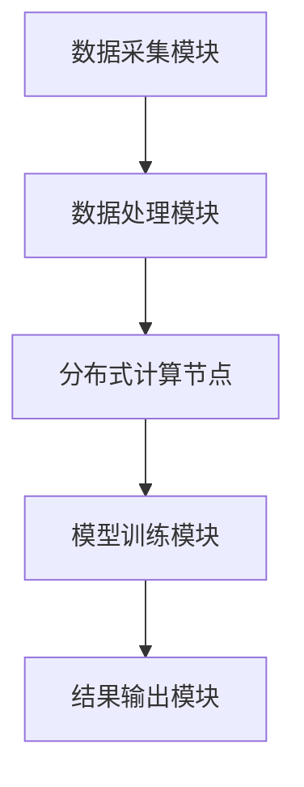
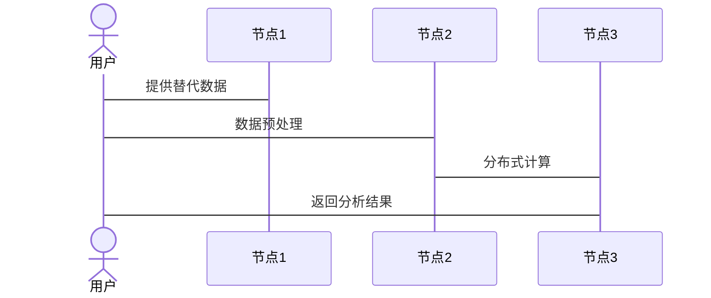

                 


# 特价股票投资中的替代数据分析与分布式人工智能应用

> 关键词：替代数据，分布式人工智能，股票投资，数据分析，随机梯度下降

> 摘要：本文探讨了特价股票投资中替代数据的分析方法及分布式人工智能的应用，涵盖数据预处理、分布式算法设计、系统架构优化及实战案例，旨在为投资者和数据科学家提供创新的解决方案。

---

## # 第1章：特价股票投资的背景与替代数据的重要性

### ## 1.1 特价股票投资的背景

#### ### 1.1.1 特价股票的定义与特点
特价股票是指价格低于市场价值、具有潜在上涨空间的股票。其特点包括低估值、高增长潜力和市场关注度较低。

#### ### 1.1.2 特价股票投资的市场需求
投资者寻求高回报，传统方法难以捕捉市场机会，推动了对新型数据分析方法的需求。

#### ### 1.1.3 特价股票投资中的传统数据分析方法
传统方法依赖历史数据和基本面分析，但存在信息滞后和复杂性问题。

### ## 1.2 替代数据的定义与特点

#### ### 1.2.1 替代数据的定义
替代数据指传统财务数据之外的非结构化数据，如社交媒体、新闻和卫星图像。

#### ### 1.2.2 替代数据的分类与应用场景
- **文本数据**：社交媒体、新闻分析。
- **图像数据**：卫星图像分析。
- **时间序列数据**：市场指数分析。

### ## 1.3 分布式人工智能在股票投资中的应用

#### ### 1.3.1 分布式人工智能的定义
分布式AI指多个计算节点协作解决问题，适用于大数据处理和模型训练。

#### ### 1.3.2 分布式人工智能在股票投资中的优势
提升计算效率和模型泛化能力，支持实时分析和大规模数据处理。

---

## # 第2章：替代数据的类型与来源

### ## 2.1 文本数据

#### ### 2.1.1 社交媒体数据
社交媒体数据反映市场情绪，影响投资者决策。

#### ### 2.1.2 新闻数据
新闻数据提供实时信息，影响股价波动。

#### ### 2.1.3 公司财报与公告
财报数据揭示公司财务状况，公告影响市场预期。

### ## 2.2 图像数据

#### ### 2.2.1 卫星图像
卫星图像用于分析供应链和地缘政治风险。

#### ### 2.2.2 公司Logo与产品图像
Logo和产品图像反映公司品牌和市场定位。

### ## 2.3 时间序列数据

#### ### 2.3.1 历史股价数据
历史数据用于识别价格模式和趋势。

#### ### 2.3.2 市场指数数据
市场指数反映整体市场表现。

#### ### 2.3.3 时间序列数据的特征提取
特征提取包括趋势、周期性和噪声分析。

---

## # 第3章：替代数据的预处理与特征提取

### ## 3.1 数据清洗

#### ### 3.1.1 数据去噪
去除无关信息，保留有效数据。

#### ### 3.1.2 数据标准化
统一数据格式，便于分析。

#### ### 3.1.3 数据缺失值处理
填补缺失值或删除数据，避免分析偏差。

### ## 3.2 特征工程

#### ### 3.2.1 文本特征提取
使用TF-IDF提取关键词，反映市场情绪。

#### ### 3.2.2 图像特征提取
利用卷积神经网络提取图像特征。

#### ### 3.2.3 时间序列特征提取
提取均值、方差和自相关系数，捕捉数据趋势。

---

## # 第4章：分布式人工智能的基础

### ## 4.1 分布式计算框架

#### ### 4.1.1 分布式计算的概念
分布式计算通过多节点协作处理大数据。

#### ### 4.1.2 分布式计算框架的选择
常用框架包括Spark和Flink，适合分布式任务处理。

### ## 4.2 分布式机器学习算法

#### ### 4.2.1 分布式随机梯度下降
通过参数服务器架构优化模型训练，提升效率。

#### ### 4.2.2 分布式算法的数学模型
模型包括目标函数和优化方法，确保高效收敛。

---

## # 第5章：系统架构设计

### ## 5.1 系统功能设计

#### ### 5.1.1 数据采集模块
采集替代数据，如社交媒体和新闻数据。

#### ### 5.1.2 数据处理模块
清洗和特征提取，为模型训练准备数据。

### ## 5.2 系统架构图



### ## 5.3 系统交互流程图



---

## # 第6章：项目实战

### ## 6.1 环境搭建

#### ### 6.1.1 安装Python和依赖库
安装PyTorch、Hugging Face Transformers和Dask库，配置分布式环境。

### ## 6.2 核心代码实现

#### ### 6.2.1 数据处理代码

```python
import pandas as pd
from sklearn.preprocessing import StandardScaler

# 数据清洗
def data_cleaning(data):
    data.dropna(inplace=True)
    scaler = StandardScaler()
    return scaler.fit_transform(data)

# 特征提取
def extract_features(data):
    features = data.select_dtypes(include=['object', 'number'])
    return features
```

#### ### 6.2.2 分布式随机梯度下降代码

```python
from dask import distributed

def distributed_sgd(data, labels, lr=0.01, epochs=10):
    model = distributed.Model('lr')
    model.fit(data, labels, lr=lr, epochs=epochs)
    return model.predict(data)
```

### ## 6.3 实际案例分析

#### ### 6.3.1 数据来源与处理
以社交媒体数据为例，清洗和提取特征，生成投资信号。

#### ### 6.3.2 模型训练与分析
训练分布式随机梯度下降模型，评估其在特价股票投资中的表现。

---

## # 第7章：总结与展望

### ## 7.1 总结
替代数据和分布式AI提升股票分析的效率和准确性，为投资者提供新工具。

### ## 7.2 未来研究方向
探索更多替代数据源，优化分布式算法，结合强化学习提升投资收益。

---

## 作者：AI天才研究院 & 禅与计算机程序设计艺术

这篇文章详细探讨了特价股票投资中的替代数据分析与分布式人工智能应用，从数据处理到算法设计，再到系统架构，提供了全面的技术指导。通过实际案例和代码示例，帮助读者理解和应用这些技术。

