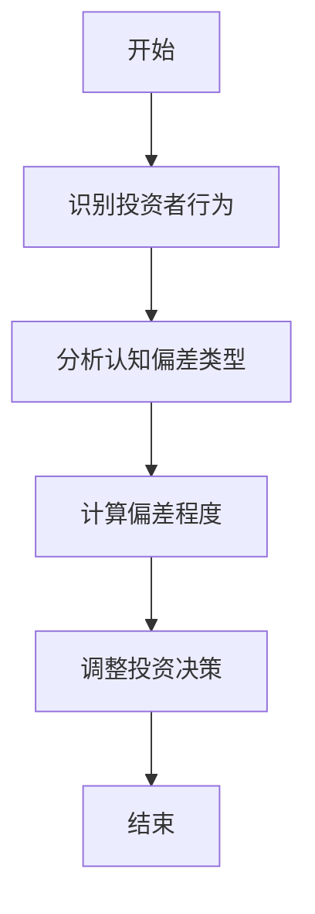
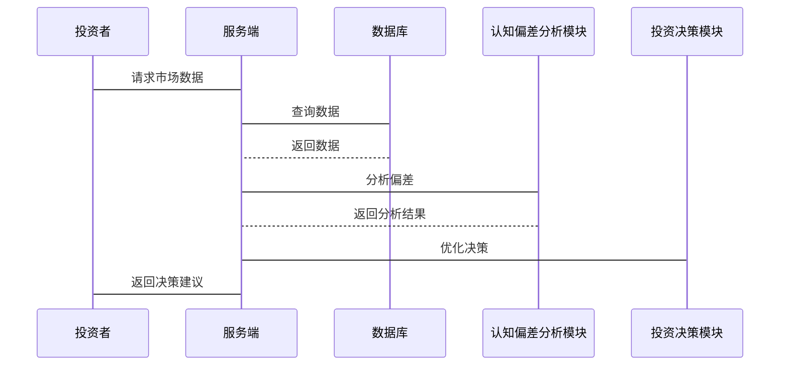

                 


# 特价股票投资中的认知科学应用技巧

> 关键词：特价股票投资，认知科学，认知偏差，行为金融学，投资决策

> 摘要：本文将探讨特价股票投资中认知科学的应用技巧，通过分析投资者的认知偏差和行为模式，结合数学模型和算法，提出优化投资决策的方法。文章将从背景介绍、认知偏差分析、数学模型构建、系统架构设计、项目实战以及最佳实践等方面展开，帮助投资者更好地理解和应用认知科学原理，提升投资决策的科学性和有效性。

---

## 第一部分：特价股票投资与认知科学基础

### 第1章：特价股票投资与认知科学概述

#### 1.1 特价股票投资的基本概念

##### 1.1.1 什么是特价股票
特价股票是指市场价格显著低于其内在价值的股票。这种折扣通常是由于市场波动、投资者情绪或市场结构等因素导致的。特价股票的投资机会往往隐藏在市场低估的角落，需要投资者具备敏锐的洞察力和分析能力。

##### 1.1.2 特价股票投资的核心原则
- **价值发现**：识别市场价格与内在价值之间的差异。
- **风险控制**：在低价买入时，需评估潜在风险，避免陷入价值陷阱。
- **长期视角**：特价股票投资通常需要耐心等待市场重新发现其价值。

##### 1.1.3 特价股票与传统投资的区别
| 特点 | 特价股票投资 | 传统投资 |
|------|--------------|-----------|
| 投资策略 | 基于市场低估进行抄底 | 基于基本面或技术分析 |
| 风险承受 | 高风险，需谨慎筛选 | 风险可控，注重分散投资 |
| 时间周期 | 中长期 | 短期或中长期 |

#### 1.2 认知科学与投资的关系

##### 1.2.1 认知科学的基本概念
认知科学是研究人类认知过程的跨学科领域，包括心理学、神经科学、语言学和计算机科学等。它关注人类如何感知、记忆、思考和决策。

##### 1.2.2 认知科学在金融领域的应用
认知科学在金融领域的应用主要体现在以下方面：
- **行为金融学**：研究投资者心理和行为对市场的影响。
- **决策优化**：通过认知模型优化投资决策。
- **风险管理**：识别和规避认知偏差带来的风险。

##### 1.2.3 特价股票投资中的认知科学价值
认知科学可以帮助投资者识别和克服认知偏差，优化决策过程，提高投资效率。例如，通过分析投资者的行为模式，可以避免情绪化决策，抓住特价股票的投资机会。

#### 1.3 特价股票投资的认知科学应用前景

##### 1.3.1 特价股票投资中的认知偏差
认知偏差是指人们在决策过程中产生的系统性错误。常见的认知偏差包括过度自信、确认偏差和从众心理。

##### 1.3.2 认知科学对投资决策的影响
认知科学通过揭示人类决策的规律，帮助投资者更好地理解市场行为，从而做出更理性的投资决策。

##### 1.3.3 行为金融学的核心理论
行为金融学强调投资者心理和行为对市场的影响，认为市场并非完全有效，投资者的非理性行为会导致市场波动。

---

## 第二部分：投资者认知偏差与行为分析

### 第2章：投资者认知偏差的分析

#### 2.1 认知偏差的定义与分类

##### 2.1.1 认知偏差的定义
认知偏差是指人们在信息处理和决策过程中产生的系统性错误，通常由心理因素或认知限制引起。

##### 2.1.2 常见的认知偏差类型
- **过度自信偏差**：投资者过于相信自己的判断能力，导致决策失误。
- **确认偏差**：倾向于寻找支持自己观点的信息，忽略相反证据。
- **从众心理**：盲目跟随市场趋势，缺乏独立判断。

#### 2.2 投资者行为分析

##### 2.2.1 投资者行为的分类
投资者行为可以分为理性和非理性两类。非理性行为主要由认知偏差引起。

##### 2.2.2 投资者行为的驱动因素
- **情绪因素**：恐惧和贪婪是主要驱动因素。
- **认知因素**：认知偏差影响决策过程。
- **外部因素**：市场环境和信息传播影响投资者行为。

#### 2.3 特价股票投资中的认知偏差案例分析

##### 2.3.1 过度自信偏差
投资者可能过于相信自己的分析能力，忽视市场变化，导致高价买入或低价卖出。

##### 2.3.2 沉没成本偏差
投资者可能因为已经投入了资金而继续持有亏损股票，导致更大的损失。

##### 2.3.3 羊群效应
投资者跟随市场趋势，缺乏独立判断，可能导致市场泡沫或崩盘。

#### 2.4 本章小结
认知偏差是影响投资者决策的重要因素，通过识别和克服认知偏差，投资者可以做出更理性的投资决策。

---

## 第三部分：认知科学中的数学模型与算法

### 第3章：认知科学中的数学模型

#### 3.1 基础概率模型

##### 3.1.1 概率论基础
概率论是认知科学的基础，用于分析事件发生的可能性。例如，股票价格涨跌的概率可以用概率分布模型表示。

##### 3.1.2 投资决策中的概率分析
通过概率模型，投资者可以评估不同决策的期望收益和风险，做出更科学的投资决策。

##### 3.1.3 马尔可夫决策过程
马尔可夫决策过程是一种用于序列决策的数学模型，适用于动态市场环境下的投资决策。

#### 3.2 认知偏差的数学建模

##### 3.2.1 偏差函数的定义
偏差函数描述了认知偏差对决策的影响。例如，过度自信偏差可以用概率偏移函数表示。

##### 3.2.2 偏差模型的构建
通过数学模型，可以量化认知偏差的影响，例如：
$$ \text{偏差程度} = \frac{\text{实际决策} - \text{理性决策}}{\text{理性决策}} $$

##### 3.2.3 偏差对决策的影响公式
偏差对投资决策的影响可以通过以下公式表示：
$$ \text{调整后的决策} = \text{理性决策} + \text{偏差程度} $$

#### 3.3 认知科学中的算法实现

##### 3.3.1 基于认知偏差的算法设计
例如，通过机器学习算法识别投资者的偏差行为，优化投资策略。

##### 3.3.2 算法流程图
以下是认知偏差识别算法的mermaid流程图：


---

## 第四部分：系统分析与架构设计

### 第4章：系统架构设计

#### 4.1 问题场景介绍
我们设计一个基于认知科学的特价股票投资系统，帮助投资者识别认知偏差，优化投资决策。

#### 4.2 系统功能设计

##### 4.2.1 领域模型（mermaid类图）


#### 4.3 系统架构设计（mermaid架构图）


#### 4.4 系统交互流程（mermaid序列图）


---

## 第五部分：项目实战

### 第5章：项目实战与案例分析

#### 5.1 环境安装
需要安装Python、Pandas、NumPy和机器学习库（如Scikit-learn）。

#### 5.2 核心代码实现

##### 5.2.1 数据处理代码
```python
import pandas as pd
import numpy as np

# 加载市场数据
data = pd.read_csv('market_data.csv')
# 计算股票价值与市场价格的差异
value = data['内在价值']
price = data['市场价格']
difference = np.where(price < value, value - price, 0)
data['差异'] = difference
```

##### 5.2.2 认知偏差识别代码
```python
from sklearn.tree import DecisionTreeClassifier

# 训练认知偏差识别模型
X = data[['价格', '价值', '差异']]
y = data['偏差类型']
model = DecisionTreeClassifier()
model.fit(X, y)
```

##### 5.2.3 投资决策优化代码
```python
# 基于偏差分析优化决策
optimized_decision = model.predict(X)
```

#### 5.3 案例分析
以某只股票为例，分析其市场价格与内在价值的差异，识别认知偏差，并制定优化后的投资策略。

#### 5.4 项目小结
通过实战项目，验证了认知科学在特价股票投资中的应用价值，提高了投资决策的科学性和有效性。

---

## 第六部分：最佳实践与小结

### 第6章：最佳实践与小结

#### 6.1 投资中的认知陷阱
- 避免过度自信偏差，保持谦逊和理性的态度。
- 识别羊群效应，避免盲目跟风。

#### 6.2 风险管理策略
- 设置止损点，控制投资风险。
- 保持投资组合的分散化，降低市场波动的影响。

#### 6.3 未来研究方向
- 结合大数据和人工智能，进一步优化认知偏差识别算法。
- 研究投资者情绪对市场波动的长期影响。

#### 6.4 本章小结
认知科学为特价股票投资提供了新的视角和工具，通过识别和克服认知偏差，投资者可以做出更理性的决策，提升投资效果。

---

## 作者：AI天才研究院 & 禅与计算机程序设计艺术

本文由AI天才研究院与禅与计算机程序设计艺术联合撰写，旨在为投资者提供基于认知科学的特价股票投资策略和技巧。

