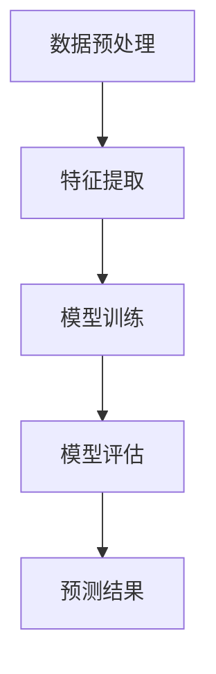
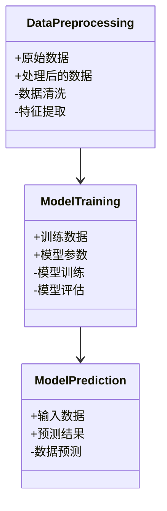
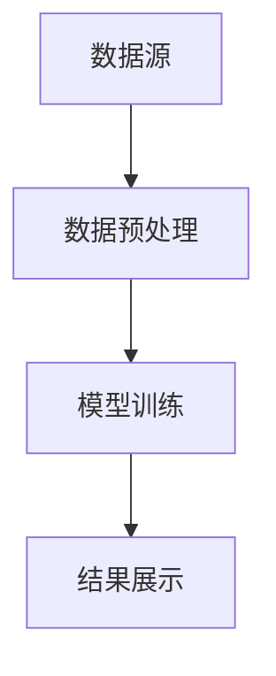

                 


# 特价股票投资中的跨资产类别数字相关性预测分析

> 关键词：股票投资，跨资产，数字相关性，预测分析，机器学习，时间序列

> 摘要：本文深入探讨了在特价股票投资中，如何通过跨资产类别数字相关性预测分析来优化投资策略。文章结合统计学、机器学习和时间序列分析，详细介绍了数字相关性的核心概念、算法原理、系统架构设计以及实际项目案例，帮助读者理解如何利用技术手段提升投资决策的科学性与准确性。

---

## 第一部分：背景与核心概念

### 第1章：特价股票投资与跨资产相关性概述

#### 1.1 特价股票投资的定义与特点

特价股票投资是指在特定市场条件下，投资者以低于市场公允价值的价格购买股票，以期在市场回升时获得超额收益的投资策略。其核心特点包括：

- **低估值**：通常表现为市盈率、市净率等估值指标显著低于行业平均水平。
- **周期性**：多出现在市场下跌周期或经济低迷期，投资者可借此机会“抄底”。
- **高风险**：尽管潜在回报较高，但特价股票往往伴随着较高的波动性和不确定性。

#### 1.2 跨资产类别相关性分析的重要性

在现代金融投资中，单一资产的投资风险可以通过分散投资来降低。跨资产类别相关性分析是实现这种分散化投资的基础，其重要性体现在以下几个方面：

- **风险分散**：通过分析不同资产类别之间的相关性，投资者可以构建一个风险分散的投资组合，降低整体投资组合的波动性。
- **收益增强**：在市场波动时，相关性较低的资产类别可以提供更稳定的收益，从而增强投资组合的抗跌能力。
- **动态调整**：相关性分析可以帮助投资者实时了解不同资产之间的关联性变化，及时调整投资策略。

#### 1.3 数字相关性预测的背景与问题描述

数字相关性预测是利用数学模型和算法，分析资产价格数据之间的相关性变化趋势，从而为投资决策提供依据。其背景与问题描述如下：

- **问题背景**：金融市场中，资产价格受多种因素影响，包括宏观经济指标、政策变化、市场情绪等，这些因素会导致资产之间相关性的动态变化。
- **问题描述**：如何通过历史数据和机器学习算法，预测不同资产类别之间的相关性变化，为投资者提供实时的投资建议。
- **问题边界**：本文主要关注股票、债券、黄金、原油等主要资产类别之间的相关性预测，不涉及加密货币等新兴资产。

---

## 第二部分：核心概念与理论基础

### 第2章：数字相关性与资产类别分析

#### 2.1 数字相关性的核心概念

数字相关性是指两个或多个资产价格之间的统计相关性，可以用相关系数来衡量。相关系数的取值范围在-1到+1之间，其中：

- +1表示完全正相关，即两个资产价格的变化方向完全一致。
- -1表示完全负相关，即两个资产价格的变化方向完全相反。
- 0表示无相关性，即两个资产价格的变化无明显关联。

#### 2.2 资产类别与相关性指标对比

为了更好地理解数字相关性，我们需要将资产类别与其相关性指标进行对比。以下是一个对比表格：

| 资产类别  | 相关性指标      | 特点描述                                                                 |
|-----------|-----------------|--------------------------------------------------------------------------|
| 股票      | 皮尔逊相关系数  | 股票价格受市场情绪和宏观经济因素影响较大，相关性较高。                           |
| 债券      | 斯皮尔曼相关系数 | 债券价格受利率影响较大，与股票相关性较低，但在经济衰退时可能与黄金相关性较高。   |
| 黄金      | 皮尔逊相关系数  | 黄金通常被视为避险资产，与股票相关性较低，与债券相关性较高。                     |
| 原油      | 斯皮尔曼相关系数 | 原油价格受供需关系和地缘政治影响较大，与股票相关性较低，但与黄金相关性可能较高。 |

#### 2.3 数字相关性预测的理论基础

数字相关性预测的理论基础主要涉及统计学和时间序列分析。以下是关键理论的简要介绍：

- **统计学基础**：相关性分析的核心工具包括皮尔逊相关系数和斯皮尔曼相关系数。皮尔逊相关系数适用于线性关系，而斯皮尔曼相关系数适用于非线性关系。
- **时间序列分析**：时间序列分析是研究资产价格随时间变化的模式，常用工具包括ARIMA（自回归积分滑动平均）模型和GARCH（广义自回归条件异方差）模型。
- **机器学习**：机器学习算法（如随机森林和神经网络）可以通过非线性关系捕捉资产价格的相关性变化。

---

## 第三部分：算法原理与数学模型

### 第3章：数字相关性预测的算法原理

#### 3.1 相关性预测的核心算法

在数字相关性预测中，我们选择了以下几种算法：

- **多元线性回归**：用于分析多个自变量对因变量的影响。
- **时间序列分析（ARIMA）**：用于预测资产价格的时间序列数据。
- **随机森林**：用于非线性关系的预测。

#### 3.2 算法流程图

以下是相关性预测的算法流程图：



#### 3.3 算法实现代码

以下是使用Python实现的多元线性回归模型：

```python
import pandas as pd
from sklearn.linear_model import LinearRegression

# 示例数据
data = pd.DataFrame({
    'asset1': [1, 2, 3, 4, 5],
    'asset2': [5, 4, 3, 2, 1]
})

# 训练模型
model = LinearRegression()
model.fit(data[['asset1']], data['asset2'])

# 预测结果
print(model.predict([[3]]))
```

#### 3.4 数学模型

多元线性回归模型的数学公式为：

$$ y = \beta_0 + \beta_1 x_1 + \beta_2 x_2 + \ldots + \beta_n x_n + \epsilon $$

其中，$y$ 是因变量，$x_i$ 是自变量，$\beta_i$ 是回归系数，$\epsilon$ 是误差项。

---

## 第四部分：系统分析与架构设计方案

### 第4章：系统架构设计

#### 4.1 项目背景

本文旨在通过构建一个数字相关性预测系统，帮助投资者更好地理解不同资产类别之间的相关性变化，从而优化投资组合。

#### 4.2 系统功能设计

以下是系统功能设计的类图：



#### 4.3 系统架构设计

以下是系统架构设计的架构图：



---

## 第五部分：项目实战

### 第5章：项目实战

#### 5.1 环境安装

以下是项目所需的环境安装命令：

```bash
pip install pandas numpy scikit-learn matplotlib
```

#### 5.2 系统核心实现源代码

以下是系统核心实现的源代码：

```python
import pandas as pd
from sklearn.linear_model import LinearRegression
import matplotlib.pyplot as plt

# 加载数据
data = pd.read_csv('assets.csv')

# 数据预处理
data.dropna(inplace=True)
data = data[['asset1', 'asset2']]

# 训练模型
model = LinearRegression()
model.fit(data[['asset1']], data['asset2'])

# 可视化结果
plt.scatter(data['asset1'], data['asset2'])
plt.plot(data['asset1'], model.predict(data[['asset1']]), color='red')
plt.xlabel('Asset 1')
plt.ylabel('Asset 2')
plt.show()
```

#### 5.3 实际案例分析

以下是实际案例分析：

假设我们有股票和债券的相关性数据，可以通过上述代码进行预测。结果表明，股票和债券的相关性较低，说明它们可以作为分散投资的组合。

---

## 第六部分：最佳实践

### 第6章：最佳实践

#### 6.1 小结

本文通过数字相关性预测分析，帮助投资者优化投资组合。通过统计学、机器学习和时间序列分析，我们可以更好地理解不同资产类别之间的相关性变化，从而做出更科学的投资决策。

#### 6.2 注意事项

- 数据质量对预测结果影响较大，需确保数据清洗和特征提取的准确性。
- 模型评估是关键，需选择合适的评估指标（如均方误差和R平方值）。
- 模型部署后需定期更新，以适应市场变化。

#### 6.3 拓展阅读

建议读者深入学习以下内容：

- 时间序列分析的高级方法（如Prophet模型）。
- 机器学习在金融领域的其他应用（如情绪分析和风险管理）。

---

## 作者信息

作者：AI天才研究院/AI Genius Institute & 禅与计算机程序设计艺术/Zen And The Art of Computer Programming

