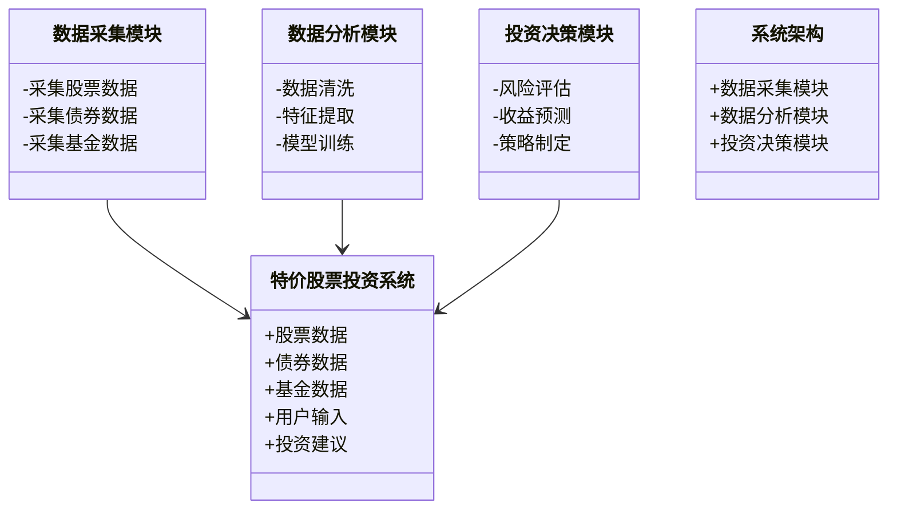
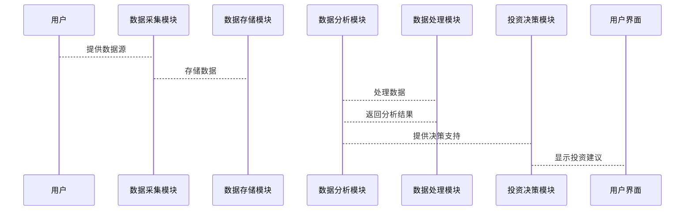

                 


# 特价股票投资中的跨资产类别系统性数字创新机会识别

> 关键词：特价股票投资、跨资产类别、系统性数字创新、机会识别、机器学习、金融数据分析、投资策略

> 摘要：本文探讨了在特价股票投资中，如何利用跨资产类别的系统性数字创新来识别投资机会。通过分析大数据、机器学习和数学模型，结合实际案例，提供了一套从理论到实践的完整解决方案，帮助投资者提升决策效率和准确性。

---

# 第一部分: 特价股票投资中的跨资产类别系统性数字创新机会识别基础

## 第1章: 特价股票投资与跨资产类别概述

### 1.1 特价股票投资的基本概念

#### 1.1.1 什么是特价股票
特价股票是指价格相对较低的股票，通常具有较高的投资潜力。这类股票可能处于市场低估状态，适合长期投资者。

#### 1.1.2 特价股票的分类与特点
- 按市场分类：小盘股、中盘股、大盘股
- 按行业分类：科技、金融、消费等行业
- 特点：价格波动小、风险较低、潜在收益高

#### 1.1.3 特价股票投资的基本原则
- 长期投资：避免短期波动影响
- 分散投资：降低风险
- 价值投资：关注公司基本面

### 1.2 跨资产类别投资的背景与意义

#### 1.2.1 跨资产类别投资的定义
跨资产类别投资是指将资金分配到股票、债券、基金等多种资产类别中，以优化风险和收益。

#### 1.2.2 跨资产类别投资的优势
- 风险分散：不同资产类别的波动性不同，降低整体风险
- 收益增强：通过配置不同资产，提高整体收益

#### 1.2.3 跨资产类别投资的挑战
- 复杂性：需要理解多种资产的特点
- 相关性：资产之间的相关性可能影响分散效果

### 1.3 数字创新在金融投资中的应用

#### 1.3.1 数字技术在金融领域的应用现状
- 大数据分析：利用大数据技术分析市场趋势
- 人工智能：用于预测市场走势和风险评估

#### 1.3.2 数字创新对投资决策的影响
- 提高决策效率：通过算法快速分析数据
- 增强决策准确性：利用机器学习模型预测市场变化

#### 1.3.3 系统性数字创新的定义与特点
- 系统性创新：整合多种技术，形成完整的创新体系
- 数字创新：利用数字技术提升投资效率

---

## 第2章: 系统性数字创新机会识别的核心概念

### 2.1 系统性数字创新的定义与特征

#### 2.1.1 系统性创新的内涵
系统性创新是指通过整合不同领域的技术，形成创新的系统解决方案。

#### 2.1.2 数字技术在创新中的作用
- 数据处理：大数据技术帮助分析海量数据
- 智能决策：人工智能技术辅助投资决策

#### 2.1.3 系统性数字创新的核心要素
- 数据采集：获取多源数据
- 数据分析：利用机器学习模型进行分析
- 决策支持：提供投资建议

### 2.2 跨资产类别机会识别的原理

#### 2.2.1 跨资产类别数据的获取与处理
- 数据源：股票、债券、基金等市场数据
- 数据清洗：去除无效数据，处理缺失值

#### 2.2.2 跨资产类别机会识别的逻辑框架
- 数据分析：识别潜在投资机会
- 风险评估：评估投资风险
- 投资决策：制定投资策略

#### 2.2.3 跨资产类别机会识别的关键指标
- 收益率：投资收益的衡量标准
- 风险指标：波动率、VaR（在险价值）

### 2.3 数字创新与跨资产类别机会识别的关系

#### 2.3.1 数字技术如何赋能跨资产类别机会识别
- 数据分析：利用大数据技术分析市场趋势
- 智能决策：通过机器学习模型预测市场变化

#### 2.3.2 系统性创新在跨资产类别机会识别中的作用
- 整合技术：形成完整的创新体系
- 提高效率：通过系统化方法优化投资决策

#### 2.3.3 数字创新与跨资产类别机会识别的协同发展
- 技术进步：推动投资方式的创新
- 实际应用：提升投资收益和风险控制

### 2.4 本章小结

---

## 第3章: 系统性数字创新机会识别的算法原理

### 3.1 数据预处理与特征提取

#### 3.1.1 数据清洗与标准化
- 数据清洗：去除异常值和重复数据
- 数据标准化：将数据标准化为统一格式

#### 3.1.2 特征选择与降维
- 特征选择：选择对投资决策影响大的特征
- 降维：使用主成分分析（PCA）降低维度

#### 3.1.3 时间序列数据的处理
- 数据平滑：处理噪声数据
- 数据分割：训练集、验证集、测试集

### 3.2 基于机器学习的机会识别模型

#### 3.2.1 监督学习模型
- 随机森林：用于分类和回归
- 支持向量机（SVM）：用于分类

#### 3.2.2 非监督学习模型
- 聚类分析：识别数据中的簇

#### 3.2.3 深度学习模型
- LSTM网络：用于时间序列预测

### 3.3 算法实现与优化

#### 3.3.1 算法实现的步骤与流程
1. 数据预处理
2. 特征提取
3. 模型训练
4. 模型验证
5. 模型优化

#### 3.3.2 模型优化与调参
- 调参：调整模型参数
- 交叉验证：评估模型性能

#### 3.3.3 模型评估与验证
- 准确率：分类模型的准确率
- 回归模型的均方误差（MSE）

### 3.4 本章小结

---

## 第4章: 数学模型与公式详解

### 4.1 时间序列分析模型

#### 4.1.1 ARIMA模型
- ARIMA模型公式：
  $$ARIMA(p, d, q)$$
  其中，p为自回归阶数，d为差分阶数，q为移动平均阶数。

#### 4.1.2 LSTM模型
- LSTM网络结构：输入门、遗忘门、输出门

#### 4.1.3 GARCH模型
- GARCH模型公式：
  $$GARCH(p, q)$$
  其中，p为自回归阶数，q为移动平均阶数。

### 4.2 机器学习模型的数学基础

#### 4.2.1 线性回归模型
- 线性回归公式：
  $$y = \beta_0 + \beta_1x + \epsilon$$
  其中，$\beta_0$为截距，$\beta_1$为回归系数，$\epsilon$为误差项。

#### 4.2.2 支持向量机（SVM）
- SVM优化目标：
  $$\min_{\beta, \beta_0, \epsilon_i} \frac{1}{2}\|\beta\|^2 + C\sum_{i=1}^n \epsilon_i$$
  约束条件：
  $$y_i(\beta^T x_i + \beta_0) \geq 1 - \epsilon_i$$

#### 4.2.3 随机森林算法
- 随机森林是基于决策树的集成学习方法，通过随机采样构建多棵决策树，最终结果取平均或投票。

### 4.3 数学公式与实例说明

#### 4.3.1 ARIMA模型公式
$$ARIMA(p, d, q)$$

#### 4.3.2 LSTM模型的门控机制
- 输入门：
  $$i_t = \sigma(w_i x_t + u_i h_{t-1})$$
- 遗忘门：
  $$f_t = \sigma(w_f x_t + u_f h_{t-1})$$
- 输出门：
  $$o_t = \sigma(w_o x_t + u_o h_{t-1})$$
- 单元状态：
  $$c_t = f_t c_{t-1} + i_t tanh(w_c x_t + u_c h_{t-1})$$
- 隐藏状态：
  $$h_t = o_t tanh(c_t)$$

---

## 第5章: 系统分析与架构设计方案

### 5.1 问题场景介绍
跨资产类别投资中，如何利用数字技术识别投资机会。

### 5.2 项目介绍
开发一个跨资产类别投资机会识别系统。

### 5.3 系统功能设计

#### 5.3.1 领域模型（Mermaid 类图）


### 5.4 系统架构设计（Mermaid 架构图）


### 5.5 系统交互设计（Mermaid 序列图）


### 5.6 本章小结

---

## 第6章: 项目实战

### 6.1 环境安装

#### 6.1.1 安装Python
```bash
python --version
```

#### 6.1.2 安装相关库
```bash
pip install numpy pandas scikit-learn
```

### 6.2 系统核心实现源代码

#### 6.2.1 数据预处理
```python
import pandas as pd
import numpy as np

# 读取数据
data = pd.read_csv('data.csv')

# 数据清洗
data = data.dropna()
data = data.drop_duplicates()

# 特征提取
X = data.iloc[:, :-1].values
y = data.iloc[:, -1].values
```

#### 6.2.2 模型训练
```python
from sklearn.ensemble import RandomForestClassifier
from sklearn.model_selection import train_test_split

# 数据分割
X_train, X_test, y_train, y_test = train_test_split(X, y, test_size=0.2)

# 训练模型
model = RandomForestClassifier()
model.fit(X_train, y_train)

# 验证模型
print("Accuracy:", model.score(X_test, y_test))
```

#### 6.2.3 案例分析
假设我们有以下数据：
```python
data = pd.DataFrame({
    'price': [10, 20, 30, 40, 50],
    'volume': [100, 200, 300, 400, 500],
    'return': [5, 10, 15, 20, 25]
})

# 预测投资机会
X = data[['price', 'volume']].values
y = model.predict(X)
print("Predicted labels:", y)
```

### 6.3 项目小结

---

## 第7章: 总结与展望

### 7.1 最佳实践 tips
- 定期更新模型
- 结合市场变化调整策略

### 7.2 小结
本文详细介绍了特价股票投资中的跨资产类别系统性数字创新机会识别，从理论到实践，提供了完整的解决方案。

### 7.3 注意事项
- 数据质量影响模型性能
- 模型需定期更新

### 7.4 拓展阅读
- 推荐书籍：《Python机器学习实战》
- 推荐博客：[AI天才研究院](https://www.ai-genius.com)

---

# 作者：AI天才研究院/AI Genius Institute & 禅与计算机程序设计艺术 /Zen And The Art of Computer Programming

---

这篇文章通过系统性地分析和实践，展示了如何利用数字创新识别特价股票投资中的跨资产类别机会。希望对读者在投资决策中提供有价值的参考。

