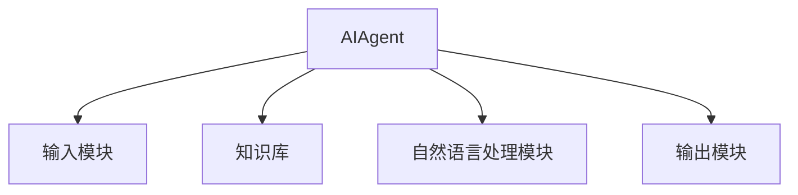

                 


# 理解AI Agent：定义、特征与基本原理

## 关键词：
AI Agent、人工智能、多智能体系统、自主决策、智能系统设计

## 摘要：
本文系统地阐述AI Agent的定义、特征与基本原理。从AI Agent的核心概念出发，分析其发展历程与技术现状，探讨其在各个领域的应用场景与价值。通过详细解析AI Agent的算法原理、系统架构设计与项目实战，帮助读者全面理解AI Agent的技术本质与实际应用。

---

# 第一部分: AI Agent 的背景与基本概念

## 第1章: AI Agent 的定义与特征

### 1.1 AI Agent 的基本概念

#### 1.1.1 什么是 AI Agent
AI Agent（人工智能代理）是一种能够感知环境、自主决策并采取行动的智能实体。它通过传感器获取信息，利用算法进行推理，最终执行目标导向的动作。

#### 1.1.2 AI Agent 的核心特征
AI Agent具有以下核心特征：
- **自主性**：能够在没有外部干预的情况下独立运作。
- **反应性**：能够实时感知环境并做出响应。
- **目标导向性**：通过设定目标来指导行为和决策。
- **学习能力**：能够通过经验改进性能。

#### 1.1.3 AI Agent 的边界与外延
AI Agent的边界包括其感知、决策和执行能力，而外延则涉及多智能体协作、人机交互等领域。

### 1.2 AI Agent 的核心要素

#### 1.2.1 感知能力
AI Agent通过传感器或接口获取环境信息，如视觉、听觉或数据输入。

#### 1.2.2 决策能力
基于感知信息，AI Agent利用算法做出决策，如规则引擎或强化学习。

#### 1.2.3 执行能力
AI Agent通过执行器或接口将决策转化为实际动作，如机器人动作或网络请求。

---

## 第2章: AI Agent 的发展背景与现状

### 2.1 AI Agent 的历史发展

#### 2.1.1 从专家系统到 AI Agent
专家系统依赖于规则库，而AI Agent引入了自主性和目标导向性。

#### 2.1.2 人工智能的第三次浪潮对 AI Agent 的影响
深度学习和大数据技术推动了AI Agent的智能化和实用性。

### 2.2 当前 AI Agent 的技术现状

#### 2.2.1 多智能体系统的发展
多智能体协作已成为AI Agent的重要研究方向。

#### 2.2.2 基于深度学习的 AI Agent
深度学习模型（如Transformer）在自然语言处理和决策任务中表现出色。

#### 2.2.3 AI Agent 的标准化与开源生态
开源框架（如OpenAI的GPT系列）促进了AI Agent的普及和标准化。

---

## 第3章: AI Agent 的应用场景与价值

### 3.1 AI Agent 的主要应用领域

#### 3.1.1 智能助手
AI Agent在智能音箱、智能手机中的语音助手应用广泛。

#### 3.1.2 智能客服
通过自然语言处理实现自动客服对话系统。

#### 3.1.3 自动驾驶
自动驾驶汽车中的路径规划和决策系统是AI Agent的典型应用。

#### 3.1.4 游戏 AI
在游戏中实现智能NPC行为和策略。

### 3.2 AI Agent 的核心价值

#### 3.2.1 提高效率
AI Agent能够快速处理复杂任务，提升效率。

#### 3.2.2 降低人工成本
通过自动化减少对人力的依赖，降低成本。

#### 3.2.3 实现复杂任务的自动化
AI Agent能够处理需要多步骤和决策的任务，如智能制造中的流程优化。

---

# 第二部分: AI Agent 的核心概念与联系

## 第4章: AI Agent 的核心概念解析

### 4.1 AI Agent 的定义与特征对比

#### 4.1.1 自主性与反应性对比
- **自主性**：AI Agent独立运作，主动完成目标。
- **反应性**：实时感知并做出响应，适应动态环境。

#### 4.1.2 知识表示与推理能力对比
- **知识表示**：通过符号逻辑或概率模型表示知识。
- **推理能力**：基于知识进行逻辑推理或概率推断。

#### 4.1.3 单智能体与多智能体对比
- **单智能体**：独立运作，目标明确。
- **多智能体**：协作完成复杂任务，需考虑交互和协调。

### 4.2 AI Agent 的 ER 实体关系图

```mermaid
er
actor(Agent) -|> has|-> capability:Capability
actor(Agent) -|> has|-> knowledge:Knowledge
actor(Agent) -|> has|-> goal:Goal
```

---

## 第5章: AI Agent 的算法原理

### 5.1 基于模型的规划算法

#### 5.1.1 状态空间搜索
状态空间搜索是一种通过遍历可能状态来找到最优路径的算法。

#### 5.1.2 启发式搜索（A*算法）
A*算法结合了广度优先搜索和启发式函数，用于找到最短路径。

#### 5.1.3 A*算法的数学模型
$$f(n) = g(n) + h(n)$$
其中，$g(n)$ 表示从起点到节点 $n$ 的实际成本，$h(n)$ 表示从节点 $n$ 到目标的估计成

---

## 第6章: AI Agent 的系统架构设计

### 6.1 系统分析与设计

#### 6.1.1 问题场景介绍
设计一个简单的智能客服系统，实现用户咨询的自动响应。

#### 6.1.2 系统功能设计
- 用户输入问题。
- AI Agent解析问题并生成回答。
- 输出回答。

#### 6.1.3 系统架构图


---

## 第7章: AI Agent 的项目实战

### 7.1 环境安装
安装Python和相关库（如numpy、pandas、scikit-learn）。

### 7.2 核心代码实现

```python
class AI_Agent:
    def __init__(self, knowledge_base):
        self.knowledge_base = knowledge_base

    def perceive(self, input):
        # 解析输入并生成响应
        pass

    def decide(self, input):
        # 基于知识库生成决策
        pass

    def execute(self, action):
        # 执行动作
        pass

# 示例代码：基于规则的简单AI Agent
class SimpleAgent(AI_Agent):
    def __init__(self, rules):
        super().__init__(rules)
        self.rules = rules

    def decide(self, input):
        for rule in self.rules:
            if rule['condition'](input):
                return rule['action']
        return 'default_response'
```

### 7.3 代码解读与分析
- `AI_Agent`类定义了基本的感知、决策和执行方法。
- `SimpleAgent`继承自`AI_Agent`，实现基于规则的决策逻辑。

### 7.4 实际案例分析
以智能客服为例，输入用户问题，AI Agent解析并生成回答。

### 7.5 项目小结
实现一个简单的AI Agent需要明确需求、设计架构并选择合适的算法。

---

# 第三部分: 最佳实践与总结

## 8.1 最佳实践 tips
- 明确目标和需求。
- 选择合适的算法和框架。
- 注重系统的可扩展性和维护性。

## 8.2 小结
本文详细讲解了AI Agent的定义、特征、算法原理和系统设计，帮助读者全面理解AI Agent的技术本质。

## 8.3 注意事项
- 避免过度复杂化设计。
- 定期更新和优化AI Agent的模型和算法。

## 8.4 拓展阅读
- 推荐阅读《人工智能：一种现代的方法》和《强化学习》。

---

# 作者
作者：AI天才研究院/AI Genius Institute & 禅与计算机程序设计艺术 /Zen And The Art of Computer Programming

