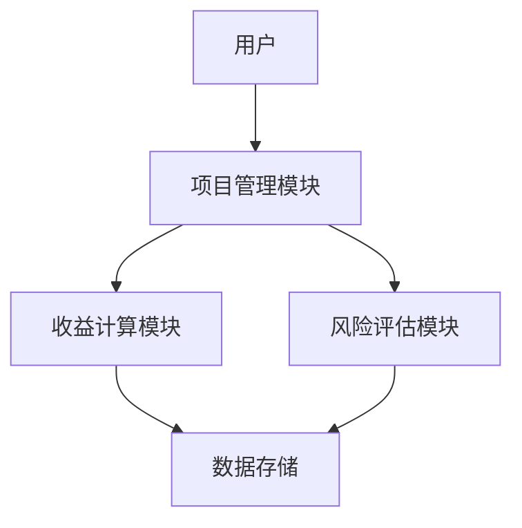
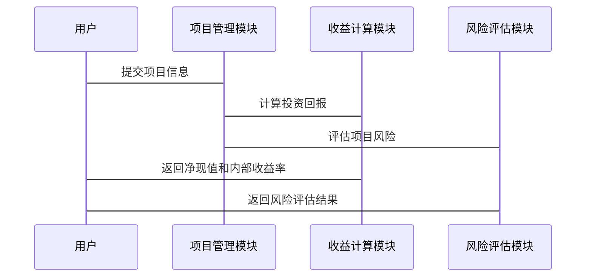

                 


# 生态修复与碳汇林项目的投资回报分析

## 关键词：生态修复，碳汇林，投资回报，净现值，内部收益率，碳汇收益

## 摘要：本文系统地分析了生态修复与碳汇林项目的投资回报，从背景、概念、数学模型到系统架构和实际案例，全面探讨了如何评估和优化碳汇林的投资收益。通过净现值、内部收益率等模型，结合实际案例分析，为投资者提供科学的决策依据，同时指出了项目中的风险和挑战。

---

## 第1章: 生态修复与碳汇林的定义与背景

### 1.1 生态修复的定义与背景

#### 1.1.1 生态修复的定义
生态修复是指通过人为干预和自然恢复相结合的方式，修复因人类活动或自然因素破坏的生态系统，使其恢复到健康、稳定的状态。生态修复的目标是恢复生态系统的功能和结构，提高其生产力和可持续性。

#### 1.1.2 生态修复的重要性
生态修复是解决环境问题、保护生物多样性、改善人类生活质量的重要手段。它不仅可以恢复生态系统的功能，还能提高土地的价值，为经济发展提供新的机会。

#### 1.1.3 生态修复的分类与特点
生态修复可以分为自然恢复和人工恢复两种类型。自然恢复主要依靠自然力量，而人工恢复则需要人类的主动干预。生态修复的特点包括：区域性、长期性、复杂性和系统性。

### 1.2 碳汇林的概念与作用

#### 1.2.1 碳汇的基本定义
碳汇是指通过植物的光合作用，将大气中的二氧化碳固定在植被和土壤中，从而减少大气中二氧化碳的过程。碳汇是应对气候变化的重要手段之一。

#### 1.2.2 碳汇林的定义与特点
碳汇林是指以吸收和储存二氧化碳为主要目标的森林或其他类型的植被。碳汇林的特点包括：高效性、可持续性和可测量性。

#### 1.2.3 碳汇林在生态修复中的作用
碳汇林不仅可以吸收二氧化碳，还能改善土壤质量、防止水土流失、保护生物多样性，为生态修复提供重要的支持。

### 1.3 生态修复与碳汇林的关联性

#### 1.3.1 生态修复与碳汇林的关系
生态修复为碳汇林提供了良好的生长环境，而碳汇林则通过吸收二氧化碳，进一步促进生态系统的恢复和稳定。

#### 1.3.2 碳汇林对生态修复的促进作用
碳汇林通过改善生态环境，促进生态系统的自我修复能力，为生态修复提供持续的支持。

#### 1.3.3 生态修复与碳汇林的协同发展
生态修复和碳汇林的协同发展可以实现经济效益和生态效益的双重目标，为可持续发展提供重要保障。

---

## 第2章: 碳汇林项目的运作模式与现状

### 2.1 碳汇林项目的运作模式

#### 2.1.1 碳汇林项目的实施流程
碳汇林项目的实施流程包括规划、设计、实施和监测四个阶段。每个阶段都需要专业的技术支持和严格的管理。

#### 2.1.2 碳汇林项目的参与者与角色
碳汇林项目的参与者包括政府、企业、非政府组织和当地社区。不同参与者在项目中承担不同的角色，共同推动项目的实施。

#### 2.1.3 碳汇林项目的资金来源
碳汇林项目的资金来源包括政府拨款、企业投资、国际援助和碳交易收益。多样化的资金来源为项目的实施提供了有力保障。

### 2.2 碳汇林项目的现状与发展趋势

#### 2.2.1 全球碳汇林项目的现状
全球范围内，碳汇林项目已经取得了一定的进展，但整体规模仍有限，主要集中在发展中国家和地区。

#### 2.2.2 碳汇林项目的发展趋势
随着全球气候变化问题的加剧，碳汇林项目的需求和投资将不断增加，尤其是在碳交易市场活跃的地区。

#### 2.2.3 碳汇林项目面临的挑战
碳汇林项目面临的主要挑战包括资金不足、技术落后、管理不善和政策支持不足等问题。这些问题需要通过多方合作和技术创新来解决。

---

## 第3章: 碳汇林项目投资回报分析的理论基础

### 3.1 投资回报分析的基本原理

#### 3.1.1 投资回报分析的定义
投资回报分析是指通过对项目的投资和收益进行预测和评估，确定项目是否具有投资价值的过程。

#### 3.1.2 投资回报分析的方法与模型
常用的投资回报分析方法包括净现值法、内部收益率法和回收期法等。这些方法各有优缺点，适用于不同的项目类型。

#### 3.1.3 投资回报分析的核心要素
投资回报分析的核心要素包括投资成本、预期收益、资金的时间价值和风险因素等。

### 3.2 碳汇林项目投资回报分析的特殊性

#### 3.2.1 碳汇林项目的收益来源
碳汇林项目的收益主要来自碳交易、林产品销售和生态服务等。

#### 3.2.2 碳汇林项目的成本构成
碳汇林项目的成本包括土地租赁费、造林费用、维护费用和监测费用等。

#### 3.2.3 碳汇林项目的风险因素
碳汇林项目面临的主要风险包括政策风险、市场风险和自然风险等。

---

## 第4章: 碳汇林项目投资回报分析的数学模型

### 4.1 净现值（NPV）模型

#### 4.1.1 净现值的定义
净现值是指项目未来现金流的现值与初始投资的差额，用于衡量项目的盈利能力。

#### 4.1.2 净现值的计算公式
$$ NPV = \sum_{t=0}^{n} \frac{C_t}{(1+r)^t} $$
其中，$C_t$是第t年的现金流，$r$是贴现率。

#### 4.1.3 净现值的应用案例
假设一个碳汇林项目初始投资为100万元，未来5年的现金流分别为20万元、30万元、40万元、50万元和60万元，贴现率为10%。计算其净现值：

$$ NPV = \frac{20}{1.1} + \frac{30}{(1.1)^2} + \frac{40}{(1.1)^3} + \frac{50}{(1.1)^4} + \frac{60}{(1.1)^5} - 100 $$

计算结果为正，说明项目具有投资价值。

### 4.2 内部收益率（IRR）模型

#### 4.2.1 内部收益率的定义
内部收益率是指使项目净现值为零的贴现率，用于衡量项目的盈利能力。

#### 4.2.2 内部收益率的计算公式
$$ IRR = r \text{ 使得 } NPV = 0 $$

#### 4.2.3 内部收益率的应用案例
假设一个碳汇林项目的现金流为：初始投资-100万元，第一年收益50万元，第二年收益60万元。计算其内部收益率：

$$ 0 = \frac{50}{1+IRR} + \frac{60}{(1+IRR)^2} - 100 $$

计算结果为IRR = 20%，说明项目具有较高的投资回报率。

### 4.3 碳汇收益模型

#### 4.3.1 碳汇收益的计算公式
$$ \text{碳汇收益} = \text{碳汇量} \times \text{碳价} $$

#### 4.3.2 碳汇收益的影响因素
碳汇收益受碳价波动、碳汇量和市场需求的影响较大。

---

## 第5章: 碳汇林项目投资回报分析的系统架构

### 5.1 系统功能设计

#### 5.1.1 项目管理模块
项目管理模块负责项目的规划、执行和监控，确保项目按计划进行。

#### 5.1.2 收益计算模块
收益计算模块负责计算项目的净现值、内部收益率等指标，评估项目的盈利能力。

#### 5.1.3 风险评估模块
风险评估模块负责识别和评估项目中的各种风险，制定相应的风险管理策略。

### 5.2 系统架构设计

#### 5.2.1 系统架构图


#### 5.2.2 系统交互图


---

## 第6章: 碳汇林项目投资回报分析的项目实战

### 6.1 环境配置

#### 6.1.1 系统需求
需要安装Python、NumPy、Matplotlib和Mermaid等工具。

#### 6.1.2 安装步骤
```bash
pip install numpy matplotlib
```

### 6.2 核心实现

#### 6.2.1 净现值计算代码
```python
import numpy as np

def calculate_npv(cash_flows, discount_rate):
    return np.npv(discount_rate, *cash_flows)

cash_flows = [-100, 20, 30, 40, 50, 60]
discount_rate = 0.1
npv = calculate_npv(cash_flows, discount_rate)
print(f"净现值: {npv}")
```

#### 6.2.2 内部收益率计算代码
```python
import numpy as np

def calculate_irr(cash_flows):
    return np.irr(cash_flows)

cash_flows = [-100, 50, 60]
irr = calculate_irr(cash_flows)
print(f"内部收益率: {irr}")
```

### 6.3 案例分析

#### 6.3.1 案例背景
某地区计划实施一个碳汇林项目，初始投资为100万元，预计未来5年的现金流分别为20万元、30万元、40万元、50万元和60万元，贴现率为10%。

#### 6.3.2 计算结果
净现值为正，内部收益率为20%，说明项目具有较高的投资回报率。

### 6.4 项目总结

#### 6.4.1 成功经验
通过科学的投资回报分析，项目实现了经济效益和生态效益的双重目标。

#### 6.4.2 挑战与改进
项目实施过程中面临资金不足和技术落后等挑战，未来需要通过技术创新和政策支持进一步优化。

---

## 第7章: 总结与展望

### 7.1 总结
通过本文的分析，我们可以看到，碳汇林项目具有较高的投资回报潜力。通过科学的投资回报分析方法，投资者可以更好地评估项目的风险和收益，做出科学的决策。

### 7.2 最佳实践 tips
1. 在投资碳汇林项目时，需要综合考虑经济效益和生态效益。
2. 投资者应选择合适的数学模型进行投资回报分析，确保分析结果的准确性。
3. 项目实施过程中，需要加强风险管理，确保项目顺利进行。

### 7.3 未来展望
随着全球气候变化问题的加剧，碳汇林项目的需求和投资将不断增加。未来，通过技术创新和政策支持，碳汇林项目将实现更大的发展。

---

## 作者：AI天才研究院/AI Genius Institute & 禅与计算机程序设计艺术 /Zen And The Art of Computer Programming

---

以上是《生态修复与碳汇林项目的投资回报分析》的完整目录和文章内容。通过系统的分析和详细的案例，本文为投资者提供了科学的投资回报分析方法，帮助他们在碳汇林项目中做出明智的决策。

