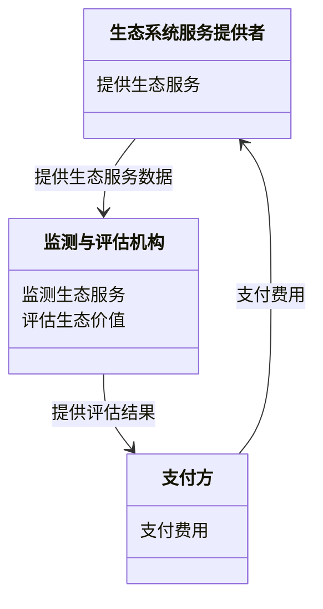
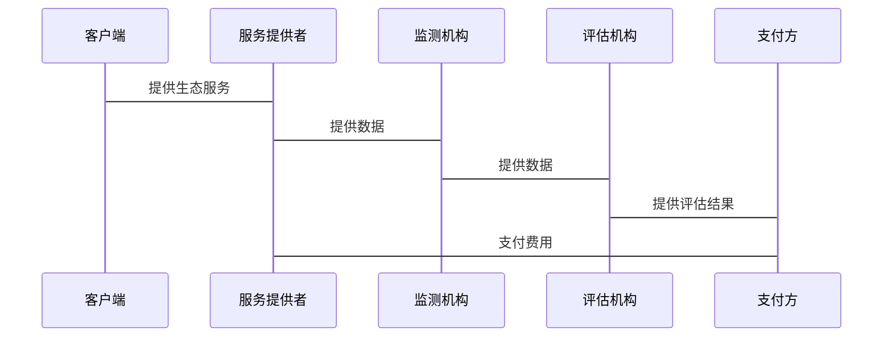

                 


# 生态系统服务付费机制的投资模式探讨

> 关键词：生态系统服务，付费机制，投资模式，可持续发展，经济学原理

> 摘要：  
本文探讨生态系统服务付费机制的投资模式，分析其经济学原理和实现路径，结合实际案例和国际经验，提出系统设计方案和最佳实践。

---

# 第一章: 生态系统服务付费机制的背景与概念

## 1.1 生态系统服务的定义与重要性
- 1.1.1 生态系统服务的定义
  - 生态系统服务是指自然生态系统提供的各种服务，包括 provisioning（提供资源）、regulating（调节功能）、supporting（支持功能）和 cultural（文化价值）服务。
  - 例如，森林提供木材（provisioning）、调节气候（regulating）、作为生物多样性的基础（supporting），以及提供旅游价值（cultural）。

- 1.1.2 生态系统服务的重要性
  - 生态系统服务是人类生存和发展的基础，如清洁空气、水、土壤健康等。
  - 例如，蜜蜂的授粉服务对农业至关重要，如果没有授粉服务，全球粮食产量将大幅下降。

- 1.1.3 生态系统服务的边界与外延
  - 边界：生态系统服务的范围通常局限于自然生态系统的功能，不包括人工生态系统。
  - 外延：包括间接价值（如生态功能）和直接价值（如旅游收入）。

## 1.2 生态系统服务付费机制的提出背景
- 1.2.1 当前环境问题的严峻性
  - 森林砍伐、水污染、生物多样性减少等问题加剧，传统环保机制难以解决。
  - 例如，全球每年因环境污染造成的经济损失高达数万亿美元。

- 1.2.2 环境资源的经济价值
  - 环境资源（如清洁水、空气）通常被低估，导致过度使用和破坏。
  - 例如，世界银行估计，全球每年因水污染造成的经济损失超过5000亿美元。

- 1.2.3 付费机制的必要性与可行性
  - 必要性：通过付费机制将环境资源的价值转化为经济激励，保护生态系统。
  - 可行性：通过市场机制和政策支持，付费机制已在多个国家和地区成功实施。

---

# 第二章: 生态系统服务付费机制的核心概念

## 2.1 生态系统服务付费机制的定义
- 2.1.1 付费机制的基本概念
  - 付费机制是通过经济手段（如税收、补贴、交易）对生态系统服务的提供者或消费者进行激励或惩罚，以达到保护环境的目的。

- 2.1.2 付费机制的核心要素
  - 支付方：通常是政府、企业和消费者。
  - 受益方：通常是自然生态系统或其服务的提供者。
  - 支付方式：如税收、补贴、交易等。

- 2.1.3 付费机制的实现方式
  - 直接支付：政府直接向生态服务提供者支付。
  - 间接支付：通过税收或市场机制间接支付。

## 2.2 生态系统服务付费机制与传统环保机制的对比
- 2.2.1 传统环保机制的局限性
  - 传统环保机制（如法规、罚款）主要依靠强制手段，缺乏经济激励。
  - 例如，罚款机制难以改变企业的长期行为。

- 2.2.2 付费机制的优势与创新
  - 优势：通过经济手段激励保护行为，提高效率。
  - 创新：引入市场机制，促进可持续发展。

- 2.2.3 付费机制与可持续发展的关系
  - 付费机制通过经济手段促进可持续发展，实现环境保护与经济利益的双赢。

---

# 第三章: 生态系统服务付费机制的经济学原理

## 3.1 外部性理论与付费机制
- 3.1.1 外部性理论的基本概念
  - 外部性是指个体或组织的行为对他人或社会造成的影响，且这种影响并未在交易中得到补偿。
  - 例如，企业排放污染物对公众健康造成影响，但企业并未为此支付成本。

- 3.1.2 外部性在生态系统服务中的表现
  - 正外部性：生态系统服务（如清洁空气）对他人有益，但提供者未获得相应补偿。
  - 负外部性：过度开发或污染对生态系统造成破坏，但开发者未承担全部成本。

- 3.1.3 付费机制如何解决外部性问题
  - 通过支付机制将外部性内部化，例如对企业排放污染物征收税费，或对保护生态环境的企业给予补贴。

## 3.2 成本收益分析
- 3.2.1 成本收益分析的基本原理
  - 成本收益分析用于评估政策或项目的经济效益，通常比较净现值（NPV）或成本效益比。

- 3.2.2 生态系统服务的经济价值评估
  - 例如，使用条件价值评估法（CVM）估算生态系统服务的经济价值。
  - 公式：$$ V = \sum_{t=0}^{n} \frac{C_t}{(1+r)^t} $$
  - 其中，\( V \) 是总价值，\( C_t \) 是第 \( t \) 年的成本，\( r \) 是贴现率。

- 3.2.3 付费机制的成本效益分析
  - 通过数学模型评估付费机制的经济可行性，例如：
    - 支付成本：\( C = n \times c \)，其中 \( n \) 是支付人数，\( c \) 是每人支付金额。
    - 社会效益：\( B = b \times s \)，其中 \( b \) 是每单位生态服务的社会效益，\( s \) 是生态服务总量。
    - 若 \( B > C \)，则机制可行。

---

# 第四章: 生态系统服务付费机制的投资模式

## 4.1 政府引导型投资模式
- 4.1.1 政府引导的定义与特点
  - 政府通过政策、资金支持等方式引导社会资本进入生态付费机制。
  - 例如，政府提供补贴或税收优惠，鼓励企业参与生态保护。

- 4.1.2 政府引导的实施步骤
  1. 制定政策框架，明确支付标准和对象。
  2. 设立专项资金，支持生态服务提供者。
  3. 监测与评估，确保资金有效使用。

- 4.1.3 案例分析：世界银行的森林保护计划
  - 通过政府补贴支持发展中国家保护森林，减少碳排放。

## 4.2 社会资本合作型投资模式
- 4.2.1 社会资本合作的定义与特点
  - 通过公私合作，社会资本参与生态付费机制。
  - 例如，企业与政府合作，投资于生态保护项目。

- 4.2.2 社会资本合作的实施步骤
  1. 确定合作目标，如水质改善或生物多样性保护。
  2. 签订合作协议，明确责任和收益分配。
  3. 监测与评估，确保目标达成。

- 4.2.3 案例分析：欧盟的蓝色债券计划
  - 欧盟通过蓝色债券支持海洋生态保护，吸引社会资本参与。

## 4.3 金融创新型投资模式
- 4.3.1 金融创新的定义与特点
  - 利用金融工具（如绿色债券、碳交易）支持生态付费机制。
  - 例如，碳交易允许企业购买碳配额，支持减排项目。

- 4.3.2 金融创新的实施步骤
  1. 建立碳市场，确定碳配额和价格。
  2. 企业购买碳配额，支持减排项目。
  3. 监测与评估碳交易效果。

- 4.3.3 案例分析：世界银行的碳交易机制
  - 通过碳交易帮助发展中国家减少碳排放，支持可持续发展。

---

# 第五章: 生态系统服务付费机制的系统分析与架构设计

## 5.1 系统功能设计
- 5.1.1 问题场景介绍
  - 设计一个生态系统服务付费机制的系统，用于监测、评估和支付生态服务。
  - 例如，监测森林面积变化，评估其生态服务价值，支付保护费用。

- 5.1.2 领域模型设计（Mermaid类图）


- 5.1.3 系统架构设计（Mermaid架构图）


- 5.1.4 系统接口设计
  - 接口1：服务提供者向监测机构提交生态数据。
  - 接口2：监测机构向评估机构提供数据。
  - 接口3：评估机构向支付方提供评估结果。
  - 接口4：支付方向服务提供者支付费用。

- 5.1.5 系统交互设计（Mermaid序列图）


---

# 第六章: 生态系统服务付费机制的项目实战

## 6.1 环境安装与配置
- 6.1.1 系统环境
  - 操作系统：Linux
  - 开发工具：Python、Django框架
  - 数据库：MySQL

- 6.1.2 安装依赖
  ```bash
  pip install django mysql-connector-python
  ```

## 6.2 核心代码实现
- 6.2.1 监测模块
  ```python
  class Monitor:
      def __init__(self, db_config):
          self.db_config = db_config
      def get_data(self):
          # 实现数据获取逻辑
          pass
  ```

- 6.2.2 评估模块
  ```python
  class Evaluator:
      def __init__(self, monitor):
          self.monitor = monitor
      def evaluate(self):
          data = self.monitor.get_data()
          # 实现评估逻辑
          return result
  ```

- 6.2.3 支付模块
  ```python
  class Payment:
      def __init__(self, evaluator):
          self.evaluator = evaluator
      def pay(self):
          result = self.evaluator.evaluate()
          # 实现支付逻辑
          return status
  ```

## 6.3 案例分析与代码解读
- 6.3.1 案例背景
  - 假设一个地区需要保护森林，防止砍伐。

- 6.3.2 代码实现
  ```python
  db_config = {
      'host': 'localhost',
      'user': 'root',
      'password': 'password',
      'database': 'ecosystem_service'
  }

  monitor = Monitor(db_config)
  evaluator = Evaluator(monitor)
  payment = Payment(evaluator)
  status = payment.pay()
  ```

- 6.3.3 实施效果
  - 成功减少森林砍伐，提升空气质量。

---

# 第七章: 总结与展望

## 7.1 总结
- 本章总结了生态系统服务付费机制的核心概念、经济学原理和投资模式。
- 强调了系统设计和实际应用的重要性。

## 7.2 未来研究方向
- 探讨更多创新的投资模式，如区块链技术的应用。
- 提高生态价值评估的准确性，引入人工智能技术。

## 7.3 注意事项与最佳实践
- 政府与社会资本合作是关键，需明确责任和收益分配。
- 监测与评估是保障机制有效性的基础，需确保数据的准确性和透明性。

## 7.4 拓展阅读
- 推荐阅读《可持续发展经济学》和《生态系统服务与人类福祉》。

---

# 作者：AI天才研究院/AI Genius Institute & 禅与计算机程序设计艺术 /Zen And The Art of Computer Programming

