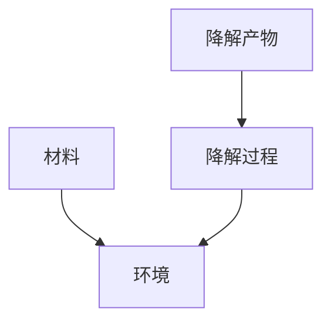
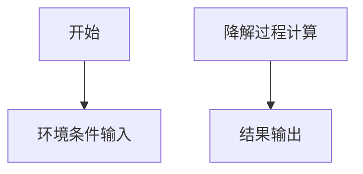
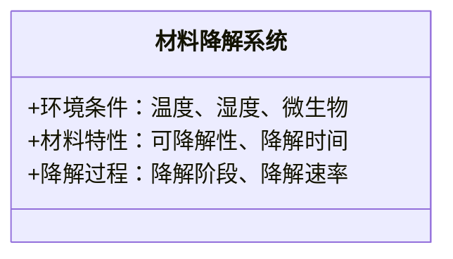
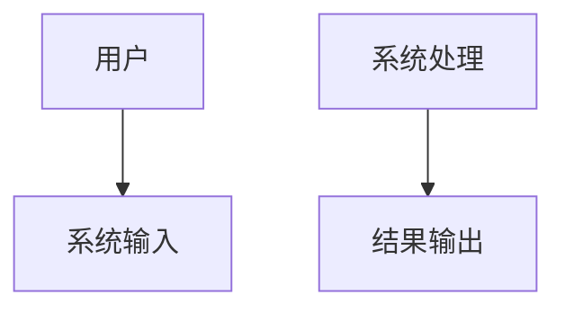

                 


# 生物降解材料的发展与相关产业投资

---

## 关键词：
生物降解材料、可持续发展、环境影响、产业投资、材料科学、降解机制、数学模型

---

## 摘要：
生物降解材料作为解决传统塑料污染问题的重要途径，近年来受到广泛关注。本文从生物降解材料的核心概念、降解机制、数学模型、系统设计、项目实战以及投资分析等方面展开详细论述，结合实际案例和数据，为读者提供全面的视角，涵盖从基础理论到实际应用的全链条分析。本文旨在为研究人员、投资者和相关产业从业者提供深度洞察，助力生物降解材料的快速发展与产业化应用。

---

## 目录

### 第一部分: 生物降解材料的发展与应用背景

#### 第1章: 生物降解材料的背景介绍

##### 1.1 生物降解材料的基本概念
###### 1.1.1 生物降解材料的定义
- 什么是生物降解材料？
- 生物降解材料的分类与特点
- 生物降解材料的环境意义

###### 1.1.2 生物降解材料的分类
- 生物基材料与石油基材料的对比
- 可降解材料与不可降解材料的区别
- 常见的生物降解材料类型（如PLA、PBS、PHA等）

###### 1.1.3 生物降解材料的应用领域
- 包装行业
- 农业领域
- 日用品行业
- 工业材料应用

##### 1.2 生物降解材料的发展背景
###### 1.2.1 环境污染与可持续发展的需求
- 塑料污染的现状与危害
- 可持续发展的重要性
- 生物降解材料在环保中的作用

###### 1.2.2 石油基材料的局限性
- 石油基材料的不可降解性
- 石油基材料对环境的长期影响
- 石油资源的不可再生性

###### 1.2.3 生物降解材料的市场需求
- 消费者环保意识的提升
- 政策法规的推动（如限塑令）
- 市场对环保产品的偏好

#### 第2章: 生物降解材料的核心概念与联系

##### 2.1 生物降解材料的核心原理
###### 2.1.1 降解的基本机制
- 生物降解的定义
- 微生物在降解过程中的作用
- 化学降解与生物降解的区别

###### 2.1.2 材料的降解速率模型
- 影响降解速率的因素（温度、湿度、微生物种类等）
- 降解速率与材料结构的关系
- 降解过程的阶段划分

##### 2.2 核心概念的属性特征对比
###### 2.2.1 材料性能对比表格
| 材料类型 | � 强度  | 耐用性 | 降解时间 | 生物相容性 |
|----------|--------|--------|----------|------------|
| PLA      | 高     | 低     | 6-12个月 | 良          |
| PBS      | 中等   | 中等   | 12-24个月| 良          |
| PHA      | 低     | 高     | 3-6个月  | 优          |

###### 2.2.2 材料降解过程的ER实体关系图


---

### 第二部分: 生物降解材料的降解机制与数学模型

#### 第3章: 生物降解材料的降解机制与数学模型

##### 3.1 降解机制的数学模型
###### 3.1.1 降解速率模型
$$\frac{dM}{dt} = -kM$$
其中，$M$ 表示材料的质量，$k$ 是降解速率常数。

###### 3.1.2 降解过程的模拟算法


##### 3.2 材料降解的算法原理
###### 3.2.1 算法实现步骤
1. 输入环境参数（温度、湿度、微生物数量）
2. 计算降解速率常数 $k$
3. 模拟降解过程，输出降解时间与降解程度的关系曲线

###### 3.2.2 降解速率的优化方法
- 使用遗传算法优化 $k$ 的值
- 基于实验数据拟合降解模型

##### 3.3 降解过程的模拟与优化
###### 3.3.1 材料降解的模拟算法
```python
def degrade(material, environment):
    # 计算降解速率常数
    k = calculate_k(environment)
    # 模拟降解过程
    return simulate_degradation(material, k)
```

###### 3.3.2 降解速率的优化方法
- 使用实验数据拟合降解模型
- 通过优化算法提高降解效率

---

### 第三部分: 生物降解材料的系统分析与架构设计

#### 第4章: 生物降解材料的系统分析与架构设计

##### 4.1 系统分析
###### 4.1.1 问题场景介绍
- 降解材料的实际应用场景
- 系统功能需求分析
- 系统性能指标

##### 4.2 系统架构设计
###### 4.2.1 系统架构图


##### 4.3 系统功能设计
###### 4.3.1 功能模块划分
- 环境数据采集模块
- 降解过程监控模块
- 数据分析与优化模块

##### 4.4 系统接口设计
###### 4.4.1 系统接口描述
- 数据输入接口
- 数据输出接口
- 系统控制接口

##### 4.5 系统交互流程
###### 4.5.1 交互流程图


---

### 第四部分: 生物降解材料的项目实战

#### 第5章: 生物降解材料的项目实战

##### 5.1 项目背景与目标
###### 5.1.1 项目背景
- 选择PBAT材料作为案例
- 项目目标：开发一种高效降解的PBAT材料

##### 5.2 项目实施步骤
###### 5.2.1 环境搭建
- 实验室环境准备
- 材料采购与制备

###### 5.2.2 核心实现
- 材料配方优化
- 降解过程监控

##### 5.3 代码实现与解读
###### 5.3.1 降解过程模拟代码
```python
def simulate_degradation(material, environment):
    # 计算降解速率
    k = calculate_k(environment)
    # 模拟降解过程
    degradation_curve = []
    for t in range(0, 1000, 1):
        M = material * exp(-k * t)
        degradation_curve.append(M)
    return degradation_curve
```

##### 5.4 项目小结
###### 5.4.1 成功经验总结
- 配方优化的重要性
- 降解过程监控的必要性

###### 5.4.2 项目成果展示
- PBAT材料的降解性能测试结果
- 成本分析与市场竞争力

---

### 第五部分: 生物降解材料的投资分析与成功案例

#### 第6章: 生物降解材料的投资分析与成功案例

##### 6.1 生物降解材料的市场现状
###### 6.1.1 市场规模与增长趋势
- 全球市场规模预测
- 区域市场分布

##### 6.2 生物降解材料的投资机会
###### 6.2.1 投资领域分析
- 包装行业
- 农业领域
- 工业材料

##### 6.3 生物降解材料的投资风险
###### 6.3.1 技术风险
- 技术成熟度
- 技术更新换代快

###### 6.3.2 市场风险
- 市场接受度
- 替代品的竞争

##### 6.4 成功案例分析
###### 6.4.1 国内外成功案例
- 国内案例：某企业成功研发可降解包装材料
- 国外案例：欧洲某公司推广生物降解农用地膜

---

## 总结

生物降解材料作为解决传统塑料污染的重要手段，其发展与应用前景广阔。本文从背景介绍、核心概念、降解机制、系统设计、项目实战和投资分析等多个方面进行了深入探讨，结合实际案例和数据，为读者提供了全面的视角。未来，随着技术的进步和市场的推动，生物降解材料将在更多领域得到应用，成为可持续发展的重要支柱。

---

## 作者：AI天才研究院/AI Genius Institute & 禅与计算机程序设计艺术 /Zen And The Art of Computer Programming

