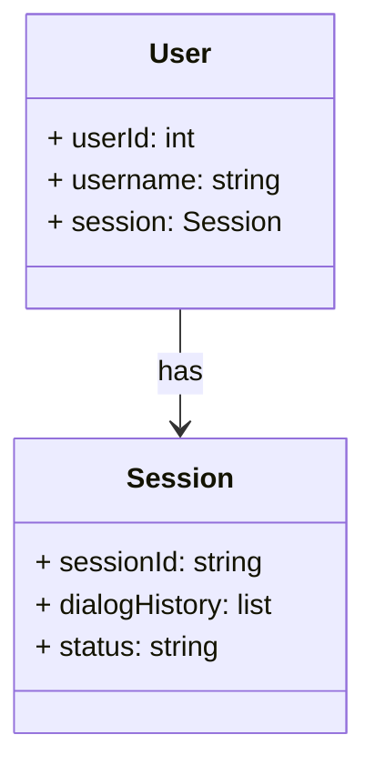
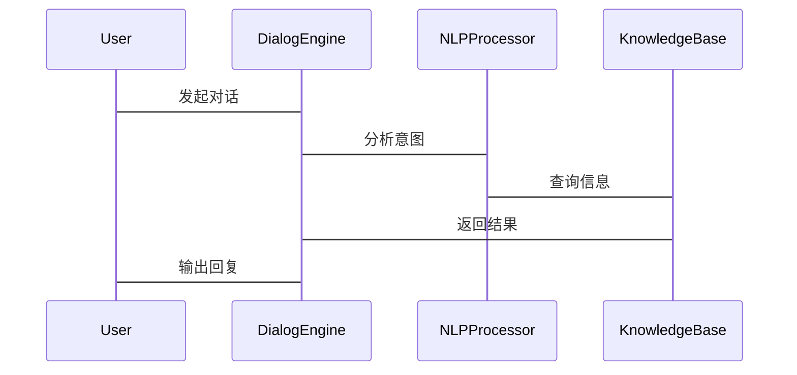

                 


# 用户体验研究：提升AI Agent的易用性

---

## 关键词：用户体验研究, AI Agent, 易用性, 自然语言处理, 强化学习, 系统架构设计

---

## 摘要：  
本文探讨了如何通过用户体验研究提升AI Agent的易用性。从基础理论到实际应用，文章详细分析了AI Agent的核心原理、影响易用性的关键因素，并通过自然语言处理和强化学习的算法原理，结合系统架构设计和项目实战，为读者提供了全面的解决方案。  

---

## 目录  

### 第1章：用户体验研究概述  
1.1 用户体验的核心概念  
1.2 AI Agent的基本原理  

### 第2章：影响AI Agent易用性的关键因素  
2.1 交互设计  
2.2 系统性能与响应速度  

### 第3章：用户体验研究的算法原理  
3.1 基于自然语言处理的意图识别  
3.2 基于强化学习的对话策略优化  

### 第4章：系统分析与架构设计方案  
4.1 问题场景介绍  
4.2 系统架构设计  

### 第5章：项目实战  
5.1 环境安装与系统实现  
5.2 案例分析与项目总结  

---

## 第1章：用户体验研究概述  

### 1.1 用户体验的核心概念  
用户体验（User Experience, UX）是指用户在与产品或服务交互过程中所感受到的体验。它不仅包括功能的可用性，还包括情感上的愉悦感和满意度。  

#### 1.1.1 问题背景与描述  
在AI Agent领域，用户体验研究的核心目标是通过优化人机交互流程，提升用户的满意度和任务完成效率。  

#### 1.1.2 用户体验问题的解决方法  
通过定性研究（如用户访谈）和定量研究（如用户测试）相结合的方式，识别痛点并提出优化方案。  

#### 1.1.3 用户体验的边界与外延  
用户体验研究不仅关注功能实现，还涉及情感设计和文化差异等外部因素。  

### 1.2 AI Agent的基本原理  

#### 1.2.1 定义与基本特征  
AI Agent是一种能够理解并执行用户意图的智能体，通常基于自然语言处理（NLP）和机器学习技术实现。  

#### 1.2.2 基于自然语言处理的体系结构  
AI Agent的体系结构包括意图识别、语义理解、对话生成等模块。  

#### 1.2.3 AI Agent与传统软件的对比  
AI Agent的核心区别在于其具备学习和自适应能力，能够根据用户反馈优化交互流程。  

---

## 第2章：影响AI Agent易用性的关键因素  

### 2.1 交互设计  

#### 2.1.1 自然语言处理与对话设计  
通过分析用户输入的上下文，生成符合用户期望的回复。  

#### 2.1.2 用户反馈机制  
实时收集用户反馈，优化对话策略，提升用户体验。  

#### 2.1.3 错误处理与用户引导  
设计友好的错误提示和用户引导机制，减少用户困惑。  

### 2.2 系统性能与响应速度  

#### 2.2.1 响应时间优化  
通过分布式架构和缓存技术，提升系统的响应速度。  

#### 2.2.2 系统稳定性与可靠性  
采用冗余设计和容错机制，确保系统的稳定运行。  

#### 2.2.3 性能监控与调优  
实时监控系统性能，及时发现并解决问题。  

---

## 第3章：用户体验研究的算法原理  

### 3.1 基于自然语言处理的意图识别  

#### 3.1.1 意图识别的流程  
用户输入→分词→意图分析→生成回复。  

#### 3.1.2 模型训练与优化  
使用深度学习模型（如BERT）进行意图分类，通过数据增强优化模型性能。  

#### 3.1.3 案例分析与代码实现  
```python
# 示例代码：基于TF-IDF的关键词提取
from sklearn.feature_extraction.text import TfidfVectorizer

vectorizer = TfidfVectorizer()
X = vectorizer.fit_transform(["这是一个测试句子"])
print(vectorizer.get_feature_names())
```

### 3.2 基于强化学习的对话策略优化  

#### 3.2.1 强化学习的基本原理  
通过定义状态、动作和奖励函数，优化对话策略。  

#### 3.2.2 对话策略的优化过程  
状态转移→动作选择→奖励计算→策略更新。  

#### 3.2.3 实际应用中的挑战与解决方案  
- 挑战：对话树的复杂性  
- 解决方案：使用深度强化学习（Deep RL）简化策略设计。  

---

## 第4章：系统分析与架构设计方案  

### 4.1 问题场景介绍  

#### 4.1.1 用户需求分析  
用户希望与AI Agent进行自然对话，快速获取所需信息。  

#### 4.1.2 项目目标与范围  
设计一个高效的AI Agent系统，支持多轮对话和复杂查询。  

#### 4.1.3 系统功能设计  
包括用户身份验证、对话历史记录、知识库查询等功能。  

### 4.2 系统架构设计  

#### 4.2.1 领域模型设计  


#### 4.2.2 系统架构设计  
```mermaid
architecturalDiagram
    component User Interface {
        include DialogEngine
        include SessionManager
    }
    component DialogEngine {
        include NLPProcessor
        include KnowledgeBase
    }
    component SessionManager {
        include Database
        include Cache
    }
```

#### 4.2.3 系统接口与交互设计  


---

## 第5章：项目实战  

### 5.1 环境安装与系统实现  

#### 5.1.1 环境安装  
安装Python、TensorFlow、Keras等工具。  

#### 5.1.2 核心功能实现  
实现意图识别、对话生成、知识库查询等功能。  

#### 5.1.3 代码解读与分析  
```python
# 示例代码：简单的意图分类器
from tensorflow.keras import layers

model = Sequential()
model.add(layers.Dense(64, activation='relu', input_shape=(n_words,)))
model.add(layers.Dense(1, activation='sigmoid'))
model.compile(optimizer='adam', loss='binary_crossentropy', metrics=['accuracy'])
model.fit(X_train, y_train, epochs=10, batch_size=32)
```

### 5.2 案例分析与项目总结  

#### 5.2.1 案例分析  
分析实际项目中的用户反馈，优化系统性能。  

#### 5.2.2 项目小结  
总结项目经验，提出改进建议，为后续研究提供参考。  

---

## 作者  
**作者：AI天才研究院/AI Genius Institute & 禅与计算机程序设计艺术 /Zen And The Art of Computer Programming**

