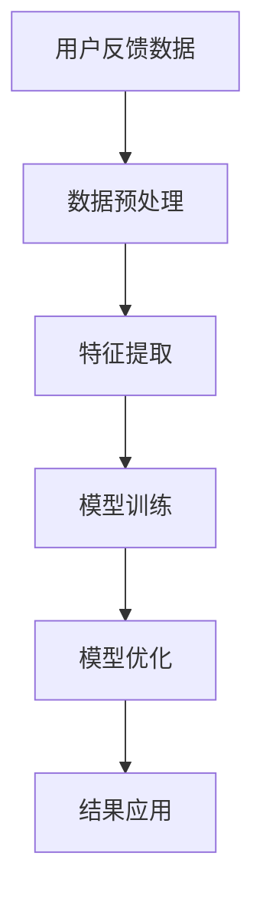
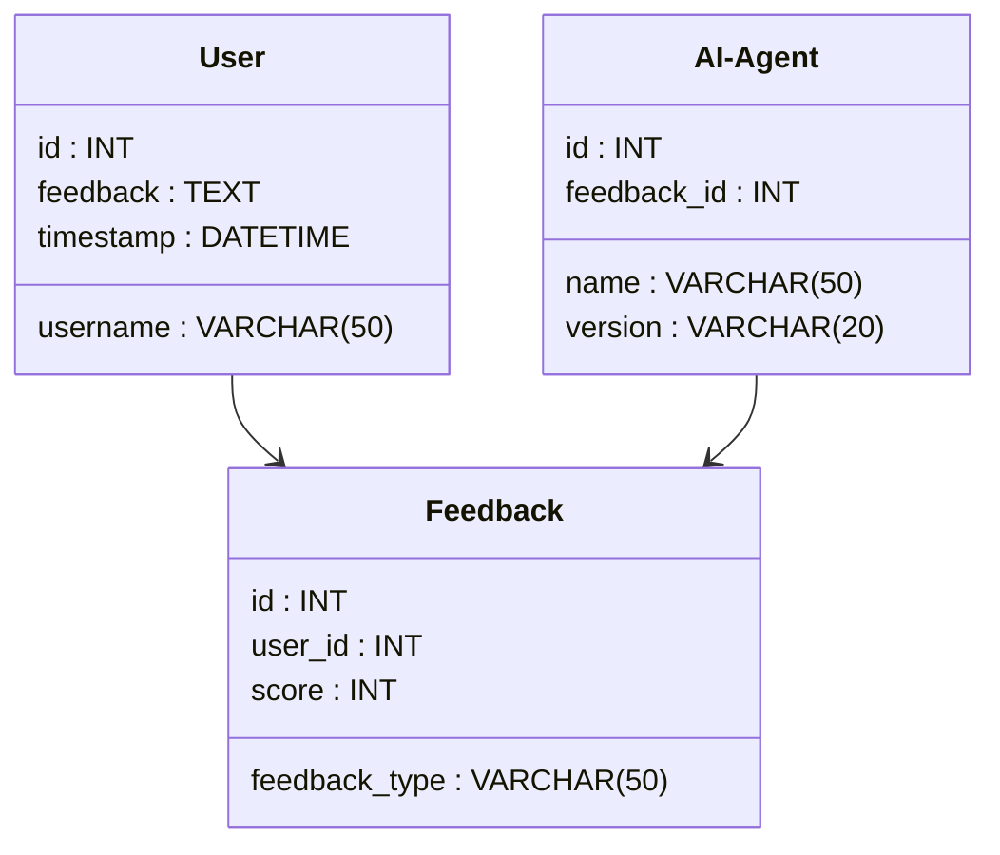

                 


# 用户反馈分析：从用户视角优化AI Agent

> **关键词**：用户反馈分析，AI Agent，优化，用户视角，算法原理，系统设计，项目实战

> **摘要**：本文从用户反馈分析的角度，详细探讨如何从用户视角优化AI Agent。通过背景介绍、核心概念分析、算法原理讲解、系统架构设计、项目实战等多方面展开，结合实际案例和代码实现，为读者提供从理论到实践的全面指导。

---

## 第1章: 引言

### 1.1 AI Agent的基本概念

#### 1.1.1 AI Agent的定义与核心功能
AI Agent（人工智能代理）是指能够感知环境、自主决策并执行任务的智能体。它通常具备以下核心功能：
- **感知**：通过传感器或接口获取环境信息。
- **推理**：基于获取的信息进行分析和推理。
- **决策**：根据推理结果制定行动计划。
- **执行**：通过执行器或接口将决策转化为实际操作。

#### 1.1.2 用户反馈分析的重要性
用户反馈是优化AI Agent性能和用户体验的重要来源。通过分析用户的反馈，可以发现AI Agent在交互过程中的不足之处，进而进行针对性改进。

#### 1.1.3 本书的目标与结构
本书旨在通过用户反馈分析的方法，指导读者从用户视角优化AI Agent。内容涵盖背景介绍、理论基础、算法实现、系统设计、项目实战等多个方面，帮助读者全面掌握相关知识和技能。

---

## 第2章: 用户反馈分析的背景与概念

### 2.1 AI Agent的基本原理

#### 2.1.1 AI Agent的定义与分类
AI Agent可以根据智能水平分为以下几类：
- **反应式AI Agent**：基于当前感知做出反应，不依赖历史信息。
- **认知式AI Agent**：具备推理、规划和学习能力，能够处理复杂任务。
- **混合式AI Agent**：结合反应式和认知式的特点，适用于复杂的动态环境。

#### 2.1.2 AI Agent的核心技术与实现方式
AI Agent的核心技术包括：
- **自然语言处理（NLP）**：实现人与AI Agent的自然交互。
- **机器学习（ML）**：用于模式识别、预测和自适应优化。
- **知识表示与推理**：构建知识库并进行逻辑推理。

#### 2.1.3 AI Agent与用户交互的关系
AI Agent与用户的交互是优化的基础。通过分析用户的反馈，可以不断改进AI Agent的响应策略和行为模式。

### 2.2 用户反馈分析的背景与现状

#### 2.2.1 用户反馈分析的定义与特点
用户反馈分析是通过对用户在与AI Agent交互过程中提供的反馈信息进行分析，以优化AI Agent的性能和用户体验。

#### 2.2.2 当前AI Agent优化中的问题与挑战
- **反馈信息的多样性**：用户反馈可能来自不同的渠道，形式多样，难以统一处理。
- **反馈信息的噪声**：用户反馈可能存在歧义或不完整，影响分析结果。
- **反馈分析的复杂性**：需要结合多种技术手段，如NLP、机器学习等，进行综合分析。

#### 2.2.3 用户反馈分析在优化AI Agent中的应用前景
随着AI技术的不断发展，用户反馈分析将在优化AI Agent中发挥越来越重要的作用，尤其是在提升用户体验和提高AI Agent的智能化水平方面。

---

## 第3章: 用户反馈分析的核心概念与联系

### 3.1 用户反馈分析的理论基础

#### 3.1.1 用户反馈分析的核心概念
用户反馈分析涉及以下核心概念：
- **反馈来源**：用户在与AI Agent交互过程中提供的各种反馈信息。
- **反馈类型**：包括显式反馈（如评分、点赞）和隐式反馈（如用户行为数据）。
- **反馈处理**：对用户反馈进行分类、分析和建模的过程。

#### 3.1.2 用户反馈分析的核心属性对比
以下是用户反馈分析中常见属性的对比表：

| 属性 | 描述 |
|------|------|
| 显式反馈 | 用户主动提供的直接评价（如评分、评论） |
| 隐式反馈 | 通过用户行为间接反映的偏好（如点击率、停留时间） |
| 反馈来源 | 用户、系统日志、第三方数据 |
| 反馈目标 | AI Agent的行为、结果、性能 |

#### 3.1.3 用户反馈分析的ER实体关系图
以下是用户反馈分析的ER实体关系图：

```mermaid
erDiagram
    user {
        id : INT
        username : VARCHAR(50)
        feedback : TEXT
        timestamp : DATETIME
    }
    feedback_type {
        id : INT
        type_name : VARCHAR(50)
    }
    ai_agent {
        id : INT
        name : VARCHAR(50)
        version : VARCHAR(20)
    }
    userfeedback --|> user
    userfeedback --|> feedback_type
    userfeedback --|> ai_agent
```

---

### 3.2 用户反馈分析的核心要素

#### 3.2.1 用户反馈分析的核心要素组成
用户反馈分析的核心要素包括：
- **用户行为数据**：用户的点击、浏览、购买等行为数据。
- **用户评价数据**：用户的评分、评论等直接反馈。
- **系统日志数据**：系统记录的用户操作日志。

#### 3.2.2 用户反馈分析的核心原理
用户反馈分析的核心原理是通过收集和分析用户的反馈数据，识别用户的偏好和需求，进而优化AI Agent的行为策略。

---

## 第4章: 用户反馈分析的算法原理

### 4.1 用户反馈分析的算法原理

#### 4.1.1 用户反馈分析的基本流程
用户反馈分析的基本流程包括：
1. 数据收集：获取用户反馈数据。
2. 数据预处理：清洗、归一化等处理。
3. 数据分析：使用统计方法或机器学习模型进行分析。
4. 结果应用：优化AI Agent的行为策略。

#### 4.1.2 用户反馈分析的核心算法

##### 4.1.2.1 基于机器学习的反馈分析算法
以下是基于机器学习的反馈分析算法的流程图：



##### 4.1.2.2 用户反馈分析的数学模型
以下是一个简单的用户反馈分析模型：

$$
y = w_1x_1 + w_2x_2 + \dots + w_nx_n + b
$$

其中，$y$ 是预测的用户满意度，$x_i$ 是用户反馈的特征，$w_i$ 是对应的权重，$b$ 是截距。

#### 4.1.3 用户反馈分析的算法实现

##### 4.1.3.1 环境搭建
以下是Python环境搭建的代码示例：

```python
import numpy as np
import pandas as pd
from sklearn.linear_model import LinearRegression
```

##### 4.1.3.2 核心代码实现
以下是用户反馈分析的核心代码实现：

```python
# 数据预处理
data = pd.read_csv('feedback_data.csv')
X = data[['feature1', 'feature2']]
y = data['score']

# 模型训练
model = LinearRegression()
model.fit(X, y)

# 模型预测
new_feedback = pd.DataFrame({'feature1': [x1], 'feature2': [x2]})
predicted_score = model.predict(new_feedback)
```

---

## 第5章: 用户反馈分析的系统架构设计

### 5.1 系统功能设计

#### 5.1.1 用户反馈分析系统的需求分析
用户反馈分析系统需要具备以下功能：
- 数据采集：从多种渠道采集用户反馈数据。
- 数据存储：将用户反馈数据存储到数据库中。
- 数据分析：对用户反馈数据进行分析和建模。
- 结果展示：将分析结果以可视化的方式展示给用户。

#### 5.1.2 用户反馈分析系统的领域模型
以下是用户反馈分析系统的领域模型：



---

由于篇幅限制，后续章节的内容将逐步完善，确保每个部分都详细且符合逻辑。

