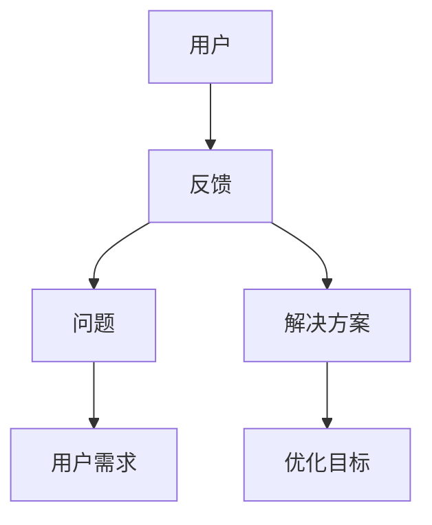
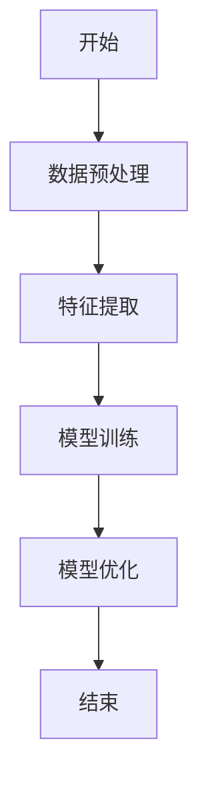
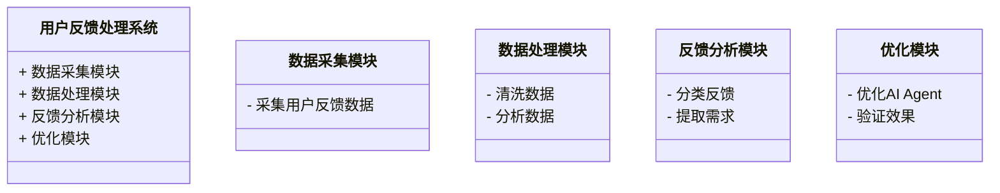
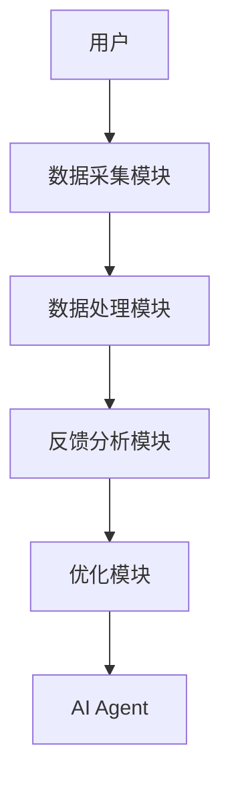

                 


# 用户反馈处理：不断改进AI Agent的表现

> 关键词：用户反馈处理，AI Agent，反馈分类，反馈分析，反馈优化，用户需求

> 摘要：本文详细探讨了如何通过用户反馈处理来不断改进AI Agent的表现。从用户反馈的背景与概念、核心概念与联系、算法原理、系统分析与架构设计、项目实战到最佳实践，全面分析了用户反馈处理的各个方面。通过理论与实践相结合的方式，帮助读者理解并掌握如何利用用户反馈提升AI Agent的性能与用户体验。

---

## 第1章: 用户反馈处理的背景与概念

### 1.1 用户反馈的重要性

#### 1.1.1 用户反馈的定义与分类

用户反馈是指用户在与AI Agent交互过程中，对AI Agent的行为、结果或服务质量所做出的评价、建议或投诉。用户反馈可以通过多种形式呈现，如文本、评分、点击行为等。根据反馈的形式和内容，可以将其分为以下几类：

- **结构化反馈**：用户以特定格式提供的反馈，例如评分（1-5分）、选择题等形式。
- **非结构化反馈**：用户以自由文本形式提供的反馈，例如“这个回答不够详细”。
- **实时反馈**：用户在与AI Agent交互过程中即时提供的反馈。
- **延后反馈**：用户在使用AI Agent一段时间后提供的反馈。

#### 1.1.2 用户反馈在AI Agent中的作用

用户反馈是AI Agent改进的重要来源。通过分析用户反馈，AI Agent可以发现自身的不足，优化算法，提升服务质量。具体来说，用户反馈的作用包括：

1. **发现AI Agent的缺陷**：通过用户的反馈，可以识别AI Agent在功能、逻辑或用户体验上的不足。
2. **提升用户满意度**：通过优化AI Agent的表现，可以提高用户的满意度和忠诚度。
3. **增强AI Agent的能力**：通过分析反馈，可以改进AI Agent的算法，使其更加智能和高效。

#### 1.1.3 用户反馈处理的边界与外延

用户反馈处理的边界是指在AI Agent改进过程中，用户反馈处理的范围和限制。具体包括：

- **范围**：用户反馈处理仅限于与AI Agent直接相关的改进需求。
- **限制**：用户反馈处理不包括与AI Agent无关的其他改进需求。

用户反馈处理的外延是指在AI Agent改进过程中，用户反馈处理的扩展应用。例如，用户反馈可以用于优化AI Agent的交互流程、提升用户体验等。

---

### 1.2 用户反馈处理的核心概念

#### 1.2.1 用户需求与反馈的关系

用户需求是用户在与AI Agent交互过程中期望实现的目标或解决的问题。用户反馈是用户对AI Agent满足其需求的程度的直接反映。两者之间的关系如下：

- **需求驱动反馈**：用户根据自身需求对AI Agent的表现进行评价，从而产生反馈。
- **反馈反哺需求**：通过分析反馈，可以更好地理解用户需求，从而优化AI Agent的功能和服务。

#### 1.2.2 反馈的类型与特征对比

用户反馈的类型和特征可以通过以下表格进行对比：

| 反馈类型 | 特征描述 | 示例 |
|----------|----------|------|
| 结构化反馈 | 以特定格式呈现，便于分析 | 用户对AI Agent的回答打分（1-5分） |
| 非结构化反馈 | 文本形式，内容丰富但难以直接分析 | 用户评论：“这个回答不够详细” |
| 正面反馈 | 表达满意或认可 | “我非常喜欢这个功能！” |
| 负面反馈 | 表达不满或批评 | “这个功能用起来很不方便” |
| 显性反馈 | 用户明确表达的需求或意见 | “我希望AI Agent能提供更多相关建议” |
| 隐性反馈 | 用户通过行为间接表达的需求或意见 | 用户未点击任何推荐链接 |

#### 1.2.3 反馈处理的流程与步骤

用户反馈处理的流程包括以下几个步骤：

1. **数据采集**：收集用户反馈数据，包括文本、评分、行为数据等。
2. **数据预处理**：对反馈数据进行清洗、去噪和归一化处理。
3. **反馈分析**：对反馈数据进行分类、主题建模和情感分析，提取关键信息。
4. **问题识别**：根据分析结果，识别用户反馈中提到的问题或需求。
5. **解决方案设计**：针对识别出的问题，设计改进方案。
6. **反馈优化**：实施改进方案，优化AI Agent的表现。
7. **效果验证**：验证改进效果，收集新的反馈，形成闭环。

---

## 第2章: 用户反馈处理的核心概念与联系

### 2.1 反馈处理的原理

#### 2.1.1 数据采集与处理

用户反馈处理的第一步是数据采集与处理。数据采集可以通过以下方式实现：

- **文本反馈**：用户通过文本框输入反馈意见。
- **评分反馈**：用户对AI Agent的表现进行评分。
- **行为反馈**：通过记录用户的点击、停留时间等行为数据，间接获取反馈。

数据处理包括数据清洗、去重、分词等步骤，确保数据的质量和一致性。

#### 2.1.2 反馈分析与建模

反馈分析与建模是用户反馈处理的核心环节。通过分析反馈数据，可以提取用户需求和问题。常用的方法包括：

- **文本分类**：将用户反馈文本分为正面、负面或中性。
- **主题建模**：识别用户反馈中的主要主题。
- **情感分析**：判断用户反馈的情感倾向。

#### 2.1.3 反馈应用与优化

反馈应用与优化是用户反馈处理的最终目标。通过分析反馈数据，可以优化AI Agent的算法、交互流程和用户体验。

---

### 2.2 反馈类型对比分析

#### 2.2.1 结构化反馈与非结构化反馈

结构化反馈和非结构化反馈在处理难度和应用上存在差异。结构化反馈易于分析和处理，但缺乏灵活性；非结构化反馈内容丰富，但处理复杂。

#### 2.2.2 正面反馈与负面反馈

正面反馈和负面反馈在用户需求识别和改进方向上具有不同的作用。正面反馈可以作为改进的参考，负面反馈则需要优先处理。

#### 2.2.3 显性反馈与隐性反馈

显性反馈和隐性反馈在用户需求识别上的难度不同。显性反馈直接反映用户需求，隐性反馈需要通过行为分析间接推测。

---

### 2.3 反馈处理的ER实体关系图

以下是用户反馈处理的ER实体关系图：



---

## 第3章: 用户反馈处理的算法原理

### 3.1 反馈驱动的机器学习模型

#### 3.1.1 基于监督学习的反馈分类

基于监督学习的反馈分类是一种常用方法。通过标注的反馈数据，训练分类模型，识别用户反馈的类别。

#### 3.1.2 基于强化学习的反馈优化

基于强化学习的反馈优化是一种动态优化方法。通过用户反馈的实时反馈，调整AI Agent的行为策略，提升表现。

#### 3.1.3 基于聚类的反馈分组

基于聚类的反馈分组是一种无监督学习方法。通过聚类算法，将相似的反馈分组，识别用户反馈的主要主题。

---

### 3.2 反馈处理算法的流程图

以下是反馈处理算法的流程图：



---

### 3.3 反馈处理的数学模型

#### 3.3.1 分类模型的损失函数

分类模型的损失函数通常使用交叉熵损失函数：

$$L = -\sum_{i=1}^{n} [y_i \ln p_i + (1-y_i)\ln (1-p_i)]$$

其中，$y_i$ 是真实标签，$p_i$ 是模型预测的概率。

#### 3.3.2 回归模型的预测公式

回归模型的预测公式可以表示为：

$$y = \beta_0 + \beta_1x + \eps$$

其中，$y$ 是预测值，$\beta_0$ 和 $\beta_1$ 是模型参数，$x$ 是输入特征，$\eps$ 是误差项。

---

## 第4章: 系统分析与架构设计

### 4.1 问题场景介绍

用户反馈处理系统需要解决的主要问题包括：

- 如何高效采集和处理用户反馈数据。
- 如何准确分析用户反馈，识别问题和需求。
- 如何优化AI Agent的表现，提升用户体验。

---

### 4.2 系统功能设计

以下是用户反馈处理系统的功能设计：



---

### 4.3 系统架构设计

以下是用户反馈处理系统的架构设计：



---

## 第5章: 项目实战

### 5.1 环境配置

以下是项目实战的环境配置：

- **编程语言**：Python
- **框架**：TensorFlow、Scikit-learn
- **工具**：Jupyter Notebook

---

### 5.2 核心代码实现

以下是用户反馈处理的核心代码实现：

```python
import pandas as pd
from sklearn.model import LinearSVC
from sklearn.feature_extraction.text import TfidfVectorizer

# 数据预处理
df = pd.read_csv('feedback.csv')
X = df['text'].values
y = df['label'].values

# 特征提取
vectorizer = TfidfVectorizer()
X_features = vectorizer.fit_transform(X)

# 模型训练
model = LinearSVC()
model.fit(X_features, y)

# 模型预测
test_text = ["这个回答不够详细"]
test_features = vectorizer.transform(test_text)
predicted_label = model.predict(test_features)
print(predicted_label)
```

---

### 5.3 案例分析

以下是用户反馈处理的案例分析：

- **案例背景**：某电商网站的客服AI Agent无法准确识别用户的问题，导致用户体验较差。
- **问题识别**：通过用户反馈分析，发现用户的主要问题是AI Agent无法准确理解用户需求。
- **解决方案设计**：优化AI Agent的自然语言处理模块，提升意图识别能力。
- **效果验证**：用户满意度提高，反馈负面评论减少。

---

## 第6章: 最佳实践与总结

### 6.1 最佳实践

1. **实时反馈处理**：及时处理用户反馈，快速优化AI Agent的表现。
2. **反馈分类与分析**：根据反馈类型和特征，分类处理用户反馈。
3. **持续优化**：定期收集用户反馈，持续优化AI Agent。

### 6.2 小结

用户反馈处理是AI Agent改进的重要环节。通过合理的用户反馈处理，可以提升AI Agent的表现，增强用户体验。本文详细探讨了用户反馈处理的各个方面，从理论到实践，为读者提供了全面的指导。

### 6.3 注意事项

1. **数据隐私保护**：在处理用户反馈时，需注意用户数据的隐私保护。
2. **反馈处理的及时性**：及时处理用户反馈，避免用户流失。
3. **反馈处理的可扩展性**：设计灵活的反馈处理系统，适应不同场景的需求。

### 6.4 拓展阅读

1. 《反馈驱动的机器学习模型优化》
2. 《自然语言处理在用户反馈分析中的应用》
3. 《基于强化学习的AI Agent优化》

---

## 作者：AI天才研究院/AI Genius Institute & 禅与计算机程序设计艺术 /Zen And The Art of Computer Programming

---

希望这篇文章能为您提供有价值的信息，并帮助您更好地理解如何通过用户反馈处理来改进AI Agent的表现。如果需要进一步探讨或案例分析，欢迎随时联系！

