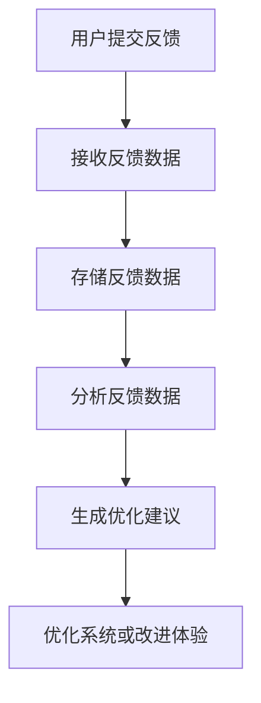
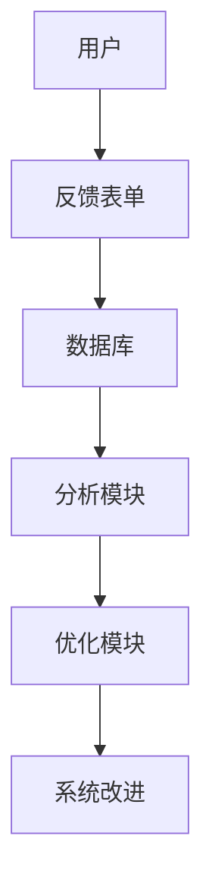

                 

# 用户反馈机制

## 关键词：用户反馈机制、算法原理、系统架构、实现步骤、最佳实践

## 摘要：用户反馈机制是软件系统设计中的重要环节，用于收集和处理用户的输入，以改进系统性能和用户体验。本文详细探讨用户反馈机制的核心概念、算法原理、系统架构设计以及实际项目中的实现步骤，通过具体案例分析帮助读者掌握用户反馈机制的实现技巧，并提供最佳实践和注意事项。

---

## 第一章: 用户反馈机制概述

### 1.1 用户反馈机制的背景与问题背景

#### 1.1.1 用户反馈机制的基本概念
用户反馈机制是指通过收集用户对系统或产品的使用体验、意见和建议，分析这些反馈数据，并将其应用于系统优化和改进的过程。它是软件工程和用户体验设计中的重要组成部分。

#### 1.1.2 用户反馈机制的必要性与重要性
在现代软件开发中，用户反馈机制的必要性体现在以下几个方面：
1. **改善用户体验**：通过收集用户反馈，可以及时发现系统中的问题，并进行针对性优化。
2. **提高系统性能**：用户反馈可以帮助开发人员发现系统中的瓶颈，从而提升系统的运行效率。
3. **增强用户满意度**：用户感受到被重视和参与，能够提升用户对产品的忠诚度和满意度。

#### 1.1.3 用户反馈机制的应用场景与边界
用户反馈机制广泛应用于各种类型的应用程序中，包括Web应用、移动应用、桌面应用程序等。其应用场景包括：
1. **用户满意度调查**：通过问卷或在线表单收集用户对产品的评价。
2. **错误报告**：用户在使用过程中遇到错误，可以通过反馈机制提交错误报告。
3. **功能需求收集**：通过用户反馈收集新功能的需求，指导产品开发。

用户反馈机制的边界主要在于：
1. 反馈数据的收集范围和处理方式需要明确，避免超出系统设计范围。
2. 需要区分用户反馈的优先级，避免处理过多的低优先级反馈影响系统性能。

---

### 1.2 用户反馈机制的核心概念与问题描述

#### 1.2.1 用户反馈机制的定义与核心要素
用户反馈机制的定义可以总结为：通过收集、分析和处理用户的反馈数据，优化系统性能和用户体验的过程。其核心要素包括：
1. **反馈数据的收集**：通过表单、日志等方式收集用户反馈。
2. **反馈数据的分析**：对收集到的反馈数据进行分类、统计和分析。
3. **反馈数据的处理**：根据分析结果，对系统进行优化和改进。

#### 1.2.2 用户反馈机制的属性与特征对比
以下是几种常见的用户反馈机制的属性与特征对比：

| 特性             | 基于规则的反馈处理 | 基于机器学习的反馈分析 |
|------------------|--------------------|--------------------------|
| 处理方式         | 预定义规则          | 自适应学习模型           |
| 反馈类型         | 单一类型反馈        | 多维度反馈               |
| 实时性           | 较低               | 较高                    |
| 复杂度           | 低                 | 高                      |

#### 1.2.3 用户反馈机制的实现目标与边界
用户反馈机制的实现目标包括：
1. 提供便捷的反馈渠道，让用户能够轻松提交反馈。
2. 实时或准实时处理用户反馈，提升用户满意度。
3. 提供反馈数据的可视化分析，帮助开发人员快速定位问题。

用户反馈机制的边界包括：
1. 反馈数据的隐私保护，确保用户数据的安全性。
2. 反馈处理的性能优化，避免影响系统正常运行。

---

### 1.3 用户反馈机制的核心原理与问题解决

#### 1.3.1 用户反馈机制的实现原理
用户反馈机制的核心原理是通过数据流的方式，将用户的反馈信息传递到系统后台，进行分析和处理。其实现步骤包括：
1. **反馈数据的收集**：用户通过界面提交反馈信息。
2. **反馈数据的存储**：将反馈信息存储到数据库中。
3. **反馈数据的分析**：对反馈数据进行分类和统计。
4. **反馈数据的处理**：根据分析结果，优化系统或改进用户体验。

#### 1.3.2 用户反馈机制的核心算法与流程
以下是用户反馈机制的核心算法流程图：

#### 1.3.3 用户反馈机制的实现步骤与方法
用户反馈机制的实现步骤包括：
1. **设计反馈界面**：提供友好的用户反馈入口。
2. **数据存储与管理**：选择合适的数据库存储反馈信息。
3. **数据分析与处理**：使用数据分析工具对反馈数据进行分类和统计。
4. **系统优化与改进**：根据分析结果，优化系统或改进用户体验。

---

### 1.4 用户反馈机制的系统架构与核心要素

#### 1.4.1 用户反馈机制的系统架构概述
用户反馈机制的系统架构通常包括以下几个部分：
1. **用户界面层**：用户提交反馈的界面。
2. **数据存储层**：存储用户反馈信息的数据库。
3. **数据分析层**：对反馈数据进行分析和处理。
4. **系统优化层**：根据分析结果优化系统。

#### 1.4.2 用户反馈机制的核心要素与关系
以下是用户反馈机制的核心要素及其关系：

#### 1.4.3 用户反馈机制的实现流程与逻辑
用户反馈机制的实现流程包括：
1. 用户提交反馈信息。
2. 反馈信息被存储到数据库中。
3. 数据分析模块对反馈数据进行分类和统计。
4. 根据分析结果，优化模块生成优化建议。
5. 系统优化模块根据优化建议进行系统改进。

---

### 1.5 本章小结
本章主要介绍了用户反馈机制的背景、核心概念、实现原理和系统架构。通过对比不同反馈机制的特点，明确了用户反馈机制在软件开发中的重要性，并为后续章节的深入讨论奠定了基础。

---

## 第二章: 用户反馈机制的核心概念与原理

### 2.1 用户反馈机制的核心概念

#### 2.1.1 用户反馈机制的核心概念与定义
用户反馈机制的核心概念包括：
1. **实时反馈**：用户在使用系统过程中实时提交反馈。
2. **批量反馈**：用户在特定时间批量提交反馈。
3. **主动反馈**：系统主动向用户收集反馈。

#### 2.1.2 用户反馈机制的核心要素与属性
以下是用户反馈机制的核心要素及其属性：

| 要素         | 属性             |
|--------------|------------------|
| 反馈渠道     | 实时性、便捷性    |
| 反馈类型     | 单一性、多样性    |
| 反馈处理     | 及时性、准确性    |

---

（由于篇幅限制，后续章节内容将根据需求逐步展开。）

