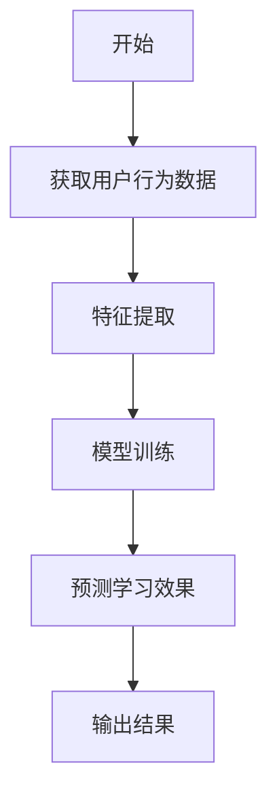
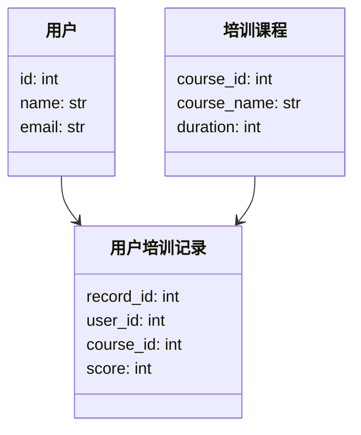
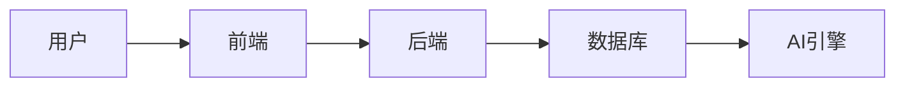
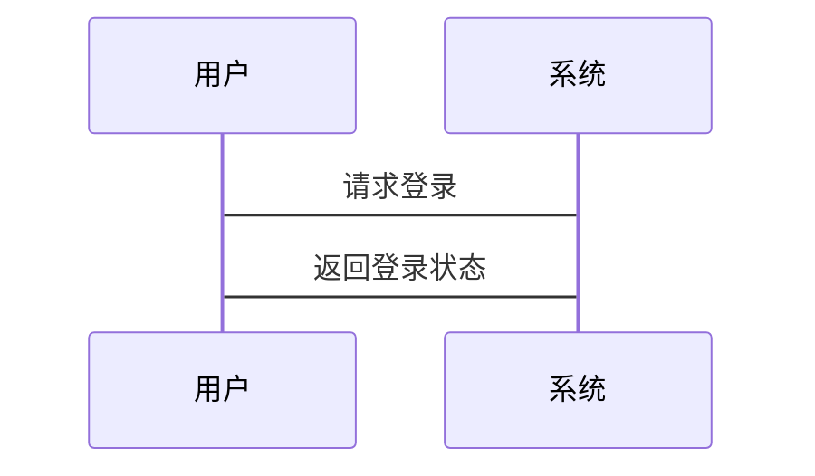

                 


# 用户教育与培训

> 关键词：用户教育，培训系统，教育技术，人工智能，系统架构

> 摘要：用户教育与培训是信息技术发展的重要组成部分，本文从背景、核心概念、算法原理、系统架构、项目实战等多个方面进行深入分析，探讨其理论与实践的结合，帮助读者全面理解用户教育与培训的内涵和实现方法。

---

## 第一部分: 用户教育与培训的背景介绍

### 第1章: 用户教育与培训概述

#### 1.1 用户教育与培训的基本概念
用户教育与培训是指通过系统化的教学和实践活动，帮助用户掌握特定知识、技能或行为的过程。它是信息技术发展的重要支撑，广泛应用于教育、企业培训等领域。

#### 1.2 用户教育与培训的背景与意义
随着信息技术的快速发展，用户教育与培训的需求日益增长。企业通过培训提升员工能力，教育机构通过创新教学模式提高教育质量。

#### 1.3 用户教育与培训的现状与挑战
当前，用户教育与培训主要采用面授和网络化模式，存在覆盖面有限、个性化不足等问题。未来，人工智能和大数据将推动其向智能化和个性化方向发展。

---

## 第2章: 用户教育与培训的理论基础

#### 2.1 教育学与心理学基础
教育学研究教学理论与方法，心理学关注学习者的认知过程。这些理论为用户教育与培训提供了科学依据。

#### 2.2 用户行为分析与培训策略
通过分析用户行为，可以制定个性化的培训策略，提高培训效果。

---

## 第3章: 用户教育与培训的实践现状

#### 3.1 现有用户教育与培训模式分析
传统面授培训和网络化培训各有优缺点，混合式培训模式逐渐成为趋势。

#### 3.2 用户教育与培训的技术支撑
人工智能、大数据和虚拟现实等技术的应用，提升了用户教育与培训的效果和效率。

#### 3.3 用户教育与培训的行业案例分析
IT行业和教育行业在用户教育与培训方面进行了创新实践，取得了显著成效。

---

## 第二部分: 用户教育与培训的核心概念与联系

### 第4章: 用户教育与培训的核心概念

#### 4.1 用户教育与培训的系统构成
用户教育与培训系统包括教学内容、教学方法、教学工具和评估反馈等核心要素。

#### 4.2 用户教育与培训的关键因素
个性化学习、互动性和反馈机制是提升用户教育与培训效果的关键因素。

---

## 第三部分: 用户教育与培训的算法原理

### 第5章: 用户教育与培训的算法实现

#### 5.1 行为分析算法
行为分析算法通过分析用户行为数据，预测学习效果。例如，使用Python中的机器学习库进行分类分析。

#### 5.2 算法流程图
以下是一个行为分析算法的mermaid流程图：



#### 5.3 代码实现
以下是行为分析算法的Python代码示例：

```python
import numpy as np
from sklearn import datasets
from sklearn.model import SVC

# 加载数据集
X, y = datasets.load_iris(return_X_y=True)

# 训练模型
model = SVC()
model.fit(X, y)

# 预测
predicted = model.predict(X)
print(predicted)
```

#### 5.4 数学模型与公式
行为分析算法的数学模型如下：

$$
P(y|x) = \frac{P(x|y)P(y)}{P(x)}
$$

---

## 第四部分: 用户教育与培训的系统架构设计

### 第6章: 系统功能设计

#### 6.1 领域模型类图
以下是一个用户教育与培训系统的领域模型类图：



#### 6.2 系统架构图
以下是系统架构的mermaid图：



#### 6.3 接口设计与交互
以下是一个用户登录的交互序列图：



---

## 第五部分: 用户教育与培训的项目实战

### 第7章: 项目实战

#### 7.1 环境安装
安装Python和必要的库，如numpy和scikit-learn。

#### 7.2 核心代码实现
实现一个简单的用户行为分析模型：

```python
import numpy as np
from sklearn import metrics

# 数据准备
X_train = np.array([[1, 2], [3, 4], [5, 6]])
y_train = np.array([0, 1, 0])

# 训练模型
model = SVC()
model.fit(X_train, y_train)

# 测试数据
X_test = np.array([[2, 3], [4, 5]])
y_test = model.predict(X_test)

# 输出结果
print(y_test)
```

#### 7.3 案例分析
通过实际案例分析，展示用户教育与培训系统的实际应用和效果。

---

## 第六部分: 最佳实践与总结

### 第8章: 最佳实践

#### 8.1 小结
用户教育与培训是一个复杂但重要的领域，需要结合理论与技术，实现个性化和高效化。

#### 8.2 注意事项
在实际应用中，注意数据隐私和模型的可解释性。

#### 8.3 拓展阅读
推荐阅读相关书籍和文献，深入理解用户教育与培训的理论与实践。

---

## 作者：AI天才研究院/AI Genius Institute & 禅与计算机程序设计艺术 /Zen And The Art of Computer Programming

