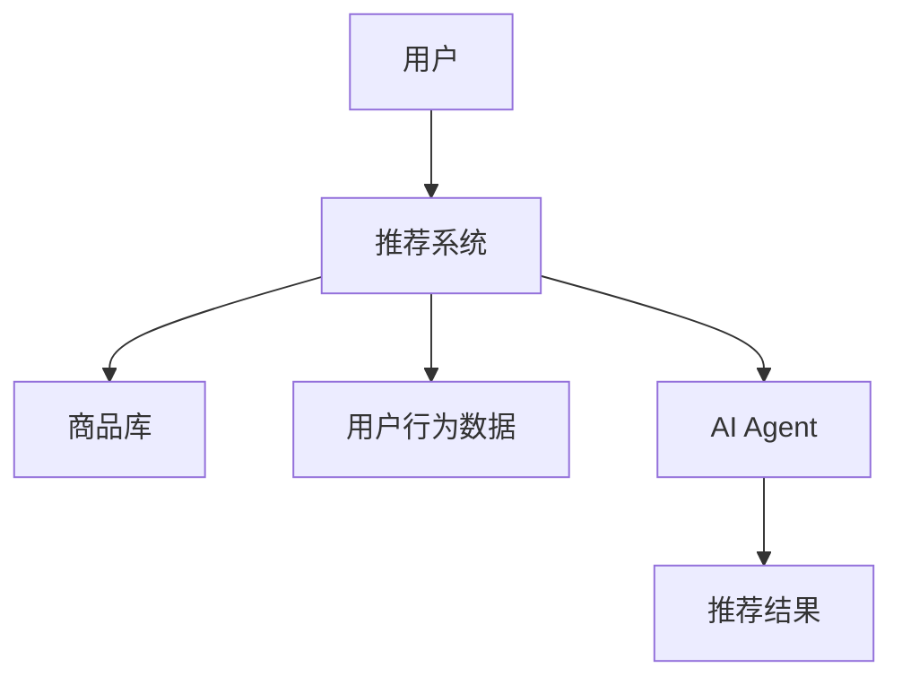
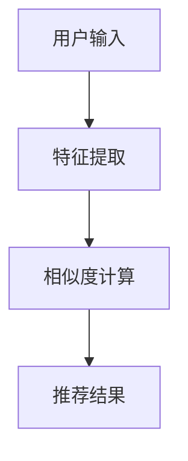
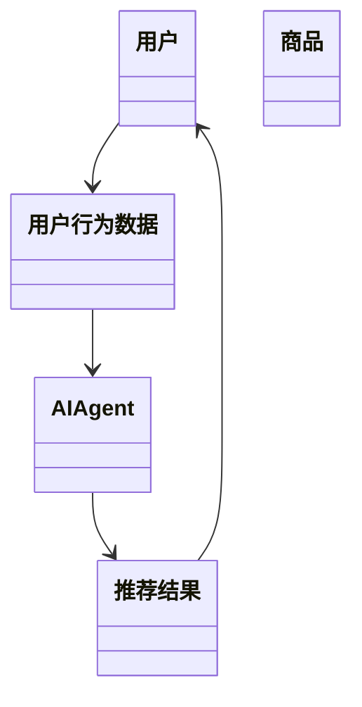
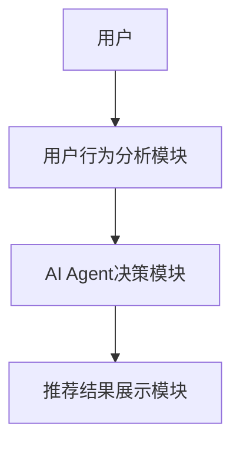
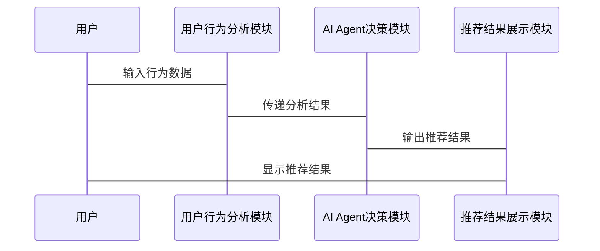

                 


# 《电子商务平台的AI Agent推荐系统》

---

## 关键词：
AI Agent、推荐系统、电子商务、协同过滤、深度学习、实时推荐

---

## 摘要：
本文深入探讨了在电子商务平台中引入AI Agent推荐系统的核心原理、算法实现和系统架构设计。通过分析用户需求与商品匹配的复杂性，结合动态数据的实时处理需求，本文提出了基于AI Agent的推荐系统解决方案，详细阐述了协同过滤、基于内容的推荐和混合推荐模型的实现方法，并通过Mermaid图和数学公式展示了系统的整体架构和算法流程。本文还通过实际案例分析，验证了AI Agent推荐系统的有效性，并总结了最佳实践和注意事项。

---

# 第一部分: 电子商务平台的AI Agent推荐系统概述

## 第1章: 问题背景与核心概念

### 1.1 问题背景

#### 1.1.1 电子商务平台的推荐系统现状
电子商务平台的核心目标是提升用户体验和销售额。推荐系统作为提升用户购买行为的重要工具，广泛应用于各大电商平台。然而，传统的推荐系统存在以下问题：

1. **推荐结果的相关性低**：传统推荐系统基于简单的协同过滤算法，无法准确捕捉用户的深层需求。
2. **实时性不足**：用户行为数据的实时性难以满足，导致推荐结果滞后。
3. **可解释性差**：复杂的推荐算法往往难以向用户解释推荐的原因。

#### 1.1.2 AI Agent在推荐系统中的应用价值
AI Agent（人工智能代理）是一种能够感知环境、自主决策并执行任务的智能体。将AI Agent引入推荐系统，可以显著提升推荐的准确性和实时性，同时增强系统的可解释性。

#### 1.1.3 当前推荐系统的挑战与痛点
1. **数据稀疏性**：用户行为数据不足以支持精确的推荐。
2. **冷启动问题**：新用户或新商品难以快速获得推荐。
3. **实时性要求高**：用户行为数据的实时更新对推荐系统提出了更高的要求。

### 1.2 问题描述

#### 1.2.1 用户需求与商品匹配的复杂性
用户的需求往往是多样化的，且会受到时间和场景的影响。例如，用户可能在不同的时间对同一类商品产生不同的兴趣。

#### 1.2.2 动态数据的实时处理需求
电子商务平台的用户行为数据是动态变化的，推荐系统需要实时处理这些数据以提供最新的推荐结果。

#### 1.2.3 推荐系统的可解释性问题
用户往往希望了解推荐的原因，以便信任推荐结果并进行决策。

### 1.3 问题解决思路

#### 1.3.1 引入AI Agent的必要性
AI Agent能够通过感知环境和自主决策，实时调整推荐策略，从而提升推荐系统的性能。

#### 1.3.2 AI Agent在推荐系统中的角色定位
AI Agent在推荐系统中主要负责以下任务：
1. **数据采集与分析**：实时采集用户行为数据，并进行分析。
2. **推荐策略制定**：根据分析结果制定推荐策略。
3. **推荐结果输出**：将推荐结果输出给用户。

#### 1.3.3 系统边界与外延
推荐系统的核心边界包括用户、商品、推荐算法和AI Agent。系统的外延则涉及数据存储、用户界面和支付系统。

### 1.4 核心概念与系统架构

#### 1.4.1 AI Agent的核心要素
AI Agent的核心要素包括：
1. **感知模块**：用于采集用户行为数据。
2. **决策模块**：用于制定推荐策略。
3. **执行模块**：用于输出推荐结果。

#### 1.4.2 推荐系统的功能模块
推荐系统的功能模块包括：
1. **用户行为分析模块**：分析用户的点击、浏览和购买行为。
2. **推荐算法模块**：基于用户行为数据生成推荐结果。
3. **结果展示模块**：将推荐结果展示给用户。

#### 1.4.3 系统整体架构图（Mermaid）


### 1.5 本章小结
本章详细介绍了电子商务平台推荐系统的现状和挑战，提出了引入AI Agent的必要性，并从系统架构的角度分析了AI Agent在推荐系统中的作用。

---

## 第2章: AI Agent的核心原理

### 2.1 AI Agent的基本原理

#### 2.1.1 什么是AI Agent
AI Agent是一种能够感知环境、自主决策并执行任务的智能体。它能够通过传感器感知环境，通过执行器与环境交互。

#### 2.1.2 AI Agent的智能决策机制
AI Agent的智能决策机制包括以下步骤：
1. **感知环境**：通过传感器采集环境数据。
2. **分析数据**：基于采集的数据进行分析和推理。
3. **制定决策**：根据分析结果制定决策。
4. **执行决策**：通过执行器执行决策。

#### 2.1.3 Agent与推荐系统的结合
将AI Agent与推荐系统结合，可以实现动态、实时的推荐。

### 2.2 推荐系统的算法原理

#### 2.2.1 协同过滤算法
协同过滤算法是一种基于用户相似性推荐算法。具体步骤如下：
1. **用户相似度计算**：基于用户行为数据计算用户相似度。
2. **推荐商品计算**：基于用户相似度计算推荐商品。

公式：
$$\text{相似度}(u, v) = \frac{\sum_{i} (u_i - \bar{u})(v_i - \bar{v})}{\sqrt{\sum_{i} (u_i - \bar{u})^2} \cdot \sqrt{\sum_{i} (v_i - \bar{v})^2}}$$

#### 2.2.2 基于内容的推荐算法
基于内容的推荐算法是一种基于商品属性推荐算法。具体步骤如下：
1. **商品特征提取**：提取商品的特征向量。
2. **用户偏好匹配**：基于用户偏好匹配商品。

公式：
$$\text{相似度}(c_u, c_v) = \frac{\sum_{i} w_i \cdot f_i(u)}{\sqrt{\sum_{i} w_i^2 \cdot f_i(u)^2} \cdot \sqrt{\sum_{i} w_i^2 \cdot f_i(v)^2}}$$

#### 2.2.3 混合推荐模型
混合推荐模型是一种结合协同过滤和基于内容的推荐算法。具体步骤如下：
1. **协同过滤推荐**：基于用户行为数据推荐商品。
2. **内容推荐**：基于商品属性推荐商品。
3. **融合推荐结果**：将两种推荐结果融合。

### 2.3 AI Agent推荐系统的数学模型

#### 2.3.1 用户-商品相似度计算
用户-商品相似度计算公式：
$$\text{相似度}(u, c) = \sum_{i} w_i \cdot (u_i - \bar{u})(c_i - \bar{c})$$

#### 2.3.2 基于概率的推荐模型
基于概率的推荐模型公式：
$$P(c | u) = \frac{P(u) \cdot P(c | u)}{P(u) \cdot P(c | u) + P(\neg u) \cdot P(c | \neg u)}$$

#### 2.3.3 深度学习模型的应用
深度学习模型（如神经网络）可以用于推荐系统的特征提取和预测。

### 2.4 算法流程图（Mermaid）


### 2.5 本章小结
本章详细介绍了AI Agent的基本原理和推荐系统的算法原理，包括协同过滤、基于内容的推荐和混合推荐模型的实现方法。

---

## 第3章: 问题场景与系统功能设计

### 3.1 问题场景介绍

#### 3.1.1 电商推荐系统的典型场景
电商推荐系统的典型场景包括：
1. **首页推荐**：基于用户行为推荐商品。
2. **商品详情页推荐**：基于商品属性推荐相关商品。
3. **购物车推荐**：基于购物车中的商品推荐相关商品。

#### 3.1.2 AI Agent在推荐系统中的应用场景
AI Agent在推荐系统中的应用场景包括：
1. **实时推荐**：基于实时用户行为推荐商品。
2. **个性化推荐**：基于用户偏好推荐商品。
3. **动态调整推荐策略**：根据用户行为动态调整推荐策略。

#### 3.1.3 系统的用户角色与权限
系统的用户角色包括：
1. **普通用户**：可以查看推荐结果。
2. **管理员**：可以管理推荐系统。

### 3.2 系统功能设计

#### 3.2.1 用户行为分析模块
用户行为分析模块的功能包括：
1. **数据采集**：采集用户的点击、浏览和购买行为。
2. **数据存储**：将用户行为数据存储到数据库中。
3. **数据分析**：分析用户行为数据，提取用户偏好。

#### 3.2.2 AI Agent决策模块
AI Agent决策模块的功能包括：
1. **数据处理**：处理用户行为数据。
2. **决策制定**：基于用户行为数据制定推荐策略。
3. **结果输出**：将推荐结果输出到推荐结果展示模块。

#### 3.2.3 推荐结果展示模块
推荐结果展示模块的功能包括：
1. **结果展示**：将推荐结果展示给用户。
2. **用户反馈采集**：采集用户的反馈数据。
3. **反馈处理**：处理用户的反馈数据，调整推荐策略。

### 3.3 领域模型类图（Mermaid）


### 3.4 本章小结
本章通过分析电商推荐系统的典型场景，设计了系统的功能模块，并通过类图展示了系统的整体架构。

---

## 第4章: 系统分析与架构设计

### 4.1 系统架构设计

#### 4.1.1 整体架构图（Mermaid）


#### 4.1.2 系统功能模块
系统功能模块包括：
1. **用户行为分析模块**：负责数据采集和分析。
2. **AI Agent决策模块**：负责制定推荐策略。
3. **推荐结果展示模块**：负责展示推荐结果。

#### 4.1.3 系统接口设计
系统接口设计包括：
1. **用户输入接口**：用户输入行为数据。
2. **数据存储接口**：数据存储到数据库。
3. **推荐结果输出接口**：推荐结果输出到前端。

### 4.2 系统交互流程图（Mermaid）


### 4.3 本章小结
本章通过架构设计和交互流程图展示了系统的整体架构和功能模块的交互关系。

---

## 第5章: 项目实战

### 5.1 项目介绍
本项目旨在实现一个基于AI Agent的推荐系统，应用于电子商务平台。

### 5.2 核心代码实现

#### 5.2.1 环境安装
推荐系统需要以下环境：
1. **Python 3.6+**
2. **TensorFlow 2.0+**
3. **Pandas**
4. **Scikit-learn**

#### 5.2.2 核心代码实现

##### 数据预处理代码
```python
import pandas as pd
from sklearn.preprocessing import StandardScaler

# 读取数据
data = pd.read_csv('user_behavior.csv')

# 数据清洗
data.dropna()

# 标准化处理
scaler = StandardScaler()
scaled_data = scaler.fit_transform(data)
```

##### 协同过滤算法实现
```python
import numpy as np
from sklearn.metrics.pairwise import cosine_similarity

# 计算用户相似度
user_similarity = cosine_similarity(scaled_data)

# 基于用户相似度的推荐
def recommend_user(user_id, user_similarity, threshold=0.5):
    similar_users = np.where(user_similarity[user_id] > threshold)[0]
    recommended_items = []
    for user in similar_users:
        recommended_items.extend(users[user]['items'])
    return recommended_items
```

##### AI Agent决策模块实现
```python
class AI-Agent:
    def __init__(self, user_similarity, item_similarity):
        self.user_similarity = user_similarity
        self.item_similarity = item_similarity

    def decide_recommendation(self, user_id, threshold=0.5):
        similar_users = np.where(self.user_similarity[user_id] > threshold)[0]
        recommended_items = []
        for user in similar_users:
            recommended_items.extend(users[user]['items'])
        return recommended_items
```

### 5.3 代码应用解读与分析
1. **数据预处理**：对用户行为数据进行清洗和标准化处理。
2. **协同过滤算法**：基于用户相似度计算推荐结果。
3. **AI Agent决策模块**：基于用户行为数据制定推荐策略。

### 5.4 实际案例分析
以某电商平台为例，分析用户行为数据，计算用户相似度，并生成推荐结果。

### 5.5 本章小结
本章通过实际案例分析，详细讲解了AI Agent推荐系统的实现过程，包括环境安装、核心代码实现和结果展示。

---

## 第6章: 最佳实践与注意事项

### 6.1 小结
AI Agent推荐系统在电子商务平台中的应用能够显著提升用户体验和销售额。

### 6.2 注意事项
1. **数据隐私保护**：确保用户数据的安全和隐私。
2. **系统实时性**：保证推荐结果的实时性。
3. **算法可解释性**：提升推荐系统的可解释性。

### 6.3 拓展阅读
1. **《推荐系统实战》**：深入讲解推荐系统的实现方法。
2. **《AI Agent原理与应用》**：详细分析AI Agent的核心原理和应用场景。

### 6.4 本章小结
本章总结了AI Agent推荐系统的应用价值，并提出了实际应用中的注意事项和拓展阅读方向。

---

## 结语
AI Agent推荐系统在电子商务平台中的应用前景广阔，随着技术的不断进步，推荐系统的性能和用户体验将不断提升。通过本文的分析和实践，读者可以深入了解AI Agent推荐系统的实现方法，并在实际应用中不断优化。

---

## 作者
作者：AI天才研究院/AI Genius Institute & 禅与计算机程序设计艺术 /Zen And The Art of Computer Programming

