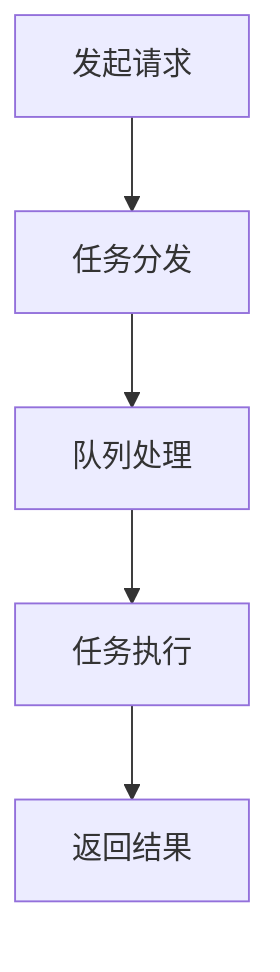
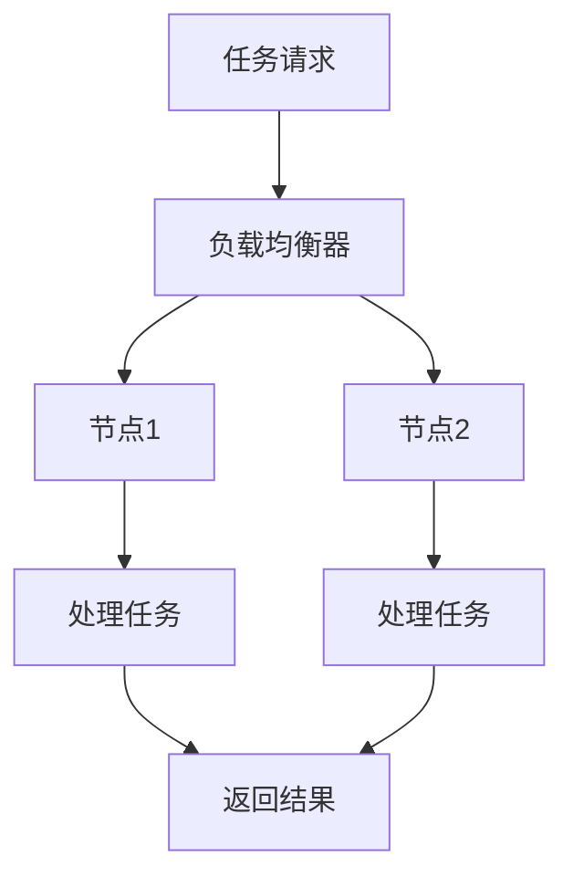
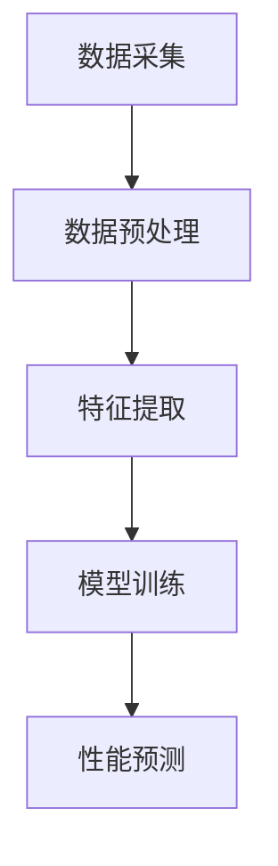
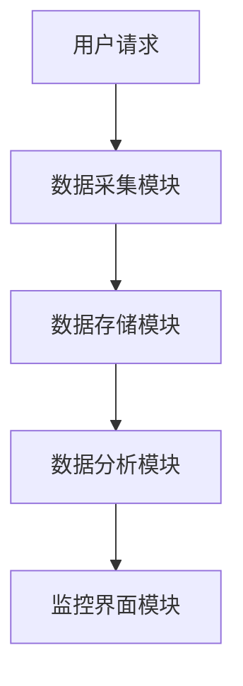

                 


# 监控与优化AI Agent性能的关键指标

> **关键词**：AI Agent、性能监控、关键指标、响应时间、吞吐量、延迟优化、资源利用率

> **摘要**：本文详细探讨了监控与优化AI Agent性能的关键指标，涵盖响应时间、吞吐量、准确率、资源利用率、错误率、延迟和系统稳定性等多个维度。通过分析这些指标的数学模型、算法原理和实际应用场景，本文为AI Agent的性能优化提供了系统化的解决方案和实践指导。

---

## 第一部分：监控与优化AI Agent性能的背景与核心概念

### 第1章：问题背景与核心概念

#### 1.1 问题背景

随着人工智能技术的快速发展，AI Agent（智能体）在企业中的应用越来越广泛。AI Agent能够自主决策并执行任务，但在实际应用中，性能问题常常成为制约其效率的关键因素。例如，一个在线客服AI Agent如果响应时间过长，会导致用户体验下降，甚至影响企业的声誉。因此，监控和优化AI Agent的性能至关重要。

AI Agent的性能监控不仅涉及技术层面的优化，还需要结合业务目标进行综合评估。传统软件开发中的性能监控方法并不完全适用于AI Agent，因为AI Agent具有更强的自主性和复杂性。

---

#### 1.2 问题描述

AI Agent的性能问题主要表现在以下几个方面：

1. **响应时间过长**：AI Agent无法在规定时间内完成任务或提供结果。
2. **吞吐量不足**：AI Agent在单位时间内处理的任务数量低于预期。
3. **准确性下降**：AI Agent的决策或输出结果出现错误。
4. **资源利用率低**：CPU、内存、网络等资源未被充分利用，导致性能浪费。
5. **系统稳定性差**：AI Agent在运行过程中频繁出现故障或崩溃。

为了全面监控和优化AI Agent的性能，需要从多个维度定义关键指标，并通过这些指标的分析和优化，提升AI Agent的整体性能表现。

---

#### 1.3 核心概念与联系

在AI Agent的性能监控中，关键指标是衡量其性能的核心维度。以下是几个关键指标的定义和分类：

| **指标名称** | **定义** | **影响因素** | **测量方法** |
|--------------|----------|--------------|--------------|
| 响应时间    | AI Agent完成单个请求所需的时间 | 系统负载、算法复杂度、网络延迟 | 通过性能测试工具测量 |
| 吞吐量      | 单位时间内AI Agent完成的任务数量 | 并行处理能力、资源分配策略 | 使用基准测试工具测量 |
| 准确率      | AI Agent决策的正确性比例 | 数据质量、算法性能、训练数据 | 通过测试用例计算 |
| 资源利用率  | CPU、内存、网络等资源的使用情况 | 系统配置、任务负载 | 使用系统监控工具测量 |
| 错误率      | AI Agent在运行过程中出现的错误数量 | 系统稳定性、算法鲁棒性 | 通过日志分析计算 |

这些指标之间存在相互影响的关系。例如，响应时间过长可能导致吞吐量下降，而吞吐量不足可能与资源利用率低有关。通过分析这些指标的关系，可以找到性能瓶颈并采取优化措施。

---

## 第二部分：AI Agent性能监控的关键指标

### 第2章：响应时间与延迟优化

#### 2.1 响应时间的定义与测量

响应时间是AI Agent性能监控的核心指标之一。定义上，响应时间是指从用户发起请求到AI Agent返回结果的时间间隔。数学上，响应时间可以表示为：

$$
\text{响应时间} = \frac{\text{处理任务数}}{\text{处理速率}}
$$

在实际测量中，通常使用性能测试工具（如JMeter、LoadRunner）来模拟大量请求，并记录响应时间的平均值、最大值和最小值。以下是一个简单的响应时间测量流程：

1. 初始化测试环境。
2. 发起测试请求。
3. 记录每个请求的响应时间。
4. 统计并分析响应时间数据。

---

#### 2.2 延迟优化的算法原理

延迟优化是提升AI Agent响应时间的关键技术之一。以下是两种主要的延迟优化策略：

1. **基于队列的延迟优化**：通过合理分配任务到不同的队列，避免任务竞争导致的延迟。例如，使用优先级队列优先处理高优先级任务。
2. **分布式系统中的延迟优化**：通过分布式计算和负载均衡技术，将任务分发到多个节点上并行处理，减少单点压力。

以下是一个简单的延迟优化算法流程图：



---

## 第三部分：系统吞吐量与资源利用率

### 第3章：系统吞吐量的监控与优化

#### 3.1 吞吐量的定义与计算公式

吞吐量是衡量AI Agent处理能力的重要指标，定义为单位时间内完成的任务数量。数学上，吞吐量可以表示为：

$$
\text{吞吐量} = \frac{\text{处理任务数}}{\text{时间}}
$$

在实际应用中，吞吐量的计算通常需要考虑系统的负载和资源限制。例如，一个AI Agent在满负荷运行时，吞吐量可能会达到其最大值。

---

#### 3.2 资源利用率分析

资源利用率是衡量系统性能的另一个关键指标，包括CPU、内存、网络等资源的使用情况。以下是资源利用率的分析步骤：

1. **数据采集**：使用系统监控工具（如Prometheus、Zabbix）采集资源使用数据。
2. **数据清洗**：去除异常值和噪声数据。
3. **特征提取**：提取关键资源使用指标（如CPU使用率、内存占用率）。
4. **数据分析**：通过统计分析或机器学习模型预测资源使用趋势。

---

#### 3.3 系统吞吐量优化策略

优化系统吞吐量可以从以下几个方面入手：

1. **并行处理**：通过多线程或分布式计算提高任务处理速度。
2. **负载均衡**：将任务均匀分配到多个节点上，避免资源浪费。
3. **资源分配算法**：根据任务类型和资源需求动态分配资源。

以下是一个简单的负载均衡算法流程图：



---

## 第四部分：AI Agent性能监控的算法原理

### 第4章：性能监控算法详解

#### 4.1 数据采集与预处理

数据采集是性能监控的基础，主要包括以下步骤：

1. **数据源选择**：确定需要采集的数据类型（如响应时间、吞吐量）。
2. **数据采集工具**：使用性能测试工具或日志采集工具。
3. **数据清洗**：去除无效数据，填补缺失值。

#### 4.2 基于机器学习的性能预测

通过机器学习模型预测AI Agent的性能表现，可以帮助我们提前发现潜在问题。以下是算法流程：



以下是一个简单的回归模型代码示例：

```python
import numpy as np
from sklearn.linear_model import LinearRegression

# 数据准备
X = np.array([1, 2, 3, 4, 5]).reshape(-1, 1)
y = np.array([2, 4, 5, 4, 6])

# 模型训练
model = LinearRegression()
model.fit(X, y)

# 预测
predicted = model.predict(X)
print(predicted)
```

---

## 第五部分：系统架构与实现

### 第5章：系统架构设计

#### 5.1 系统功能设计

系统功能设计是性能监控的基础，主要包括以下几个方面：

1. **数据采集模块**：负责采集AI Agent的性能数据。
2. **数据存储模块**：将采集的数据存储到数据库中。
3. **数据分析模块**：对数据进行分析并生成报告。
4. **监控界面模块**：提供可视化界面供用户查看性能数据。

以下是一个简单的系统架构图：



---

## 第六部分：项目实战

### 第6章：项目实战与案例分析

#### 6.1 环境安装与配置

在实际项目中，需要先安装必要的工具和库。例如，安装Prometheus和Grafana用于系统监控：

```bash
# 安装Prometheus
wget https://github.com/prometheus/prometheus/releases/download/v2.45.0/prometheus-2.45.0.linux-amd64.tar.gz
tar xvf prometheus-2.45.0.linux-amd64.tar.gz
cd prometheus-2.45.0.linux-amd64
./prometheus --config.file=prometheus.yml
```

#### 6.2 核心代码实现

以下是一个简单的性能监控代码示例：

```python
import time
import logging

def monitor_performance(func):
    def wrapper(*args, **kwargs):
        start_time = time.time()
        result = func(*args, **kwargs)
        end_time = time.time()
        duration = end_time - start_time
        logging.info(f"Function {func.__name__} took {duration:.2f} seconds.")
        return result
    return wrapper
```

---

## 第七部分：注意事项与拓展阅读

### 7.1 注意事项

1. **数据准确性**：确保数据采集和处理的准确性。
2. **系统稳定性**：避免监控工具成为性能瓶颈。
3. **隐私保护**：处理敏感数据时需要注意隐私保护。

### 7.2 拓展阅读

1. **《高性能计算的艺术》**：深入探讨性能优化的理论与实践。
2. **《分布式系统：概念与设计》**：了解分布式系统中的性能优化方法。

---

## 第八部分：总结与展望

### 8.1 小结

本文从AI Agent性能监控的关键指标出发，详细探讨了响应时间、吞吐量、资源利用率等核心指标的定义、测量方法和优化策略。通过实际案例分析和代码实现，为AI Agent的性能优化提供了系统的解决方案。

### 8.2 展望

未来，随着AI技术的不断发展，AI Agent的性能监控将更加复杂和多样化。建议在以下几个方面进行深入研究：

1. **多维度性能监控**：结合业务目标制定更加全面的监控指标。
2. **自适应优化算法**：开发能够自适应调整的优化算法，提升系统灵活性。
3. **智能化监控工具**：利用人工智能技术，实现智能化的性能监控和优化。

---

## 作者：AI天才研究院（AI Genius Institute）

--- 

如果需要更详细的内容或代码实现，可以继续深入探讨！

