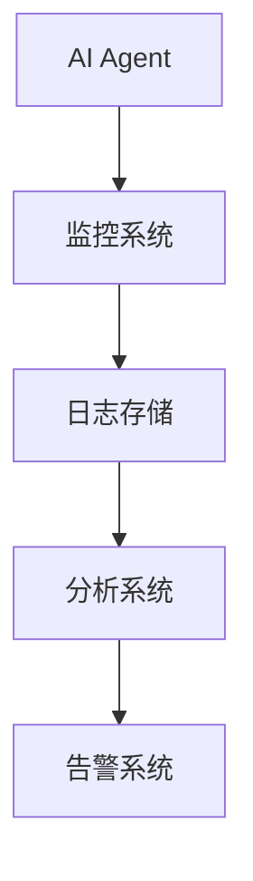
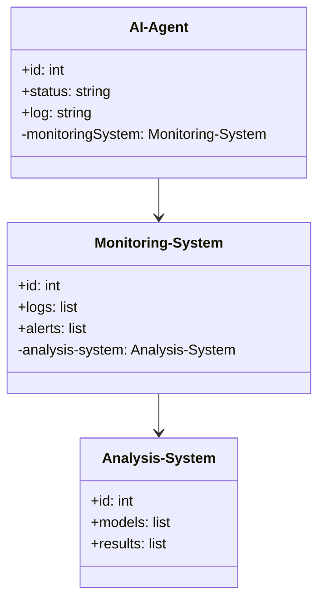
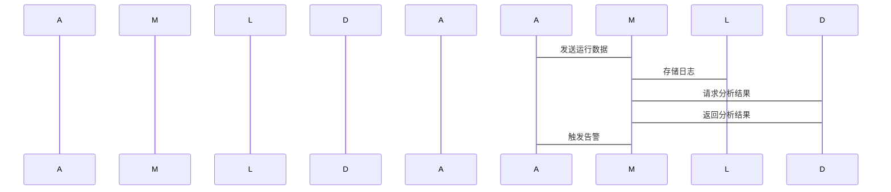

                 


# 监控与日志：跟踪AI Agent的运行状态

## 关键词：AI Agent, 监控, 日志, 系统管理, 异常检测, 时间序列分析

## 摘要：本文深入探讨了监控与日志在跟踪AI Agent运行状态中的重要性，详细分析了核心概念、算法原理、数学模型、系统架构设计以及实际项目实现，为读者提供全面的理论与实践指导。

---

## 第一部分：背景介绍

### 第1章：监控与日志的核心概念

#### 1.1 问题背景

- **AI Agent的广泛应用**：AI Agent在现代系统中扮演着关键角色，负责执行复杂任务、提供自动化服务以及优化系统性能。然而，AI Agent的运行状态直接关系到系统的稳定性和可靠性。
  
- **监控与日志的重要性**：监控和日志管理是确保AI Agent高效运行的核心手段。通过实时监控，可以及时发现并解决系统故障；通过日志分析，可以深入理解AI Agent的行为模式，识别潜在问题。

- **当前面临的挑战**：随着AI Agent的复杂性不断提高，传统的监控和日志管理方法已难以应对海量数据和复杂场景的需求。如何实现高效、智能的监控与日志管理成为亟待解决的问题。

#### 1.2 问题描述

- **AI Agent运行状态监控的必要性**：AI Agent的运行状态直接关系到系统的性能和用户体验。监控系统能够实时跟踪AI Agent的运行指标，确保其正常工作。
  
- **日志在AI Agent行为分析中的作用**：日志记录了AI Agent的所有操作和系统反馈，是分析其行为模式的重要依据。通过日志分析，可以发现异常行为，优化系统性能。

- **监控与日志管理的边界与外延**：监控与日志管理不仅限于数据的收集和存储，还包括数据分析、异常检测和告警等环节。其外延涉及数据可视化、预测分析和自动化响应。

#### 1.3 问题解决

- **监控与日志管理的目标**：通过实时监控和日志分析，确保AI Agent的高效运行，快速定位和解决系统故障，优化系统性能。

- **监控与日志管理的关键要素**：包括数据采集、存储、分析、可视化和告警等模块。每个模块都需协同工作，才能实现高效的监控与日志管理。

- **监控与日志管理的核心流程**：从数据采集到存储，再到分析和告警，每个环节都需要精心设计和优化，以确保系统的稳定性和可靠性。

---

## 第二部分：核心概念与联系

### 第2章：监控与日志的核心原理

#### 2.1 监控与日志管理的原理

- **监控的基本原理**：通过传感器、API调用或日志采集工具，实时采集AI Agent的运行数据，包括CPU使用率、内存占用、网络流量等关键指标。

- **日志管理的基本原理**：日志是系统运行的记录，通过结构化处理和存储，可以方便地进行查询、分析和挖掘，提取有价值的信息。

- **监控与日志管理的协同作用**：监控提供实时数据，日志管理提供历史记录，两者结合可以实现对AI Agent运行状态的全面了解和分析。

#### 2.2 核心概念对比

| 比较维度 | 监控 | 日志 |
|----------|------|-----|
| 数据类型 | 实时指标 | 历史记录 |
| 采集频率 | 高频 | 低频 |
| 主要用途 | 实时告警 | 行为分析 |
| 数据存储 | 时间序列数据库 | 结构化数据库 |

- **监控与日志管理的属性特征对比**：通过表格可以看出，监控侧重于实时数据，用于快速响应；日志侧重于历史数据，用于深入分析。

- **监控与日志管理的优缺点分析**：监控的优势在于实时性和高效性，但数据量大且难以长期存储；日志的优势在于全面性和可追溯性，但处理复杂且查询效率低。

- **监控与日志管理的适用场景对比**：监控适用于实时故障定位，日志适用于行为分析和问题追溯。

#### 2.3 实体关系图



- **AI Agent**：生成运行数据并发送给监控系统。
- **监控系统**：实时采集并传输数据到日志存储。
- **日志存储**：存储所有日志数据，供分析系统使用。
- **分析系统**：对日志进行分析，识别异常行为并触发告警。
- **告警系统**：根据分析结果发送告警信息，通知相关人员处理。

---

## 第三部分：算法原理讲解

### 第3章：日志收集与监控算法

#### 3.1 日志收集算法

- **日志收集的流程**：
  1. 数据采集：通过日志采集工具（如Flume、Logstash）收集AI Agent产生的日志。
  2. 数据预处理：对日志进行解析、过滤和格式化，便于后续存储和分析。
  3. 数据存储：将处理后的日志存储到分布式文件系统（如HDFS）或数据库中。

- **日志收集的实现**：
  ```python
  import logging
  import sys
  
  def setup_logger(name, log_file):
      logger = logging.getLogger(name)
      logger.setLevel(logging.INFO)
      handler = logging.FileHandler(log_file)
      formatter = logging.Formatter('%(asctime)s - %(name)s - %(levelname)s - %(message)s')
      handler.setFormatter(formatter)
      logger.addHandler(handler)
      return logger
  
  if __name__ == "__main__":
      logger = setup_logger('ai_agent_monitor', 'ai_agent.log')
      logger.info("AI Agent started")
      # ... 日志收集逻辑 ...
      logger.info("AI Agent stopped")
  ```

- **日志收集的优化**：
  - 使用高效的日志采集工具，减少数据传输延迟。
  - 对日志进行压缩存储，节省存储空间。
  - 配置合理的日志滚动策略，避免磁盘溢出。

#### 3.2 监控算法

- **监控算法的实现**：
  1. 数据采集：通过API或传感器获取AI Agent的实时运行指标。
  2. 数据分析：计算关键指标（如CPU使用率、内存占用）的平均值、最大值和最小值。
  3. 异常检测：基于统计方法或机器学习算法，识别指标的异常波动。

- **监控算法的优化**：
  - 使用滑动窗口技术，实时计算指标的动态趋势。
  - 结合历史数据，建立基线模型，提高异常检测的准确性。

- **监控算法的应用**：
  ```python
  import numpy as np
  from sklearn.ensemble import IsolationForest
  
  def detect_anomalies(data, contamination=0.05):
      model = IsolationForest(contamination=contamination)
      model.fit(data)
      anomalies = model.predict(data)
      return anomalies
  
  # 示例数据
  data = np.random.normal(loc=0, scale=1, size=100)
  anomalies = detect_anomalies(data)
  ```

---

## 第四部分：数学模型与公式

### 第4章：日志分析的数学模型

#### 4.1 时间序列分析

- **时间序列分析的数学公式**：
  $$y_t = \alpha + \beta t + \epsilon_t$$
  其中，$y_t$ 是观测值，$\alpha$ 是截距，$\beta$ 是趋势系数，$t$ 是时间，$\epsilon_t$ 是误差项。

- **时间序列分析的实现**：
  1. 数据预处理：去除趋势和季节性因素。
  2. 模型选择：基于AIC或BIC准则选择最优模型。
  3. 模型验证：通过残差分析评估模型的拟合效果。

- **时间序列分析的应用**：
  ```python
  from statsmodels.tsa.arima_model import ARIMA
  
  def forecast(y, order=(1,1,0)):
      model = ARIMA(y, order=order)
      model_fit = model.fit(disp=-1)
      forecast = model_fit.forecast(steps=1)
      return forecast[0][0]
  
  # 示例数据
  y = [1, 2, 3, 4, 5]
  forecast_value = forecast(y)
  ```

#### 4.2 异常检测

- **异常检测的数学公式**：
  $$P(x|\text{正常}) = \prod_{i=1}^n P(x_i|\text{正常})$$
  其中，$x$ 是观测数据，$P(x_i|\text{正常})$ 是正常情况下$x_i$的条件概率。

- **异常检测的实现**：
  1. 数据标准化：将数据转换为标准正态分布。
  2. 模型训练：使用无监督学习算法（如Isolation Forest）训练异常检测模型。
  3. 模型应用：对新数据进行异常检测，识别异常点。

- **异常检测的应用**：
  ```python
  from sklearn.covariance import EllipticEnvelope
  
  def detect_outliers(X, contamination=0.01):
      model = EllipticEnvelope(contamination=contamination)
      model.fit(X)
      outliers = model.predict(X)
      return outliers
  
  # 示例数据
  X = np.random.multivariate_normal(mean=[0, 0], cov=[[1, 0.5], [0.5, 1]], size=100)
  outliers = detect_outliers(X)
  ```

---

## 第五部分：系统分析与架构设计

### 第5章：系统功能设计

#### 5.1 领域模型



- **AI-Agent**：生成运行日志并发送给监控系统。
- **Monitoring-System**：接收并存储日志，进行初步分析，触发告警。
- **Analysis-System**：对日志进行深度分析，生成分析结果，指导监控系统优化。

#### 5.2 系统架构设计


- **AI Agent**：通过API向监控系统发送运行数据。
- **监控系统**：接收数据，进行初步分析，存储日志。
- **分析系统**：对日志进行深度分析，识别异常行为，生成告警信息。
- **告警系统**：根据分析结果，通知相关人员处理。

#### 5.3 系统接口设计

- **数据采集接口**：提供REST API，接收AI Agent的运行数据。
- **日志查询接口**：支持基于时间、关键字的查询，返回对应的日志记录。
- **告警触发接口**：根据分析结果，发送告警信息到指定渠道。

#### 5.4 系统交互流程



---

## 第六部分：项目实战

### 第6章：项目实现与案例分析

#### 6.1 环境安装

- **安装工具**：
  - 安装Python和相关库：`pip install numpy pandas scikit-learn`
  - 安装日志采集工具：`pip install logstash`

- **安装系统**：
  - 安装监控系统（如Prometheus）和日志存储系统（如Elasticsearch）。
  - 配置监控和日志采集脚本，确保数据正确采集和传输。

#### 6.2 核心代码实现

- **日志采集脚本**：
  ```python
  import logging
  import sys
  
  def setup_logger(name, log_file):
      logger = logging.getLogger(name)
      logger.setLevel(logging.INFO)
      handler = logging.FileHandler(log_file)
      formatter = logging.Formatter('%(asctime)s - %(name)s - %(levelname)s - %(message)s')
      handler.setFormatter(formatter)
      logger.addHandler(handler)
      return logger
  
  if __name__ == "__main__":
      logger = setup_logger('ai_agent_monitor', 'ai_agent.log')
      logger.info("AI Agent started")
      # ... 日志采集逻辑 ...
      logger.info("AI Agent stopped")
  ```

- **异常检测模型**：
  ```python
  from sklearn.ensemble import IsolationForest
  
  def detect_anomalies(X, contamination=0.05):
      model = IsolationForest(contamination=contamination)
      model.fit(X)
      anomalies = model.predict(X)
      return anomalies
  
  # 示例数据
  X = np.random.multivariate_normal(mean=[0, 0], cov=[[1, 0.5], [0.5, 1]], size=100)
  anomalies = detect_anomalies(X)
  ```

#### 6.3 代码解读与分析

- **日志采集脚本**：
  - 通过`setup_logger`函数配置日志记录器，指定日志文件和格式。
  - 在主程序中，调用`setup_logger`创建日志记录器，记录AI Agent的启动和停止信息。

- **异常检测模型**：
  - 使用Isolation Forest算法训练异常检测模型。
  - 对输入数据进行预测，返回异常标志（-1表示异常，1表示正常）。

#### 6.4 案例分析与实际应用

- **案例分析**：
  - 某AI Agent在运行过程中出现内存泄漏，导致系统响应变慢。
  - 通过监控系统，发现内存占用率持续上升。
  - 日志分析显示，内存泄漏发生在特定API调用路径。
  - 通过异常检测模型，提前发现异常行为，触发告警并采取措施。

- **实际应用**：
  - 在金融交易系统中，通过监控和日志分析，快速定位交易异常，防止资金损失。
  - 在智能客服系统中，通过实时监控和日志分析，优化系统响应时间，提升用户体验。

#### 6.5 项目小结

- **项目总结**：
  - 成功实现了AI Agent运行状态的监控与日志管理。
  - 通过实时监控和日志分析，快速定位和解决问题，提高了系统的稳定性和可靠性。

- **项目经验**：
  - 监控和日志管理是AI Agent高效运行的关键。
  - 需要结合具体业务场景，优化监控算法和日志分析模型，提升系统的智能化水平。

---

## 第七部分：最佳实践与注意事项

### 第7章：最佳实践

#### 7.1 最佳实践 tips

- **数据采集**：选择合适的日志采集工具，确保数据的完整性和准确性。
- **数据存储**：使用分布式存储系统，提高数据访问效率。
- **数据分析**：结合统计分析和机器学习算法，提升异常检测的准确性。
- **数据可视化**：通过可视化工具，直观展示系统运行状态，辅助决策。

#### 7.2 小结

- 监控与日志管理是AI Agent高效运行的核心支撑。
- 通过实时监控和深度日志分析，可以快速定位问题，优化系统性能。

#### 7.3 注意事项

- **数据隐私**：确保日志数据的隐私性，避免敏感信息泄露。
- **系统性能**：监控和日志管理需要考虑系统性能的影响，避免成为性能瓶颈。
- **团队协作**：监控与日志管理涉及多个团队协作，需要建立高效的沟通机制。

#### 7.4 拓展阅读

- **推荐书籍**：
  - 《监控的艺术》：深入探讨系统监控的理论与实践。
  - 《日志管理实战》：提供日志管理的实用技巧和最佳实践。
- **推荐阅读文章**：
  - “AI Agent的异常检测算法研究”：探讨最新的异常检测算法及其应用。
  - “分布式系统中的日志管理”：分析分布式系统中日志管理的挑战与解决方案。

---

## 作者：AI天才研究院/AI Genius Institute & 禅与计算机程序设计艺术 /Zen And The Art of Computer Programming

