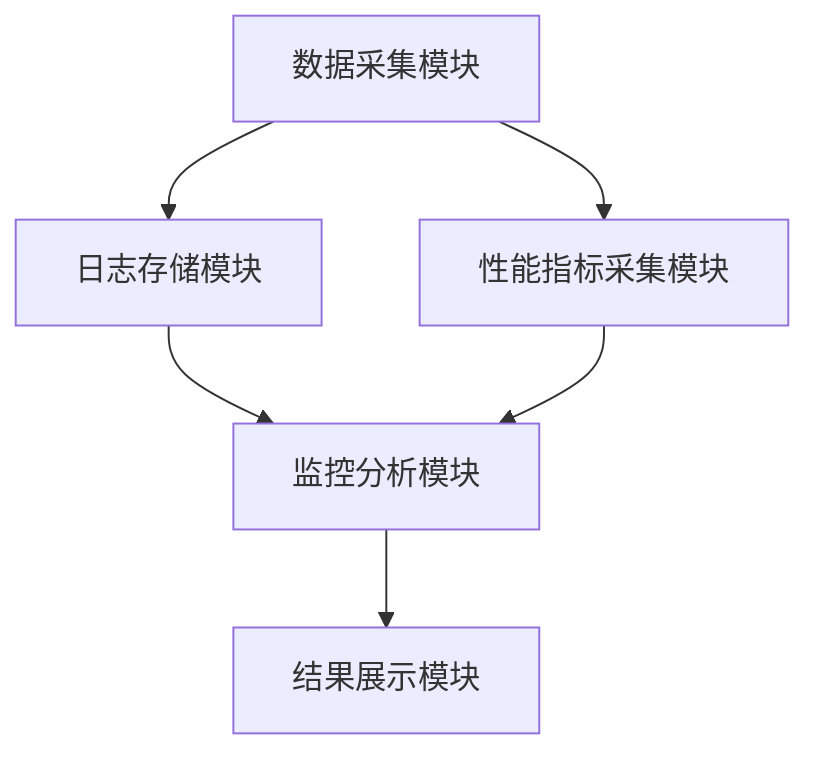

                 


# 监控与日志：追踪AI Agent的行为与性能

> 关键词：AI Agent，监控，日志，行为分析，性能优化，系统架构

> 摘要：本文探讨了如何通过监控与日志技术来追踪AI Agent的行为与性能。首先介绍了AI Agent的核心概念与监控的重要性，然后详细分析了行为监控和性能监控的算法原理，接着设计了系统的架构，并通过项目实战展示了如何实现监控。最后总结了最佳实践与未来展望。

---

## 第1章：引言

### 1.1 AI Agent的定义与重要性

AI Agent（人工智能代理）是指能够感知环境、自主决策并执行任务的智能实体。AI Agent广泛应用于自动驾驶、智能助手、推荐系统等领域。随着AI Agent的复杂性增加，对其行为和性能的监控变得至关重要。

### 1.2 监控与日志的重要性

监控与日志是追踪AI Agent行为与性能的关键手段。通过监控，可以实时了解AI Agent的状态；通过日志，可以回溯问题，分析性能瓶颈。

---

## 第2章：监控与日志的核心概念

### 2.1 AI Agent的核心概念

AI Agent的行为由感知、决策和执行三个阶段构成。感知涉及数据采集，决策基于算法，执行则将决策转化为行动。

### 2.2 监控的基本概念

监控是指对AI Agent的运行状态进行实时或周期性检查，包括性能指标和行为日志。监控数据用于优化AI Agent的性能和纠正错误。

### 2.3 日志的核心属性

日志记录了AI Agent在运行过程中的事件，包括时间戳、操作类型、执行结果等。日志分析是监控的基础。

---

## 第3章：行为监控的算法原理

### 3.1 行为监控的流程

行为监控包括数据采集、特征提取和异常检测。数据采集获取AI Agent的运行日志，特征提取识别关键行为，异常检测发现异常行为。

### 3.2 行为监控的数学模型

行为监控模型基于马尔可夫链，用于预测AI Agent的下一个行为。模型参数通过历史数据训练得出。

$$ P(B_{t+1} | B_t) = \frac{P(B_t | B_{t-1})} $$

---

## 第4章：性能监控的算法原理

### 4.1 性能监控的流程

性能监控包括数据采集、基准测试和优化策略。数据采集获取性能指标，基准测试评估性能，优化策略改进性能。

### 4.2 性能监控的数学模型

性能监控模型基于回归分析，用于预测性能瓶颈。模型参数通过历史数据训练得出。

$$ y = \beta_0 + \beta_1x + \epsilon $$

---

## 第5章：系统架构设计

### 5.1 系统功能设计

监控系统包括数据采集模块、日志存储模块、监控分析模块和结果展示模块。数据采集模块负责采集日志和性能指标，日志存储模块负责存储数据，监控分析模块负责分析数据，结果展示模块负责展示结果。

### 5.2 系统架构图



---

## 第6章：项目实战

### 6.1 环境搭建

安装Python和相关库，如`pandas`、`numpy`和`tensorflow`。

### 6.2 核心代码实现

实现AI Agent的行为监控和性能监控算法，包括数据采集、特征提取和异常检测。

```python
import pandas as pd
import numpy as np

def行为监控算法():
    data = pd.read_csv('行为日志.csv')
    features = data[['时间戳', '操作类型', '执行结果']]
    # 特征提取
    features = features.dropna()
    # 异常检测
    model = IsolationForest(n_estimators=100)
    model.fit(features)
    predictions = model.predict(features)
    return predictions

def性能监控算法():
    data = pd.read_csv('性能指标.csv')
    features = data[['时间戳', 'CPU使用率', '内存使用率', '任务完成时间']]
    # 回归分析
    model = LinearRegression()
    model.fit(features[['CPU使用率', '内存使用率']], features['任务完成时间'])
    return model
```

### 6.3 案例分析

通过实际案例分析，验证监控算法的有效性，并总结经验。

---

## 第7章：总结与展望

### 7.1 最佳实践

- 定期更新监控模型，以适应AI Agent的行为变化。
- 结合多种监控技术，提高监控的全面性。

### 7.2 未来展望

未来，监控技术将更加智能化，AI Agent的行为和性能监控将更加精准和实时。

---

作者：AI天才研究院/AI Genius Institute & 禅与计算机程序设计艺术 /Zen And The Art of Computer Programming

