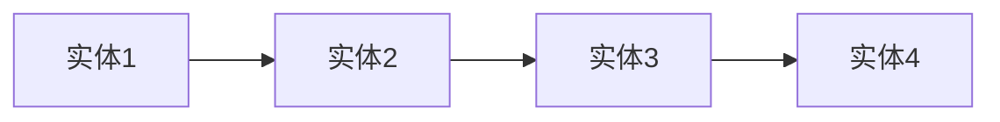
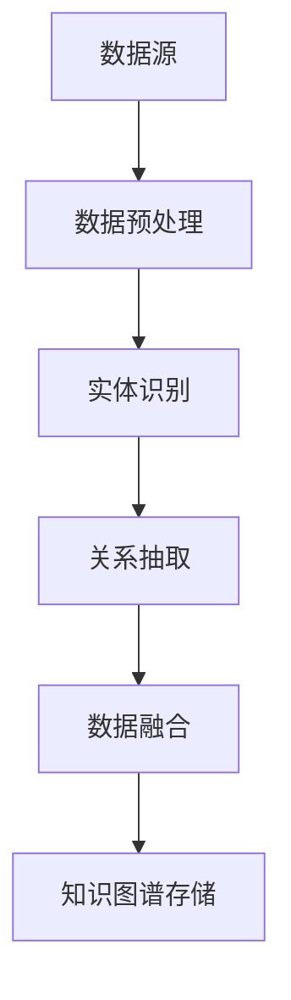
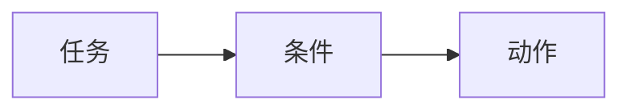
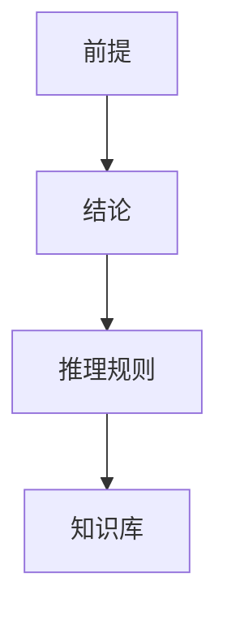
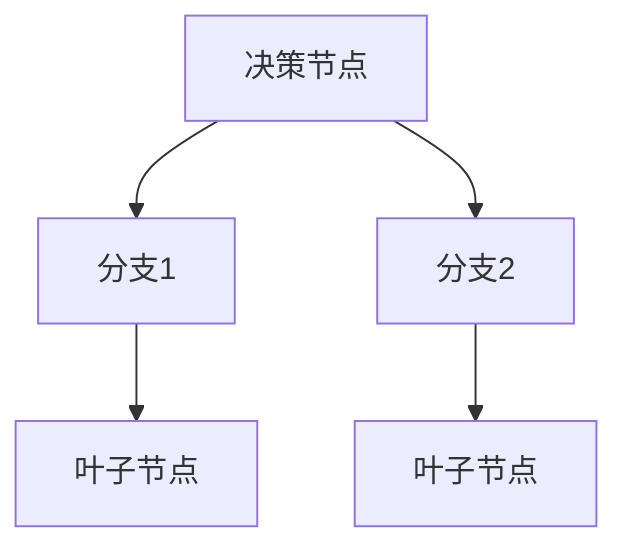
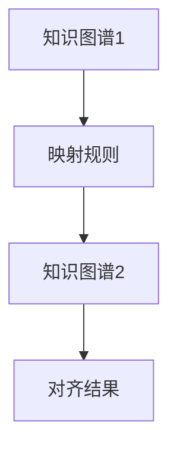
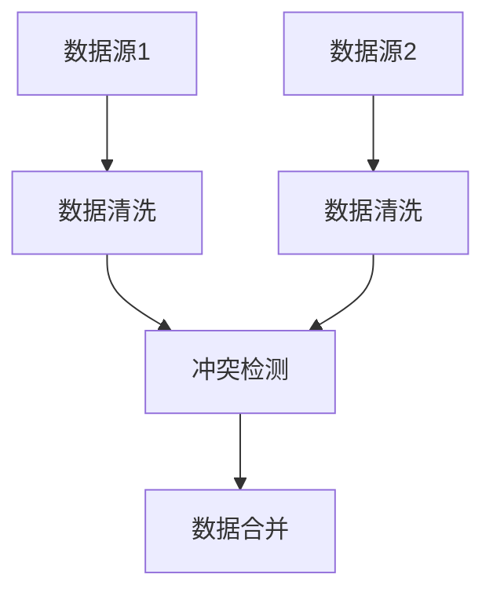
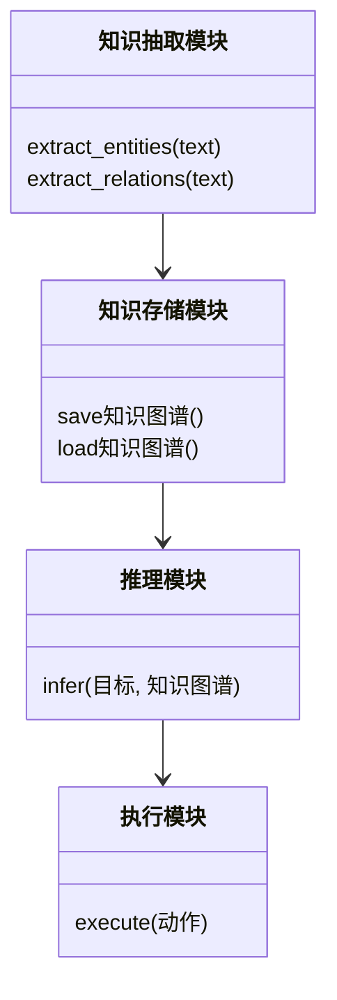
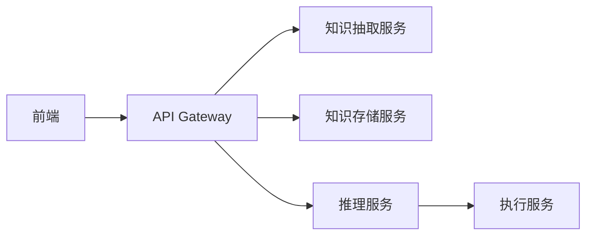
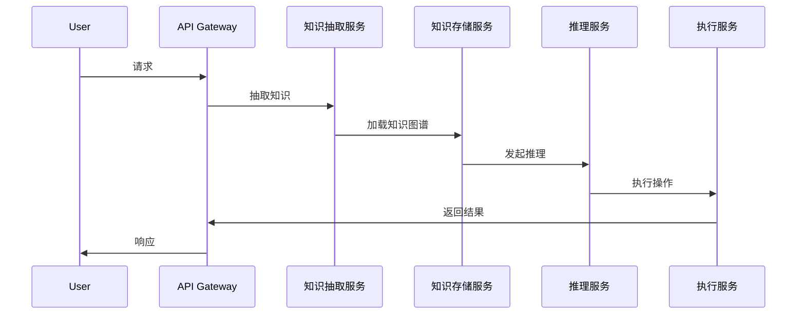

                 


# 知识图谱集成：扩展AI Agent的知识储备

> **关键词**：知识图谱、AI Agent、知识集成、语义对齐、知识表示、系统架构  
> **摘要**：本文详细探讨了知识图谱在AI Agent中的集成方法，从概念到实践，系统性地分析了如何通过知识图谱扩展AI Agent的知识储备，提升其智能水平和任务处理能力。文章涵盖了知识图谱的构建、表示，AI Agent的核心机制，知识图谱与AI Agent的集成技术，系统架构设计，项目实战以及最佳实践等内容，为读者提供了全面的知识储备扩展方案。

---

## 第1章：知识图谱与AI Agent的背景

### 1.1 知识图谱的定义与特点

知识图谱是一种用于描述实体及其关系的结构化数据模型，通常以图的形式表示。它由节点（实体）和边（关系）组成，能够表示复杂的语义信息。以下是知识图谱的核心特点：

- **语义丰富性**：通过实体间的关系，提供比传统数据库更丰富的语义信息。
- **可扩展性**：支持大规模数据的扩展，能够处理海量实体和关系。
- **结构化与非结构化结合**：既能处理结构化的数据，也能从非结构化数据中提取信息。

**对比表格：知识图谱与传统数据库的对比**

| 特性                | 知识图谱               | 传统数据库             |
|---------------------|----------------------|-----------------------|
| 数据结构            | 图结构，支持复杂关系  | 行结构，关系有限       |
| 表达能力            | 高，支持语义推理       | 低，仅支持基本查询     |
| 数据规模            | 支持海量数据          | 通常规模较小           |
| 应用场景            | 智能搜索、语义理解     | 基本查询、事务处理     |

**Mermaid图：知识图谱的实体关系图**



### 1.2 AI Agent的定义与任务处理流程

AI Agent是一种智能体，能够感知环境、自主决策并执行任务。其核心任务处理流程包括：

1. **感知环境**：通过传感器或数据接口获取环境信息。
2. **理解需求**：解析用户意图或任务目标。
3. **知识推理**：基于知识库进行推理，生成解决方案。
4. **执行操作**：根据推理结果执行任务。
5. **反馈优化**：根据执行结果优化知识库和决策模型。

### 1.3 知识图谱在AI Agent中的作用

知识图谱为AI Agent提供了丰富的知识储备，使其能够更好地理解任务需求、推理解决方案并优化执行策略。通过知识图谱的语义对齐技术，AI Agent可以有效整合多源异构数据，提升智能水平。

---

## 第2章：知识图谱的构建与表示

### 2.1 知识图谱的构建方法

知识图谱的构建通常包括数据抽取、实体识别、关系抽取和数据融合等步骤。以下是构建流程的Mermaid图：



### 2.2 知识图谱的表示形式

知识图谱的表示形式主要有三种：属性图模型、RDF三元组和语义网络。以下是三者的对比：

| 表示形式   | 描述                          | 适用场景                     |
|------------|-------------------------------|------------------------------|
| 属性图模型 | 使用属性和标签表示实体关系    | 适用于复杂关系的表示         |
| RDF三元组  | 由主语-谓词-宾语构成           | 适用于语义标注和本体构建       |
| 语义网络   | 强调语义关联，支持推理         | 适用于语义理解任务           |

### 2.3 知识图谱构建的数学模型

知识图谱的构建可以看作是一个图结构的学习问题。以下是基于规则的实体识别算法示例：

```python
def extract_entities(text):
    # 使用正则表达式提取实体
    pattern = r'\b[A-Z][a-z]+ [A-Z][a-z]+\b'  # 示例规则
    matches = re.findall(pattern, text)
    return matches
```

其中，规则匹配的数学模型可以表示为：

$$ \text{实体识别} = \{ x \in \text{文本} | x \text{匹配规则} \} $$

---

## 第3章：AI Agent的核心机制

### 3.1 AI Agent的知识表示

AI Agent的知识表示通常采用语义网络或规则表示法。以下是语义网络的示例：



### 3.2 AI Agent的推理机制

AI Agent的推理机制包括逻辑推理和语义推理。以下是基于知识图谱的推理流程：



### 3.3 AI Agent的决策机制

AI Agent的决策机制基于知识库和环境反馈，采用启发式算法优化决策路径。以下是决策树的简化示例：



---

## 第4章：知识图谱与AI Agent的集成技术

### 4.1 语义对齐

语义对齐是知识图谱集成的关键技术，通过本体映射实现语义一致性。以下是本体映射的流程：



### 4.2 知识融合

知识融合包括数据清洗、冲突检测和数据合并。以下是数据融合的流程：



---

## 第5章：系统架构设计

### 5.1 系统功能设计

系统功能包括知识抽取、存储、推理和执行模块。以下是系统功能的类图：



### 5.2 系统架构设计

系统架构采用微服务架构，包括前端、后端和数据库。以下是系统架构图：



### 5.3 接口设计与交互流程

系统交互流程包括请求接收、知识推理和结果返回。以下是交互流程的序列图：



---

## 第6章：项目实战

### 6.1 环境搭建

安装必要的库：

```bash
pip install networkx py2neo
```

### 6.2 核心代码实现

以下是知识抽取模块的代码示例：

```python
from py2neo import Graph, Node, Relationship

# 创建知识图谱
graph = Graph("http://localhost:7474", auth=("neo4j", "password"))

# 添加实体
node1 = Node("Entity", name="实体1")
node2 = Node("Entity", name="实体2")
graph.create(node1 | node2)

# 添加关系
relationship = Relationship(node1, "关系", node2)
graph.create(relationship)
```

### 6.3 案例分析与优化

通过具体案例分析，优化知识抽取和推理过程，提升系统性能。

---

## 第7章：最佳实践与总结

### 7.1 最佳实践

- 数据质量是关键，确保知识图谱的准确性和完整性。
- 系统优化需关注性能瓶颈，如查询效率和推理速度。

### 7.2 小结

本文系统性地探讨了知识图谱在AI Agent中的集成方法，从构建、表示到系统设计和实战，为读者提供了全面的知识储备扩展方案。

### 7.3 注意事项

- 知识图谱的构建需要考虑数据的多样性和复杂性。
- AI Agent的决策机制需结合实际场景进行优化。

### 7.4 拓展阅读

推荐阅读《知识图谱：概念、方法与应用》，深入理解知识图谱的构建与应用。

---

## 作者

**作者：AI天才研究院 & 禅与计算机程序设计艺术**

本文由AI天才研究院与禅与计算机程序设计艺术联合撰写，旨在分享知识图谱与AI Agent结合的最新研究成果，为技术从业者提供实践指导。

