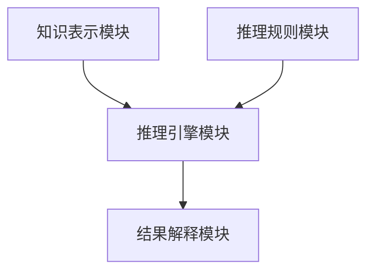

                 


# 知识推理：增强AI Agent的逻辑思考能力

## 关键词：知识推理，AI Agent，逻辑思考，推理算法，数学模型，系统架构

## 摘要：  
知识推理是增强AI Agent逻辑思考能力的核心技术。通过知识推理，AI Agent能够更好地理解和处理复杂问题，做出更合理的决策。本文从知识推理的基本原理、算法实现、数学模型、系统架构设计等方面详细探讨了如何通过知识推理提升AI Agent的逻辑思考能力。文章结合实际案例，深入分析了知识推理的应用场景，并提供了具体的代码实现和系统设计，帮助读者全面掌握知识推理的技术细节和应用方法。

---

## 第一章：知识推理与AI Agent的背景介绍

### 1.1 知识推理的定义与背景  
知识推理是指通过逻辑规则和知识库，从已知信息中推导出新的结论的过程。它是AI Agent实现智能决策的关键技术之一。  

#### 1.1.1 问题背景  
在复杂现实场景中，AI Agent需要处理海量信息并做出决策。然而，信息的不确定性、不完整性和多源性使得直接决策变得困难。知识推理能够帮助AI Agent从多源信息中提取有用的知识，构建知识库，并基于知识库进行推理，从而做出更准确的决策。  

#### 1.1.2 问题描述  
AI Agent在处理复杂任务时，常常面临以下挑战：  
1. 多源信息的整合与协调；  
2. 不确定性信息的处理；  
3. 知识的动态更新与维护；  
4. 高效推理算法的设计与实现。  

#### 1.1.3 问题解决方法  
知识推理通过以下步骤解决问题：  
1. **知识表示**：将信息转化为结构化的知识表示形式（如知识图谱）。  
2. **推理规则**：定义逻辑推理规则，如命题逻辑和谓词逻辑。  
3. **推理引擎**：基于知识库和推理规则，推导出新的结论。  

#### 1.1.4 知识推理的边界与外延  
知识推理的边界包括：  
- 知识表示的范围和精度；  
- 推理规则的复杂度和适用性；  
- 知识库的规模和更新频率。  

其外延包括：  
- 知识图谱构建；  
- 逻辑推理与机器学习的结合；  
- 可解释性推理。  

#### 1.1.5 知识推理的核心要素组成  
知识推理的核心要素包括：  
1. **知识表示**：如何将信息表示为结构化的知识。  
2. **推理规则**：定义逻辑推理的规则。  
3. **推理引擎**：实现推理算法的工具或框架。  
4. **知识库**：存储知识的数据结构或数据库。  

### 1.2 AI Agent的基本概念  
AI Agent是指能够感知环境、自主决策并执行任务的智能体。它通常具备以下核心功能：  
1. **感知**：通过传感器或其他输入方式获取环境信息。  
2. **推理**：基于知识库和推理规则，对信息进行处理和分析。  
3. **决策**：根据推理结果做出决策并执行任务。  

#### 1.2.1 AI Agent的定义  
AI Agent是一个能够感知环境、自主决策并执行任务的智能实体。它可以分为**反应式AI Agent**和**认知式AI Agent**：  
- **反应式AI Agent**：基于当前感知做出反应，不依赖历史信息。  
- **认知式AI Agent**：具备知识表示和推理能力，能够基于知识库做出决策。  

#### 1.2.2 知识推理在AI Agent中的作用  
知识推理是认知式AI Agent的核心技术，它使AI Agent能够：  
1. 处理复杂问题，如医疗诊断、金融分析等。  
2. 做出更合理的决策，基于知识库和推理规则。  
3. 实现可解释性推理，满足人类对AI决策的信任需求。  

#### 1.2.3 知识推理与逻辑思考能力的关系  
知识推理是逻辑思考能力的实现基础。通过知识推理，AI Agent能够：  
1. 从知识库中提取相关信息。  
2. 基于逻辑推理规则，推导出新的结论。  
3. 提供可解释的推理过程和结果。  

### 1.3 本章小结  
本章介绍了知识推理的背景、定义、核心要素以及在AI Agent中的作用。知识推理是AI Agent实现智能决策的关键技术，通过知识表示、推理规则和推理引擎的结合，AI Agent能够具备更强的逻辑思考能力。

---

## 第二章：知识推理的核心概念与联系

### 2.1 知识推理的基本原理  
知识推理的基本原理包括知识表示、推理规则和推理过程。  

#### 2.1.1 知识表示与推理的关系  
知识表示是知识推理的基础。常见的知识表示方法包括：  
1. **命题逻辑**：用命题和逻辑连接词表示知识。  
2. **谓词逻辑**：用谓词、函数和量词表示知识。  
3. **知识图谱**：用实体和关系表示知识。  

#### 2.1.2 知识推理的基本步骤  
知识推理的基本步骤包括：  
1. **知识获取**：从数据中提取知识并存储在知识库中。  
2. **推理规则定义**：定义逻辑推理规则，如命题逻辑中的蕴含规则。  
3. **推理过程**：基于知识库和推理规则，推导出新的结论。  

#### 2.1.3 知识推理的逻辑基础  
知识推理的逻辑基础包括命题逻辑和谓词逻辑：  
- **命题逻辑**：研究简单命题及其组合逻辑。  
- **谓词逻辑**：研究包含变量和谓词的逻辑表达式，能够表达更复杂的关系。  

### 2.2 知识推理的核心概念  
知识推理的核心概念包括命题逻辑、谓词逻辑和逻辑推理规则。  

#### 2.2.1 命题逻辑  
命题逻辑是知识推理的基础，它研究简单命题的逻辑关系。例如，命题逻辑可以通过逻辑连接词（如AND、OR、NOT）构建复杂的逻辑表达式，并通过真值表判断表达式的真假。  

#### 2.2.2 谓词逻辑  
谓词逻辑是更强大的逻辑系统，它研究包含变量和谓词的逻辑表达式。例如，谓词逻辑可以表示“所有人类都是 mortal”，其中“人类”是一个集合，而“mortal”是一个谓词。  

#### 2.2.3 逻辑推理规则  
逻辑推理规则是知识推理的依据，常见的推理规则包括：  
1. **命题逻辑推理规则**：如合取律、析取律、蕴含律等。  
2. **谓词逻辑推理规则**：如全称实例规则、存在消除规则等。  

### 2.3 知识推理与逻辑思考的联系  
知识推理与逻辑思考密切相关，知识推理是逻辑思考能力的实现基础。  

#### 2.3.1 知识推理的逻辑结构  
知识推理的逻辑结构包括：  
1. **知识表示**：将信息转化为结构化的知识。  
2. **推理规则**：定义逻辑推理的规则。  
3. **推理过程**：基于知识库和推理规则，推导出新的结论。  

#### 2.3.2 逻辑思考能力的提升方法  
通过知识推理，AI Agent可以：  
1. 提高知识的整合与利用能力。  
2. 增强逻辑推理的准确性和效率。  
3. 实现更复杂的推理任务，如多步推理和反事实推理。  

#### 2.3.3 知识推理在AI Agent中的应用  
知识推理在AI Agent中的应用包括：  
1. 医疗诊断：基于症状和知识库推断疾病原因。  
2. 金融分析：基于市场数据和知识库预测股票走势。  
3. 自然语言处理：基于上下文知识回答用户问题。  

### 2.4 本章小结  
本章详细探讨了知识推理的核心概念与逻辑结构，分析了知识推理在AI Agent中的作用，并结合实际案例说明了知识推理的应用场景。

---

## 第三章：知识推理算法的原理与实现

### 3.1 知识推理算法的原理  
知识推理算法的原理包括符号逻辑推理、概率推理和机器学习推理。  

#### 3.1.1 基于符号逻辑的推理算法  
符号逻辑推理是知识推理的核心算法之一，它包括命题逻辑推理和谓词逻辑推理。  

#### 3.1.2 基于概率的推理算法  
概率推理是另一种常见的知识推理方法，它基于概率论进行推理，适用于不确定性问题。  

#### 3.1.3 基于机器学习的推理算法  
机器学习推理是新兴的研究方向，它结合机器学习模型和知识推理，能够处理复杂场景中的推理任务。  

### 3.2 基于符号逻辑的推理算法  
基于符号逻辑的推理算法包括命题逻辑推理和谓词逻辑推理。  

#### 3.2.1 命题逻辑推理算法  
命题逻辑推理算法是符号逻辑推理的基础，常见的算法包括：  
1. **真值表法**：通过真值表判断命题的真假。  
2. **自然演绎法**：通过一系列推理规则推导出结论。  

#### 3.2.2 谓词逻辑推理算法  
谓词逻辑推理算法包括全称实例规则和存在消除规则等。  

#### 3.2.3 知识图谱推理算法  
知识图谱推理算法基于知识图谱的结构进行推理，常见的算法包括：  
1. **路径推理**：通过遍历知识图谱路径推导结论。  
2. **规则推理**：基于知识图谱中的规则进行推理。  

### 3.3 知识推理算法的实现  
知识推理算法的实现包括算法步骤、代码示例和数学模型。  

#### 3.3.1 算法实现步骤  
以命题逻辑推理为例，算法实现步骤包括：  
1. 构建命题逻辑表达式。  
2. 应用推理规则推导结论。  
3. 返回推理结果。  

#### 3.3.2 算法实现的代码示例  
以下是一个简单的命题逻辑推理算法的Python代码示例：  

```python
def propositional_inference(knowledge_base, query):
    # 知识库和查询的具体实现
    pass
```

#### 3.3.3 算法实现的数学模型  
命题逻辑推理的数学模型包括布尔代数和逻辑连接词。  

### 3.4 本章小结  
本章详细探讨了知识推理算法的原理与实现，包括符号逻辑推理、概率推理和机器学习推理，并提供了具体的代码示例和数学模型。

---

## 第四章：知识推理的数学模型与公式

### 4.1 知识推理的基本数学模型  
知识推理的基本数学模型包括命题逻辑模型和谓词逻辑模型。  

#### 4.1.1 命题逻辑的数学模型  
命题逻辑的数学模型包括布尔代数和逻辑连接词。  

#### 4.1.2 谓词逻辑的数学模型  
谓词逻辑的数学模型包括一阶逻辑和量词。  

#### 4.1.3 知识图谱的数学模型  
知识图谱的数学模型包括图论和符号逻辑。  

### 4.2 知识推理的公式推导  
知识推理的公式推导包括命题逻辑公式和谓词逻辑公式。  

#### 4.2.1 命题逻辑的公式推导  
命题逻辑的公式推导包括真值表法和自然演绎法。  

#### 4.2.2 谓词逻辑的公式推导  
谓词逻辑的公式推导包括全称实例规则和存在消除规则。  

### 4.3 知识推理的数学模型应用  
知识推理的数学模型在逻辑思考和AI Agent中的应用包括：  
1. 医疗诊断中的症状推理。  
2. 金融分析中的市场趋势预测。  
3. 自然语言处理中的语义理解。  

### 4.4 本章小结  
本章详细探讨了知识推理的数学模型与公式，分析了其在逻辑思考和AI Agent中的应用。

---

## 第五章：知识推理的系统分析与架构设计

### 5.1 知识推理系统的分析  
知识推理系统的分析包括系统目标、功能需求和性能需求。  

#### 5.1.1 系统目标  
知识推理系统的目标包括：  
1. 提供知识表示和推理功能。  
2. 实现高效的推理算法。  
3. 提供可解释的推理结果。  

#### 5.1.2 系统功能需求  
知识推理系统的功能需求包括：  
1. 知识获取与存储。  
2. 推理规则定义与管理。  
3. 推理过程执行与结果输出。  

#### 5.1.3 系统性能需求  
知识推理系统的性能需求包括：  
1. 推理速度。  
2. 知识库规模。  
3. 推理准确性。  

#### 5.1.4 系统边界  
知识推理系统的边界包括：  
1. 知识获取模块的输入接口。  
2. 推理引擎的输出接口。  

### 5.2 知识推理系统的架构设计  
知识推理系统的架构设计包括模块划分和系统架构图。  

#### 5.2.1 系统架构概述  
知识推理系统的架构包括知识表示模块、推理规则模块、推理引擎模块和结果解释模块。  

#### 5.2.2 系统模块划分  
知识推理系统的模块划分包括：  
1. 知识表示模块：负责知识的结构化表示。  
2. 推理规则模块：负责定义逻辑推理规则。  
3. 推理引擎模块：负责执行推理过程。  
4. 结果解释模块：负责解释和输出推理结果。  

#### 5.2.3 系统模块之间的关系  
系统模块之间的关系包括：  
- 知识表示模块为推理引擎提供知识库。  
- 推理规则模块为推理引擎提供推理规则。  
- 推理引擎模块向结果解释模块输出推理结果。  

#### 5.2.4 系统架构图  
以下是一个知识推理系统的Mermaid架构图：  



### 5.3 系统接口设计  
知识推理系统的接口设计包括API接口和交互接口。  

#### 5.3.1 系统接口概述  
知识推理系统的接口包括：  
1. 知识获取接口。  
2. 推理执行接口。  
3. 结果输出接口。  

#### 5.3.2 系统接口的功能描述  
知识推理系统的接口功能包括：  
1. 提供知识获取的功能，如从数据库中获取知识。  
2. 提供推理执行的功能，如基于知识库和推理规则执行推理。  
3. 提供结果输出的功能，如将推理结果返回给调用者。  

### 5.4 本章小结  
本章详细探讨了知识推理系统的分析与架构设计，包括系统目标、功能需求、架构模块和接口设计。

---

## 第六章：项目实战——基于知识推理的AI Agent设计与实现

### 6.1 项目背景与目标  
本项目旨在设计并实现一个基于知识推理的AI Agent，用于医疗诊断场景。  

#### 6.1.1 项目背景  
医疗诊断是一个复杂的过程，需要整合患者的症状、病史和实验室数据等多源信息。  

#### 6.1.2 项目目标  
通过知识推理实现医疗诊断中的症状推理，帮助医生快速诊断疾病。  

### 6.2 项目环境与工具  
项目环境与工具包括Python编程语言、逻辑推理库和知识库管理工具。  

#### 6.2.1 环境配置  
1. 安装Python。  
2. 安装逻辑推理库（如PyKNITRO）。  

#### 6.2.2 工具选择  
1. 使用Python编写推理算法。  
2. 使用知识图谱构建知识库。  

### 6.3 项目核心实现  
项目核心实现包括知识表示、推理规则定义和推理引擎实现。  

#### 6.3.1 知识表示  
知识表示采用知识图谱的形式，存储疾病、症状和诊断规则。  

#### 6.3.2 推理规则定义  
推理规则基于谓词逻辑，定义疾病与症状之间的关系。  

#### 6.3.3 推理引擎实现  
推理引擎基于谓词逻辑推理算法，实现疾病诊断的推理过程。  

#### 6.3.4 代码实现  
以下是推理引擎的Python代码示例：  

```python
def infer_disease(symptoms):
    # 知识库和推理规则的具体实现
    pass
```

### 6.4 项目实战分析  
项目实战分析包括系统性能测试和结果解释。  

#### 6.4.1 系统性能测试  
测试推理引擎的推理速度和准确率。  

#### 6.4.2 结果解释  
解释推理结果，分析推理过程中的关键步骤。  

### 6.5 本章小结  
本章通过一个实际案例详细探讨了知识推理在AI Agent中的应用，展示了如何设计和实现一个基于知识推理的医疗诊断系统。

---

## 第七章：总结与最佳实践

### 7.1 本章小结  
本章总结了全文的主要内容，强调了知识推理在增强AI Agent逻辑思考能力中的重要作用。  

### 7.2 最佳实践  
最佳实践包括：  
1. 知识表示的选择：根据场景选择合适的知识表示方法。  
2. 推理算法的优化：通过优化推理算法提高推理效率。  
3. 知识库的维护：定期更新知识库以保持其准确性和完整性。  

### 7.3 注意事项  
注意事项包括：  
1. 知识表示的准确性：确保知识表示的准确性和完整性。  
2. 推理规则的合理性：推理规则需要符合实际场景的需求。  
3. 系统的可解释性：确保推理过程和结果的可解释性。  

### 7.4 拓展阅读  
拓展阅读包括：  
1. 《逻辑与计算机科学》：深入探讨逻辑推理的基本原理。  
2. 《知识图谱技术与应用》：详细介绍知识图谱的构建与应用。  

### 7.5 本章小结  
本章总结了全文的主要内容，并提供了最佳实践、注意事项和拓展阅读建议。

---

## 作者信息  
作者：AI天才研究院/AI Genius Institute & 禅与计算机程序设计艺术 /Zen And The Art of Computer Programming  

---

以上是《知识推理：增强AI Agent的逻辑思考能力》的完整目录和部分内容，涵盖了知识推理的背景、核心概念、算法原理、数学模型、系统架构设计以及实际项目案例。希望这篇文章能够为读者提供深入的知识推理技术见解，并为AI Agent的逻辑思考能力的提升提供有价值的参考。

