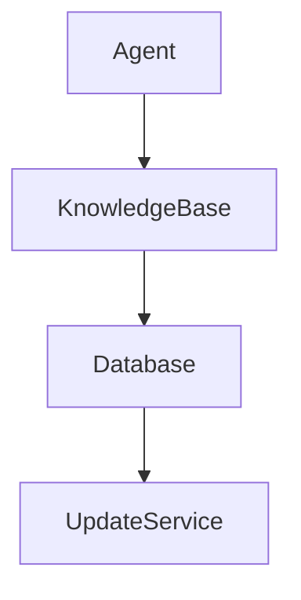

                 


```markdown
# 知识更新：保持AI Agent信息的时效性

> 关键词：知识更新，AI Agent，时效性，信息管理，算法优化，系统设计，实时反馈

> 摘要：在AI Agent的应用中，知识的时效性至关重要。本文详细探讨了知识更新的基本概念、核心机制、算法原理、系统设计及其实现，通过实际案例分析和最佳实践，为保持AI Agent信息的时效性提供了全面的解决方案。

---

# 第1章 知识更新的背景与重要性

## 1.1 知识更新的基本概念
- **知识更新**：指定期更新和维护知识库中的信息，确保其准确性和时效性。
- **AI Agent**：智能体，能够在环境中感知并自主决策，依赖于知识库进行推理和行动。

## 1.2 AI Agent的定义与特点
- **定义**：AI Agent是能够感知环境、自主决策并执行任务的智能实体。
- **特点**：
  - 自主性：无需外部干预
  - 反应性：能感知并实时响应
  - 持续性：能够长期运行

## 1.3 知识时效性的重要性
- **知识过时的风险**：可能导致决策失误。
- **对AI Agent的影响**：知识过时会降低智能体的准确性和效率。
- **保持更新的意义**：确保AI Agent持续有效，适应变化。

---

# 第2章 知识更新的机制

## 2.1 知识更新的原理
- **知识库结构化管理**：通过分类和标签组织知识。
- **自动获取与筛选**：利用爬虫和NLP技术获取新信息。
- **验证与校正**：通过交叉验证和人工审核确保准确性。

## 2.2 知识更新的策略
| 策略类型 | 描述 | 优缺点 |
|----------|------|--------|
| 基于时间 | 定期自动更新 | 简单，但可能不够灵活 | 
| 基于事件 | 根据特定事件触发 | 精准，但需预定义触发条件 |
| 基于反馈 | 根据用户反馈调整 | 更加灵活，但依赖用户输入 |

---

# 第3章 知识更新的算法与实现

## 3.1 基于时间的更新算法
- **算法流程**：
  1. 设置更新周期（如每天一次）。
  2. 判断是否达到更新时间。
  3. 执行知识库更新。

- **代码实现**：
  ```python
  def time_based_update(schedule):
      while True:
          current_time = get_current_time()
          if current_time in schedule:
              updateKnowledgeBase()
          sleep(1)
  ```

## 3.2 基于反馈的更新算法
- **算法流程**：
  1. 收集用户反馈。
  2. 分析反馈内容。
  3. 根据反馈优先级更新知识库。

- **代码实现**：
  ```python
  def feedback_driven_update():
      feedback = get_user_feedback()
      priority = calculate_priority(feedback)
      if priority > threshold:
          updateKnowledgeBase(feedback)
  ```

---

# 第4章 系统分析与架构设计

## 4.1 系统功能设计
- **领域模型**：
  ```mermaid
  classDiagram
      class KnowledgeBase {
          + data: dict
          + update(): void
      }
      class Agent {
          + knowledge_base: KnowledgeBase
          + updateKnowledgeBase(): void
      }
  ```

## 4.2 系统架构设计


## 4.3 接口设计
- **API接口**：
  - `GET /knowledge/update`：触发知识更新。
  - `POST /feedback`：接收用户反馈。

---

# 第5章 项目实战

## 5.1 环境安装
- **工具**：Python 3.8+，Jupyter Notebook，Mermaid CLI。

## 5.2 核心代码实现
- **更新脚本**：
  ```python
  import time

  def update_knowledge_base():
      print("Updating knowledge base...")
      time.sleep(2)
      print("Update completed.")

  def main():
      while True:
          try:
              update_knowledge_base()
              time.sleep(60*60)  # 每小时更新一次
          except KeyboardInterrupt:
              break

  if __name__ == "__main__":
      main()
  ```

---

# 第6章 总结与展望

## 6.1 最佳实践
- 定期检查知识库的更新频率。
- 结合多种更新策略提高效率。

## 6.2 小结
知识更新是保持AI Agent高效运作的关键，通过合理的机制和算法设计，可以确保信息的时效性。

## 6.3 注意事项
- 避免过度更新导致资源消耗过大。
- 定期进行系统维护和优化。

## 6.4 拓展阅读
- 《Effective Knowledge Management》
- 《Real-Time Systems Design》

---

作者：AI天才研究院/AI Genius Institute & 禅与计算机程序设计艺术 /Zen And The Art of Computer Programming
```

