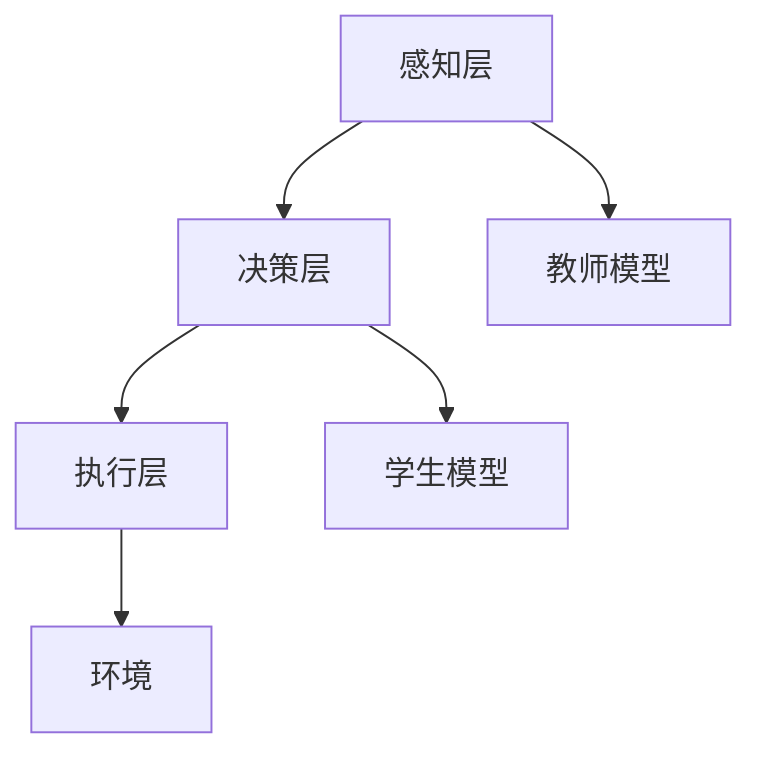

                 


# 知识蒸馏在AI Agent轻量化中的应用

> 关键词：知识蒸馏，AI Agent，轻量化，模型压缩，迁移学习

> 摘要：知识蒸馏是一种将大型模型的知识迁移到小型模型的技术，适用于AI Agent的轻量化设计。本文将从背景、原理、应用和算法等方面详细探讨知识蒸馏在AI Agent轻量化中的应用，结合实际案例和数学公式，帮助读者深入理解这一技术。

---

## 第1章 知识蒸馏与AI Agent轻量化概述

### 1.1 知识蒸馏的背景与目标

知识蒸馏是一种将大型模型的知识迁移到小型模型的技术，其目标是通过减少模型的复杂性，提高模型的运行效率和部署能力。在AI Agent领域，轻量化的目标是减少计算资源的消耗，同时保持模型的性能。

### 1.2 知识蒸馏的核心概念

知识蒸馏通过教师模型（large model）指导学生模型（small model）学习，核心在于提取教师模型的知识并将其迁移到学生模型中。这种技术适用于资源受限的场景，如移动设备和边缘计算。

### 1.3 知识蒸馏与AI Agent的关系

知识蒸馏通过压缩教师模型的知识，使学生模型能够在资源有限的环境中高效运行。这种技术不仅提升了AI Agent的性能，还降低了计算成本，适用于实时响应和快速决策的应用场景。

---

## 第2章 知识蒸馏的基本原理

### 2.1 知识蒸馏的核心原理

知识蒸馏的关键在于定义损失函数，学生模型通过最小化与教师模型的输出差异来学习。教师模型通常是一个预训练的大模型，学生模型则是一个参数较少的小模型。

### 2.2 知识蒸馏的主要技术

知识蒸馏包括模型压缩和模型蒸馏两种技术。模型压缩通过剪枝、量化等方式减少模型参数，而模型蒸馏则通过知识转移来提升学生模型的性能。

### 2.3 知识蒸馏的优缺点分析

优点：提升性能、降低计算成本、适应资源受限场景。缺点：依赖教师模型的质量、知识转移的效率问题。

---

## 第3章 AI Agent轻量化的核心技术

### 3.1 AI Agent的基本概念

AI Agent是一种能够感知环境并采取行动以实现目标的智能体，广泛应用于自动驾驶、机器人等领域。

### 3.2 AI Agent轻量化的目标

通过减少计算资源消耗，提升运行效率，同时保持或提升性能。

### 3.3 知识蒸馏在AI Agent轻量化中的应用

知识蒸馏通过压缩和迁移学习，使AI Agent能够在资源有限的环境中高效运行，适用于边缘计算和实时应用。

---

## 第4章 知识蒸馏在AI Agent中的具体应用

### 4.1 知识蒸馏在AI Agent中的应用场景

包括自然语言处理、计算机视觉、推荐系统等领域，特别是对实时性和资源效率要求高的场景。

### 4.2 知识蒸馏在AI Agent中的实现案例

以自然语言处理为例，教师模型（BERT）的学生模型（DistilBERT）通过蒸馏技术显著减少了参数数量，同时保持了相似的性能。

### 4.3 知识蒸馏在AI Agent中的效果评估

评估指标包括模型准确率、推理速度、模型大小等，效果显著时，蒸馏后的模型性能接近甚至超过教师模型。

---

## 第5章 知识蒸馏算法的数学模型与公式

### 5.1 知识蒸馏的核心算法

知识蒸馏通常采用交叉熵损失函数，结合蒸馏损失函数，以指导学生模型学习教师模型的输出。

### 5.2 知识蒸馏的数学模型

损失函数定义如下：

$$ \mathcal{L}(\theta, T) = -\sum_{i} [y_i \log p_i + (1 - y_i) \log (1 - p_i)] $$

其中，$y_i$ 是真实标签，$p_i$ 是学生模型的输出概率，$T$ 是温度参数，用于软化输出。

### 5.3 知识蒸馏的公式解析

通过调整温度参数，学生模型的输出概率分布更接近教师模型，从而实现知识迁移。

---

## 第6章 系统架构设计与实现

### 6.1 问题场景介绍

AI Agent需要在资源有限的环境中运行，如移动设备和边缘设备。

### 6.2 系统功能设计

设计AI Agent的系统架构，包括感知层、决策层和执行层，其中决策层采用轻量化模型。

### 6.3 系统架构设计

使用Mermaid图展示系统架构，包括教师模型和学生模型的交互。



### 6.4 系统接口设计

定义教师模型和学生模型之间的接口，确保知识蒸馏过程中的数据传递和参数调整。

### 6.5 系统交互设计

使用Mermaid序列图展示系统交互流程，包括知识蒸馏过程中的数据传递和反馈。

---

## 第7章 项目实战

### 7.1 环境安装

安装必要的库和工具，如TensorFlow、Keras、Transformers等。

### 7.2 核心实现源代码

展示知识蒸馏的实现代码，包括教师模型和学生模型的定义，以及损失函数的实现。

```python
import tensorflow as tf
from tensorflow.keras.layers import Dense, Activation
from tensorflow.keras.models import Model

def teacher_model(input_shape):
    inputs = Input(shape=input_shape)
    x = Dense(512, activation='relu')(inputs)
    x = Dense(256, activation='relu')(x)
    outputs = Dense(10, activation='softmax')(x)
    return Model(inputs=inputs, outputs=outputs)

def student_model(input_shape):
    inputs = Input(shape=input_shape)
    x = Dense(256, activation='relu')(inputs)
    x = Dense(10, activation='softmax')(x)
    return Model(inputs=inputs, outputs=outputs)

def distillation_loss(y_true, y_pred, T=2.0):
    y_pred = tf.nn.softmax(y_pred / T)
    y_true = tf.nn.softmax(y_true / T)
    loss = tf.reduce_mean(tf.keras.losses.KLDivLoss(y_true, y_pred))
    return loss

teacher = teacher_model((784,))
student = student_model((784,))
```

### 7.3 实际案例分析

以MNIST手写数字识别为例，展示知识蒸馏在AI Agent中的应用效果，包括准确率和推理速度的对比。

### 7.4 项目小结

总结知识蒸馏在项目中的应用效果，分析优化空间，提出改进建议。

---

## 第8章 总结与展望

### 8.1 总结

知识蒸馏在AI Agent轻量化中发挥着重要作用，通过压缩和迁移学习，显著提升了模型的运行效率和性能。

### 8.2 展望

未来的研究方向包括更高效的蒸馏算法、多模型蒸馏、以及在边缘计算中的应用。

---

## 附录

### 附录A 参考文献

列出相关的参考文献和资料。

### 附录B 术语表

解释文中涉及的核心术语。

---

作者：AI天才研究院/AI Genius Institute & 禅与计算机程序设计艺术 /Zen And The Art of Computer Programming

---

本文通过详细探讨知识蒸馏在AI Agent轻量化中的应用，从背景、原理、应用到实现，全面解析了这一技术的核心要素和实际价值。结合理论分析和实践案例，帮助读者深入理解知识蒸馏在提升AI Agent性能和效率中的重要作用。

