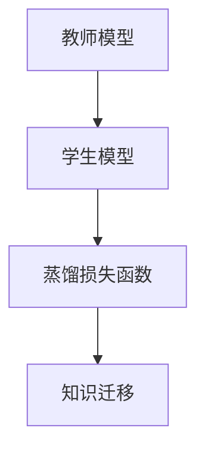
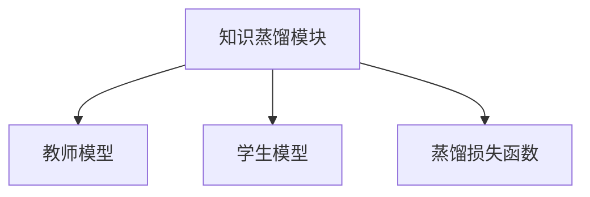

                 


# 知识蒸馏：从大模型到轻量级AI Agent

## 关键词：知识蒸馏，AI Agent，大模型，模型压缩，轻量化设计

## 摘要

知识蒸馏是一种将大模型的知识迁移到小模型的技术，能够有效降低AI Agent的计算成本和资源消耗，同时保持较高的性能。本文从知识蒸馏的基本概念出发，详细探讨其算法原理、系统架构设计以及实际应用案例，深入剖析如何将大模型的知识高效迁移到轻量级AI Agent中，实现性能与资源消耗的最佳平衡。

---

## 第1章：知识蒸馏概述

### 1.1 知识蒸馏的基本概念

知识蒸馏（Knowledge Distillation）是一种通过将大型复杂模型（教师模型）的知识迁移到小型简单模型（学生模型）中的技术。其核心思想是通过损失函数的设计，使得学生模型能够学习到教师模型的决策边界和概率分布。

#### 1.1.1 知识蒸馏的定义

知识蒸馏是一种模型压缩技术，通过损失函数的设计，将教师模型的输出概率分布迁移到学生模型中，从而实现模型的轻量化。

#### 1.1.2 知识蒸馏的核心思想

- **知识传递**：将教师模型的输出概率分布作为软标签，引导学生模型学习。
- **任务适配**：通过蒸馏损失函数，使学生模型在特定任务上与教师模型保持一致。

#### 1.1.3 知识蒸馏与模型压缩的区别

| 特性         | 知识蒸馏                          | 模型压缩                          |
|--------------|-----------------------------------|------------------------------------|
| 核心思想     | 将教师模型的知识迁移到学生模型    | 通过剪枝、量化等技术减少模型参数  |
| 输出形式     | 学生模型                          | 压缩后的模型                      |
| 适用场景     | 需要保持模型性能的同时降低资源消耗 | 需要显著减少模型体积              |

### 1.2 大模型的局限性

#### 1.2.1 大模型的计算成本

- 训练和推理的计算资源需求高，难以在资源受限的环境中部署。

#### 1.2.2 大模型的部署挑战

- 对硬件要求高，难以在边缘设备上实时运行。

#### 1.2.3 大模型的适用场景限制

- 需要依赖云端服务，延迟较高，无法满足实时性要求。

### 1.3 轻量级AI Agent的需求

#### 1.3.1 轻量级AI Agent的定义

轻量级AI Agent是一种在资源受限的环境下运行的智能体，具备低计算成本、高推理速度和强实时性等特点。

#### 1.3.2 轻量级AI Agent的优势

- 计算资源消耗低，适合边缘设备部署。
- 推理速度快，能够满足实时性需求。
- 易于扩展和集成，适合多种应用场景。

---

## 第2章：知识蒸馏的核心概念

### 2.1 知识蒸馏的理论基础

#### 2.1.1 知识蒸馏的数学模型

知识蒸馏的核心是通过蒸馏损失函数（Distillation Loss）将教师模型的输出概率分布迁移到学生模型中。

**蒸馏损失函数公式：**

$$ L_{\text{distill}} = -\sum_{i=1}^{n} T_i \log S_i $$

其中：
- $T_i$ 是教师模型输出的概率值。
- $S_i$ 是学生模型输出的概率值。

#### 2.1.2 知识蒸馏的三要素：教师模型、学生模型、蒸馏损失

- **教师模型**：提供知识的来源，通常是已经训练好的大型模型。
- **学生模型**：接收知识的目标模型，通常是轻量级的小型模型。
- **蒸馏损失**：连接教师和学生模型的桥梁，定义了知识迁移的损失函数。

#### 2.1.3 知识蒸馏与模型压缩的对比

| 特性         | 知识蒸馏                          | 模型压缩                          |
|--------------|-----------------------------------|------------------------------------|
| 核心思想     | 将教师模型的知识迁移到学生模型    | 通过剪枝、量化等技术减少模型参数  |
| 输出形式     | 学生模型                          | 压缩后的模型                      |
| 适用场景     | 需要保持模型性能的同时降低资源消耗 | 需要显著减少模型体积              |

### 2.2 知识蒸馏的关键属性对比

#### 2.2.1 教师模型与学生模型的对比

| 属性         | 教师模型                          | 学生模型                          |
|--------------|-----------------------------------|------------------------------------|
| 模型大小       | 大型或超大型模型                  | 小型或轻量级模型                  |
| 训练数据       | 需要大量标注数据                  | 可以利用教师模型的输出作为监督信号 |
| 计算资源       | 高计算资源                       | 低计算资源                        |

#### 2.2.2 蒸馏损失函数的对比

| 损失函数类型   | 蒸馏损失函数                      | 分类损失函数                      |
|--------------|-----------------------------------|------------------------------------|
| 核心思想       | 将教师模型的输出概率分布迁移到学生模型 | 通过标签信息进行监督学习          |
| 适用场景       | 需要保持模型性能的同时降低资源消耗 | 需要直接分类任务的监督信号        |

#### 2.2.3 知识蒸馏的ER实体关系图



---

## 第3章：知识蒸馏的算法原理

### 3.1 知识蒸馏的算法流程

#### 3.1.1 算法流程的定义

知识蒸馏的算法流程包括以下步骤：
1. **训练教师模型**：使用标注数据训练教师模型。
2. **初始化学生模型**：使用随机权重初始化学生模型。
3. **蒸馏损失计算**：计算教师模型和学生模型之间的蒸馏损失。
4. **优化学生模型**：通过反向传播优化学生模型的参数。
5. **迭代训练**：重复上述步骤，直到学生模型收敛。

#### 3.1.2 算法流程的步骤分解

1. **训练教师模型**：
   - 使用标注数据训练教师模型，得到教师模型的输出概率分布。
2. **初始化学生模型**：
   - 使用随机初始化参数，构建学生模型。
3. **蒸馏损失计算**：
   - 使用蒸馏损失函数计算教师模型和学生模型之间的损失。
4. **优化学生模型**：
   - 通过反向传播算法优化学生模型的参数，最小化蒸馏损失。
5. **迭代训练**：
   - 重复训练过程，直到学生模型的性能达到预期。

#### 3.1.3 算法流程的优化

- **温度系数**：通过引入温度系数$\tau$，调整蒸馏损失函数的软化程度。
  $$ T_i = S_i^{\tau} $$

- **平衡系数**：通过引入平衡系数$\alpha$，平衡蒸馏损失和分类损失的权重。
  $$ L = \alpha L_{\text{distill}} + (1-\alpha) L_{\text{class}} $$

### 3.2 知识蒸馏的数学模型

#### 3.2.1 蒸馏损失函数的公式推导

知识蒸馏的蒸馏损失函数可以表示为：

$$ L_{\text{distill}} = -\sum_{i=1}^{n} T_i \log S_i $$

其中：
- $T_i$ 是教师模型输出的概率值。
- $S_i$ 是学生模型输出的概率值。

#### 3.2.2 蒸馏损失函数的优化过程

通过反向传播算法，优化学生模型的参数，最小化蒸馏损失函数：

$$ \theta \leftarrow \theta - \eta \frac{\partial L_{\text{distill}}}{\partial \theta} $$

其中：
- $\theta$ 是学生模型的参数。
- $\eta$ 是学习率。
- $\frac{\partial L_{\text{distill}}}{\partial \theta}$ 是蒸馏损失函数对参数的梯度。

#### 3.2.3 蒸馏损失函数的实现代码

```python
import torch
import torch.nn as nn

def distillation_loss(teacher_logits, student_logits, temperature=1.0):
    teacher_logits = teacher_logits / temperature
    student_logits = student_logits / temperature
    loss = nn.KLDivLoss(reduction='batchmean')(student_logits, teacher_logits)
    return loss
```

---

## 第4章：知识蒸馏的系统架构与设计

### 4.1 系统架构的概述

#### 4.1.1 系统架构的定义

知识蒸馏系统架构包括教师模型、学生模型和蒸馏损失函数三部分。

#### 4.1.2 系统架构的组成部分

- **教师模型**：提供知识的来源，通常是已经训练好的大型模型。
- **学生模型**：接收知识的目标模型，通常是轻量级的小型模型。
- **蒸馏损失函数**：连接教师和学生模型的桥梁，定义了知识迁移的损失函数。

#### 4.1.3 系统架构的设计原则

- **模块化设计**：将系统划分为教师模型、学生模型和蒸馏损失函数三个独立模块。
- **可扩展性**：支持多种教师模型和学生模型的组合。
- **高效性**：通过优化蒸馏损失函数，提高知识迁移的效率。

### 4.2 知识蒸馏的系统设计

#### 4.2.1 系统功能设计

- **知识蒸馏**：将教师模型的知识迁移到学生模型中。
- **模型优化**：通过蒸馏损失函数优化学生模型的参数。
- **性能评估**：评估学生模型的性能，确保其与教师模型的性能一致。

#### 4.2.2 系统功能的组成部分

- **知识蒸馏模块**：
  - 输入：教师模型的输出概率分布。
  - 输出：学生模型的输出概率分布。
- **模型优化模块**：
  - 输入：蒸馏损失函数。
  - 输出：优化后的学生模型参数。
- **性能评估模块**：
  - 输入：学生模型的输出概率分布。
  - 输出：学生模型的性能评估结果。

#### 4.2.3 系统功能的优化

- **温度系数调整**：通过调整温度系数$\tau$，优化蒸馏损失函数的软化程度。
- **平衡系数调整**：通过调整平衡系数$\alpha$，平衡蒸馏损失和分类损失的权重。

### 4.3 知识蒸馏的系统架构图



---

## 第5章：知识蒸馏的项目实战

### 5.1 项目背景与目标

#### 5.1.1 项目背景

- 需求背景：在资源受限的环境中部署AI Agent，需要降低计算成本和资源消耗。
- 技术背景：知识蒸馏是一种有效的模型压缩技术，能够将大型复杂模型的知识迁移到小型简单模型中。

#### 5.1.2 项目目标

- 实现知识蒸馏技术，将教师模型的知识迁移到学生模型中。
- 优化学生模型的性能，确保其与教师模型的性能一致。

### 5.2 项目环境与工具

#### 5.2.1 项目环境

- 操作系统：Linux/Windows/MacOS
- 编程语言：Python
- 深度学习框架：PyTorch/TensorFlow
- 依赖管理工具：pip/conda

#### 5.2.2 项目工具

- 深度学习框架：PyTorch
- 虚拟环境管理工具：venv
- 代码编辑工具：VS Code/Jupyter Notebook

### 5.3 项目实现

#### 5.3.1 环境安装

```bash
pip install torch
```

#### 5.3.2 系统核心实现源代码

```python
import torch
import torch.nn as nn
import torch.optim as optim

# 定义教师模型
class TeacherModel(nn.Module):
    def __init__(self):
        super(TeacherModel, self).__init__()
        self.linear = nn.Linear(10, 5)
        self.softmax = nn.Softmax(dim=1)

    def forward(self, x):
        x = self.linear(x)
        x = self.softmax(x)
        return x

# 定义学生模型
class StudentModel(nn.Module):
    def __init__(self):
        super(StudentModel, self).__init__()
        self.linear = nn.Linear(10, 5)
        self.softmax = nn.Softmax(dim=1)

    def forward(self, x):
        x = self.linear(x)
        x = self.softmax(x)
        return x

# 定义蒸馏损失函数
def distillation_loss(teacher_logits, student_logits, temperature=1.0):
    teacher_logits = teacher_logits / temperature
    student_logits = student_logits / temperature
    loss = nn.KLDivLoss(reduction='batchmean')(student_logits, teacher_logits)
    return loss

# 训练教师模型
def train_teacher_model(teacher_model, optimizer, epochs=10):
    for epoch in range(epochs):
        optimizer.zero_grad()
        outputs = teacher_model(inputs)
        loss = nn.CrossEntropyLoss()(outputs, labels)
        loss.backward()
        optimizer.step()

# 初始化学生模型
student_model = StudentModel()
optimizer = optim.Adam(student_model.parameters(), lr=0.001)

# 蒸馏训练学生模型
for epoch in range(10):
    optimizer.zero_grad()
    teacher_outputs = teacher_model(inputs)
    student_outputs = student_model(inputs)
    loss = distillation_loss(teacher_outputs, student_outputs)
    loss.backward()
    optimizer.step()
```

#### 5.3.3 代码应用解读与分析

1. **教师模型**：
   - 输入：10维特征向量。
   - 输出：5维概率分布。

2. **学生模型**：
   - 输入：10维特征向量。
   - 输出：5维概率分布。

3. **蒸馏损失函数**：
   - 输入：教师模型和学生模型的输出概率分布。
   - 输出：蒸馏损失。

4. **优化过程**：
   - 通过反向传播优化学生模型的参数，最小化蒸馏损失。

#### 5.3.4 实际案例分析

- **训练教师模型**：使用标注数据训练教师模型，得到教师模型的输出概率分布。
- **初始化学生模型**：使用随机权重初始化学生模型。
- **蒸馏训练学生模型**：通过蒸馏损失函数优化学生模型的参数，使其输出概率分布与教师模型的输出概率分布一致。

### 5.4 项目小结

知识蒸馏是一种有效的模型压缩技术，能够将教师模型的知识迁移到学生模型中，实现模型的轻量化。通过蒸馏损失函数的设计，可以有效降低计算成本和资源消耗，同时保持较高的性能。

---

## 第6章：总结与展望

### 6.1 总结

知识蒸馏是一种将教师模型的知识迁移到学生模型中的技术，通过蒸馏损失函数的设计，可以有效降低计算成本和资源消耗，同时保持较高的性能。

### 6.2 展望

未来的研究方向包括：
- **多教师模型的蒸馏**：通过多个教师模型的组合，进一步提高学生模型的性能。
- **动态蒸馏**：通过动态调整蒸馏损失函数的参数，优化知识迁移的过程。
- **无监督蒸馏**：研究无监督条件下的知识蒸馏技术，减少对标注数据的依赖。

---

## 作者

作者：AI天才研究院/AI Genius Institute & 禅与计算机程序设计艺术 /Zen And The Art of Computer Programming

