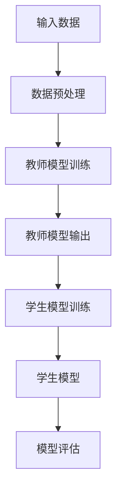

                 


# 知识蒸馏：从教师模型到高效AI Agent

> **关键词**：知识蒸馏、教师模型、学生模型、AI代理、模型压缩、迁移学习

> **摘要**：知识蒸馏是一种有效的模型压缩技术，通过将大模型（教师模型）的知识迁移到小模型（学生模型）中，从而提升小模型的性能。本文将详细介绍知识蒸馏的核心概念、算法原理、系统架构设计以及实际项目实现，帮助读者全面理解并掌握这一技术。

---

## 第1章：知识蒸馏概述

### 1.1 知识蒸馏的基本概念

知识蒸馏是一种模型压缩技术，旨在将大型复杂模型（教师模型）的知识迁移到更小、更高效的模型（学生模型）中。通过蒸馏过程，学生模型能够继承教师模型的优良特性，同时在资源消耗上大幅降低，适用于边缘计算、移动设备等场景。

- **教师模型**：通常是一个经过充分训练的大模型，具有强大的特征提取和分类能力。
- **学生模型**：一个较小的模型，通过蒸馏过程学习教师模型的知识。
- **蒸馏过程**：通过特定的损失函数，引导学生模型的输出与教师模型的输出尽可能接近。

### 1.2 知识蒸馏的背景与问题背景

随着深度学习技术的快速发展，大模型在性能上表现出色，但在实际应用中面临诸多挑战：

- **计算资源消耗大**：大型模型在推理阶段需要大量的计算资源，难以部署在资源受限的环境中。
- **部署成本高**：模型的训练和推理成本高，尤其是在边缘设备上。
- **知识共享的需求**：在分布式系统中，如何高效地共享知识是一个重要问题。

知识蒸馏通过将大模型的知识迁移到小模型，解决了上述问题，使得小模型在性能和资源消耗上达到更好的平衡。

### 1.3 知识蒸馏的实现与应用

知识蒸馏的核心在于设计合适的损失函数，使学生模型的输出与教师模型的输出尽可能接近。与传统的剪枝和量化方法相比，知识蒸馏的优势在于能够保留教师模型的决策边界，同时减少模型的复杂性。

---

## 第2章：知识蒸馏的核心概念与联系

### 2.1 知识蒸馏的原理

知识蒸馏通过损失函数将教师模型的知识迁移到学生模型中。具体来说，损失函数包括两部分：

- **交叉熵损失**：衡量学生模型输出与真实标签之间的差异。
- **蒸馏损失**：衡量学生模型输出与教师模型输出之间的差异。

数学上，蒸馏损失函数可以表示为：

$$ L_{\text{total}} = \alpha L_{\text{CE}} + (1-\alpha) L_{\text{KL}} $$

其中，$\alpha$ 是平衡参数，$L_{\text{CE}}$ 是交叉熵损失，$L_{\text{KL}}$ 是KL散度损失。

### 2.2 知识蒸馏与迁移学习的联系

知识蒸馏与迁移学习有相似之处，但也有显著区别：

| 特性 | 知识蒸馏 | 迁移学习 |
|------|----------|----------|
| 目标 | 将教师模型的知识迁移到学生模型 | 将源任务的知识迁移到目标任务 |
| 方法 | 通过损失函数引导 | 通过特征提取或参数共享 |
| 应用 | 模型压缩、边缘计算 | 多任务学习、领域适应 |

---

## 第3章：知识蒸馏的算法原理

### 3.1 知识蒸馏的数学模型与算法

知识蒸馏的数学模型主要基于KL散度，公式如下：

$$ L_{\text{KL}} = \text{KL}(P || Q) $$

其中，$P$ 是教师模型的输出概率分布，$Q$ 是学生模型的输出概率分布。

通过优化上述损失函数，学生模型能够逐步逼近教师模型的输出。

### 3.2 知识蒸馏的算法实现

以下是知识蒸馏的Python代码示例：

```python
import tensorflow as tf
from tensorflow.keras import layers

# 定义教师模型
def teacher_model(input_shape):
    model = tf.keras.Sequential()
    model.add(layers.Dense(128, activation='relu', input_shape=input_shape))
    model.add(layers.Dense(10, activation='softmax'))
    return model

# 定义学生模型
def student_model(input_shape):
    model = tf.keras.Sequential()
    model.add(layers.Dense(64, activation='relu', input_shape=input_shape))
    model.add(layers.Dense(10, activation='softmax'))
    return model

# 定义蒸馏损失函数
def distillation_loss(y_true, y_pred, alpha=0.5, temperature=3.0):
    y_pred_t = y_pred / temperature
    y_true_t = y_true / temperature
    loss = tf.keras.losses.kullback_leibler_divergence(y_true_t, y_pred_t)
    return alpha * tf.keras.losses.sparse_categorical_crossentropy(y_true, y_pred) + (1 - alpha) * loss

# 训练过程
teacher = teacher_model((784,))
student = student_model((784,))
teacher.compile(optimizer='adam', loss='sparse_categorical_crossentropy')
student.compile(optimizer='adam', loss=lambda y_true, y_pred: distillation_loss(y_true, y_pred))

# 数据准备
(x_train, y_train), (x_test, y_test) = tf.keras.datasets.mnist.load_data()
x_train = x_train.reshape(-1, 784).astype('float32') / 255.0
x_test = x_test.reshape(-1, 784).astype('float32') / 255.0

# 训练教师模型
teacher.fit(x_train, y_train, epochs=10, batch_size=32)

# 使用教师模型的输出作为蒸馏目标
teacher_preds = teacher.predict(x_train)

# 训练学生模型
student.fit(x_train, y_train, epochs=10, batch_size=32, validation_data=(x_test, y_test))
```

---

## 第4章：知识蒸馏的系统分析与架构设计

### 4.1 系统功能设计

知识蒸馏系统的功能模块包括：

- 数据预处理模块：对输入数据进行归一化和格式转换。
- 教师模型训练模块：训练教师模型并生成概率分布输出。
- 学生模型训练模块：基于蒸馏损失函数训练学生模型。
- 模型评估模块：评估学生模型的性能。

### 4.2 系统架构设计

知识蒸馏系统的架构设计如下：



---

## 第5章：知识蒸馏的项目实战

### 5.1 项目环境搭建

- 安装必要的库：
  ```bash
  pip install tensorflow keras matplotlib
  ```

### 5.2 项目核心代码实现

以下是完整的知识蒸馏代码示例：

```python
import tensorflow as tf
from tensorflow.keras import layers
import numpy as np

# 定义教师模型
def teacher_model(input_shape):
    model = tf.keras.Sequential([
        layers.Dense(128, activation='relu', input_shape=input_shape),
        layers.Dropout(0.5),
        layers.Dense(10, activation='softmax')
    ])
    return model

# 定义学生模型
def student_model(input_shape):
    model = tf.keras.Sequential([
        layers.Dense(64, activation='relu', input_shape=input_shape),
        layers.Dropout(0.5),
        layers.Dense(10, activation='softmax')
    ])
    return model

# 定义蒸馏损失函数
def distillation_loss(y_true, y_pred, alpha=0.5, temperature=3.0):
    y_pred_t = y_pred / temperature
    y_true_t = y_true / temperature
    loss_kl = tf.keras.losses.kullback_leibler_divergence(y_true_t, y_pred_t)
    loss_ce = tf.keras.losses.sparse_categorical_crossentropy(y_true, y_pred)
    return alpha * loss_ce + (1 - alpha) * loss_kl

# 数据准备
(x_train, y_train), (x_test, y_test) = tf.keras.datasets.mnist.load_data()
x_train = x_train.reshape(-1, 784).astype('float32') / 255.0
x_test = x_test.reshape(-1, 784).astype('float32') / 255.0

# 训练教师模型
teacher = teacher_model((784,))
teacher.compile(optimizer='adam', loss='sparse_categorical_crossentropy')
teacher.fit(x_train, y_train, epochs=10, batch_size=32)

# 获取教师模型的输出
teacher_preds = teacher.predict(x_train)

# 训练学生模型
student = student_model((784,))
student.compile(optimizer='adam', loss=lambda y_true, y_pred: distillation_loss(y_true, y_pred))
student.fit(x_train, y_train, epochs=10, batch_size=32, validation_data=(x_test, y_test))

# 模型评估
student_loss, student_acc = student.evaluate(x_test, y_test)
print(f"学生成绩: loss={student_loss}, accuracy={student_acc}")
```

### 5.3 项目测试与部署

- **测试**：在测试集上评估学生模型的性能。
- **部署**：将学生模型集成到AI代理中，确保其在资源受限环境下的高效运行。

---

## 第6章：总结与展望

### 6.1 最佳实践

- 选择合适的教师模型和学生模型。
- 调整蒸馏温度和平衡参数 $\alpha$。
- 在实际应用中结合数据增强和正则化技术。

### 6.2 小结

知识蒸馏是一种高效的知识迁移技术，通过将大模型的知识迁移到小模型，显著提升了小模型的性能，同时降低了资源消耗。本文通过理论与实践的结合，详细介绍了知识蒸馏的核心概念、算法实现和项目实战。

### 6.3 注意事项

- 蒸馏过程中需要平衡交叉熵损失和KL散度损失。
- 注意防止数据泄漏，确保教师模型和学生模型的独立性。
- 在实际应用中，需根据具体场景调整模型结构和训练参数。

### 6.4 拓展阅读

- 《Distilling the Knowledge in Neural Networks》
- 《Domain Adaptation via Discriminative Feature Mapping》
- 《Progressive Knowledge Distillation for Deep Neural Networks》

---

**作者：AI天才研究院**  
**链接：[禅与计算机程序设计艺术](https://github.com/Zen-Art-of-Programming)**

