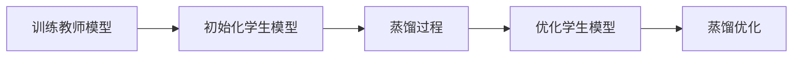
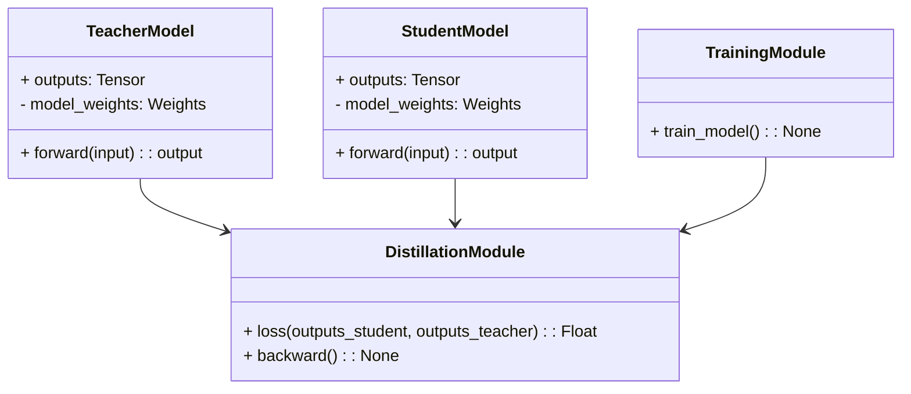
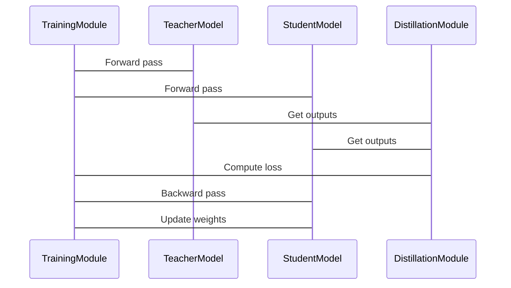

                 


# 知识蒸馏：压缩模型大小的同时保持性能

> 关键词：知识蒸馏、模型压缩、人工智能、深度学习、教师模型、学生模型、模型优化

> 摘要：本文详细探讨了知识蒸馏技术在压缩模型大小的同时保持性能的方法。通过介绍知识蒸馏的核心概念、算法原理、系统架构设计、项目实战和应用案例，深入分析了知识蒸馏在模型压缩中的应用价值，并提供了详细的实现步骤和优化建议。

---

## 目录

1. [知识蒸馏的背景与基础](#知识蒸馏的背景与基础)
   - 1.1 知识蒸馏的定义与核心概念
   - 1.2 模型压缩的挑战与意义
   - 1.3 知识蒸馏与模型压缩的关系

2. [知识蒸馏的核心概念与原理](#知识蒸馏的核心概念与原理)
   - 2.1 知识蒸馏的原理与过程
   - 2.2 知识蒸馏的关键技术
   - 2.3 知识蒸馏的数学模型与公式

3. [知识蒸馏的算法原理与实现](#知识蒸馏的算法原理与实现)
   - 3.1 知识蒸馏算法的流程与步骤
   - 3.2 知识蒸馏的数学模型与公式
   - 3.3 知识蒸馏的算法实现

4. [知识蒸馏的系统架构与设计](#知识蒸馏的系统架构与设计)
   - 4.1 知识蒸馏系统的总体架构
   - 4.2 知识蒸馏系统的功能设计
   - 4.3 知识蒸馏系统的系统架构设计
   - 4.4 知识蒸馏系统的接口设计与交互流程

5. [知识蒸馏的项目实战](#知识蒸馏的项目实战)
   - 5.1 知识蒸馏的环境安装与准备
   - 5.2 知识蒸馏的核心实现代码
   - 5.3 知识蒸馏的案例分析与解读
   - 5.4 知识蒸馏的项目总结与经验分享

6. [知识蒸馏的应用与拓展](#知识蒸馏的应用与拓展)
   - 6.1 知识蒸馏在实际项目中的应用案例
   - 6.2 知识蒸馏的最佳实践与注意事项
   - 6.3 知识蒸馏的未来发展方向与研究热点

---

## 1. 知识蒸馏的背景与基础

### 1.1 知识蒸馏的定义与核心概念

知识蒸馏是一种通过将复杂的大型模型（教师模型）的知识迁移到更小、更简单的模型（学生模型）中的技术，从而实现模型压缩的目标。其核心在于通过教师模型的指导，使学生模型能够掌握教师模型的深层知识，同时保持较高的性能。

#### 核心概念

- **教师模型（Teacher Model）**：大型、复杂且性能较高的模型，通常在大规模数据上预训练。
- **学生模型（Student Model）**：较小、简单的模型，通过蒸馏技术学习教师模型的知识。
- **蒸馏过程**：通过损失函数的优化，使学生模型的输出分布接近教师模型的输出分布。

### 1.2 模型压缩的挑战与意义

#### 挑战

- **模型大小**：大型模型通常需要大量的计算资源和存储空间，限制了其在移动设备和边缘计算中的应用。
- **计算效率**：复杂的模型在推理阶段需要较高的计算资源，影响实时性和响应速度。
- **知识保留**：直接剪枝或量化等方法可能导致模型性能下降，难以保证压缩后模型的效果。

#### 意义

- **资源优化**：通过压缩模型，减少存储和计算资源的需求，提升部署效率。
- **应用场景扩展**：使复杂的模型能够在资源受限的环境中运行，扩展其应用范围。
- **性能优化**：通过蒸馏技术，平衡模型大小与性能，实现高效推理。

### 1.3 知识蒸馏与模型压缩的关系

知识蒸馏是模型压缩的一种重要技术，通过知识传递的方式，将教师模型的复杂性降低，同时保留其性能优势。与传统的剪枝、量化等技术相比，蒸馏更注重模型的语义信息传递，能够有效提升压缩后模型的性能。

---

## 2. 知识蒸馏的核心概念与原理

### 2.1 知识蒸馏的原理与过程

知识蒸馏的过程可以分为以下几个步骤：

1. **教师模型训练**：首先训练一个性能高但体积大的教师模型。
2. **蒸馏过程**：将教师模型的输出分布作为学生模型的参考，通过损失函数的优化，使学生模型的输出分布接近教师模型。
3. **学生模型优化**：通过反复蒸馏，逐步优化学生模型，使其在保持较小体积的同时，达到较高的性能。

#### 核心原理

知识蒸馏的核心在于通过损失函数的构建，引导学生模型学习教师模型的决策边界和特征表示。通常，损失函数包括两部分：类别损失（与传统分类任务的损失函数类似）和知识损失（基于教师模型输出的概率分布）。

#### 损失函数公式

$$
L = \alpha L_{cls} + (1-\alpha) L_{dist}
$$

其中：
- $L_{cls}$ 是学生模型的类别损失，用于监督分类任务。
- $L_{dist}$ 是知识损失，通常使用KL散度衡量教师模型和学生模型输出概率分布的差异。
- $\alpha$ 是平衡系数，用于权衡两个损失的重要性。

### 2.2 知识蒸馏的关键技术

#### 教师模型与学生模型

- **教师模型**：通常是一个复杂的深度学习模型，如BERT、ResNet等。
- **学生模型**：可以是一个简单的模型，如小规模的卷积神经网络、轻量级Transformer等。

#### 蒸馏过程中的关键因素

1. **温度参数（Temperature）**：通过调整温度参数，可以平滑教师模型的概率分布，使学生模型更容易学习。
2. **平衡系数（$\alpha$）**：调整类别损失和知识损失的权重，找到最佳平衡点。
3. **蒸馏数据**：使用与教师模型相同的训练数据，或使用标注数据进行联合训练。

### 2.3 知识蒸馏的数学模型与公式

#### KL散度公式

知识蒸馏的核心是通过KL散度衡量两个概率分布的差异：

$$
\text{KL}(P||Q) = \sum P_i \log \frac{P_i}{Q_i}
$$

其中，$P$ 是教师模型的输出概率分布，$Q$ 是学生模型的输出概率分布。

#### 蒸馏损失函数

结合类别损失和知识损失，蒸馏损失函数可以表示为：

$$
L = \alpha L_{cls} + (1-\alpha) \text{KL}(P||Q)
$$

---

## 3. 知识蒸馏的算法原理与实现

### 3.1 知识蒸馏算法的流程与步骤

1. **训练教师模型**：在大规模数据上训练一个性能高的教师模型。
2. **初始化学生模型**：设计一个简单的小模型，并初始化其参数。
3. **蒸馏过程**：通过优化器最小化蒸馏损失函数，逐步优化学生模型。
4. **蒸馏优化**：调整温度参数和平衡系数，进一步优化学生模型的性能。

#### mermaid 流程图



### 3.2 知识蒸馏的数学模型与公式

#### 损失函数

$$
L = \alpha L_{cls} + (1-\alpha) L_{dist}
$$

其中：
- $L_{cls}$：学生模型的交叉熵损失。
- $L_{dist}$：KL散度损失。

### 3.3 知识蒸馏的算法实现

#### 代码实现

```python
import torch
import torch.nn as nn
import torch.optim as optim

# 定义教师模型和学生模型
class TeacherModel(torch.nn.Module):
    def __init__(self):
        super(TeacherModel, self).__init__()
        self.fc = nn.Linear(784, 10)

class StudentModel(torch.nn.Module):
    def __init__(self):
        super(StudentModel, self).__init__()
        self.fc = nn.Linear(784, 512)
        self.fc2 = nn.Linear(512, 10)

# 初始化模型
teacher_model = TeacherModel()
student_model = StudentModel()

# 定义损失函数和优化器
criterion = nn.CrossEntropyLoss()
optimizer = optim.SGD(student_model.parameters(), lr=0.01)

# 蒸馏过程
def distillation_loss(outputs_student, labels, outputs_teacher, alpha=0.5, temperature=3):
    student_loss = criterion(outputs_student, labels)
    teacher_loss = torch.nn.KLDivLoss(reduction='batchmean')(F.log_softmax(outputs_student / temperature, dim=1),
                                                               F.softmax(outputs_teacher / temperature, dim=1))
    return alpha * student_loss + (1 - alpha) * teacher_loss

# 训练循环
for epoch in range(num_epochs):
    for batch_input, batch_label in dataloader:
        # 前向传播
        outputs_teacher = teacher_model(batch_input)
        outputs_student = student_model(batch_input)
        
        # 计算蒸馏损失
        loss = distillation_loss(outputs_student, batch_label, outputs_teacher)
        
        # 反向传播与优化
        optimizer.zero_grad()
        loss.backward()
        optimizer.step()
```

---

## 4. 知识蒸馏的系统架构与设计

### 4.1 系统架构设计

知识蒸馏系统通常包括以下几个模块：

1. **教师模型模块**：负责生成知识蒸馏的指导信息。
2. **学生模型模块**：负责学习教师模型的知识。
3. **蒸馏模块**：负责计算损失函数并优化学生模型。
4. **训练模块**：负责整个蒸馏过程的流程控制。

#### mermaid 类图



### 4.2 系统交互流程

#### mermaid 序列图



---

## 5. 知识蒸馏的项目实战

### 5.1 环境安装与准备

- 安装必要的库：`torch`, `numpy`, `matplotlib`
- 准备数据集：MNIST手写数字识别数据集

### 5.2 核心实现代码

```python
import torch
import torch.nn as nn
import torch.optim as optim
import torch.utils.data
import torchvision.datasets as datasets
import torchvision.transforms as transforms

# 数据预处理
transform = transforms.Compose([
    transforms.ToTensor(),
    transforms.Normalize((0.1307, ), (0.3081, )),
])

# 加载数据集
train_dataset = datasets.MNIST(root='./data', train=True, download=True, transform=transform)
train_loader = torch.utils.data.DataLoader(train_dataset, batch_size=64, shuffle=True)

# 定义教师模型和学生模型
class TeacherModel(nn.Module):
    def __init__(self):
        super(TeacherModel, self).__init__()
        self.fc = nn.Linear(784, 10)

    def forward(self, x):
        x = x.view(-1, 784)
        return self.fc(x)

class StudentModel(nn.Module):
    def __init__(self):
        super(StudentModel, self).__init__()
        self.fc1 = nn.Linear(784, 512)
        self.fc2 = nn.Linear(512, 10)

    def forward(self, x):
        x = x.view(-1, 784)
        x = self.fc1(x)
        x = self.fc2(x)
        return x

# 初始化模型和优化器
teacher_model = TeacherModel()
student_model = StudentModel()
criterion = nn.CrossEntropyLoss()
optimizer = optim.SGD(student_model.parameters(), lr=0.01)

# 定义蒸馏损失函数
def distillation_loss(outputs_student, labels, outputs_teacher, alpha=0.5, temperature=3):
    student_loss = criterion(outputs_student, labels)
    teacher_loss = torch.nn.KLDivLoss(reduction='batchmean')(F.log_softmax(outputs_student / temperature, dim=1),
                                                               F.softmax(outputs_teacher / temperature, dim=1))
    return alpha * student_loss + (1 - alpha) * teacher_loss

# 训练循环
num_epochs = 10
for epoch in range(num_epochs):
    for batch_input, batch_label in train_loader:
        # 前向传播
        outputs_teacher = teacher_model(batch_input)
        outputs_student = student_model(batch_input)
        
        # 计算蒸馏损失
        loss = distillation_loss(outputs_student, batch_label, outputs_teacher)
        
        # 反向传播与优化
        optimizer.zero_grad()
        loss.backward()
        optimizer.step()

# 验证模型性能
# 加载测试集
test_dataset = datasets.MNIST(root='./data', train=False, download=True, transform=transform)
test_loader = torch.utils.data.DataLoader(test_dataset, batch_size=64, shuffle=False)

# 定义评估函数
def evaluate_model(model, loader):
    model.eval()
    correct = 0
    total = 0
    with torch.no_grad():
        for images, labels in loader:
            outputs = model(images)
            _, predicted = torch.max(outputs.data, 1)
            total += labels.size(0)
            correct += (predicted == labels).sum().item()
    return correct / total

# 评估学生模型
student_acc = evaluate_model(student_model, test_loader)
print(f"Student model accuracy: {student_acc}")
```

### 5.3 案例分析与解读

通过上述代码，我们可以看到学生模型在经过蒸馏过程后，能够达到较高的准确率，同时体积远小于教师模型。具体来说，教师模型是一个简单的全连接网络，而学生模型则是一个带有两个全连接层的轻量级模型。

---

## 6. 知识蒸馏的应用与拓展

### 6.1 应用案例

知识蒸馏技术广泛应用于各种场景，如：

- **移动应用**：将复杂的模型压缩到手机端运行，提升用户体验。
- **边缘计算**：在资源受限的环境中部署高效的模型。
- **多模态模型压缩**：将大型多模态模型压缩到更小的模型中，同时保持性能。

### 6.2 最佳实践与注意事项

- **选择合适的教师模型**：教师模型的性能直接影响学生模型的效果。
- **调整蒸馏参数**：合理选择温度参数和平衡系数，找到最佳的蒸馏效果。
- **结合其他压缩技术**：将知识蒸馏与其他模型压缩技术（如剪枝、量化）结合使用，进一步提升压缩效果。

### 6.3 未来发展方向

- **自适应蒸馏**：根据任务需求自适应地调整蒸馏参数。
- **多教师蒸馏**：利用多个教师模型的知识，进一步提升学生模型的性能。
- **跨任务蒸馏**：将一个任务中学到的知识迁移到其他任务中。

---

## 总结

知识蒸馏作为一种有效的模型压缩技术，能够在保持性能的同时，显著减小模型的体积，提升其在资源受限环境中的应用能力。通过本文的详细讲解，读者可以深入了解知识蒸馏的核心原理、算法实现和系统架构设计，并能够通过实际项目案例掌握其应用方法。未来，随着技术的不断发展，知识蒸馏将在更多领域展现出其独特的优势。

---

## 作者

**作者：AI天才研究院/AI Genius Institute & 禅与计算机程序设计艺术 /Zen And The Art of Computer Programming**

