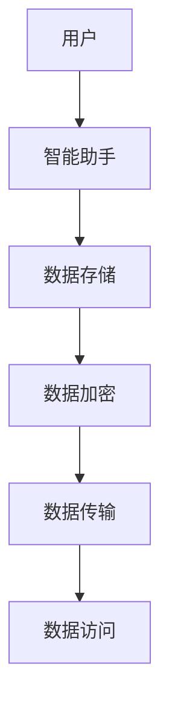
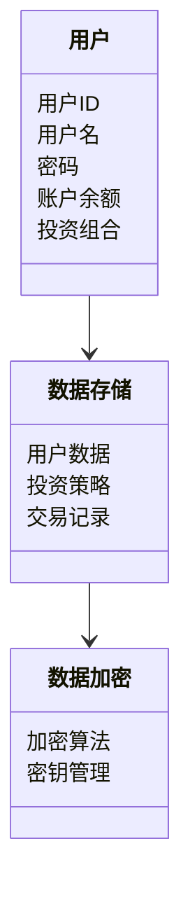
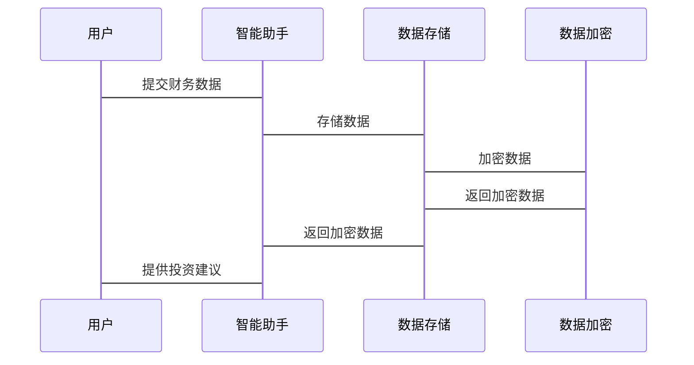

                 


# 确保投资理财智能助手的数据安全与隐私保护

> 关键词：数据安全，隐私保护，投资理财，智能助手，加密算法，系统架构，用户隐私

> 摘要：本文深入探讨了投资理财智能助手在数据安全与隐私保护方面的关键问题，从核心概念、算法原理到系统架构，再到实际项目实战，全面分析了如何确保用户数据的安全与隐私。文章通过详细的技术分析和实际案例，为投资理财智能助手的开发者和用户提供了一套完整的数据安全与隐私保护解决方案。

---

# 第一部分：投资理财智能助手的数据安全与隐私保护背景介绍

# 第1章：数据安全与隐私保护的背景与重要性

## 1.1 投资理财智能助手的定义与功能

### 1.1.1 投资理财智能助手的定义

投资理财智能助手是一种基于人工智能技术的工具，旨在为用户提供个性化的投资建议、资产配置、风险评估和财务规划等服务。它通常通过分析用户的财务数据、市场趋势和用户需求，为用户提供智能化的投资决策支持。

### 1.1.2 投资理财智能助手的核心功能

- **数据收集与分析**：智能助手需要收集用户的财务数据（如收入、支出、资产等），并分析市场数据（如股票、基金、债券等）。
- **投资建议**：基于数据分析结果，智能助手为用户提供个性化的投资建议。
- **风险评估**：智能助手需要评估用户的投资风险，并提供风险控制的建议。
- **资产配置**：智能助手根据用户的财务目标和风险偏好，优化资产配置。

### 1.1.3 投资理财智能助手的用户群体与应用场景

- **用户群体**：个人投资者、机构投资者、理财顾问等。
- **应用场景**：投资决策支持、资产配置优化、风险管理、财务规划等。

## 1.2 数据安全与隐私保护的重要性

### 1.2.1 数据泄露的潜在风险

投资理财智能助手处理的用户数据通常是敏感信息，一旦发生数据泄露，可能导致用户的财务损失、身份盗窃甚至法律纠纷。例如，用户的银行账户信息、交易记录和投资策略等一旦被泄露，可能被不法分子利用进行欺诈活动。

### 1.2.2 用户隐私保护的法律要求

随着数据保护法律法规的不断完善，投资理财智能助手的开发者和运营者必须遵守相关法律法规，如《数据安全法》、《个人信息保护法》等。这些法律法规要求企业必须采取有效措施保护用户的隐私数据，否则将面临法律处罚和声誉损失。

### 1.2.3 投资理财行业对数据安全的特殊要求

投资理财行业涉及大量金融数据，这些数据的敏感性和价值性要求企业必须采取更高的安全标准。例如，投资策略、市场预测和交易数据等如果被竞争对手获取，可能会影响企业的竞争优势。此外，金融数据的泄露还可能引发市场波动和信任危机。

## 1.3 当前数据安全与隐私保护的挑战

### 1.3.1 数据泄露事件的典型案例分析

近年来，数据泄露事件频发，尤其是在金融行业。例如，2021年某知名金融机构的数据泄露事件导致数百万用户的个人信息和账户信息被泄露，造成了巨大的经济损失和声誉损失。这些事件表明，数据安全和隐私保护是投资理财智能助手必须解决的核心问题。

### 1.3.2 技术与法律层面的双重挑战

从技术角度来看，投资理财智能助手需要应对复杂的网络安全威胁，如黑客攻击、病毒侵袭等。从法律角度来看，企业需要遵守日益严格的法律法规，确保数据处理的合法性。此外，数据跨境传输、用户 consent 管理等也是企业需要面对的挑战。

### 1.3.3 用户隐私与企业利益的平衡点

用户隐私与企业利益之间的平衡是数据安全与隐私保护的核心问题。企业需要在保护用户隐私的前提下，利用数据进行商业分析和优化。然而，如何在不侵犯用户隐私的前提下，最大化数据的价值，是企业需要解决的难题。

## 1.4 本章小结

本章从投资理财智能助手的定义与功能出发，分析了数据安全与隐私保护的重要性，以及当前面临的主要挑战。通过典型案例分析，读者可以深刻理解数据泄露的严重性，同时认识到技术与法律层面的双重挑战。接下来，我们将深入探讨数据安全与隐私保护的核心概念与联系。

---

# 第二部分：数据安全与隐私保护的核心概念与联系

# 第2章：数据安全与隐私保护的核心概念

## 2.1 数据安全的基本原理

### 2.1.1 数据安全的定义与分类

数据安全是指通过技术手段保护数据的完整性、机密性和可用性。数据安全可以分为以下几个类别：

- **物理安全**：防止数据的物理损坏或丢失，如设备损坏、盗窃等。
- **网络安全**：防止数据在传输过程中被窃取或篡改。
- **应用安全**：防止通过应用层漏洞进行攻击，如SQL注入、XSS攻击等。
- **数据存储安全**：防止存储数据被未经授权的访问或篡改。

### 2.1.2 数据安全的关键属性

- **完整性**：数据在存储和传输过程中保持原始状态，防止被篡改。
- **机密性**：只有授权的用户才能访问敏感数据。
- **可用性**：数据在需要时可以被合法用户访问。

### 2.1.3 数据安全与隐私保护的区别与联系

- **区别**：数据安全侧重于保护数据的完整性、机密性和可用性，而隐私保护侧重于保护用户隐私不被未经授权的访问或滥用。
- **联系**：隐私保护是数据安全的重要组成部分，数据安全的实现是隐私保护的基础。

## 2.2 隐私保护的核心要素

### 2.2.1 隐私保护的定义与范围

隐私保护是指通过技术和法律手段，确保用户的个人数据不被未经授权的主体访问或滥用。隐私保护的范围包括个人身份信息、财务信息、交易记录等。

### 2.2.2 隐私保护的法律框架

- **《个人信息保护法》**：明确了个人信息处理者的义务，要求企业必须获得用户的明确同意才能处理其个人信息。
- **GDPR（通用数据保护条例）**：欧盟的数据保护法规，要求企业必须保护用户的数据隐私。

### 2.2.3 隐私保护的技术手段

- **加密技术**：通过对数据进行加密，确保只有授权的用户才能访问。
- **匿名化处理**：通过数据匿名化处理，保护用户的真实身份。
- **访问控制**：通过权限管理，限制未经授权的用户访问敏感数据。

## 2.3 数据安全与隐私保护的实体关系图

以下是一个数据安全与隐私保护的实体关系图：



## 2.4 本章小结

本章从数据安全与隐私保护的核心概念出发，分析了数据安全的关键属性和隐私保护的核心要素。通过实体关系图，读者可以清晰理解数据安全与隐私保护的实现过程。接下来，我们将深入探讨数据安全与隐私保护的算法原理。

---

# 第三部分：数据安全与隐私保护的算法原理

# 第3章：加密算法原理与实现

## 3.1 对称加密算法

### 3.1.1 AES加密算法的工作原理

AES（高级加密标准）是一种广泛使用的对称加密算法，其加密过程如下：

1. **密钥生成**：根据用户提供的密钥，生成加密和解密所需的密钥。
2. **初始轮次**：对明文进行初始轮次的加密，生成中间密钥。
3. **多轮加密**：通过对中间密钥进行多轮加密，生成最终密文。
4. **解密过程**：通过多轮解密，将密文还原为明文。

### 3.1.2 AES加密算法的Python实现

以下是一个AES加密算法的Python实现示例：

```python
from cryptography.hazmat.primitives.ciphers import Cipher, algorithms, modes
from cryptography.hazmat.primitives.asymmetric import padding
from cryptography.hazmat.primitives import hashes
from cryptography.hazmat.backends import default_backend

# 加密密钥
key = b'your_encryption_key'
# 初始向量
iv = b'your_initial_vector'

# 创建AES加密器
cipher = Cipher(algorithms.AES(key), modes.CBC(iv), backend=default_backend())
encryptor = cipher.encryptor()

# 加密明文
plaintext = b'your_plaintext'
ciphertext = encryptor.update(plaintext) + encryptor.finalize()

# 解密过程
decryptor = cipher.decryptor()
decrypted_text = decryptor.update(ciphertext) + decryptor.finalize()
```

### 3.1.3 AES加密算法的数学模型和公式

AES加密算法的数学模型如下：

$$
\text{加密} = E(k, p) = c
$$

$$
\text{解密} = D(k, c) = p
$$

其中，\(k\) 表示密钥，\(p\) 表示明文，\(c\) 表示密文。

### 3.1.4 AES加密算法的优缺点

- **优点**：AES加密算法具有高效性、安全性高的特点，适合大规模数据加密。
- **缺点**：AES加密算法对密钥管理要求较高，密钥泄露可能导致数据被破解。

### 3.1.5 AES加密算法的实际应用场景

- **金融交易**：用于保护交易数据的安全。
- **数据存储**：用于加密存储的用户数据。
- **通信安全**：用于保护通信过程中的数据安全。

## 3.2 非对称加密算法

### 3.2.1 RSA加密算法的工作原理

RSA（ Rivest-Shamir-Adleman）是一种非对称加密算法，其加密过程如下：

1. **生成密钥对**：生成公钥和私钥。
2. **加密过程**：使用公钥对明文进行加密。
3. **解密过程**：使用私钥对密文进行解密。

### 3.2.2 RSA加密算法的Python实现

以下是一个RSA加密算法的Python实现示例：

```python
from cryptography.hazmat.primitives.asymmetric import rsa
from cryptography.hazmat.primitives.asymmetric.padding import PaddingMethod
from cryptography.hazmat.primitives.asymmetric import padding as asym_padding
from cryptography.hazmat.primitives.asymmetric import utils

# 生成RSA密钥对
key = rsa.RSAPublicKey.generate(
    public_exponent=65537,
    key_size=2048,
    backend=default_backend()
)

# 获取公钥和私钥
public_key = key.public_key()
private_key = key.private_key()

# 加密明文
plaintext = b'your_plaintext'
ciphertext = public_key.encrypt(
    plaintext,
    asym_padding.PKCSv1_5(
        mgfunc=utils.RSAMGFunc(),
        pfunc=utils.RSAPKCS1v1_5EncryptFunction()
    )
)

# 解密密文
decrypted_text = private_key.decrypt(ciphertext)
```

### 3.2.3 RSA加密算法的数学模型和公式

RSA加密算法的数学模型如下：

$$
\text{加密} = E(e, m) = c^e \mod n
$$

$$
\text{解密} = D(d, c) = c^d \mod n
$$

其中，\(e\) 表示公钥指数，\(d\) 表示私钥指数，\(n\) 表示模数。

### 3.2.4 RSA加密算法的优缺点

- **优点**：RSA加密算法具有安全性高的特点，适合公钥加密和数字签名。
- **缺点**：RSA加密算法的加密速度较慢，适合小规模数据加密。

### 3.2.5 RSA加密算法的实际应用场景

- **数字签名**：用于验证数据的完整性和真实性。
- **公钥加密**：用于保护通信过程中的数据安全。
- **身份验证**：用于用户身份验证。

## 3.3 加密算法的优缺点对比

以下是对AES和RSA加密算法的优缺点对比：

| 特性             | AES加密算法                 | RSA加密算法                 |
|------------------|-----------------------------|-----------------------------|
| 加密速度         | 快                         | 慢                         |
| 密钥管理         | 对称密钥                   | 非对称密钥                 |
| 适用场景         | 适合大规模数据加密         | 适合公钥加密和数字签名     |
| 安全性           | 高                         | 高                         |

## 3.4 本章小结

本章从加密算法的原理出发，详细讲解了AES和RSA加密算法的工作原理和实现方法。通过优缺点对比，读者可以更好地理解不同加密算法的应用场景。接下来，我们将探讨如何将这些加密算法应用于投资理财智能助手的数据安全与隐私保护中。

---

# 第四部分：数据安全与隐私保护的系统分析与架构设计

# 第4章：系统分析与架构设计

## 4.1 问题场景介绍

投资理财智能助手需要处理大量的用户数据，包括用户的财务信息、投资策略、交易记录等。这些数据的敏感性要求企业必须采取严格的数据安全措施，防止数据泄露和滥用。

## 4.2 项目介绍

本项目旨在设计一个投资理财智能助手，确保用户数据的安全与隐私。通过采用加密技术、访问控制和匿名化处理等手段，保护用户的敏感数据。

## 4.3 系统功能设计

### 4.3.1 领域模型设计

以下是一个投资理财智能助手的领域模型：



### 4.3.2 系统架构设计

以下是一个投资理财智能助手的系统架构图：


### 4.3.3 系统接口设计

- **用户接口**：用户通过智能助手输入财务数据和投资需求。
- **数据接口**：智能助手通过API接口访问数据存储和加密服务。
- **加密接口**：加密服务通过API接口提供加密和解密功能。

### 4.3.4 系统交互设计

以下是一个系统交互的序列图：



## 4.4 本章小结

本章通过系统分析与架构设计，展示了投资理财智能助手的数据安全与隐私保护的整体框架。通过领域模型和系统架构图，读者可以清晰理解系统的各个组成部分。接下来，我们将通过项目实战，详细讲解如何实现这些设计。

---

# 第五部分：数据安全与隐私保护的项目实战

# 第5章：项目实战

## 5.1 环境安装

### 5.1.1 安装Python和相关库

- **安装Python**：建议使用Python 3.8及以上版本。
- **安装加密库**：使用以下命令安装加密库：

  ```bash
  pip install cryptography
  ```

### 5.1.2 安装其他依赖

根据项目需求，安装其他依赖库，如数据库连接库、API接口库等。

## 5.2 系统核心实现源代码

### 5.2.1 数据加密模块的实现

以下是一个数据加密模块的Python代码示例：

```python
from cryptography.hazmat.primitives.ciphers import Cipher, algorithms, modes
from cryptography.hazmat.primitives.asymmetric import padding
from cryptography.hazmat.primitives import hashes
from cryptography.hazmat.backends import default_backend

# 加密密钥
key = b'your_encryption_key'
# 初始向量
iv = b'your_initial_vector'

# 创建AES加密器
cipher = Cipher(algorithms.AES(key), modes.CBC(iv), backend=default_backend())
encryptor = cipher.encryptor()

# 加密明文
plaintext = b'your_plaintext'
ciphertext = encryptor.update(plaintext) + encryptor.finalize()

# 解密过程
decryptor = cipher.decryptor()
decrypted_text = decryptor.update(ciphertext) + decryptor.finalize()
```

### 5.2.2 数据存储模块的实现

以下是一个数据存储模块的Python代码示例：

```python
import sqlite3

# 数据库连接
conn = sqlite3.connect('investment_assistant.db')
# 数据库游标
cursor = conn.cursor()

# 创建表
cursor.execute('''CREATE TABLE users
                 (id INTEGER PRIMARY KEY AUTOINCREMENT,
                  username TEXT,
                  password TEXT,
                  balance REAL,
                  investment_portfolio TEXT)''')

# 插入数据
cursor.execute('INSERT INTO users (username, password, balance, investment_portfolio) VALUES (?, ?, ?, ?)',
              ('user1', 'password1', 10000.0, 'stock: 50%, bond: 30%, cash: 20%'))

# 提交事务
conn.commit()

# 查询数据
cursor.execute('SELECT * FROM users WHERE username = ?', ('user1',))
result = cursor.fetchall()

# 关闭连接
conn.close()
```

### 5.2.3 系统交互模块的实现

以下是一个系统交互模块的Python代码示例：

```python
from flask import Flask, request, jsonify

app = Flask(__name__)

@app.route('/api/v1/encrypt', methods=['POST'])
def encrypt():
    data = request.json
    plaintext = data['plaintext'].encode('utf-8')
    key = data['key'].encode('utf-8')
    iv = data['iv'].encode('utf-8')

    cipher = Cipher(algorithms.AES(key), modes.CBC(iv), backend=default_backend())
    encryptor = cipher.encryptor()
    ciphertext = encryptor.update(plaintext) + encryptor.finalize()

    return jsonify({'ciphertext': ciphertext.decode('utf-8')})

if __name__ == '__main__':
    app.run(debug=True)
```

## 5.3 代码应用解读与分析

### 5.3.1 数据加密模块的解读

上述代码通过AES加密算法实现了数据的加密和解密功能。加密过程包括密钥生成、初始向量生成、明文加密和密文解密。通过这种方式，可以有效保护用户数据的安全。

### 5.3.2 数据存储模块的解读

上述代码通过SQLite数据库实现了用户数据的存储和管理。通过创建表和插入数据，可以实现用户数据的持久化存储。通过查询数据，可以实现数据的检索和更新。

### 5.3.3 系统交互模块的解读

上述代码通过Flask框架实现了系统的API接口。通过POST请求，用户可以提交明文、密钥和初始向量，系统将返回加密后的密文。这种方式可以实现数据的安全传输和处理。

## 5.4 实际案例分析

### 5.4.1 案例背景

假设我们有一个投资理财智能助手，用户通过提交财务数据，系统根据用户的财务状况提供投资建议。

### 5.4.2 案例分析

1. **数据加密**：用户提交的财务数据通过AES加密算法进行加密，确保数据在传输过程中的安全性。
2. **数据存储**：加密后的数据存储在数据库中，确保数据的机密性和完整性。
3. **数据解密**：系统在处理数据时，通过解密算法对数据进行解密，确保数据的可用性。

### 5.4.3 案例总结

通过上述案例分析，我们可以看到，数据安全与隐私保护贯穿于投资理财智能助手的整个生命周期。从数据加密到数据存储，再到数据解密，每一步都需要严格的安全措施。

## 5.5 本章小结

本章通过项目实战，详细讲解了投资理财智能助手的数据安全与隐私保护的实现过程。通过代码实现和案例分析，读者可以更好地理解如何将理论应用于实践。接下来，我们将总结全书的内容，并给出一些实用的建议。

---

# 第六部分：数据安全与隐私保护的最佳实践与小结

# 第6章：最佳实践与小结

## 6.1 最佳实践

### 6.1.1 数据分类与分级

企业应对数据进行分类与分级，明确哪些数据是敏感数据，哪些数据是普通数据。对于敏感数据，企业应采取更高的安全措施。

### 6.1.2 最小化原则

企业应遵循最小化原则，只收集实现业务功能所必需的用户数据，避免过度收集用户数据。

### 6.1.3 访问控制

企业应通过权限管理，确保只有授权的用户才能访问敏感数据。通过多因素认证（MFA）和细粒度权限管理，可以进一步提高数据安全性。

### 6.1.4 数据加密与匿名化处理

企业应通过加密技术保护用户数据的机密性，并通过数据匿名化处理保护用户隐私。

### 6.1.5 定期安全审计

企业应定期进行安全审计，发现和修复系统中的安全漏洞，确保数据安全与隐私保护措施的有效性。

## 6.2 本章小结

本章总结了投资理财智能助手的数据安全与隐私保护的最佳实践，包括数据分类与分级、最小化原则、访问控制、数据加密与匿名化处理，以及定期安全审计等。通过这些措施，企业可以有效保护用户数据的安全与隐私。

---

# 作者：AI天才研究院/AI Genius Institute & 禅与计算机程序设计艺术 /Zen And The Art of Computer Programming

