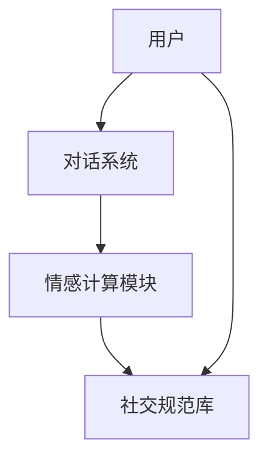
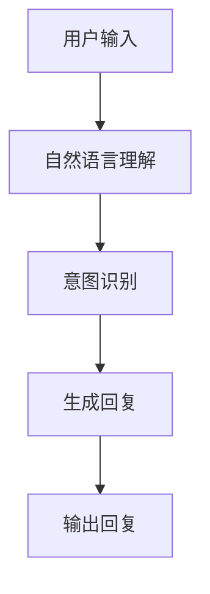
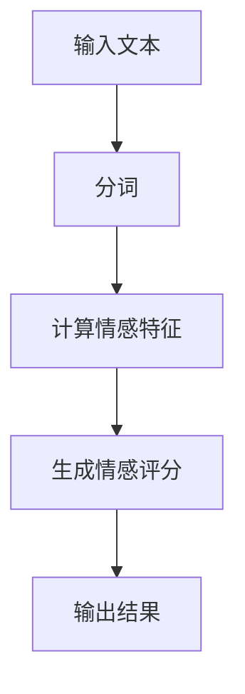
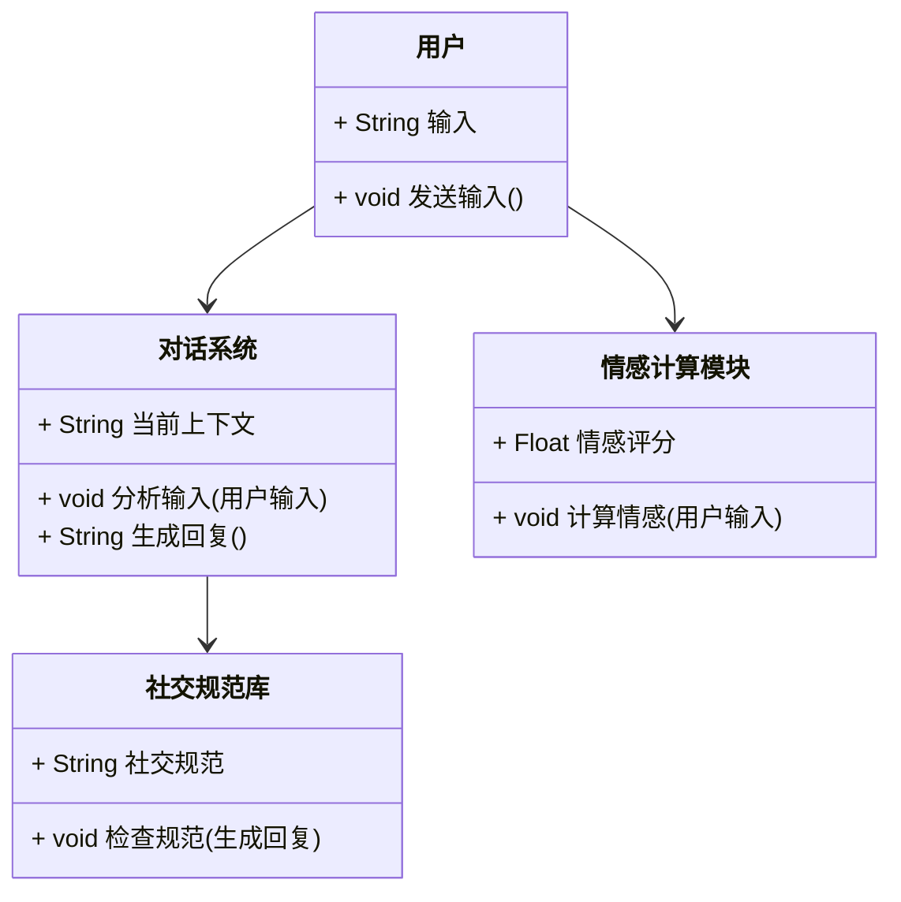
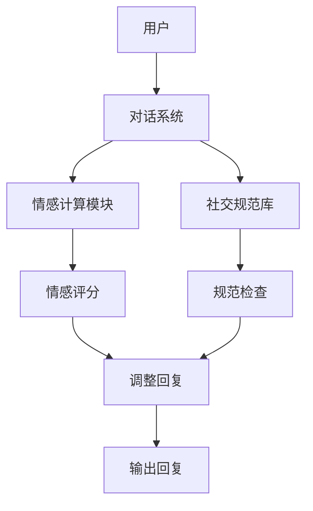
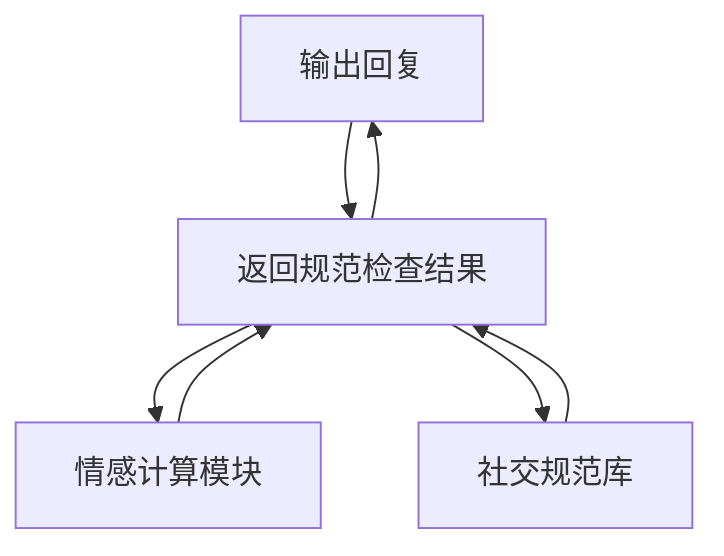

                 


# 社交AI：提升AI Agent的人际交互能力

---

## 关键词：社交AI，人工智能，人机交互，对话系统，情感计算，自然语言处理

---

## 摘要：  
本文深入探讨了社交AI的核心概念、算法原理和系统设计，重点分析了如何通过自然语言处理、情感计算和社交规范提升AI Agent的社交能力。文章从背景介绍到实际案例，结合数学模型和系统架构，全面解析了社交AI的实现路径与未来发展方向。

---

## 第一部分：社交AI的背景与核心概念

### 第1章：社交AI的背景与问题背景

#### 1.1 什么是社交AI
- **1.1.1 社交AI的定义**  
  社交AI（Social AI）是指能够理解和模拟人类社交行为、情感表达和对话交互的人工智能技术。它结合了自然语言处理（NLP）、情感计算和社交规范，旨在让AI Agent具备类似人类的社交能力。

- **1.1.2 社交AI的核心问题与挑战**  
  社交AI的核心问题在于如何让AI理解并生成符合人类社交习惯的对话。挑战包括：  
  1. 对话的多模态性（语言、情感、语境）；  
  2. 社交规范的多样性和文化差异；  
  3. 动态对话上下文的处理。

- **1.1.3 社交AI的应用场景与价值**  
  - 场景：智能客服、社交机器人、虚拟助手、教育辅助等。  
  - 价值：提升用户体验、提高效率、降低成本、拓展人机交互的边界。

#### 1.2 为什么需要社交AI
- **1.2.1 传统AI的局限性**  
  传统AI（如搜索引擎、聊天机器人）缺乏情感理解和社交能力，无法真正实现“人性化”交互。

- **1.2.2 社交交互的复杂性与AI的结合**  
  社交AI通过整合NLP、情感分析和意图识别，能够处理复杂的对话场景，如幽默、讽刺、隐喻等。

- **1.2.3 社交AI在人机交互中的重要性**  
  社交AI是实现人机协作、增强用户体验的关键技术，能够显著提升AI系统的可用性和用户满意度。

#### 1.3 社交AI的边界与外延
- **1.3.1 社交AI的定义域**  
  社交AI专注于人机交互中的社交行为模拟，不涵盖纯逻辑推理或数据分析任务。

- **1.3.2 社交AI与其他AI领域的区别**  
  - 与NLP的区别：NLP注重文本理解和生成，而社交AI更关注对话的情感和社交规范。  
  - 与机器学习的区别：社交AI依赖于特定的社交数据和模型，而机器学习更广泛。

- **1.3.3 社交AI的未来发展展望**  
  随着技术的进步，社交AI将更加智能化、个性化，能够处理更复杂的社交场景，如多轮对话、跨文化交流等。

---

## 第二部分：社交AI的核心概念与原理

### 第2章：社交AI的核心概念与联系

#### 2.1 社交AI的核心要素
- **2.1.1 对话系统**  
  对话系统是社交AI的核心模块，负责理解用户输入并生成合适的回复。  
  - 输入：自然语言文本（如“今天天气不错”）。  
  - 输出：生成符合语境的回复（如“是的，今天天气很好，您想了解哪里的天气？”）。  

- **2.1.2 情感计算**  
  情感计算用于分析和模拟人类情感，是实现自然对话的关键。  
  - 输入：文本或语音数据。  
  - 输出：情感评分（如积极、消极、中性）或情感标签（如快乐、愤怒）。

- **2.1.3 社交规范与礼仪**  
  社交规范是指导AI Agent在对话中遵循的社会规则，如礼貌用语、避免敏感话题等。

#### 2.2 核心概念的属性对比
- **2.2.1 对话系统与传统NLP的对比**
| 特性       | 对话系统                     | 传统NLP                   |
|------------|------------------------------|--------------------------|
| 目标       | 支持动态对话                 | 单一任务（如翻译、摘要） |
| 输入       | 多轮对话                    | 单条文本                 |
| 输出       | 自然、连贯的回复             | 固定格式的输出            |

- **2.2.2 情感计算与情绪识别的差异**
| 特性       | 情感计算                     | 情绪识别                   |
|------------|------------------------------|--------------------------|
| 范围       | 分析情感强度和类型           | 仅识别情绪类别            |
| 应用       | 对话生成、情感反馈           | 情感分析工具              |

- **2.2.3 社交规范与通用规则的区别**
| 特性       | 社交规范                     | 通用规则                   |
|------------|------------------------------|--------------------------|
| 范围       | 社交场景                    | 通用场景                  |
| 复杂性     | 高（涉及文化、礼仪）         | 低（如数学规则）           |

#### 2.3 ER实体关系图


---

## 第三部分：社交AI的算法原理与数学模型

### 第3章：社交AI的算法原理

#### 3.1 对话系统的算法流程


#### 3.2 情感计算的数学模型
- **3.2.1 情感分析的数学公式**
  $$ 情感评分 = \sum_{i=1}^{n} w_i \cdot f_i(x_i) $$
  - $w_i$：第$i$个特征的权重。  
  - $f_i(x_i)$：第$i$个特征的函数，用于计算情感值。

- **3.2.2 情感计算的流程图**


#### 3.3 对话生成的算法实现
- **3.3.1 基于规则的对话生成**
  - 示例规则：如果用户表达负面情绪，回复应带有安慰语气。

- **3.3.2 基于深度学习的对话生成**
  - 使用预训练模型（如GPT-3）生成回复，结合情感评分调整输出。

---

## 第四部分：系统分析与架构设计

### 第4章：社交AI系统的分析与设计

#### 4.1 问题场景介绍
- 用户与AI Agent的对话场景，包括情感分析、意图识别和回复生成。

#### 4.2 系统功能设计
- **功能模块**：
  - 对话模块：负责接收输入并生成回复。  
  - 情感计算模块：分析用户情感并调整回复语气。  
  - 社交规范模块：确保回复符合社交礼仪。

- **领域模型类图**


#### 4.3 系统架构设计


#### 4.4 系统接口设计
- **输入接口**：接收用户输入（文本或语音）。  
- **输出接口**：生成符合情感和规范的回复。  
- **API接口**：供其他系统调用对话功能。

#### 4.5 系统交互序列图


---

## 第五部分：项目实战与应用

### 第5章：社交AI项目的实战与分析

#### 5.1 项目环境安装
- **工具与库**：
  - Python 3.8+  
  - NLTK、spaCy（NLP库）  
  - Gensim（文本处理）  
  - Hugging Face（模型库）  

#### 5.2 核心代码实现
```python
# 情感计算模块
import nltk
from nltk.sentiment import SentimentIntensityAnalyzer

def calculate_sentiment(text):
    analyzer = SentimentIntensityAnalyzer()
    sentiment = analyzer.polarity_scores(text)
    return sentiment['compound']

# 对话生成模块
def generate_response(text):
    # 示例：基于规则的回复生成
    if calculate_sentiment(text) > 0.5:
        response = "听起来您心情很好，有什么我可以帮您的吗？"
    else:
        response = "您似乎有些不开心，有什么我可以为您做的吗？"
    return response
```

#### 5.3 案例分析与小结
- **案例分析**：构建一个简单的社交AI代理，实现基本的对话功能。  
- **小结**：通过项目实战，验证了社交AI的实现可行性，但也发现了情感计算和对话生成中的不足，未来需要进一步优化。

---

## 第六部分：总结与展望

### 第6章：总结与未来展望

#### 6.1 本章总结
- 社交AI的核心在于理解人类社交行为并模拟其能力，涉及对话系统、情感计算和社交规范等多个方面。  
- 通过算法和系统设计，可以显著提升AI Agent的人际交互能力。

#### 6.2 未来展望
- **技术进步**：深度学习和大语言模型的结合将使社交AI更加智能化。  
- **应用场景拓展**：社交AI将在教育、医疗、客服等领域发挥更大作用。  
- **伦理与隐私**：未来需要关注社交AI的伦理问题和用户隐私保护。

---

## 最佳实践 tips

- 在实现社交AI时，注重情感计算的准确性，避免产生误解。  
- 对话系统的设计应考虑上下文的连贯性，避免孤立回复。  
- 定期更新社交规范库，以适应不同文化和场景的需求。  

---

## 小结

通过本文的深入分析与实战，我们展示了如何通过技术手段提升AI Agent的社交能力。社交AI的未来发展潜力巨大，但也需要我们不断探索和优化。

---

## 作者

作者：AI天才研究院/AI Genius Institute & 禅与计算机程序设计艺术 /Zen And The Art of Computer Programming

